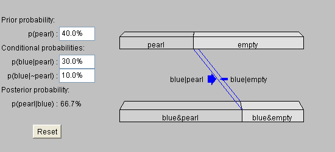
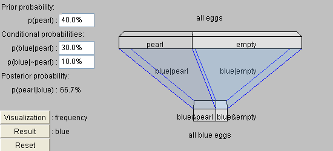
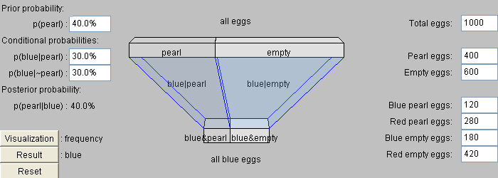
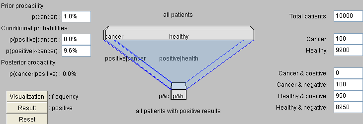
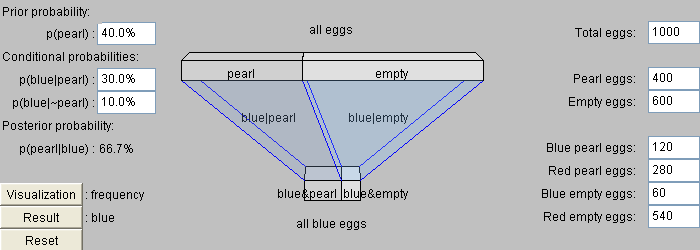
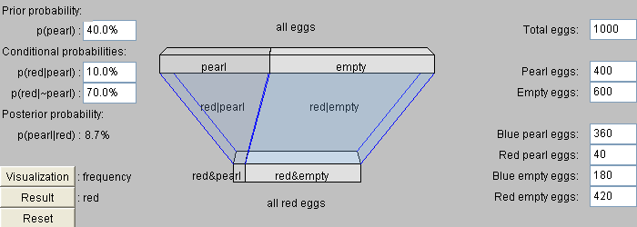
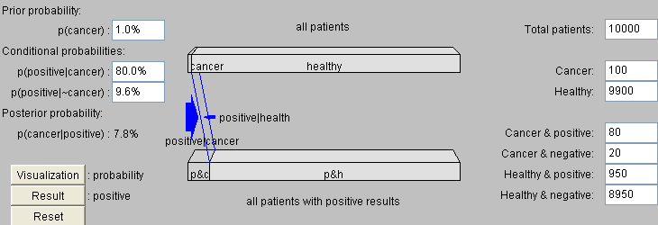
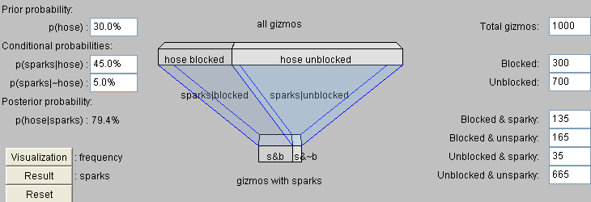
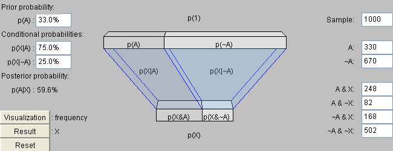

# An Intuitive Explanation of Bayes' Theorem

*Bayes' Theorem  
for the curious and bewildered;  
 an excruciatingly gentle introduction.*

* * * * *

Your friends and colleagues are talking about something called
"Bayes' Theorem" or "Bayes' Rule", or something called Bayesian
reasoning.  They sound really enthusiastic about it, too, so you
google and find a webpage about Bayes' Theorem and...  
  
It's this equation.  That's all.  Just one equation.  The page you
found gives a definition of it, but it doesn't say what it is, or
why it's useful, or why your friends would be interested in it.  It
looks like this random statistics thing.  
  
So you came here.  Maybe you don't understand what the equation
says.  Maybe you understand it in theory, but every time you try to
apply it in practice you get mixed up trying to remember the
difference between p(a|x) and p(x|a), and whether p(a)\*p(x|a)
belongs in the numerator or the denominator.  Maybe you see the
theorem, and you understand the theorem, and you can use the
theorem, but you can't understand why your friends and/or research
colleagues seem to think it's the secret of the universe.  Maybe
your friends are all wearing Bayes' Theorem T-shirts, and you're
feeling left out.  Maybe you're a girl looking for a boyfriend, but
the boy you're interested in refuses to date anyone who "isn't
Bayesian".  What matters is that Bayes is cool, and if you don't
know Bayes, you aren't cool.  
  
Why does a mathematical concept generate this strange enthusiasm in
its students?  What is the so-called Bayesian Revolution now
sweeping through the sciences, which claims to subsume even the
experimental method itself as a special case?  What is the secret
that the adherents of Bayes know?  What is the light that they have
seen?  
  
Soon you will know.  Soon you will be one of us.  
  
While there are a few existing online explanations of Bayes'
Theorem, my experience with trying to introduce people to Bayesian
reasoning is that the existing online explanations are too
abstract.  Bayesian reasoning is very counterintuitive.  People do
not employ Bayesian reasoning intuitively, find it very difficult
to learn Bayesian reasoning when tutored, and rapidly forget
Bayesian methods once the tutoring is over.  This holds equally
true for novice students and highly trained professionals in a
field.  Bayesian reasoning is apparently one of those things which,
like quantum mechanics or the Wason Selection Test, is inherently
difficult for humans to grasp with our built-in mental faculties.  
  
Or so they claim.  Here you will find an attempt to offer an
intuitive explanation of Bayesian reasoning - an excruciatingly
gentle introduction that invokes all the human ways of grasping
numbers, from natural frequencies to spatial visualization.  The
intent is to convey, not abstract rules for manipulating numbers,
but what the numbers mean, and why the rules are what they are (and
cannot possibly be anything else).  When you are finished reading
this page, you will see Bayesian problems in your dreams.  
  
And let's begin.  

* * * * *

  
Here's a story problem about a situation that doctors often
encounter:  
1% of women at age forty who participate in routine screening have
breast cancer.  80% of women with breast cancer will get positive
mammographies.  9.6% of women without breast cancer will also get
positive mammographies.  A woman in this age group had a positive
mammography in a routine screening.  What is the probability that
she actually has breast cancer?
  
What do you think the answer is?  If you haven't encountered this
kind of problem before, please take a moment to come up with your
own answer before continuing.  

* * * * *

  
Next, suppose I told you that most doctors get the same wrong
answer on this problem - usually, only around 15% of doctors get it
right.  ("Really?  15%?  Is that a real number, or an urban legend
based on an Internet poll?"  It's a real number.  See Casscells,
Schoenberger, and Grayboys 1978; Eddy 1982; Gigerenzer and Hoffrage
1995; and many other studies.  It's a surprising result which is
easy to replicate, so it's been extensively replicated.)  
  
Do you want to think about your answer again?  Here's a Javascript
calculator if you need one.  This calculator has the usual
precedence rules; multiplication before addition and so on.  If
you're not sure, I suggest using parentheses.  
Calculator: Result:

* * * * *

  
On the story problem above, most doctors estimate the probability
to be between 70% and 80%, which is wildly incorrect.  
  
Here's an alternate version of the problem on which doctors fare
somewhat better:  
10 out of 1000 women at age forty who participate in routine
screening have breast cancer.  800 out of 1000 women with breast
cancer will get positive mammographies.  96 out of 1000 women
without breast cancer will also get positive mammographies.  If
1000 women in this age group undergo a routine screening, about
what fraction of women with positive mammographies will actually
have breast cancer?
Calculator: Result:

* * * * *

  
And finally, here's the problem on which doctors fare best of all,
with 46% - nearly half - arriving at the correct answer:
  
100 out of 10,000 women at age forty who participate in routine
screening have breast cancer.  80 of every 100 women with breast
cancer will get a positive mammography.  950 out of  9,900 women
without breast cancer will also get a positive mammography.  If
10,000 women in this age group undergo a routine screening, about
what fraction of women with positive mammographies will actually
have breast cancer?
Calculator: Result:

* * * * *

  
The correct answer is 7.8%, obtained as follows:  Out of 10,000
women, 100 have breast cancer; 80 of those 100 have positive
mammographies.  From the same 10,000 women, 9,900 will not have
breast cancer and of those 9,900 women, 950 will also get positive
mammographies.  This makes the total number of women with positive
mammographies 950+80 or 1,030.  Of those 1,030 women with positive
mammographies, 80 will have cancer.  Expressed as a proportion,
this is 80/1,030 or 0.07767 or 7.8%.  
  
To put it another way, before the mammography screening, the 10,000
women can be divided into two groups:
-   Group 1:  100 women with breast cancer.
-   Group 2:  9,900 women without breast cancer.

Summing these two groups gives a total of 10,000 patients,
confirming that none have been lost in the math.  After the
mammography, the women can be divided into four groups:
-   Group A:  80 women with breast cancer, and a positive
    mammography.
-   Group B:  20 women with breast cancer, and a negative
    mammography.
-   Group C:  950 women without  breast cancer, and a positive
    mammography.
-   Group D:  8,950 women without breast cancer, and a negative
    mammography.

Calculator: Result:
As you can check, the sum of all four groups is still 10,000.  The
sum of groups A and B, the groups with breast cancer, corresponds
to group 1; and the sum of groups C and D, the groups without
breast cancer, corresponds to group 2; so administering a
mammography does not actually change the number of women with
breast cancer.  The proportion of the cancer patients (A + B)
within the complete set of patients (A + B + C + D) is the same as
the 1% prior chance that a woman has cancer: (80 + 20) / (80 + 20 +
950 + 8950) = 100 / 10000 = 1%.  
  
The proportion of cancer patients with positive results, within the
group of all patients with positive results, is the proportion of
(A) within (A + C):   80 / (80 + 950) = 80 / 1030 = 7.8%.  If you
administer a mammography to 10,000 patients, then out of the 1030
with positive mammographies, 80 of those positive-mammography
patients will have cancer.  This is the correct answer, the answer
a doctor should give a positive-mammography patient if she asks
about the chance she has breast cancer; if thirteen patients ask
this question, roughly 1 out of those 13 will have cancer.  

* * * * *

  
The most common mistake is to ignore the original fraction of women
with breast cancer, and the fraction of women without breast cancer
who receive false positives, and focus only on the fraction of
women with breast cancer who get positive results.  For example,
the vast majority of doctors in these studies seem to have thought
that if around 80% of women with breast cancer have positive
mammographies, then the probability of a women with a positive
mammography having breast cancer must be around 80%.  
  
Figuring out the final answer always requires all three pieces of
information - the percentage of women with breast cancer, the
percentage of women without breast cancer who receive false
positives, and the percentage of women with breast cancer who
receive (correct) positives.  
  
To see that the final answer always depends on the original
fraction of women with breast cancer, consider an alternate
universe in which only one woman out of a million has breast
cancer.  Even if mammography in this world detects breast cancer in
8 out of 10 cases, while returning a false positive on a woman
without breast cancer in only 1 out of 10 cases, there will still
be a hundred thousand false positives for every real case of cancer
detected.  The original probability that a woman has cancer is so
extremely low that, although a positive result on the mammography
does increase the estimated probability, the probability isn't
increased to certainty or even "a noticeable chance"; the
probability goes from 1:1,000,000 to 1:100,000.  
  
Similarly, in an alternate universe where only one out of a million
women does not have breast cancer, a positive result on the
patient's mammography obviously doesn't mean that she has an 80%
chance of having breast cancer!  If this were the case her
estimated probability of having cancer would have been revised
drastically downward after she got a positive result on her
mammography - an 80% chance of having cancer is a lot less than
99.9999%!  If you administer mammographies to ten million women in
this world, around eight million women with breast cancer will get
correct positive results, while one woman without breast cancer
will get false positive results.  Thus, if you got a positive
mammography in this alternate universe, your chance of having
cancer would go from 99.9999% up to 99.999987%.  That is, your
chance of being healthy would go from 1:1,000,000 down to
1:8,000,000.  
  
These two extreme examples help demonstrate that the mammography
result doesn't replace your old information about the patient's
chance of having cancer; the mammography slides the estimated
probability in the direction of the result.  A positive result
slides the original probability upward; a negative result slides
the probability downward.  For example, in the original problem
where 1% of the women have cancer, 80% of women with cancer get
positive mammographies, and 9.6% of women without cancer get
positive mammographies, a positive result on the mammography slides
the 1% chance upward to 7.8%.  
  
Most people encountering problems of this type for the first time
carry out the mental operation of replacing the original 1%
probability with the 80% probability that a woman with cancer gets
a positive mammography.  It may seem like a good idea, but it just
doesn't work.  "The probability that a woman with a positive
mammography has breast cancer" is not at all the same thing as "the
probability that a woman with breast cancer has a positive
mammography"; they are as unlike as apples and cheese.  Finding the
final answer, "the probability that a woman with a positive
mammography has breast cancer", uses all three pieces of problem
information - "the prior probability that a woman has breast
cancer", "the probability that a woman with breast cancer gets a
positive mammography", and "the probability that a woman without
breast cancer gets a positive mammography".  

* * * * *

**Fun  
 Fact!**
**Q.  What is the Bayesian Conspiracy?**  
A.  The Bayesian Conspiracy is a multinational, interdisciplinary,
and shadowy group of scientists that controls publication, grants,
tenure, and the illicit traffic in grad students.  The best way to
be accepted into the Bayesian Conspiracy is to join the Campus
Crusade for Bayes in high school or college, and gradually work
your way up to the inner circles.  It is rumored that at the upper
levels of the Bayesian Conspiracy exist nine silent figures known
only as the Bayes Council.

* * * * *

  
To see that the final answer always depends on the chance that a
woman without breast cancer gets a positive mammography, consider
an alternate test, mammography+.  Like the original test,
mammography+ returns positive for 80% of women with breast cancer. 
However, mammography+ returns a positive result for only one out of
a million women without breast cancer - mammography+ has the same
rate of false negatives, but a vastly lower rate of false
positives.  Suppose a patient receives a positive mammography+. 
What is the chance that this patient has breast cancer?  Under the
new test, it is a virtual certainty - 99.988%, i.e., a 1 in 8082
chance of being healthy.  
Calculator: Result:
Remember, at this point, that neither mammography nor mammography+
actually change the number of women who have breast cancer.  It may
seem like "There is a virtual certainty you have breast cancer" is
a terrible thing to say, causing much distress and despair; that
the more hopeful verdict of the previous mammography test - a 7.8%
chance of having breast cancer - was much to be preferred.  This
comes under the heading of "Don't shoot the messenger".  The number
of women who really do have cancer stays exactly the same between
the two cases.  Only the accuracy with which we detect cancer
changes.  Under the previous mammography test, 80 women with cancer
(who already had cancer, before the mammography) are first told
that they have a 7.8% chance of having cancer, creating X amount of
uncertainty and fear, after which more detailed tests will inform
them that they definitely do have breast cancer.  The old
mammography test also involves informing 950 women without breast
cancer that they have a 7.8% chance of having cancer, thus creating
twelve times as much additional fear and uncertainty.  The new
test, mammography+, does not give 950 women false positives, and
the 80 women with cancer are told the same facts they would have
learned eventually, only earlier and without an intervening period
of uncertainty.  Mammography+ is thus a better test in terms of its
total emotional impact on patients, as well as being more
accurate.  Regardless of its emotional impact, it remains a fact
that a patient with positive mammography+ has a 99.988% chance of
having breast cancer.  
  
Of course, that mammography+ does not give 950 healthy women false
positives means that all 80 of the patients with positive
mammography+ will be patients with breast cancer.  Thus, if you
have a positive mammography+, your chance of having cancer is a
virtual certainty.  It is because mammography+ does not generate as
many false positives (and needless emotional stress), that the
(much smaller) group of patients who do get positive results will
be composed almost entirely of genuine cancer patients (who have
bad news coming to them regardless of when it arrives).  

* * * * *

  
Similarly, let's suppose that we have a less discriminating test,
mammography\*, that still has a 20% rate of false negatives, as in
the original case.  However, mammography\* has an 80% rate of false
positives.  In other words, a patient without breast cancer has an
80% chance of getting a false positive result on her mammography\*
test.  If we suppose the same 1% prior probability that a patient
presenting herself for screening has breast cancer, what is the
chance that a patient with positive mammography\* has cancer?
-   Group 1:  100 patients with breast cancer.
-   Group 2:  9,900 patients without breast cancer.

After mammography\* screening:
-   Group A:  80 patients with breast cancer and a "positive"
    mammography\*.
-   Group B:  20 patients with breast cancer and a "negative"
    mammography\*.
-   Group C:  7920 patients without breast cancer and a "positive"
    mammography\*.
-   Group D:  1980 patients without breast cancer and a "negative"
    mammography\*.

Calculator: Result:
The result works out to 80 / 8,000, or 0.01.  This is exactly the
same as the 1% prior probability that a patient has breast cancer! 
A "positive" result on mammography\* doesn't change the probability
that a woman has breast cancer at all.  You can similarly verify
that a "negative" mammography\* also counts for nothing.  And in
fact it must be this way, because if mammography\* has an 80% hit
rate for patients with breast cancer, and also an 80% rate of false
positives for patients without breast cancer, then mammography\* is
completely uncorrelated with breast cancer.  There's no reason to
call one result "positive" and one result "negative"; in fact,
there's no reason to call the test a "mammography".  You can throw
away your expensive mammography\* equipment and replace it with a
random number generator that outputs a red light 80% of the time
and a green light 20% of the time; the results will be the same. 
Furthermore, there's no reason to call the red light a "positive"
result or the green light a "negative" result.  You could have a
green light 80% of the time and a red light 20% of the time, or a
blue light 80% of the time and a purple light 20% of the time, and
it would all have the same bearing on whether the patient has
breast cancer: i.e., no bearing whatsoever.  
  
We can show algebraically that this must hold for any case where
the chance of a true positive and the chance of a false positive
are the same, i.e:
-   Group 1:  100 patients with breast cancer.
-   Group 2:  9,900 patients without breast cancer.

Now consider a test where the probability of a true positive and
the probability of a false positive are the same number M (in the
example above, M=80% or M = 0.8):
-   Group A:  100\*M patients with breast cancer and a "positive"
    result.
-   Group B:  100\*(1 - M) patients with breast cancer and a
    "negative" result.
-   Group C:  9,900\*M patients without breast cancer and a
    "positive" result.
-   Group D:  9,900\*(1 - M) patients without breast cancer and a
    "negative" result.

The proportion of patients with breast cancer, within the group of
patients with a "positive" result, then equals 100\*M / (100\*M +
9900\*M) = 100 / (100 + 9900) = 1%.  This holds true regardless of
whether M is 80%, 30%, 50%, or 100%.  If we have a mammography\*
test that returns "positive" results for 90% of patients with
breast cancer and returns "positive" results for 90% of patients
without breast cancer, the proportion of "positive"-testing
patients who have breast cancer will still equal the original
proportion of patients with breast cancer, i.e., 1%.  
  
You can run through the same algebra, replacing the prior
proportion of patients with breast cancer with an arbitrary
percentage P:
-   Group 1:  Within some number of patients, a fraction P have
    breast cancer.
-   Group 2:  Within some number of patients, a fraction (1 - P) do
    not have breast cancer.

After a "cancer test" that returns "positive" for a fraction M of
patients with breast cancer, and also returns "positive" for the
same fraction M of patients without cancer:
-   Group A:  P\*M patients have breast cancer and a "positive"
    result.
-   Group B:  P\*(1 - M) patients have breast cancer and a
    "negative" result.
-   Group C:  (1 - P)\*M patients have no breast cancer and a
    "positive" result.
-   Group D:  (1 - P)\*(1 - M) patients have no breast cancer and a
    "negative" result.

The chance that a patient with a "positive" result has breast
cancer is then the proportion of group A within the combined group
A + C, or P\*M / [P\*M + (1 - P)\*M], which, cancelling the common
factor M from the numerator and denominator, is P / [P + (1 - P)]
or P / 1 or just P.  If the rate of false positives is the same as
the rate of true positives, you always have the same probability
after the test as when you started.  
  
Which is common sense.  Take, for example, the "test" of flipping a
coin; if the coin comes up heads, does it tell you anything about
whether a patient has breast cancer?  No; the coin has a 50% chance
of coming up heads if the patient has breast cancer, and also a 50%
chance of coming up heads if the patient does not have breast
cancer.  Therefore there is no reason to call either heads or tails
a "positive" result.  It's not the probability being "50/50" that
makes the coin a bad test; it's that the two probabilities, for
"cancer patient turns up heads" and "healthy patient turns up
heads", are the same.  If the coin was slightly biased, so that it
had a 60% chance of coming up heads, it still wouldn't be a cancer
test - what makes a coin a poor test is not that it has a 50/50
chance of coming up heads if the patient has cancer, but that it
also has a 50/50 chance of coming up heads if the patient does not
have cancer.  You can even use a test that comes up "positive" for
cancer patients 100% of the time, and still not learn anything.  An
example of such a test is "Add 2 + 2 and see if the answer is 4." 
This test returns positive 100% of the time for patients with
breast cancer.  It also returns positive 100% of the time for
patients without breast cancer.  So you learn nothing.  
  
The original proportion of patients with breast cancer is known as
the prior probability.  The chance that a patient with breast
cancer gets a positive mammography, and the chance that a patient
without breast cancer gets a positive mammography, are known as the
two conditional probabilities.  Collectively, this initial
information is known as the priors.  The final answer - the
estimated probability that a patient has breast cancer, given that
we know she has a positive result on her mammography - is known as
the revised probability or the posterior probability.  What we've
just shown is that if the two conditional probabilities are equal,
the posterior probability equals the prior probability.  

* * * * *

**Fun  
 Fact!**
Q.  How can I find the priors for a problem?  
A.  Many commonly used priors are listed in the Handbook of
Chemistry and Physics.  
  
Q.  Where do priors originally come from?  
A.  Never ask that question.  
  
Q.  Uh huh.  Then where do scientists get their priors?  
A.  Priors for scientific problems are established by annual vote
of the AAAS.  In recent years the vote has become fractious and
controversial, with widespread acrimony, factional polarization,
and several outright assassinations.  This may be a front for
infighting within the Bayes Council, or it may be that the
disputants have too much spare time.  No one is really sure.  
  
Q.  I see.  And where does everyone else get their priors?  
A.  They download their priors from Kazaa.  
  
Q.  What if the priors I want aren't available on Kazaa?  
A.  There's a small, cluttered antique shop in a back alley of San
Francisco's Chinatown.  Don't ask about the bronze rat.
  
Actually, priors are true or false just like the final answer -
they reflect reality and can be judged by comparing them against
reality.  For example, if you think that 920 out of 10,000 women in
a sample have breast cancer, and the actual number is 100 out of
10,000, then your priors are wrong.  For our particular problem,
the priors might have been established by three studies - a study
on the case histories of women with breast cancer to see how many
of them tested positive on a mammography, a study on women without
breast cancer to see how many of them test positive on a
mammography, and an epidemiological study on the prevalence of
breast cancer in some specific demographic.  

* * * * *

  
Suppose that a barrel contains many small plastic eggs.  Some eggs
are painted red and some are painted blue.  40% of the eggs in the
bin contain pearls, and 60% contain nothing.   30% of eggs
containing pearls are painted blue, and 10% of eggs containing
nothing are painted blue.  What is the probability that a blue egg
contains a pearl?  For this example the arithmetic is simple enough
that you may be able to do it in your head, and I would suggest
trying to do so.  
But just in case... Result:
A more compact way of specifying the problem:
-   p(pearl) = 40%
-   p(blue|pearl) = 30%
-   p(blue|\~pearl) = 10%
-   p(pearl|blue) = ?

"\~" is shorthand for "not", so \~pearl reads "not pearl".  
  
blue|pearl is shorthand for "blue given pearl" or "the probability
that an egg is painted blue, given that the egg contains a pearl". 
One thing that's confusing about this notation is that the order of
implication is read right-to-left, as in Hebrew or Arabic. 
blue|pearl means "blue<-pearl", the degree to which pearl-ness
implies blue-ness, not the degree to which blue-ness implies
pearl-ness.  This is confusing, but it's unfortunately the standard
notation in probability theory.  
  
Readers familiar with quantum mechanics will have already
encountered this peculiarity; in quantum mechanics, for example,
<d|c\><c|b\><b|a\> reads as "the probability that a particle at A
goes to B, then to C, ending up at D".  To follow the particle, you
move your eyes from right to left.  Reading from left to right, "|"
means "given"; reading from right to left, "|" means "implies" or
"leads to".  Thus, moving your eyes from left to right, blue|pearl
reads "blue given pearl" or "the probability that an egg is painted
blue, given that the egg contains a pearl".  Moving your eyes from
right to left, blue|pearl reads "pearl implies blue" or "the
probability that an egg containing a pearl is painted blue".  
  
The item on the right side is what you already know or the premise,
and the item on the left side is the implication or conclusion.  If
we have p(blue|pearl) = 30%, and we already know that some egg
contains a pearl, then we can conclude there is a 30% chance that
the egg is painted blue.  Thus, the final fact we're looking for -
"the chance that a blue egg contains a pearl" or "the probability
that an egg contains a pearl, if we know the egg is painted blue" -
reads p(pearl|blue).  
  
Let's return to the problem.  We have that 40% of the eggs contain
pearls, and 60% of the eggs contain nothing.  30% of the eggs
containing pearls are painted blue, so 12% of the eggs altogether
contain pearls and are painted blue.  10% of the eggs containing
nothing are painted blue, so altogether 6% of the eggs contain
nothing and are painted blue.  A total of 18% of the eggs are
painted blue, and a total of 12% of the eggs are painted blue and
contain pearls, so the chance a blue egg contains a pearl is 12/18
or 2/3 or around 67%.  
  
The applet below, courtesy of Christian Rovner, shows a graphic
representation of this problem:  
(Are you having trouble seeing this applet?  Do you see an image of
the applet rather than the applet itself?  Try downloading an
updated [Java](http://www.java.com/en/index.jsp).)  

  
  
Looking at this applet, it's easier to see why the final answer
depends on all three probabilities; it's the differential pressure
between the two conditional probabilities,  p(blue|pearl) and
p(blue|\~pearl), that slides the prior probability p(pearl) to the
posterior probability p(pearl|blue).  
  
As before, we can see the necessity of all three pieces of
information by considering extreme cases (feel free to type them
into the applet).  In a (large) barrel in which only one egg out of
a thousand contains a pearl, knowing that an egg is painted blue
slides the probability from 0.1% to 0.3% (instead of sliding the
probability from 40% to 67%).  Similarly, if 999 out of 1000 eggs
contain pearls, knowing that an egg is blue slides the probability
from 99.9% to 99.966%; the probability that the egg does not
contain a pearl goes from 1/1000 to around 1/3000.  Even when the
prior probability changes, the differential pressure of the two
conditional probabilities always slides the probability in the same
direction.  If you learn the egg is painted blue, the probability
the egg contains a pearl always goes up - but it goes up from the
prior probability, so you need to know the prior probability in
order to calculate the final answer.  0.1% goes up to 0.3%, 10%
goes up to 25%, 40% goes up to 67%, 80% goes up to 92%, and 99.9%
goes up to 99.966%.  If you're interested in knowing how any other
probabilities slide, you can type your own prior probability into
the Java applet.  You can also click and drag the dividing line
between pearl and \~pearl in the upper bar, and watch the posterior
probability change in the bottom bar.  
  
Studies of clinical reasoning show that most doctors carry out the
mental operation of replacing the original 1% probability with the
80% probability that a woman with cancer would get a positive
mammography.  Similarly, on the pearl-egg problem, most respondents
unfamiliar with Bayesian reasoning would probably respond that the
probability a blue egg contains a pearl is 30%, or perhaps 20% (the
30% chance of a true positive minus the 10% chance of a false
positive).  Even if this mental operation seems like a good idea at
the time, it makes no sense in terms of the question asked.  It's
like the experiment in which you ask a second-grader:  "If eighteen
people get on a bus, and then seven more people get on the bus, how
old is the bus driver?"  Many second-graders will respond: 
"Twenty-five."  They understand when they're being prompted to
carry out a particular mental procedure, but they haven't quite
connected the procedure to reality.  Similarly, to find the
probability that a woman with a positive mammography has breast
cancer, it makes no sense whatsoever to replace the original
probability that the woman has cancer with the probability that a
woman with breast cancer gets a positive mammography.  Neither can
you subtract the probability of a false positive from the
probability of the true positive.  These operations are as wildly
irrelevant as adding the number of people on the bus to find the
age of the bus driver.  

* * * * *

  
I keep emphasizing the idea that evidence slides probability
because of research that shows people tend to use spatial intutions
to grasp numbers.  In particular, there's interesting evidence that
we have an innate sense of quantity that's localized to left
inferior parietal cortex - patients with damage to this area can
selectively lose their sense of whether 5 is less than 8, while
retaining their ability to read, write, and so on.  (Yes, really!) 
The parietal cortex processes our sense of where things are in
space (roughly speaking), so an innate "number line", or rather
"quantity line", may be responsible for the human sense of
numbers.  This is why I suggest visualizing Bayesian evidence as
sliding the probability along the number line; my hope is that this
will translate Bayesian reasoning into something that makes sense
to innate human brainware.  (That, really, is what an "intuitive
explanation" is.)  For more information, see Stanislas Dehaene's
The Number Sense.  

* * * * *

  
A study by Gigerenzer and Hoffrage in 1995 showed that some ways of
phrasing story problems are much more evocative of correct Bayesian
reasoning.  The least evocative phrasing used probabilities.  A
slightly more evocative phrasing used frequencies instead of
probabilities; the problem remained the same, but instead of saying
that 1% of women had breast cancer, one would say that 1 out of 100
women had breast cancer, that 80 out of 100 women with breast
cancer would get a positive mammography, and so on.  Why did a
higher proportion of subjects display Bayesian reasoning on this
problem?  Probably because saying "1 out of 100 women" encourages
you to concretely visualize X women with cancer, leading you to
visualize X women with cancer and a positive mammography, etc.  
  
The most effective presentation found so far is what's known as
natural frequencies - saying that 40 out of 100 eggs contain
pearls, 12 out of 40 eggs containing pearls are painted blue, and 6
out of 60 eggs containing nothing are painted blue.  A natural
frequencies presentation is one in which the information about the
prior probability is included in presenting the conditional
probabilities.  If you were just learning about the eggs'
conditional probabilities through natural experimentation, you
would - in the course of cracking open a hundred eggs - crack open
around 40 eggs containing pearls, of which 12 eggs would be painted
blue, while cracking open 60 eggs containing nothing, of which
about 6 would be painted blue.  In the course of learning the
conditional probabilities, you'd see examples of blue eggs
containing pearls about twice as often as you saw examples of blue
eggs containing nothing.  
  
It may seem like presenting the problem in this way is "cheating",
and indeed if it were a story problem in a math book, it probably
would be cheating.  However, if you're talking about real doctors,
you want to cheat; you want the doctors to draw the right
conclusions as easily as possible.  The obvious next move would be
to present all medical statistics in terms of natural frequencies. 
Unfortunately, while natural frequencies are a step in the right
direction, it probably won't be enough.  When problems are
presented in natural frequences, the proportion of people using
Bayesian reasoning rises to around half.  A big improvement, but
not big enough when you're talking about real doctors and real
patients.  
  
A presentation of the problem in natural frequencies might be
visualized like this:  

  
  
In the frequency visualization, the selective attrition of the two
conditional probabilities changes the proportion of eggs that
contain pearls.  The bottom bar is shorter than the top bar, just
as the number of eggs painted blue is less than the total number of
eggs.  The probability graph shown earlier is really just the
frequency graph with the bottom bar "renormalized", stretched out
to the same length as the top bar.  In the frequency applet you can
change the conditional probabilities by clicking and dragging the
left and right edges of the graph.  (For example, to change the
conditional probability blue|pearl, click and drag the line on the
left that stretches from the left edge of the top bar to the left
edge of the bottom bar.)  
  
In the probability applet, you can see that when the conditional
probabilities are equal, there's no differential pressure - the
arrows are the same size - so the prior probability doesn't slide
between the top bar and the bottom bar.  But the bottom bar in the
probability applet is just a renormalized (stretched out) version
of the bottom bar in the frequency applet, and the frequency applet
shows why the probability doesn't slide if the two conditional
probabilities are equal.  Here's a case where the prior proportion
of pearls remains 40%, and the proportion of pearl eggs painted
blue remains 30%, but the number of empty eggs painted blue is also
30%:  

  
  
If you diminish two shapes by the same factor, their relative
proportion will be the same as before.  If you diminish the left
section of the top bar by the same factor as the right section,
then the bottom bar will have the same proportions as the top bar -
it'll just be smaller.  If the two conditional probabilities are
equal, learning that the egg is blue doesn't change the probability
that the egg contains a pearl - for the same reason that similar
triangles have identical angles; geometric figures don't change
shape when you shrink them by a constant factor.  
  
In this case, you might as well just say that 30% of eggs are
painted blue, since the probability of an egg being painted blue is
independent of whether the egg contains a pearl.  Applying a "test"
that is statistically independent of its condition just shrinks the
sample size.  In this case, requiring that the egg be painted blue
doesn't shrink the group of eggs with pearls any more or less than
it shrinks the group of eggs without pearls.  It just shrinks the
total number of eggs in the sample.  

* * * * *

**Fun  
 Fact!**
**Q.  Why did the Bayesian reasoner cross the road?**  
A.  You need more information to answer this question.

* * * * *

  
Here's what the original medical problem looks like when graphed. 
1% of women have breast cancer, 80% of those women test positive on
a mammography, and 9.6% of women without breast cancer also receive
positive mammographies.  

  
  
As is now clearly visible, the mammography doesn't increase the
probability a positive-testing woman has breast cancer by
increasing the number of women with breast cancer - of course not;
if mammography increased the number of women with breast cancer, no
one would ever take the test!  However, requiring a positive
mammography is a membership test that eliminates many more women
without breast cancer than women with cancer.  The number of women
without breast cancer diminishes by a factor of more than ten, from
9,900 to 950, while the number of women with breast cancer is
diminished only from 100 to 80.  Thus, the proportion of 80 within
1,030 is much larger than the proportion of 100 within 10,000.  In
the graph, the left sector (representing women with breast cancer)
is small, but the mammography test projects almost all of this
sector into the bottom bar.  The right sector (representing women
without breast cancer) is large, but the mammography test projects
a much smaller fraction of this sector into the bottom bar.  There
are, indeed, fewer women with breast cancer and positive
mammographies than there are women with breast cancer - obeying the
law of probabilities which requires that p(A) \>= p(A&B).  But even
though the left sector in the bottom bar is actually slightly
smaller, the proportion of the left sector within the bottom bar is
greater - though still not very great.  If the bottom bar were
renormalized to the same length as the top bar, it would look like
the left sector had expanded.  This is why the proportion of "women
with breast cancer" in the group "women with positive
mammographies" is higher than the proportion of "women with breast
cancer" in the general population - although the proportion is
still not very high.  The evidence of the positive mammography
slides the prior probability of 1% to the posterior probability of
7.8%.  

* * * * *

  
Suppose there's yet another variant of the mammography test,
mammography@, which behaves as follows.  1% of women in a certain
demographic have breast cancer.  Like ordinary mammography,
mammography@ returns positive 9.6% of the time for women without
breast cancer.  However, mammography@ returns positive 0% of the
time (say, once in a billion) for women with breast cancer.  The
graph for this scenario looks like this:  

  
  
What is it that this test actually does?  If a patient comes to you
with a positive result on her mammography@, what do you say?  

* * * * *

  
"Congratulations, you're among the rare 9.5% of the population
whose health is definitely established by this test."  
  
Mammography@ isn't a cancer test; it's a health test!  Few women
without breast cancer get positive results on mammography@, but
only women without breast cancer ever get positive results at all. 
Not much of the right sector of the top bar projects into the
bottom bar, but none of the left sector projects into the bottom
bar.  So a positive result on mammography@ means you definitely
don't have breast cancer.  

* * * * *

  
What makes ordinary mammography a positive indicator for breast
cancer is not that someone named the result "positive", but rather
that the test result stands in a specific Bayesian relation to the
condition of breast cancer.  You could call the same result
"positive" or "negative" or "blue" or "red" or "James Rutherford",
or give it no name at all, and the test result would still slide
the probability in exactly the same way.  To minimize confusion, a
test result which slides the probability of breast cancer upward
should be called "positive".  A test result which slides the
probability of breast cancer downward should be called "negative". 
If the test result is statistically unrelated to the presence or
absence of breast cancer - if the two conditional probabilities are
equal - then we shouldn't call the procedure a "cancer test"!  The
meaning of the test is determined by the two conditional
probabilities; any names attached to the results are simply
convenient labels.  

* * * * *

  
  
The bottom bar for the graph of mammography@ is small; mammography@
is a test that's only rarely useful.  Or rather, the test only
rarely gives strong evidence, and most of the time gives weak
evidence.  A negative result on mammography@ does slide probability
- it just doesn't slide it very far.  Click the "Result" switch at
the bottom left corner of the applet to see what a negative result
on mammography@ would imply.  You might intuit that since the test
could have returned positive for health, but didn't, then the
failure of the test to return positive must mean that the woman has
a higher chance of having breast cancer - that her probability of
having breast cancer must be slid upward by the negative result on
her health test.  
  
This intuition is correct!  The sum of the groups with negative
results and positive results must always equal the group of all
women.  If the positive-testing group has "more than its fair
share" of women without breast cancer, there must be an at least
slightly higher proportion of women with cancer in the
negative-testing group.  A positive result is rare but very strong
evidence in one direction, while a negative result is common but
very weak evidence in the opposite direction.  You might call this
the Law of Conservation of Probability - not a standard term, but
the conservation rule is exact.  If you take the revised
probability of breast cancer after a positive result, times the
probability of a positive result, and add that to the revised
probability of breast cancer after a negative result, times the
probability of a negative result, then you must always arrive at
the prior probability.  If you don't yet know what the test result
is, the expected revised probability after the test result arrives
- taking both possible results into account - should always equal
the prior probability.  
  
On ordinary mammography, the test is expected to return "positive"
10.3% of the time - 80 positive women with cancer plus 950 positive
women without cancer equals 1030 women with positive results. 
Conversely, the mammography should return negative 89.7% of the
time:  100% - 10.3% = 89.7%.  A positive result slides the revised
probability from 1% to 7.8%, while a negative result slides the
revised probability from 1% to 0.22%.  So
p(cancer|positive)\*p(positive) + p(cancer|negative)\*p(negative) =
7.8%\*10.3% + 0.22%\*89.7% = 1% = p(cancer), as expected.  
Calculator: Result:

* * * * *

  
Why "as expected"?  Let's take a look at the quantities involved:  
p(cancer):
0.01
  
Group 1: 100 women with breast cancer
p(\~cancer):
0.99
Group 2: 9900 women without breast cancer
 
p(positive|cancer):
80.0%
80% of women with breast cancer have positive mammographies
p(\~positive|cancer):
20.0%
20% of women with breast cancer have negative mammographies
p(positive|\~cancer):
9.6%
9.6% of women without breast cancer have positive mammographies
p(\~positive|\~cancer):
90.4%
90.4% of women without breast cancer have negative mammographies
 
p(cancer&positive):
0.008
Group A:  80 women with breast cancer and positive mammographies
p(cancer&\~positive):
0.002
Group B: 20 women with breast cancer and negative mammographies
p(\~cancer&positive):
0.095
Group C: 950 women without breast cancer and positive mammographies
p(\~cancer&\~positive):
0.895
Group D: 8950 women without breast cancer and negative
mammographies
 
p(positive):
0.103
1030 women with positive results
p(\~positive):
0.897
8970 women with negative results
 
p(cancer|positive):
7.80%
Chance you have breast cancer if mammography is positive: 7.8%
p(\~cancer|positive):
92.20%
Chance you are healthy if mammography is positive: 92.2%
p(cancer|\~positive):
0.22%
Chance you have breast cancer if mammography is negative: 0.22%
p(\~cancer|\~positive):
99.78%
Chance you are healthy if mammography is negative: 99.78%
  
One of the common confusions in using Bayesian reasoning is to mix
up some or all of these quantities - which, as you can see, are all
numerically different and have different meanings.  p(A&B) is the
same as p(B&A), but p(A|B) is not the same thing as p(B|A), and
p(A&B) is completely different from p(A|B).  (I don't know who
chose the symmetrical "|" symbol to mean "implies", and then made
the direction of implication right-to-left, but it was probably a
bad idea.)  
  
To get acquainted with all these quantities and the relationships
between them, we'll play "follow the degrees of freedom".  For
example, the two quantities p(cancer) and p(\~cancer) have 1 degree
of freedom between them, because of the general law p(A) + p(\~A) =
1.  If you know that p(\~cancer) = .99, you can obtain p(cancer) =
1 - p(\~cancer) = .01.  There's no room to say that p(\~cancer) =
.99 and then also specify p(cancer) = .25; it would violate the
rule p(A) + p(\~A) = 1.  
  
p(positive|cancer) and p(\~positive|cancer) also have only one
degree of freedom between them; either a woman with breast cancer
gets a positive mammography or she doesn't.  On the other hand,
p(positive|cancer) and p(positive|\~cancer) have two degrees of
freedom.  You can have a mammography test that returns positive for
80% of cancerous patients and 9.6% of healthy patients, or that
returns positive for 70% of cancerous patients and 2% of healthy
patients, or even a health test that returns "positive" for 30% of
cancerous patients and 92% of healthy patients.  The two
quantities, the output of the mammography test for cancerous
patients and the output of the mammography test for healthy
patients, are in mathematical terms independent; one cannot be
obtained from the other in any way, and so they have two degrees of
freedom between them.  
  
What about p(positive&cancer), p(positive|cancer), and p(cancer)? 
Here we have three quantities; how many degrees of freedom are
there?  In this case the equation that must hold is
p(positive&cancer) = p(positive|cancer) \* p(cancer).  This
equality reduces the degrees of freedom by one.  If we know the
fraction of patients with cancer, and chance that a cancerous
patient has a positive mammography, we can deduce the fraction of
patients who have breast cancer and a positive mammography by
multiplying.  You should recognize this operation from the graph;
it's the projection of the top bar into the bottom bar.  p(cancer)
is the left sector of the top bar, and p(positive|cancer)
determines how much of that sector projects into the bottom bar,
and the left sector of the bottom bar is p(positive&cancer).  

  
  
Similarly, if we know the number of patients with breast cancer and
positive mammographies, and also the number of patients with breast
cancer, we can estimate the chance that a woman with breast cancer
gets a positive mammography by dividing: p(positive|cancer) =
p(positive&cancer) / p(cancer).  In fact, this is exactly how such
medical diagnostic tests are calibrated; you do a study on 8,520
women with breast cancer and see that there are 6,816 (or
thereabouts) women with breast cancer andpositive mammographies,
then divide 6,816 by 8520 to find that 80% of women with breast
cancer had positive mammographies.  (Incidentally, if you
accidentally divide 8520 by 6,816 instead of the other way around,
your calculations will start doing strange things, such as
insisting that 125% of women with breast cancer and positive
mammographies have breast cancer.  This is a common mistake in
carrying out Bayesian arithmetic, in my experience.)  And finally,
if you know p(positive&cancer) and p(positive|cancer), you can
deduce how many cancer patients there must have been originally. 
There are two degrees of freedom shared out among the three
quantities; if we know any two, we can deduce the third.  
  
How about p(positive), p(positive&cancer), and
p(positive&\~cancer)?  Again there are only two degrees of freedom
among these three variables.  The equation occupying the extra
degree of freedom is p(positive) = p(positive&cancer) +
p(positive&\~cancer).  This is how p(positive) is computed to begin
with; we figure out the number of women with breast cancer who have
positive mammographies, and the number of women without breast
cancer who have positive mammographies, then add them together to
get the total number of women with positive mammographies.  It
would be very strange to go out and conduct a study to determine
the number of women with positive mammographies - just that one
number and nothing else - but in theory you could do so.  And if
you then conducted another study and found the number of those
women who had positive mammographies and breast cancer, you would
also know the number of women with positive mammographies and no
breast cancer - either a woman with a positive mammography has
breast cancer or she doesn't.  In general, p(A&B) + p(A&\~B) =
p(A).  Symmetrically, p(A&B) + p(\~A&B) = p(B).  
   
What about p(positive&cancer), p(positive&\~cancer),
p(\~positive&cancer), and p(\~positive&\~cancer)?  You might at
first be tempted to think that there are only two degrees of
freedom for these four quantities - that you can, for example, get
p(positive&\~cancer) by multiplying p(positive) \* p(\~cancer), and
thus that all four quantities can be found given only the two
quantities p(positive) and p(cancer).  This is not the case! 
p(positive&\~cancer) = p(positive) \* p(\~cancer) only if the two
probabilities are statistically independent - if the chance that a
woman has breast cancer has no bearing on whether she has a
positive mammography.  As you'll recall, this amounts to requiring
that the two conditional probabilities be equal to each other - a
requirement which would eliminate one degree of freedom.  If you
remember that these four quantities are the groups A, B, C, and D,
you can look over those four groups and realize that, in theory,
you can put any number of people into the four groups.  If you
start with a group of 80 women with breast cancer and positive
mammographies, there's no reason why you can't add another group of
500 women with breast cancer and negative mammographies, followed
by a group of 3 women without breast cancer and negative
mammographies, and so on.  So now it seems like the four quantities
have four degrees of freedom.  And they would, except that in
expressing them as probabilities, we need to normalize them to
fractions of the complete group, which adds the constraint that
p(positive&cancer) + p(positive&\~cancer) + p(\~positive&cancer) +
p(\~positive&\~cancer) = 1.  This equation takes up one degree of
freedom, leaving three degrees of freedom among the four
quantities.  If you specify the fractions of women in groups A, B,
and D, you can deduce the fraction of women in group C.  

* * * * *

  
Given the four groups A, B, C, and D, it is very straightforward to
compute everything else:  p(cancer) = A + B, p(\~positive|cancer) =
B / (A + B), and so on.  Since ABCD contains three degrees of
freedom, it follows that the entire set of 16 probabilities
contains only three degrees of freedom.  Remember that in our
problems we always needed three pieces of information - the prior
probability and the two conditional probabilities - which, indeed,
have three degrees of freedom among them.  Actually, for Bayesian
problems, any three quantities with three degrees of freedom
between them should logically specify the entire problem.  For
example, let's take a barrel of eggs with p(blue) = 0.40, 
p(blue|pearl) = 5/13, and p(\~blue&\~pearl) = 0.20.  Given this
information, you can compute p(pearl|blue).   
  
As a story problem:  
Suppose you have a large barrel containing a number of plastic
eggs.  Some eggs contain pearls, the rest contain nothing.  Some
eggs are painted blue, the rest are painted red.  Suppose that 40%
of the eggs are painted blue, 5/13 of the eggs containing pearls
are painted blue, and 20% of the eggs are both empty and painted
red.  What is the probability that an egg painted blue contains a
pearl?  
  
Try it - I assure you it is possible.  
Calculator: Result:
You probably shouldn't try to solve this with just a Javascript
calculator, though.  I used a Python console.  (In theory, pencil
and paper should also work, but I don't know anyone who owns a
pencil so I couldn't try it personally.)  
  
As a check on your calculations, does the (meaningless) quantity
p(\~pearl|\~blue)/p(pearl) roughly equal .51?  (In story problem
terms:  The likelihood that a red egg is empty, divided by the
likelihood that an egg contains a pearl, equals approximately
.51.)  Of course, using this information in the problem would be
cheating.  
  
If you can solve that problem, then when we revisit Conservation of
Probability, it seems perfectly straightforward.  Of course the
mean revised probability, after administering the test, must be the
same as the prior probability.  Of course strong but rare evidence
in one direction must be counterbalanced by common but weak
evidence in the other direction.  
  
Because:  
  
  p(cancer|positive)\*p(positive)  
+ p(cancer|\~positive)\*p(\~positive)  
= p(cancer)  
  
In terms of the four groups:  
  
p(cancer|positive)  = A / (A + C)  
p(positive)         = A + C  
p(cancer&positive)  = A  
p(cancer|\~positive) = B / (B + D)  
p(\~positive)        = B + D  
p(cancer&\~positive) = B  
p(cancer)           = A + B  

* * * * *

  
Let's return to the original barrel of eggs - 40% of the eggs
containing pearls, 30% of the pearl eggs painted blue, 10% of the
empty eggs painted blue.  The graph for this problem is:  

  
  
What happens to the revised probability, p(pearl|blue), if the
proportion of eggs containing pearls is kept constant, but 60% of
the eggs with pearls are painted blue (instead of 30%), and 20% of
the empty eggs are painted blue (instead of 10%)?  You could type
60% and 20% into the inputs for the two conditional probabilities,
and see how the graph changes - but can you figure out in advance
what the change will look like?  

* * * * *

  
If you guessed that the revised probability remains the same,
because the bottom bar grows by a factor of 2 but retains the same
proportions, congratulations!  Take a moment to think about how far
you've come.  Looking at a problem like  
1% of women have breast cancer.  80% of women with breast cancer
get positive mammographies.  9.6% of women without breast cancer
get positive mammographies.  If a woman has a positive mammography,
what is the probability she has breast cancer?
  
the vast majority of respondents intuit that around 70-80% of women
with positive mammographies have breast cancer.  Now, looking at a
problem like  
Suppose there are two barrels containing many small plastic eggs. 
In both barrels, some eggs are painted blue and the rest are
painted red.  In both barrels, 40% of the eggs contain pearls and
the rest are empty.  In the first barrel, 30% of the pearl eggs are
painted blue, and 10% of the empty eggs are painted blue.  In the
second barrel, 60% of the pearl eggs are painted blue, and 20% of
the empty eggs are painted blue.  Would you rather have a blue egg
from the first or second barrel?
  
you can see it's intuitively obvious that the probability of a blue
egg containing a pearl is the same for either barrel.  Imagine how
hard it would be to see that using the old way of thinking!  

* * * * *

  
It's intuitively obvious, but how to prove it?  Suppose that we
call P the prior probability that an egg contains a pearl, that we
call M the first conditional probability (that a pearl egg is
painted blue), and N the second conditional probability (that an
empty egg is painted blue).  Suppose that M and N are both
increased or diminished by an arbitrary factor X - for example, in
the problem above, they are both increased by a factor of 2.  Does
the revised probability that an egg contains a pearl, given that we
know the egg is blue, stay the same?
-   p(pearl) = P
-   p(blue|pearl) = M\*X
-   p(blue|\~pearl) = N\*X
-   p(pearl|blue) = ?

From these quantities, we get the four groups:
-   Group A:  p(pearl&blue)   = P\*M\*X
-   Group B:  p(pearl&\~blue)  = P\*(1 - (M\*X))
-   Group C:  p(\~pearl&blue)  = (1 - P)\*N\*X
-   Group D:  p(\~pearl&\~blue) = (1 - P)\*(1 - (N\*X))

The proportion of eggs that contain pearls and are blue, within the
group of all blue eggs, is then the proportion of group (A) within
the group (A + C), equalling P\*M\*X / (P\*M\*X + (1 - P)\*N\*X). 
The factor X in the numerator and denominator cancels out, so
increasing or diminishing both conditional probabilities by a
constant factor doesn't change the revised probability.  

* * * * *

**Fun  
 Fact!**
**Q. **Suppose that there are two barrels, each containing a number
of plastic eggs.  In both barrels, some eggs are painted blue and
the rest are painted red.  In the first barrel, 90% of the eggs
contain pearls and 20% of the pearl eggs are painted blue.  In the
second barrel, 45% of the eggs contain pearls and 60% of the empty
eggs are painted red.  Would you rather have a blue pearl egg from
the first or second barrel?  
A.  Actually, it doesn't matter which barrel you choose!  Can you
see why?

* * * * *

  
The probability that a test gives a true positive divided by the
probability that a test gives a false positive is known as the
likelihood ratio of that test.  Does the likelihood ratio of a
medical test sum up everything there is to know about the
usefulness of the test?  
  
No, it does not!  The likelihood ratio sums up everything there is
to know about the meaning of a positive result on the medical test,
but the meaning of a negative result on the test is not specified,
nor is the frequency with which the test is useful.  If we examine
the algebra above, while p(pearl|blue) remains constant,
p(pearl|\~blue) may change - the X does not cancel out.  As a story
problem, this strange fact would look something like this:  
Suppose that there are two barrels, each containing a number of
plastic eggs.  In both barrels, 40% of the eggs contain pearls and
the rest contain nothing.  In both barrels, some eggs are painted
blue and the rest are painted red.  In the first barrel, 30% of the
eggs with pearls are painted blue, and 10% of the empty eggs are
painted blue.  In the second barrel, 90% of the eggs with pearls
are painted blue, and 30% of the empty eggs are painted blue. 
Would you rather have a blue egg from the first or second barrel? 
Would you rather have a red egg from the first or second barrel?
  
For the first question, the answer is that we don't care whether we
get the blue egg from the first or second barrel.  For the second
question, however, the probabilities do change - in the first
barrel, 34% of the red eggs contain pearls, while in the second
barrel 8.7% of the red eggs contain pearls!  Thus, we should prefer
to get a red egg from the first barrel.  In the first barrel, 70%
of the pearl eggs are painted red, and 90% of the empty eggs are
painted red.  In the second barrel, 10% of the pearl eggs are
painted red, and 70% of the empty eggs are painted red.  
Calculator: Result:
What goes on here?  We start out by noting that, counter to
intuition, p(pearl|blue) and p(pearl|\~blue) have two degrees of
freedom among them even when p(pearl) is fixed - so there's no
reason why one quantity shouldn't change while the other remains
constant.  But we didn't we just get through establishing a law for
"Conservation of Probability", which says that
p(pearl|blue)\*p(blue) + p(pearl|\~blue)\*p(\~blue) = p(pearl)? 
Doesn't this equation take up one degree of freedom?  No, because
p(blue) isn't fixed between the two problems.  In the second
barrel, the proportion of blue eggs containing pearls is the same
as in the first barrel, but a much larger fraction of eggs are
painted blue!  This alters the set of red eggs in such a way that
the proportions do change.  Here's a graph for the red eggs in the
second barrel:  

  

* * * * *

  
Let's return to the example of a medical test.  The likelihood
ratio of a medical test - the number of true positives divided by
the number of false positives - tells us everything there is to
know about the meaning of a positive result.  But it doesn't tell
us the meaning of a negative result, and it doesn't tell us how
often the test is useful.  For example, a mammography with a hit
rate of 80% for patients with breast cancer and a false positive
rate of 9.6% for healthy patients has the same likelihood ratio as
a test with an 8% hit rate and a false positive rate of 0.96%. 
Although these two tests have the same likelihood ratio, the first
test is more useful in every way - it detects disease more often,
and a negative result is stronger evidence of health.  
  
The likelihood ratio for a positive result summarizes the
differential pressure of the two conditional probabilities for a
positive result, and thus summarizes how much a positive result
will slide the prior probability.  Take a probability graph, like
this one:  

  
  
The likelihood ratio of the mammography is what determines the
slant of the line.  If the prior probability is 1%, then knowing
only the likelihood ratio is enough to determine the posterior
probability after a positive result.  
  
But, as you can see from the frequency graph, the likelihood ratio
doesn't tell the whole story - in the frequency graph, the
proportions of the bottom bar can stay fixed while the size of the
bottom bar changes.  p(blue) increases but p(pearl|blue) doesn't
change, because p(pearl&blue) and p(\~pearl&blue) increase by the
same factor.  But when you flip the graph to look at p(\~blue), the
proportions of p(pearl&\~blue) and p(\~pearl&\~blue) do not remain
constant.  
  
Of course the likelihood ratio can't tell the whole story; the
likelihood ratio and the prior probability together are only two
numbers, while the problem has three degrees of freedom.  

* * * * *

  
Suppose that you apply two tests for breast cancer in succession -
say, a standard mammography and also some other test which is
independent of mammography.  Since I don't know of any such test
which is independent of mammography, I'll invent one for the
purpose of this problem, and call it the Tams-Braylor Division
Test, which checks to see if any cells are dividing more rapidly
than other cells.  We'll suppose that the Tams-Braylor gives a true
positive for 90% of patients with breast cancer, and gives a false
positive for 5% of patients without cancer.  Let's say the prior
prevalence of breast cancer is 1%.  If a patient gets a positive
result on her mammography and her Tams-Braylor, what is the revised
probability she has breast cancer?  
  
One way to solve this problem would be to take the revised
probability for a positive mammography, which we already calculated
as 7.8%, and plug that into the Tams-Braylor test as the new prior
probability.  If we do this, we find that the result comes out to
60%.  
Calculator: Result:
But this assumes that first we see the positive mammography result,
and then the positive result on the Tams-Braylor.  What if first
the woman gets a positive result on the Tams-Braylor, followed by a
positive result on her mammography.  Intuitively, it seems like it
shouldn't matter.  Does the math check out?  
  
First we'll administer the Tams-Braylor to a woman with a 1% prior
probability of breast cancer.    
Calculator: Result:
Then we administer a mammography, which gives 80% true positives
and 9.6% false positives, and it also comes out positive.  
Calculator: Result:
Lo and behold, the answer is again 60%.  (If it's not exactly the
same, it's due to rounding error - you can get a more precise
calculator, or work out the fractions by hand, and the numbers will
be exactly equal.)  
  
An algebraic proof that both strategies are equivalent is left to
the reader.  To visualize, imagine that the lower bar of the
frequency applet for mammography projects an even lower bar using
the probabilities of the Tams-Braylor Test, and that the final
lowest bar is the same regardless of the order in which the
conditional probabilities are projected.  

* * * * *

  
We might also reason that since the two tests are independent, the
probability a woman with breast cancer gets a positive mammography
and a positive Tams-Braylor is 90% \* 80% = 72%.  And the
probability that a woman without breast cancer gets false positives
on mammography and Tams-Braylor is 5% \* 9.6% = 0.48%.  So if we
wrap it all up as a single test with a likelihood ratio of
72%/0.48%, and apply it to a woman with a 1% prior probability of
breast cancer:  
Calculator: Result:
...we find once again that the answer is 60%.  
  
Suppose that the prior prevalence of breast cancer in a demographic
is 1%.  Suppose that we, as doctors, have a repertoire of three
independent tests for breast cancer.  Our first test, test A, a
mammography, has a likelihood ratio of 80%/9.6% = 8.33.  The second
test, test B, has a likelihood ratio of 18.0 (for example, from 90%
versus 5%); and the third test, test C, has a likelihood ratio of
3.5 (which could be from 70% versus 20%, or from 35% versus 10%; it
makes no difference).  Suppose a patient gets a positive result on
all three tests.  What is the probability the patient has breast
cancer?  
  
Here's a fun trick for simplifying the bookkeeping.  If the prior
prevalence of breast cancer in a demographic is 1%, then 1 out of
100 women have breast cancer, and 99 out of 100 women do not have
breast cancer.  So if we rewrite the probability of 1% as an odds
ratio, the odds are:  
  
1:99  
  
And the likelihood ratios of the three tests A, B, and C are:  
  
8.33:1 = 25:3  
18.0:1 = 18:1  
 3.5:1 =  7:2  
  
The odds for women with breast cancer who score positive on all
three tests, versus women without breast cancer who score positive
on all three tests, will equal:  
  
1\*25\*18\*7:99\*3\*1\*2 =  
3,150:594  
  
To recover the probability from the odds, we just write:  
3,150 / (3,150 + 594) = 84%  
  
This always works regardless of how the odds ratios are written;
i.e., 8.33:1 is just the same as 25:3 or 75:9.  It doesn't matter
in what order the tests are administered, or in what order the
results are computed.  The proof is left as an exercise for the
reader.  

* * * * *

  
E. T. Jaynes, in "Probability Theory With Applications in Science
and Engineering", suggests that credibility and evidence should be
measured in decibels.  
  
Decibels?  
  
Decibels are used for measuring exponential differences of
intensity.  For example, if the sound from an automobile horn
carries 10,000 times as much energy (per square meter per second)
as the sound from an alarm clock, the automobile horn would be 40
decibels louder.  The sound of a bird singing might carry 1,000
times less energy than an alarm clock, and hence would be 30
decibels softer.  To get the number of decibels, you take the
logarithm base 10 and multiply by 10.  
  
decibels = 10 log~10~ (intensity)  
    or  
intensity = 10^(decibels/10)^  
  
Suppose we start with a prior probability of 1% that a woman has
breast cancer, corresponding to an odds ratio of 1:99.  And then we
administer three tests of likelihood ratios 25:3, 18:1, and 7:2. 
You could multiply those numbers... or you could just add their
logarithms:  
  
10 log~10~ (1/99) = -20  
10 log~10~ (25/3) = 9  
10 log~10~ (18/1) = 13  
10 log~10~ (7/2)  = 5  
  
It starts out as fairly unlikely that a woman has breast cancer -
our credibility level is at -20 decibels.  Then three test results
come in, corresponding to 9, 13, and 5 decibels of evidence.  This
raises the credibility level by a total of 27 decibels, meaning
that the prior credibility of -20 decibels goes to a posterior
credibility of 7 decibels.  So the odds go from 1:99 to 5:1, and
the probability goes from 1% to around 83%.  

* * * * *

In front of you is a bookbag containing 1,000 poker chips.  I
started out with two such bookbags, one containing 700 red and 300
blue chips, the other containing 300 red and 700 blue.  I flipped a
fair coin to determine which bookbag to use, so your prior
probability that the bookbag in front of you is the red bookbag is
50%.  Now, you sample randomly, with replacement after each chip. 
In 12 samples, you get 8 reds and 4 blues.  What is the probability
that this is the predominantly red bag?
  
Just for fun, try and work this one out in your head.  You don't
need to be exact - a rough estimate is good enough.  When you're
ready, continue onward.  

* * * * *

  
According to a study performed by Lawrence Phillips and Ward
Edwards in 1966, most people, faced with this problem, give an
answer in the range 70% to 80%.  Did you give a substantially
higher probability than that?  If you did, congratulations - Ward
Edwards wrote that very seldom does a person answer this question
properly, even if the person is relatively familiar with Bayesian
reasoning.  The correct answer is 97%.  
  
The likelihood ratio for the test result "red chip" is 7/3, while
the likelihood ratio for the test result "blue chip" is 3/7. 
Therefore a blue chip is exactly the same amount of evidence as a
red chip, just in the other direction - a red chip is 3.6 decibels
of evidence for the red bag, and a blue chip is -3.6 decibels of
evidence.  If you draw one blue chip and one red chip, they cancel
out.  So the ratio of red chips to blue chips does not matter; only
the excess of red chips over blue chips matters.  There were eight
red chips and four blue chips in twelve samples; therefore, four
more red chips than blue chips.  Thus the posterior odds will be:  
  
7^4^:3^4^ = 2401:81  
which is around 30:1, i.e., around 97%.  
  
The prior credibility starts at 0 decibels and there's a total of
around 14 decibels of evidence, and indeed this corresponds to odds
of around 25:1 or around 96%.  Again, there's some rounding error,
but if you performed the operations using exact arithmetic, the
results would be identical.  
  
We can now see intuitively that the bookbag problem would have
exactly the same answer, obtained in just the same way, if sixteen
chips were sampled and we found ten red chips and six blue chips.  

* * * * *

You are a mechanic for gizmos.  When a gizmo stops working, it is
due to a blocked hose 30% of the time.  If a gizmo's hose is
blocked, there is a 45% probability that prodding the gizmo will
produce sparks.  If a gizmo's hose is unblocked, there is only a 5%
chance that prodding the gizmo will produce sparks.  A customer
brings you a malfunctioning gizmo.  You prod the gizmo and find
that it produces sparks.  What is the probability that a
spark-producing gizmo has a blocked hose?
Calculator: Result:
What is the sequence of arithmetical operations that you performed
to solve this problem?  
  
(45%\*30%) / (45%\*30% + 5%\*70%)  

  
  
Similarly, to find the chance that a woman with positive
mammography has breast cancer, we computed:  
p(positive|cancer)\*p(cancer)  
\_\_\_\_\_\_\_\_\_\_\_\_\_\_\_\_\_\_\_\_\_\_\_\_\_\_\_\_\_\_\_\_\_\_\_\_\_\_\_\_\_\_\_\_\_\_\_  
p(positive|cancer)\*p(cancer) + p(positive|\~cancer)\*p(\~cancer)  
    which is  
p(positive&cancer) / [p(positive&cancer) + p(positive&\~cancer)]  
    which is  
p(positive&cancer) / p(positive)  
    which is  
p(cancer|positive)  
  
The fully general form of this calculation is known as Bayes'
Theorem or Bayes' Rule:  

p(A|X) =
        p(X|A)\*p(A)           
  p(X|A)\*p(A) + p(X|\~A)\*p(\~A)
  
Given some phenomenon A that we want to investigate, and an
observation X that is evidence about A - for example, in the
previous example, A is breast cancer and X is a positive
mammography - Bayes' Theorem tells us how we should update our
probability of A, given the new evidence X.  

  
  
By this point, Bayes' Theorem may seem blatantly obvious or even
tautological, rather than exciting and new.  If so, this
introduction has entirely succeeded in its purpose.  

* * * * *

**Fun  
 Fact!**
Q.  Who originally discovered Bayes' Theorem?  
A.  The Reverend Thomas Bayes, by far the most enigmatic figure in
mathematical history.  Almost nothing is known of Bayes's life, and
very few of his manuscripts survived.  Thomas Bayes was born in
1701 or 1702 to Joshua Bayes and Ann Carpenter, and his date of
death is listed as 1761.  The exact date of Thomas Bayes's birth is
not known for certain because Joshua Bayes, though a surprisingly
wealthy man, was a member of an unusual, esoteric, and even
heretical religious sect, the "Nonconformists".  The Nonconformists
kept their birth registers secret, supposedly from fear of
religious discrimination; whatever the reason, no true record
exists of Thomas Bayes's birth.  Thomas Bayes was raised a
Nonconformist and was soon promoted into the higher ranks of the
Nonconformist theosophers, whence comes the "Reverend" in his
name.  
  
In 1742 Bayes was elected a Fellow of the Royal Society of London,
the most prestigious scientific body of its day, despite Bayes
having published no scientific or mathematical works at that time. 
Bayes's nomination certificate was signed by sponsors including the
President and the Secretary of the Society, making his election
almost certain.  Even today, however, it remains a mystery why such
weighty names sponsored an unknown into the Royal Society.  
  
Bayes's sole publication during his known lifetime was allegedly a
mystical book entitled Divine Benevolence, laying forth the
original causation and ultimate purpose of the universe.  The book
is commonly attributed to Bayes, though it is said that no author
appeared on the title page, and the entire work is sometimes
considered to be of dubious provenance.  
  
Most mysterious of all, Bayes' Theorem itself appears in a Bayes
manuscript presented to the Royal Society of London in 1764, three
years after Bayes's supposed death in 1761!  
  
Despite the shocking circumstances of its presentation, Bayes'
Theorem was soon forgotten, and was popularized within the
scientific community only by the later efforts of the great
mathematician Pierre-Simon Laplace.  Laplace himself is almost as
enigmatic as Bayes; we don't even know whether it was "Pierre" or
"Simon" that was his actual first name.  Laplace's papers are said
to have contained a design for an AI capable of predicting all
future events, the so-called "Laplacian superintelligence".  While
it is generally believed that Laplace never tried to implement his
design, there remains the fact that Laplace presciently fled the
guillotine that claimed many of his colleagues during the Reign of
Terror.  Even today, physicists sometimes attribute unusual effects
to a "Laplacian Operator" intervening in their experiments.  
  
In summary, we do not know the real circumstances of Bayes's birth,
the ultimate origins of Bayes' Theorem, Bayes's actual year of
death, or even whether Bayes ever really died.  Nonetheless
"Reverend Thomas Bayes", whatever his true identity, has the
greatest fondness and gratitude of Earth's scientific community.

* * * * *

  
So why is it that some people are so excited about Bayes'
Theorem?  
  
"Do you believe that a nuclear war will occur in the next 20 years?
 If no, why not?"  Since I wanted to use some common answers to
this question to make a point about rationality, I went ahead and
asked the above question in an IRC channel, \#philosophy on
EFNet.  
  
One EFNetter who answered replied "No" to the above question, but
added that he believed biological warfare would wipe out "99.4%" of
humanity within the next ten years.  I then asked whether he
believed 100% was a possibility.  "No," he said.  "Why not?", I
asked.  "Because I'm an optimist," he said.  (Roanoke of
\#philosophy on EFNet wishes to be credited with this statement,
even having been warned that it will not be cast in a complimentary
light.  Good for him!)  Another person who answered the above
question said that he didn't expect a nuclear war for 100 years,
because "All of the players involved in decisions regarding nuclear
war are not interested right now."  "But why extend that out for
100 years?", I asked.  "Pure hope," was his reply.  
  
What is it exactly that makes these thoughts "irrational" - a poor
way of arriving at truth?  There are a number of intuitive replies
that can be given to this; for example:  "It is not rational to
believe things only because they are comforting."  Of course it is
equally irrational to believe things only because they are
discomforting; the second error is less common, but equally
irrational.  Other intuitive arguments include the idea that
"Whether or not you happen to be an optimist has nothing to do with
whether biological warfare wipes out the human species", or "Pure
hope is not evidence about nuclear war because it is not an
observation about nuclear war."  
  
There is also a mathematical reply that is precise, exact, and
contains all the intuitions as special cases.  This mathematical
reply is known as Bayes' Theorem.  
  
For example, the reply "Whether or not you happen to be an optimist
has nothing to do with whether biological warfare wipes out the
human species" can be translated into the statement:  
  
p(you are currently an optimist | biological war occurs within ten
years and wipes out humanity) =  
p(you are currently an optimist | biological war occurs within ten
years and does not wipe out humanity)  
  
Since the two probabilities for p(X|A) and p(X|\~A) are equal,
Bayes' Theorem says that p(A|X) = p(A); as we have earlier seen,
when the two conditional probabilities are equal, the revised
probability equals the prior probability.  If X and A are
unconnected - statistically independent - then finding that X is
true cannot be evidence that A is true; observing X does not update
our probability for A; saying "X" is not an argument for A.  
  
But suppose you are arguing with someone who is verbally clever and
who says something like, "Ah, but since I'm an optimist, I'll have
renewed hope for tomorrow, work a little harder at my dead-end job,
pump up the global economy a little, eventually, through the
trickle-down effect, sending a few dollars into the pocket of the
researcher who ultimately finds a way to stop biological warfare -
so you see, the two events are related after all, and I can use one
as valid evidence about the other."  In one sense, this is correct
- any correlation, no matter how weak, is fair prey for Bayes'
Theorem; but Bayes' Theorem distinguishes between weak and strong
evidence.  That is, Bayes' Theorem not only tells us what is and
isn't evidence, it also describes the strength of evidence.  Bayes'
Theorem not only tells us when to revise our probabilities, but how
much to revise our probabilities.  A correlation between hope and
biological warfare may exist, but it's a lot weaker than the
speaker wants it to be; he is revising his probabilities much too
far.  
  
Let's say you're a woman who's just undergone a mammography. 
Previously, you figured that you had a very small chance of having
breast cancer; we'll suppose that you read the statistics somewhere
and so you know the chance is 1%.  When the positive mammography
comes in, your estimated chance should now shift to 7.8%.  There is
no room to say something like, "Oh, well, a positive mammography
isn't definite evidence, some healthy women get positive
mammographies too.  I don't want to despair too early, and I'm not
going to revise my probability until more evidence comes in.  Why? 
Because I'm a optimist."  And there is similarly no room for
saying, "Well, a positive mammography may not be definite evidence,
but I'm going to assume the worst until I find otherwise.  Why? 
Because I'm a pessimist."  Your revised probability should go to
7.8%, no more, no less.  
  
Bayes' Theorem describes what makes something "evidence" and how
much evidence it is.  Statistical models are judged by comparison
to the Bayesian method because, in statistics, the Bayesian method
is as good as it gets - the Bayesian method defines the maximum
amount of mileage you can get out of a given piece of evidence, in
the same way that thermodynamics defines the maximum amount of work
you can get out of a temperature differential.  This is why you
hear cognitive scientists talking about Bayesian reasoners.  In
cognitive science, Bayesian reasoner is the technically precise
codeword that we use to mean rational mind.  
  
There are also a number of general heuristics about human reasoning
that you can learn from looking at Bayes' Theorem.  
  
For example, in many discussions of Bayes' Theorem, you may hear
cognitive psychologists saying that people do not take prior
frequencies sufficiently into account, meaning that when people
approach a problem where there's some evidence X indicating that
condition A might hold true, they tend to judge A's likelihood
solely by how well the evidence X seems to match A, without taking
into account the prior frequency of A.  If you think, for example,
that under the mammography example, the woman's chance of having
breast cancer is in the range of 70%-80%, then this kind of
reasoning is insensitive to the prior frequency given in the
problem; it doesn't notice whether 1% of women or 10% of women
start out having breast cancer.  "Pay more attention to the prior
frequency!" is one of the many things that humans need to bear in
mind to partially compensate for our built-in inadequacies.  
  
A related error is to pay too much attention to p(X|A) and not
enough to p(X|\~A) when determining how much evidence X is for A. 
The degree to which a result X is *evidence for A* depends, not
only on the strength of the statement
*we'd expect to see result X if A were true,* but also on the
strength of the statement
*we wouldn't expect to see result X if A weren't true.*  For
example, if it is raining, this very strongly implies the grass is
wet - p(wetgrass|rain) \~ 1 - but seeing that the grass is wet
doesn't necessarily mean that it has just rained; perhaps the
sprinkler was turned on, or you're looking at the early morning
dew.  Since p(wetgrass|\~rain) is substantially greater than zero,
p(rain|wetgrass) is substantially less than one.  On the other
hand, if the grass was never wet when it wasn't raining, then
knowing that the grass was wet would always show that it was
raining, p(rain|wetgrass) \~ 1, even if p(wetgrass|rain) = 50%;
that is, even if the grass only got wet 50% of the times it
rained.  Evidence is always the result of the differential between
the two conditional probabilities.  Strong evidence is not the
product of a very high probability that A leads to X, but the
product of a very low probability that not-A could have led to X.  
  
The Bayesian revolution in the sciences is fueled, not only by more
and more cognitive scientists suddenly noticing that mental
phenomena have Bayesian structure in them; not only by scientists
in every field learning to judge their statistical methods by
comparison with the Bayesian method; but also by the idea that
science itself is a special case of Bayes' Theorem; experimental
evidence is Bayesian evidence.  The Bayesian revolutionaries hold
that when you perform an experiment and get evidence that
"confirms" or "disconfirms" your theory, this confirmation and
disconfirmation is governed by the Bayesian rules.  For example,
you have to take into account, not only whether your theory
predicts the phenomenon, but whether other possible explanations
also predict the phenomenon.  Previously, the most popular
philosophy of science was probably Karl Popper's falsificationism -
this is the old philosophy that the Bayesian revolution is
currently dethroning.  Karl Popper's idea that theories can be
definitely falsified, but never definitely confirmed, is yet
another special case of the Bayesian rules; if p(X|A) \~ 1 - if the
theory makes a definite prediction - then observing \~X very
strongly falsifies A.  On the other hand, if p(X|A) \~ 1,  and we
observe X, this doesn't definitely confirm the theory; there might
be some other condition B such that p(X|B) \~ 1, in which case
observing X doesn't favor A over B.  For observing X to definitely
confirm A, we would have to know, not that p(X|A) \~ 1, but that
p(X|\~A) \~ 0, which is something that we can't know because we
can't range over all possible alternative explanations.  For
example, when Einstein's theory of General Relativity toppled
Newton's incredibly well-confirmed theory of gravity, it turned out
that all of Newton's predictions were just a special case of
Einstein's predictions.  
  
You can even formalize Popper's philosophy mathematically.  The
likelihood ratio for X, p(X|A)/p(X|\~A), determines how much
observing X slides the probability for A; the likelihood ratio is
what says how strong X is as evidence.  Well, in your theory A, you
can predict X with probability 1, if you like; but you can't
control the denominator of the likelihood ratio, p(X|\~A) - there
will always be some alternative theories that also predict X, and
while we go with the simplest theory that fits the current
evidence, you may someday encounter some evidence that an
alternative theory predicts but your theory does not.  That's the
hidden gotcha that toppled Newton's theory of gravity.  So there's
a limit on how much mileage you can get from successful
predictions; there's a limit on how high the likelihood ratio goes
for confirmatory evidence.  
  
On the other hand, if you encounter some piece of evidence Y that
is definitely not predicted by your theory, this is enormously
strong evidence against your theory.  If p(Y|A) is infinitesimal,
then the likelihood ratio will also be infinitesimal.  For example,
if p(Y|A) is 0.0001%, and p(Y|\~A) is 1%, then the likelihood ratio
p(Y|A)/p(Y|\~A) will be 1:10000.  -40 decibels of evidence!  Or
flipping the likelihood ratio, if p(Y|A) is very small, then
p(Y|\~A)/p(Y|A) will be very large, meaning that observing Y
greatly favors \~A over A.  Falsification is much stronger than
confirmation.  This is a consequence of the earlier point that very
strong evidence is not the product of a very high probability that
A leads to X, but the product of a very low probability that not-A
could have led to X.  This is the precise Bayesian rule that
underlies the heuristic value of Popper's falsificationism.  
  
Similarly, Popper's dictum that an idea must be falsifiable can be
interpreted as a manifestation of the Bayesian
conservation-of-probability rule; if a result X is positive
evidence for the theory, then the result \~X would have
disconfirmed the theory to some extent.  If you try to interpret
both X and \~X as "confirming" the theory, the Bayesian rules say
this is impossible!  To increase the probability of a theory you
must expose it to tests that can potentially decrease its
probability; this is not just a rule for detecting would-be
cheaters in the social process of science, but a consequence of
Bayesian probability theory.  On the other hand, Popper's idea that
there is only falsification and no such thing as confirmation turns
out to be incorrect.  Bayes' Theorem shows that falsification is
very strong evidence compared to confirmation, but falsification is
still probabilistic in nature; it is not governed by fundamentally
different rules from confirmation, as Popper argued.  
  
So we find that many phenomena in the cognitive sciences, plus the
statistical methods used by scientists, plus the scientific method
itself, are all turning out to be special cases of Bayes' Theorem. 
Hence the Bayesian revolution.  

* * * * *

**Fun  
 Fact!**
Q.  Are there any limits to the power of Bayes' Theorem?  
A.  According to legend, one who fully grasped Bayes' Theorem would
gain the ability to create and physically enter an alternate
universe using only off-the-shelf equipment and a short computer
program.  One who fully grasps Bayes' Theorem, yet remains in our
universe to aid others, is known as a Bayesattva.

* * * * *

p(A|X) =
        p(X|A)\*p(A)           
  p(X|A)\*p(A) + p(X|\~A)\*p(\~A)
  
Why wait so long to introduce Bayes' Theorem, instead of just
showing it at the beginning?  Well... because I've tried that
before; and what happens, in my experience, is that people get all
tangled up in trying to apply Bayes' Theorem as a set of poorly
grounded mental rules; instead of the Theorem helping, it becomes
one more thing to juggle mentally, so that in addition to trying to
remember how many women with breast cancer have positive
mammographies, the reader is also trying to remember whether it's
p(X|A) in the numerator or p(A|X), and whether a positive
mammography result corresponds to A or X, and which side of p(X|A)
is the implication, and what the terms are in the denominator, and
so on.  In this excruciatingly gentle introduction, I tried to show
all the workings of Bayesian reasoning without ever introducing the
explicit Theorem as something extra to memorize, hopefully reducing
the number of factors the reader needed to mentally juggle.  
  
Even if you happen to be one of the fortunate people who can easily
grasp and apply abstract theorems, the mental-juggling problem is
still something to bear in mind if you ever need to explain
Bayesian reasoning to someone else.  
  
If you do find yourself losing track, my advice is to forget Bayes'
Theorem as an equation and think about the graph.  p(A) and p(\~A)
are at the top.  p(X|A) and p(X|\~A) are the projection factors. 
p(X&A) and p(X&\~A) are at the bottom.  And p(A|X) equals the
proportion of p(X&A) within p(X&A)+p(X&\~A).  The graph isn't shown
here - but can you see it in your mind?  
  
And if thinking about the graph doesn't work, I suggest forgetting
about Bayes' Theorem entirely - just try to work out the specific
problem in gizmos, hoses, and sparks, or whatever it is.  

* * * * *

  
Having introduced Bayes' Theorem explicitly, we can explicitly
discuss its components.  
p(A|X) =
        p(X|A)\*p(A)           
  p(X|A)\*p(A) + p(X|\~A)\*p(\~A)
  
We'll start with p(A|X).  If you ever find yourself getting
confused about what's A and what's X in Bayes' Theorem, start with
p(A|X) on the left side of the equation; that's the simplest part
to interpret.  A is the thing we want to know about.  X is how
we're observing it; X is the evidence we're using to make
inferences about A.  Remember that for every expression p(Q|P), we
want to know about the probability for Q given P, the degree to
which P implies Q - a more sensible notation, which it is now too
late to adopt, would be p(Q<-P).  
  
p(Q|P) is closely related to p(Q&P), but they are not identical. 
Expressed as a probability or a fraction, p(Q&P) is the proportion
of things that have property Q and property P within all things;
i.e., the proportion of "women with breast cancer and a positive
mammography" within the group of all women.  If the total number of
women is 10,000, and 80 women have breast cancer and a positive
mammography, then p(Q&P) is 80/10,000 = 0.8%.  You might say that
the absolute quantity, 80, is being normalized to a probability
relative to the group of all women.  Or to make it clearer, suppose
that there's a group of 641 women with breast cancer and a positive
mammography within a total sample group of 89,031 women.  641 is
the absolute quantity.  If you pick out a random woman from the
entire sample, then the probability you'll pick a woman with breast
cancer and a positive mammography is p(Q&P), or 0.72% (in this
example).  
  
On the other hand, p(Q|P) is the proportion of things that have
property Q and property P within all things that have P; i.e., the
proportion of women with breast cancer and a positive mammography
within the group of all women with positive mammographies.  If
there are 641 women with breast cancer and positive mammographies,
7915 women with positive mammographies, and 89,031 women, then
p(Q&P) is the probability of getting one of those 641 women if
you're picking at random from the entire group of 89,031, while
p(Q|P) is the probability of getting one of those 641 women if
you're picking at random from the smaller group of 7915.  
  
In a sense, p(Q|P)really means p(Q&P|P), but specifying the extra P
all the time would be redundant.  You already know it has property
P, so the property you're investigating is Q - even though you're
looking at the size of group Q&P within group P, not the size of
group Q within group P (which would be nonsense).  This is what it
means to take the property on the right-hand side as given; it
means you know you're working only within the group of things that
have property P.  When you constrict your focus of attention to see
only this smaller group, many other probabilities change.  If
you're taking P as given, then p(Q&P) equals just p(Q) - at least,
relative to the group P.  The old p(Q), the frequency of "things
that have property Q within the entire sample", is revised to the
new frequency of "things that have property Q within the subsample
of things that have property P".  If P is given, if P is our entire
world, then looking for Q&P is the same as looking for just Q.  
  
If you constrict your focus of attention to only the population of
eggs that are painted blue, then suddenly "the probability that an
egg contains a pearl" becomes a different number; this proportion
is different for the population of blue eggs than the population of
all eggs.  The given, the property that constricts our focus of
attention, is always on the right side of p(Q|P); the P becomes our
world, the entire thing we see, and on the other side of the
"given"  P always has probability 1 - that is what it means to take
P as given.  So p(Q|P) means "If P has probability 1, what is the
probability of Q?" or "If we constrict our attention to only things
or events where P is true, what is the probability of Q?"  Q, on
the other side of the given, is not certain - its probability may
be 10% or 90% or any other number.  So when you use Bayes' Theorem,
and you write the part on the left side as p(A|X) - how to update
the probability of A after seeing X, the new probability of A given
that we know X, the degree to which X implies A - you can tell that
X is always the observation or the evidence, and A is the property
being investigated, the thing you want to know about.  

* * * * *

  
The right side of Bayes' Theorem is derived from the left side
through these steps:  
p(A|X) = 
p(A|X)
p(A|X) =
 p(X&A)   
p(X)
p(A|X) =
     p(X&A)        
p(X&A) + p(X&\~A)
p(A|X) =
        p(X|A)\*p(A)           
  p(X|A)\*p(A) + p(X|\~A)\*p(\~A)
  
The first step, p(A|X) to p(X&A)/p(X), may look like a tautology. 
The actual math performed is different, though.  p(A|X) is a single
number, the normalized probability or frequency of A within the
subgroup X.  p(X&A)/p(X) are usually the percentage frequencies of
X&A and X within the entire sample, but the calculation also works
if X&A and X are absolute numbers of people, events, or things. 
p(cancer|positive) is a single percentage/frequency/probability,
always between 0 and 1.  (positive&cancer)/(positive) can be
measured either in probabilities, such as 0.008/0.103, or it might
be expressed in groups of women, for example 194/2494.  As long as
both the numerator and denominator are measured in the same units,
it should make no difference.  
  
Going from p(X) in the denominator to p(X&A)+p(X&\~A) is a very
straightforward step whose main purpose is as a stepping stone to
the last equation.  However, one common arithmetical mistake in
Bayesian calculations is to divide p(X&A) by p(X&\~A), instead of
dividing p(X&A) by [p(X&A) + p(X&\~A)].  For example, someone doing
the breast cancer calculation tries to get the posterior
probability by performing the math operation 80 / 950, instead of
80 / (80 + 950).  I like to think of this as a rose-flowers error. 
Sometimes if you show young children a picture with eight roses and
two tulips, they'll say that the picture contains more roses than
flowers.  (Technically, this would be called a class inclusion
error.)  You have to add the roses and the tulips to get the number
of flowers, which you need to find the proportion of roses within
the flowers.  You can't find the proportion of roses in the tulips,
or the proportion of tulips in the roses.  When you look at the
graph, the bottom bar consists of all the patients with positive
results.  That's what the doctor sees - a patient with a positive
result.  The question then becomes whether this is a healthy
patient with a positive result, or a cancerous patient with a
positive result.  To figure the odds of that, you have to look at
the proportion of cancerous patients with positive results within
all patients who have positive results, because again, "a patient
with a positive result" is what you actually see.  You can't divide
80 by 950 because that would mean you were trying to find the
proportion of cancerous patients with positive results within the
group of healthy patients with positive results; it's like asking
how many of the tulips are roses, instead of asking how many of the
flowers are roses.  Imagine using the same method to find the
proportion of healthy patients.  You would divide 950 by 80 and
find that 1,187% of the patients were healthy.  Or to be exact, you
would find that 1,187% of cancerous patients with positive results
were healthy patients with positive results.  
  
The last step in deriving Bayes' Theorem is going from p(X&A) to
p(X|A)\*p(A), in both the numerator and the denominator, and from
p(X&\~A) to p(X|\~A)\*p(\~A), in the denominator.  
  
Why?  Well, one answer is because p(X|A), p(X|\~A), and p(A)
correspond to the initial information given in all the story
problems.  But why were the story problems written that way?  
  
Because in many cases, p(X|A), p(X|\~A), and p(A) are what we
actually know; and this in turn happens because p(X|A) and p(X|\~A)
are often the quantities that directly describe causal relations,
with the other quantities derived from them and p(A) as statistical
relations.  For example, p(X|A), the implication from A to X, where
A is what we want to know and X is our way of observing it,
corresponds to the implication from a woman having breast cancer to
a positive mammography.  This is not just a statistical implication
but a direct causal relation; a woman gets a positive mammography
because she has breast cancer.  The mammography is designed to
detect breast cancer, and it is a fact about the physical process
of the mammography exam that it has an 80% probability of detecting
breast cancer.  As long as the design of the mammography machine
stays constant, p(X|A) will stay at 80%, even if p(A) changes - for
example, if we screen a group of woman with other risk factors, so
that the prior frequency of women with breast cancer is 10% instead
of 1%.  In this case, p(X&A) will change along with p(A), and so
will p(X), p(A|X), and so on; but p(X|A) stays at 80%, because
that's a fact about the mammography exam itself.  (Though you do
need to test this statement before relying on it; it's possible
that the mammography exam might work better on some forms of breast
cancer than others.)  p(X|A) is one of the simple facts from which
complex facts like p(X&A) are constructed; p(X|A) is an elementary
causal relation within a complex system, and it has a direct
physical interpretation.  This is why Bayes' Theorem has the form
it does; it's not for solving math brainteasers, but for reasoning
about the physical universe.  
  
Once the derivation is finished, all the implications on the right
side of the equation are of the form p(X|A) or p(X|\~A), while the
implication on the left side is p(A|X).  As long as you remember
this and you get the rest of the equation right, it shouldn't
matter whether you happened to start out with p(A|X) or p(X|A) on
the left side of the equation, as long as the rules are applied
consistently - if you started out with the direction of implication
p(X|A) on the left side of the equation, you would need to end up
with the direction p(A|X) on the right side of the equation.  This,
of course, is just changing the variable labels; the point is to
remember the symmetry, in order to remember the structure of Bayes'
Theorem.  
  
The symmetry arises because the elementary causal relations are
generally implications from facts to observations, i.e., from
breast cancer to positive mammography.  The elementary steps in
reasoning are generally implications from observations to facts,
i.e., from a positive mammography to breast cancer.  The left side
of Bayes' Theorem is an elementary inferential step from the
observation of positive mammography to the conclusion of an
increased probability of breast cancer.  Implication is written
right-to-left, so we write p(cancer|positive) on the left side of
the equation.  The right side of Bayes' Theorem describes the
elementary causal steps - for example, from breast cancer to a
positive mammography - and so the implications on the right side of
Bayes' Theorem take the form p(positive|cancer) or
p(positive|\~cancer).  
  
And that's Bayes' Theorem.  Rational inference on the left end,
physical causality on the right end; an equation with mind on one
side and reality on the other.  Remember how the scientific method
turned out to be a special case of Bayes' Theorem?  If you wanted
to put it poetically, you could say that Bayes' Theorem binds
reasoning into the physical universe.
Okay, we're done.
