% Quantum Physics
% Eliezer Yudkowsky
% 2008 - 2010

# Quantum Explanations

I think I must now temporarily digress from the sequence on
[zombies](http://lesswrong.com/lw/p9/the_generalized_antizombie_principle/) (which was
a digression from the discussion of
[reductionism](http://lesswrong.com/lw/on/reductionism/), which was a digression from
the [Mind Projection Fallacy](http://lesswrong.com/lw/oi/mind_projection_fallacy/)) in
order to discuss quantum mechanics.  The reasons why this belongs
in the middle of a discussion on zombies in the middle of a
discussion of reductionism in the middle of a discussion of the
Mind Projection Fallacy, will become apparent eventually.

It's a sequence that has been weighing on my mind, demanding to be
written, for a quite a long time.  Years.  This seems like a good
time to insert it.

I wrote the
"[Intuitive Explanation of Bayesian Reasoning](http://yudkowsky.net/bayes/bayes.html)"
because people were complaining that Bayes's Theorem was
"counterintuitive" - in fact it was *famously* counterintuitive -
and this did not seem right.  The equation just did not seem
complicated enough to deserve the fearsome reputation it had.  So I
tried explaining it *my way,* and I did not manage to reach my
original target of elementary school students, but I get frequent
grateful emails from formerly confused folks ranging from reporters
to outside academic college professors.

I am not a physicist, and physicists famously hate it when
non-professional-physicists talk about QM.  But I do have some
experience with explaining mathy things that are allegedly "hard to
understand".

Besides, as a Bayesian, I don't believe in phenomena that are
*inherently* confusing.  Confusion exists in our models of the
world, not in the world itself.  If a subject is widely known as
*confusing*, not just *difficult*... you shouldn't leave it at
that.  It doesn't satisfice; it is not an okay place to be.  Maybe
you can fix the problem, maybe you can't; but you shouldn't be
*happy*to leave students confused.

The first way in which my introduction is going to depart from the
traditional, standard introduction to QM, is that I am *not*going
to tell you that quantum mechanics is supposed* *to be confusing.

I am not going to tell you that it's okay for you to not understand
quantum mechanics, because no one understands quantum mechanics, as
Richard Feynman once claimed.  There was a historical time when
this was true, but we no longer live in that era.

I am not going to tell you:  "You don't understand quantum
mechanics, you just get used to it."  (As von Neumann is reputed to
have said; back in the dark decades when, in fact, no one *did*
understand quantum mechanics.)

Explanations are supposed to make you *less confused.*  If you feel
like you don't understand something, this indicates a *problem* -
either with you, or your teacher - but at any rate a problem; and
you should move to *resolve* the problem.* *

I am not going to tell you that quantum mechanics is
*weird, bizarre, confusing,* or *alien.*  QM is counterintuitive,
but that is a problem with your intuitions, not a problem with
quantum mechanics.  Quantum mechanics has been around for billions
of years before the Sun coalesced from interstellar hydrogen. 
Quantum mechanics was here before you were, and if you have a
problem with that, *you* are the one who needs to change.  QM sure
won't.  There are no *surprising facts*, only *models* that are
*surprised by* facts; and if a model is surprised by the facts, it
is no credit to that model.

It is always best to think of reality as perfectly normal.  Since
the beginning, not one unusual thing has ever happened.

The *goal* is to become completely at home in a quantum universe. 
Like a native.  Because, in fact, that is where you live.

In the coming sequence on quantum mechanics, I am going to
consistently speak as if quantum mechanics is *perfectly normal*;
and when human intuitions depart from quantum mechanics, I am going
to make fun of the *intuitions* for being weird and unusual.  This
may seem odd, but the point is to swing your mind around to a
*native* quantum point of view.

Another thing:  The traditional introduction to quantum mechanics
closely follows the order in which quantum mechanics was
discovered.

The traditional introduction starts by saying that matter sometimes
behaves like little billiard balls bopping around, and sometimes
behaves like crests and troughs moving through a pool of water. 
Then the traditional introduction gives some examples of matter
acting like a little billiard ball, and some examples of it acting
like an ocean wave.

Now, it happens to be a historical fact that, back when students of
matter were working all this stuff out and had *no clue* about the
true underlying math, those early scientists first thought that
matter was like little billiard balls.  And then that it was like
waves in the ocean.  And then that it was like billiard balls
again.  And then the early scientists got *really* confused, and
stayed that way for several decades, until it was finally sorted
out in the second half of the twentieth century.

Dragging a modern-day student through all this may be a
*historically realistic* approach to the subject matter, but it
also ensures the historically realistic outcome of
*total bewilderment.*  Talking to aspiring young physicists about
"wave/particle duality" is like starting chemistry students on the
Four Elements.

An electron is *not* a billiard ball, and it's *not* a crest and
trough moving through a pool of water.  An electron is a
mathematically different sort of entity,
*all the time and under all circumstances,* and it has to be
accepted on its own terms.

The universe is not wavering between using particles and waves,
unable to make up its mind.  It's only human *intuitions* about QM
that swap back and forth.  The intuitions we have for billiard
balls, and the intuitions we have for crests and troughs in a pool
of water, both look *sort of* like they're applicable to electrons,
at different times and under different circumstances.  But the
truth is that both intuitions simply *aren't applicable.*

If you try to think of an electron as being like a billiard ball on
some days, and like an ocean wave on other days, you will
*confuse the living daylights* out of yourself.

Yet it's your eyes that are wobbling and unstable, not the world.

Furthermore:

The order in which humanity *discovered* things is not necessarily
the best order in which to *teach* them.  First, humanity noticed
that there were other animals running around.  Then we cut them
open and found that they were full of organs.  Then we examined the
organs carefully and found they were made of tissues.  Then we
looked at the tissues under a microscope and discovered cells,
which are made of proteins and some other chemically synthesized
stuff.  Which are made of molecules, which are made of atoms, which
are made of protons and neutrons and electrons
*which are way simpler than entire animals but were discovered tens of thousands of years later.*

Physics doesn't start by talking about biology.  So why should it
start by talking about very high-level complicated phenomena, like,
say, the observed results of experiments?

The ordinary way of teaching QM keeps stressing the experimental
results.  Now I do understand why that
[sounds nice](http://lesswrong.com/lw/i3/making_beliefs_pay_rent_in_anticipated_experiences/)
from a rationalist perspective.  Believe me, I understand.

But it seems to me that the upshot is dragging in big complicated
mathematical tools that you need to analyze real-world situations,
before the student understands what *fundamentally*goes on the
simplest cases.

It's like trying to teach programmers how to write concurrent
multithreaded programs before they know how to add two variables
together, because concurrent multithreaded programs are closer to
everyday life.  Being close to everyday life is not always a strong
recommendation for what to teach first.

Maybe the monomaniacal focus on experimental observations made
sense in the dark decades when *no one* understood what was
fundamentally going on, and you *couldn't* start there, and all
your models were just mysterious maths that gave good experimental
predictions... you can still find this view of quantum physics
presented in many books... but maybe today it's worth trying a
different angle?  The result of the standard approach is standard
confusion.

The classical world is strictly implicit in the quantum world, but
seeing from a classical perspective makes everything bigger and
more complicated.  Everyday life is a higher level of organization,
like molecules versus quarks - huge catalogue of molecules, six
quarks.  I think it is worth trying to teach from the perspective
of the quantum world first, and talking about classical
experimental results afterward.

I am not going to start with the normal classical world and then
talk about a bizarre quantum backdrop hidden behind the scenes. 
The quantum world *is* the scene and it defines normality.

I am not going to talk as if the classical world is real life, and
occasionally the classical world transmits a request for an
experimental result to a quantum-physics server, and the
quantum-physics server does some peculiar calculations and
transmits back a classical experimental result.  I am going to talk
as if the quantum world is the really real and the classical world
something far away.  Not just because that makes it easier to be a
native of a quantum universe, but because, at a core level, it's
the truth.

Finally, I am going to take a strictly realist perspective on
quantum mechanics - the quantum world is really out there, our
equations describe the territory and not our maps of it, and the
classical world only exists implicitly within the quantum one.  I
am not going to discuss non-realist views in the early stages of my
introduction, except to say why you should not be confused by
certain intuitions that non-realists draw upon for support.  I am
not going to apologize for this, and I would like to ask any
non-realists on the subject of quantum mechanics to wait and hold
their comments until called for in a later post.  Do me this favor,
please.  I think non-realism is one of the main things that
confuses prospective students, and prevents them from being able to
concretely visualize quantum phenomena.  I *will* discuss the
issues explicitly in a future post.

But everyone should be aware that, even though I'm not going to
discuss the issue at first, there is a sizable community of
scientists who dispute the realist perspective on QM.  Myself, I
don't think it's worth figuring both ways; I'm a pure realist, for
reasons that will become apparent.  But if you read my
introduction, you are getting my view.  It is not only my view.  It
is probably the majority view among theoretical physicists, if that
counts for anything (though I will argue the matter separately from
opinion polls).  Still, it is not the only view that exists in the
modern physics community.  I do not feel obliged to present the
other views *right away*, but I feel obliged to warn my readers
that there *are*other views, which I will not be presenting during
the initial stages of the introduction.

To sum up, my goal will be to teach you to think* *like
a*native of a quantum universe*, not a *reluctant tourist*.

Embrace reality.  Hug it tight.

# Quantum Explanations

So the universe isn't made of little billiard balls, and it isn't
made of crests and troughs in a pool of aether...  Then what is the
stuff that stuff is made of?

(Diagrams stolen from
[qubit.org](http://cam.qubit.org/articles/intros/comp.php) and
edited for my purposes.)

[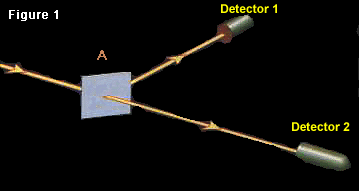](img/fig1_4.png)
In Figure 1, we see, at **A**, a half-silvered mirror, and two
photon detectors, **1** and **2**.

Early scientists, when they ran experiments like this, became
confused about what the results meant.  They would send a photon
toward the half-silvered mirror, and half the time they would see
the detector at 1 click, and the other half the time they would see
the detector at 2 click.

The early scientists - you're going to laugh at this - thought that
the silver mirror deflected the photon half the time, and let it
through half the time.

Ha, ha!  As if the half-silvered mirror did different things on
different occasions!  I want you to let go of this idea, because if
you cling to what early scientists thought, you will become
extremely confused.  The half-silvered mirror obeys the same rule
every time.

If you were going to write a computer program that *was* this
experiment - not a computer program that *predicted* the result of
the experiment, but a computer program that resembled the
underlying reality - it might look sort of like this:

At the start of the program (the start of the experiment, the start
of time) there's a certain mathematical entity, called a
*configuration.*  You can think of this configuration as
corresponding to "There is one photon heading from the photon
source toward the half-silvered mirror", or just "A photon heading
toward **A**."

A configuration can store a single complex value - "complex" as in
the complex numbers (a + b*i*).  At the start of the program,
there's already a complex number stored in the configuration "A
photon heading toward **A**."  The exact value doesn't matter so
long as it's not zero.  We'll let the configuration "A photon
heading toward **A**" have a value of (-1 + 0*i*).

All this is a fact within the territory, not a description of
anyone's knowledge.  A configuration isn't a proposition or a
possibility or a way the world can be.  A configuration is a
variable in the program - you can think of it as a kind of memory
location whose index is "A photon heading toward **A**" - and it's
out there in the territory.

As the complex numbers that get assigned to configurations are not
positive real numbers between 0 and 1, there is no danger of
confusing them with probabilities.  "A photon heading toward **A**"
has complex value -1, which is hard to see as a degree of belief. 
The complex numbers are values within the program, again out there
in the territory.  We'll call the complex numbers *amplitudes.*

There are two other configurations, which we'll call "A photon
going from **A** to Detector **1**" and "A photon going from **A**
to Detector **2**."  These configurations don't have a complex
value yet; it gets assigned as the program runs.

We are going to calculate the amplitudes of "A photon going from
**A** toward **1**" and "A photon going from **A** toward **2**"
using the value of "A photon going toward **A**", and the rule that
describes the half-silvered mirror at **A**.

Roughly speaking, the half-silvered mirror rule is "Multiply by 1
when the photon goes straight, and multiply by *i* when the photon
turns at a right angle."  This is the universal rule that relates
the amplitude of the configuration of "a photon going in", to the
amplitude that goes to the configurations of "a photon coming out
straight" or "a photon being deflected".

So we pipe the amplitude of the configuration "A photon going
toward **A**", which is (-1 + 0*i*), into the half-silvered mirror
at **A**, and this transmits an amplitude of (-1 + 0*i*)\**i* = (0
+ -*i*) to "A photon going from **A**toward **1**", and also
transmits an amplitude of (-1 + 0*i*)\*1 = (-1 + 0*i*) to "A photon
going from **A** toward **2**".

In the Figure 1 experiment, these are all the configurations and
all the transmitted amplitude we need to worry about, so we're
done.  Or, if you want to think of "Detector **1** gets a photon"
and "Detector **2** gets a photon" as separate configurations,
they'd just inherit their values from "**A**-\>**1**" and
"**A**-\>**2**" respectively.  (Actually, the values inherited
should be multiplied by another complex factor, corresponding from
the distance from **A** to the detector; but we will ignore that
for today, and suppose that all distances traveled in our
experiments happen to correspond to a complex factor of 1.)

So the final program state is:

> Configuration "A photon going toward **A**": (-1 + 0*i*)  
> Configuration "A photon going from **A** toward **1**": (0 +
> -*i*)  
> Configuration "A photon going from **A** toward **2**": (-1 +
> 0*i*)  
>     *and optionally*  
> Configuration "Detector **1** gets a photon": (0 + -*i*)  
> Configuration "Detector **2** gets a photon": (-1 + 0*i*)

This same result occurs - the same amplitudes stored in the same
configurations - every time you run the program (every time you do
the experiment).

Now, for *complicated* reasons that we aren't going to go into
today - considerations that belong on a higher level of
organization than fundamental quantum mechanics, the same way that
atoms are more complicated than quarks - there's no *simple*
measuring instrument that can directly tell us the exact amplitudes
of each configuration.  We can't directly see the program state.

So how do physicists know what the amplitudes are? 

We *do* have a magical measuring tool that can tell us the
*squared modulus* of a configuration's amplitude.  If the original
complex amplitude is (a + b*i*), we can get the positive real
number (a^2^ + b^2^).  Think of the Pythagorean theorem: if you
imagine the complex number as a little arrow stretching out from
the origin on a two-dimensional plane, then the magic tool tells us
the squared length of the little arrow, but it doesn't tell us the
direction the arrow is pointing.

To be more precise, the magic tool actually just tells us the
*ratios* of the squared lengths of the amplitudes in some
configurations.  We don't know how long the arrows are in an
absolute sense, just how long they are relative to each other.  But
this turns out to be enough information to let us reconstruct the
laws of physics - the rules of the program.  And so I can talk
about amplitudes, not just ratios of squared moduli.

When we wave the magic tool over "Detector **1** gets a photon" and
"Detector **2** gets a photon", we discover that these
configurations have the same squared modulus - the lengths of the
arrows are the same.  Thus speaks the magic tool.  By doing more
*complicated* experiments (to be seen shortly), we can tell that
the original complex numbers had a ratio of *i* to 1.  
And what is this magical measuring tool?

Well, from the perspective of everyday life - way, way, way above
the quantum level and a lot more complicated - the magical
measuring tool is that we send some photons toward the
half-silvered mirror, one at a time, and count up how many photons
arrive at Detector 1 versus Detector 2 over a few thousand trials. 
The ratio of these values is the ratio of the squared moduli of the
amplitudes.  But the reason for this is *not* something we are
going to consider yet.  Walk before you run.  It is not possible to
understand what happens *all the way up* at the level of everyday
life, before you understand what goes on in much simpler cases.

For today's purposes, we have a magical squared-modulus-ratio
reader.  And the magic tool tells us that the little
two-dimensional arrow for the configuration "Detector **1** gets a
photon" has the same squared length as for "Detector **2** gets a
photon".  That's all.

You may wonder, "Given that the magic tool works this way, what
motivates us to use quantum theory, instead of thinking that the
half-silvered mirror reflects the photon around half the time?"

Well, that's just begging to be confused - putting yourself into a
historically realistic frame of mind like that and using everyday
intuitions.  Did I say anything about a little billiard ball going
one way or the other and possibly bouncing off a mirror?  That's
not how reality works.  *Reality* is about complex amplitudes
flowing between configurations, and the laws of the flow are
stable.

But if you insist on seeing a more complicated situation that
billiard-ball ways of thinking can't handle, here's a more
complicated experiment:

In Figure 2, **B** and **C** are full mirrors, and **A** and **D**
are half-mirrors.  The line from **D** to **E** is dashed for
reasons that will become apparent, but amplitude is flowing from
**D** to **E** under exactly the same laws.

Now let's apply the rules we learned before:

At the beginning of time "A photon heading toward **A**" has
amplitude (-1 + 0*i*).

We proceed to compute the amplitude for the configurations "A
photon going from **A** to **B**" and "A photon going from **A** to
**C**".

> "A photon going from **A** to **B**" = *i* \* "A photon heading
> toward **A**" = (0 + -*i*)

Similarly,

> "A photon going from **A** to **C**" = 1 \* "A photon heading
> toward **A**" = (-1 + 0*i*)

The full mirrors behave (as one would expect) like half of a
half-silvered mirror - a full mirror just bends things by right
angles and multiplies them by *i*.  (To state this slightly more
precisely:  For a full mirror, the amplitude that flows, from the
configuration of a photon heading in, to the configuration of a
photon heading out at a right angle, is multiplied by a factor of
*i*.)

So:

> "A photon going from **B** to **D**" = *i* \* "A photon going from
> **A** to **B**" = (1 + 0*i*)  
> "A photon going from **C** to **D**" = *i* \* "A photon going from
> **A** to **C**" = (0 + -*i*)

"**B** to **D**" and "**C** to **D**" are two different
configurations - we don't simply write "A photon at **D**" -
because the photons are arriving at two different angles in these
two different configurations.  And what **D** does to a photon,
depends on the angle at which the photon arrives.

Again, the rule (speaking loosely) is that when a half-silvered
mirror bends light at a right angle, the amplitude that flows from
the photon-going-in configuration to the photon-going-out
configuration, is the amplitude of the photon-going-in
configuration multiplied by *i*.  And when two configurations are
related by a half-silvered mirror letting light straight through,
the amplitude that flows from the photon-going-in configuration is
multiplied by 1.

So:

-   From the configuration "A photon going from **B** to **D**",
    with original amplitude (1 + 0*i*)
    -   Amplitude of (1 + 0*i*) \* *i* = (0 + *i*) flows to "A photon
        going from **D** to **E**"
    -   Amplitude of (1 + 0*i*) \* 1 = (1 + 0*i*) flows to "A photon
        going from **D** to **F**".

-   From the configuration "A photon going from **C** to **D**",
    with original amplitude (0 + -*i*)
    -   Amplitude of (0 + -*i*) \* *i* = (1 + 0*i*) flows to "A photon
        going from **D** to **F**"
    -   Amplitude of (0 + -*i*) \* 1 = (0 + -*i*) flows to "A photon
        going from **D** to **E**".

Therefore:

-   The *total* amplitude flowing to configuration "A photon going
    from **D** to **E**" is (0 + *i*) + (0 + -*i*) = (0 + 0*i*) = 0.
-   The total amplitude flowing to configuration "A photon going
    from **D** to **F**" is (1 + 0*i*) + (1 + 0*i*) = (2 + 0*i*).

(You
may want to try working this out yourself on pen and paper if you
lost track at any point.)

But the upshot, from that super-high-level "experimental"
perspective that we think of as normal life, is that we see *no*
photons detected at **E**.  Every photon seems to end up at **F**. 
The ratio of squared moduli between "**D** to **E**" and "**D** to
**F**" is 0 to 4.  That's why the line from **D** to **E** is
dashed, in this figure.

This is not something it is possible to explain by thinking of
half-silvered mirrors deflecting little incoming billiard balls
half the time.  You've *got* to think in terms of amplitude flows.

If half-silvered mirrors deflected a little billiard ball half the
time, in this setup, the little ball would end up at Detector 1
around half the time and Detector 2 around half the time.  Which it
doesn't.  So don't think that.

You may say, "But wait a minute!  I can think of another hypothesis
that accounts for this result.  What if, when a half-silvered
mirror reflects a photon, it does something to the photon that
ensures it doesn't get reflected next time?  And when it lets a
photon go through straight, it does something to the photon so it
gets reflected next time."

Now really, there's no need to go making the rules so complicated. 
Occam's Razor, remember.  Just stick with simple, normal amplitude
flows between configurations.

But if you want *another* experiment that disproves your *new*
alternative hypothesis, it's this one:

Here, we've left the whole experimental setup the same, and just
put a little blocking object between **B** and **D**.  This ensures
that the amplitude of "A photon going from **B** to **D**" is 0.

Once you eliminate the amplitude contributions from that
configuration, you end up with totals of (1 + 0*i*) in "A photon
going from **D** to **F**", and (0 + -*i*) in "A photon going from
**D** to **E**".

The squared moduli of (1 + 0*i*) and (0 + -*i*) are both 1, so the
magic measuring tool should tell us that the ratio of squared
moduli is 1.  Way back up at the level where physicists exist, we
should find that Detector 1 goes off half the time, and Detector 2
half the time.

The same thing happens if we put the block between C and D.  The
amplitudes are different, but the ratio of the squared moduli is
still 1, so Detector 1 goes off half the time and Detector 2 goes
off half the time.

This cannot *possibly*happen with a little billiard ball that
either does or doesn't get reflected by the half-silvered mirrors.

Because complex numbers can have opposite directions, like 1 and
-1, or *i* and -*i*, amplitude flows can cancel each other out. 
Amplitude flowing from configuration X into configuration Y can be
canceled out by an equal and opposite amplitude flowing from
configuration Z into configuration Y.  In fact, that's exactly what
happens in this experiment.

In probability theory, when something can either happen one way or
another, X or \~X, then P(Z) = P(Z|X)P(X) + P(Z|\~X)P(\~X).  And
all probabilities are positive.  So if you establish that the
probability of Z happening given X is 1/2, and the probability of X
happening is 1/3, then the total probability of Z happening is
*at least* 1/6 no matter *what* goes on in the case of \~X. 
There's no such thing as negative probability, less-than-impossible
credence, or (0 + *i*) credibility, so *degrees of belief* can't
cancel each other out like amplitudes do.

Not to mention that
[probability is in the mind](http://lesswrong.com/lw/oj/probability_is_in_the_mind/) to
begin with; and we are talking *about* the territory, the
program-that-is-reality, not talking *about* human cognition or
states of partial knowledge.

By the same token, configurations are not *propositions,* not
*statements,* not *ways the world could be.*  Configurations are
not semantic constructs.  Adjectives like *probable*
and*possible** *do not apply to them; they are not beliefs or
sentences or possible worlds.  They are not *true* or *false* but
simply *real.*

In
the experiment of Figure 2, at right, do not be tempted to think
anything like:  "The photon goes to either **B** or **C**, but it
*could* have gone the other way, and this possibility interferes
with its ability to go to **E**..."

It makes no sense to think of something that "could have happened
but didn't" exerting an effect on the world.  We can *imagine*
things that could have happened but didn't - like thinking, "Gosh,
that car almost hit me" - and our imagination can have an effect on
our future behavior.  But the event of imagination is a real event,
that actually happens, and *that* is what has the effect.  It's
your imagination of the unreal event - your very real imagination,
implemented within a quite physical brain - that affects your
behavior.

To think that the *actual event* of a car hitting you - this event
which could have happened to you, but in fact didn't - is directly
exerting a *causal* effect on your behavior, is
[mixing up the map with the territory](http://lesswrong.com/lw/oi/mind_projection_fallacy/).

What affects the world is real.  (If things can affect the world
without being "real", it's hard to see what the word "real"
means.)  Configurations and amplitude flows are causes, and they
have visible effects; they are real.  Configurations are not
possible worlds and amplitudes are not degrees of belief, any more
than your chair is a possible world or the sky is a degree of
belief.

So what *is* a configuration, then?

Well, you'll be getting a clearer idea of that in future posts.

But to give you a quick idea of how the real picture differs from
the simplified version we saw today...

Our experimental setup only dealt with one moving particle, a
single photon.  Real configurations are about multiple particles. 
Tomorrow's post will deal with the case of more than one particle,
and that should give you a much clearer idea of what a
configuration is.

Each configuration we talked about, *should*have described a joint
position of all the particles in the mirrors and detectors, not
just the position of one photon bopping around.

In fact, the *really real* configurations are over joint positions
of all the particles in the universe, including the particles
making up the experimenters.  You can see why I'm saving the notion
of*experimental results* for later posts.

In the real world, amplitude is a continuous distribution over a
continuous *space* of configurations.  Today's "configurations"
were blocky and digital, and so were our "amplitude flows".  It was
as if we were talking about a photon teleporting from one place to
another.

We'll get atoms and molecules and humans and all that stuff, out of
a differentiable amplitude distribution in a continuous
configuration space, *later.*

If none of that made sense, don't worry.  It will be cleared up in
future posts.  Just wanted to give you some idea of where this was
heading.

# Joint Configurations

The key to understanding configurations, and hence the key to
understanding quantum mechanics, is realizing on a truly gut level
that configurations are about more than one particle.

[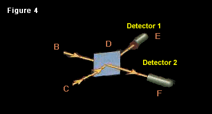](img/fig4_2.png)
Continuing from [yesterday](http://lesswrong.com/lw/pd/configurations_and_amplitude/),
here's an altered version of the experiment where we send in *two*
photons toward **D** at the same time, from the sources **B** and
**C**.

The starting configuration then is:

"A photon going from **B** to **D**, and a photon going from **C**
to **D**."

Again, let's say the starting configuration has amplitude (-1 +
0*i*).

And remember, the rule of the half-silvered mirror (at **D**) is
that a right-angle deflection multiplies by *i*, and a straight
line multiplies by 1.

So the amplitude flows from the starting configuration, separately
considering the four cases of deflection/non-deflection of each
photon, are:

1.  The "**B** to **D**" photon is deflected and the "**C** to
    **D**" photon is deflected.  This amplitude flows to the
    configuration "A photon going from **D** to **E**, and a photon
    going from **D** to **F**".  The amplitude flowing is (-1 + 0*i*)
    \* *i* \* *i* = (1 + 0*i*).
2.  The  "**B** to **D**" photon is deflected and the  "**C** to
    **D**" photon goes straight.  This amplitude flows to the
    configuration "Two photons going from **D** to **E**".  The
    amplitude flowing is (-1 + 0*i*) \* *i* \* 1 = (0 + -*i*).
3.  The  "**B** to **D**" photon goes straight and the  "**C** to
    **D**" photon is deflected.  This amplitude flows to the
    configuration "Two photons going from **D** to **F**".  The
    amplitude flowing is (-1 + 0*i*) \* 1 \* *i* = (0 + -*i*).
4.  The "**B** to **D**" photon goes straight and the "**C** to
    **D**" photon goes straight.  This amplitude flows to the
    configuration "A photon going from **D** to **F**, and a photon
    going from **D** to **E**".  The amplitude flowing is (-1 + 0*i*)
    \* 1 \* 1 = (-1 + 0*i*).

Now - and this is a
*very important and fundamental idea in quantum mechanics* - the
amplitudes in cases 1 and 4 are flowing to the *same*
configuration.  Whether the **B** photon and **C** photon both go
straight, or both are deflected, the resulting configuration is
*one photon going toward **E** and another photon going toward **F***.

So we add up the two incoming amplitude flows from case 1 and case
4, and get a total amplitude of (1 + 0*i*) + (-1 + 0*i*) = 0.

When we wave our magic squared-modulus-ratio reader over the three
final configurations, we'll find that "Two photons at Detector 1"
and "Two photons at Detector 2" have the same squared modulus, but
"A photon at Detector 1 and a photon at detector 2" has squared
modulus zero.

Way up at the level of experiment, we never find Detector 1 and
Detector 2 both going off.  We'll find Detector 1 going off twice,
or Detector 2 going off twice, with equal frequency.

(Assuming I've gotten the math and physics right.  I didn't
actually perform the experiment.  If I got this wrong, I'm sure 50
commenters will tell me so in very short order.)

The configuration's identity is *not,* "The **B** photon going
toward **E** and the **C** photon going toward **F**."  Then the
resultant configurations in case 1 and case 4 would not be equal. 
Case 1 would be, "**B** photon to **E**, **C** photon to **F**" and
case 4 would be "**B** photon to **F**, **C** photon to **E**". 
These would be two distinguishable configurations, *if*
configurations had photon-tracking structure.

So we would not add up the two amplitudes and cancel them out.  We
would keep the amplitudes in two separate configurations.  The
total amplitudes would have non-zero squared moduli.  And when we
ran the experiment, we would find (around half the time) that
Detector 1 and Detector 2 each registered one photon.  Which
doesn't happen, if my calculations are correct.

Configurations don't keep track of where particles come from.  A
configuration's identity is just, "A photon here, a photon there;
an electron here, an electron there."  No matter how you get into
that situation, so long as there are the same species of particles
in the same places, it counts as the same configuration.

I say again that the question "What kind of information does the
configuration's structure incorporate?" has
*experimental consequences.*  You can deduce, from experiment, the
way that reality itself must be treating configurations.

In a classical universe, there would be no experimental
consequences.  If the photon were like a little billiard ball that
either went one way or the other, and the configurations were our
beliefs about possible states the system could be in, and instead
of amplitudes we had probabilities, it would not make a difference
whether we tracked the origin of photons or threw the information
away.

In a classical universe, I could assign a 25% probability to both
photons going to **E**, a 25% probability of both photons going to
**F**, a 25% probability of the **B** photon going to **E** and the
**C** photon going to **F**, and 25% probability of the **B**
photon going to **F** and the **C** photon going to **E**.  Or,
since I *personally* don't care which of the two latter cases
occurred, I could decide to collapse the two possibilities into one
possibility and add up their probabilities, and just say, "A 50%
probability that each detector gets one photon."

With probabilities, we can aggregate events as we like - draw our
boundaries around sets of possible worlds as we please - and the
numbers will still work out the same.

But you can't arbitrarily collapse configurations together, or
split them apart, in your model, and get the same experimental
predictions.  Our magical tool tells us the ratios of squared
moduli.  When you add two complex numbers, the squared modulus of
the sum is not the sum of the squared moduli of the parts:

> Squared\_Modulus(C1 + C2) != Squared\_Modulus(C1) +
> Squared\_Modulus(C2)

E.g:

> S\_M((2 + *i*) + (1 + -*i*)) = S\_M(3 + 0*i*) = 3\^2 + 0\^2 = 9  
> (S\_M(2 + *i*) + S\_M(1 + -*i*)) = ((2\^2 + 1\^2) + (1\^2 +
> (-1)\^2)) = ((4 + 1) + (1 + 1)) = 7

Or in today's experiment of discourse, we had flows of (1 + 0*i*)
and (-1 + 0*i*) cancel out, adding to 0 whose squared modulus is 0,
where the squared modulus of the parts would have been 1 and 1.

Because the squared modulus of the sum does not equal the squared
modulus of the parts, the question of which configurations are the
same or distinct is experimentally distinguishable; a matter of
objective fact.  You cannot merge configurations that should be
distinct, or split configurations that should be identical, without
ending up with different results.

The *probability* of two mutually exclusive events equals the
probability of the first event plus the probability of the second
event.  This is what lets us group *possible worlds* however we
like during our calculations, without affecting our final
probabilities.

Suppose I roll two six-sided dice (all the way up at the level of
everyday life, where something like a classical level emerges). 
Then, when I calculate the probability of events like "both dice
will show odd numbers", it does not depend whether I make a table
of 36 possible outcomes for the exact numbers, or if I decide to
think about 1, 3, 5 as "odd faces" and 2, 4, 6 as "even faces" and
make a table of 4 possible outcomes. I can split up my knowledge
any way I like - throw away information that doesn't make a
difference to my current calculations, or keep the information,
depending on my whim - and my predictions will
[always come out the same](http://lesswrong.com/lw/mt/beautiful_probability/).

If in place of Squared\_Modulus, our magical tool was some linear
function - any function where F(X + Y) = F(X) + F(Y) - then all the
quantumness would instantly vanish and be replaced by a classical
physics.  (A *different*classical physics, not the same illusion of
classicality we hallucinate from inside the higher levels of
organization in our own quantum world.)

If amplitudes were just probabilities, they couldn't cancel out
when flows collided.  If configurations were just states of
knowledge, you could reorganize them however you liked.

But the configurations are nailed in place, indivisible and
unmergeable without changing the laws of physics.

And part of what is nailed, is the way that configurations treat
multiple particles.  A configuration says, "A photon here, a photon
there", not "*This* photon here, *that* photon there".  "*This*
photon here, *that* photon there" does not have a different
identity from "*That* photon here, *this* photon there."

The result - we'll talk more about this in future posts, but it's
visible already in today's experiment - is that you can't factorize
the physics of our universe to be about particles with individual
identities.

Part of the reason why humans have trouble coming to grips with
*perfectly normal* quantum physics, is that humans bizarrely keep
trying to factor reality into a sum of individually real billiard
balls.

Ha ha!  Silly humans.

# Distinct Configurations

Yesterday's experiment carried two key lessons:

First, we saw that because amplitude flows can cancel out, and
because our magic measure of squared modulus is not linear, the
identity of configurations is nailed down - you can't reorganize
configurations the way you can regroup possible worlds.  Which
configurations are the same, and which are distinct, has
experimental consequences; it is an observable fact.

Second, we saw that configurations are about multiple particles. 
If there are two photons entering the apparatus, that doesn't mean
there are two initial configurations.  Instead the initial
configuration's identity is "Two photons coming in."  (Ideally,
each configuration we talk about would include every particle in
the experiment - including the particles making up the mirrors and
detectors.  And in the real universe, every configuration is about
*all* the particles... *everywhere*.)

What makes for distinct configurations is not distinct particles. 
Each configuration is about every particle.  What makes
configurations distinct, is particles occupying different positions
- at least one particle in a different state.

To take one important demonstration...

[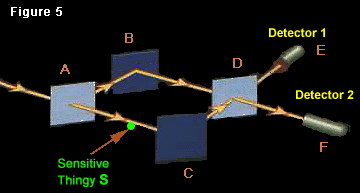](img/fig5_2.png)
This is the same experiment as
[Figure 2](http://lesswrong.com/lw/pd/configurations_and_amplitude/),  with one
important change:  Between **A** and **C** has been placed a
sensitive thingy, **S**.  The key attribute of **S** is that if a
photon goes past **S**, **S** ends up in a slightly different
state.

Let's say that the two possible states of **S** are *Yes* and
*No*.  **S** starts out in state *No*, and ends up in state *Yes*
if a photon goes past.

Then the initial configuration is:

> "A photon heading toward **A**; and **S** in state *No*."  (-1 +
> 0*i*)

Next, the action of the half-silvered mirror at **A**.  In the
[previous version of this experiment](http://lesswrong.com/lw/pd/configurations_and_amplitude/),
without the sensitive thingy, the two resultant configurations were
"**A** to **B**" with amplitude -*i* and "**A** to **C**" with
amplitude -1.  Now, though, a new element has been introduced into
the system, and all configurations are about all particles, and so
every configuration mentions the new element.  So the amplitude
flows from the initial configuration are to:

> "Photon from **A** to **B**; and **S** in state *No*."  (0 +
> -*i*)  
> "Photon from **A** to **C**; and **S** in state *Yes.*"  (-1 +
> 0*i*)

Next, the action of the full mirrors at **B** and **C**:

> "Photon from **B** to **D**; and **S** in state *No*."  (1 +
> *0i*)  
> "Photon from **C** to **D**; and **S** in state *Yes.*"  (0 +
> -*i*)

And then the action of the half-mirror at **D**, on the amplitude
flowing from both of the above configurations:

1.  "Photon from **D** to **E**; and **S** in state *No*."  (0 +
    *i*)
2.  "Photon from **D** to **F**; and **S** in state *No*."  (1 +
    0*i*)
3.  "Photon from **D** to **E**; and **S** in state *Yes.*"  (0 +
    -*i*)
4.  "Photon from **D** to **F**; and **S** in state *Yes.*"  (1 +
    0*i*)

When we did this experiment without the sensitive thingy, the
amplitude flows (1) and (3) of (0 + *i*) and (0 + -*i*) to the
"**D** to **E**" configuration canceled each other out.  We were
left with no amplitude for a photon going to Detector 1 (way up at
the experimental level, we never observe a photon striking Detector
1).

But in this case, the two amplitude flows (1) and (3) are now to
distinct configurations; at least one entity, **S**, is in a
different state between (1) and (3).  The amplitudes don't cancel
out.

When we wave our magical squared-modulus-ratio detector over the
four final configurations, we find that the squared moduli of all
are equal:  25% probability each.  Way up at the level of the real
world, we find that the photon has an equal chance of striking
Detector 1 and Detector 2.

All the above is true, even if we, the researchers, don't care
about the state of **S**.  Unlike possible worlds, configurations
cannot be regrouped on a whim.  The laws of *physics* say the two
configurations are distinct; it's not a question of how *we* can
most conveniently parse up the world.

All the above is true, even if we don't bother to look at the state
of **S**.  The configurations (1) and (3) are distinct in physics,
even if we don't know the distinction.

All the above is true, even if we don't know **S** exists.  The
configurations (1) and (3) are distinct whether or not *we* have
distinct *mental representations* for the two possibilities.

All the above is true, even if we're in space, and **S** transmits
a new photon off toward the interstellar void in two distinct
directions, depending on whether the photon of interest passed it
or not.  So that we couldn't *ever* find out whether **S** had been
in *Yes* or *No*.  The state of **S** would be embodied in the
photon transmitted off to nowhere.  The lost photon can be an
[implied invisible](http://lesswrong.com/lw/pb/belief_in_the_implied_invisible/), and
the state of **S** pragmatically undetectable; but the
configurations are still distinct.

(The main reason it *wouldn't* work, is if **S** were nudged, but
**S** had an original spread in configuration space that was larger
than the nudge.  Then you couldn't rely on the nudge to separate
the amplitude distribution over configuration space into distinct
lumps.  In reality, all this takes place within a differentiable
amplitude distribution over a continuous configuration space.)

Configurations are not belief states.  Their distinctness is an
objective fact with experimental consequences.  The configurations
are distinct even if no one knows the state of **S**; distinct even
if no intelligent entity can ever find out.  The configurations are
distinct so long as at least *one particle* in the universe
*anywhere* is in a different position.  This is experimentally
demonstrable.

Why am I emphasizing this?  Because back in the dark ages when no
one understood quantum physics...

[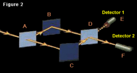](img/fig2_2.png)

Okay, so imagine that you've got no clue what's really going on,
and you try the experiment in Figure 2, and no photons show up at
Detector 1.  Cool.

You also discover that when you put a block between **B** and
**D**, *or* a block between **A** and **C**, photons show up at
Detector 1 and Detector 2 in equal proportions.  But only one at a
time - Detector 1 or Detector 2 goes off, not both simultaneously.

So, yes, it *does*seem to you like you're dealing with a particle -
the photon is only in one place at one time, every time *you*see it
(we'll talk about the *real* reasons for this later).

And yet there's some kind of... *mysterious phenomenon...* that
prevents the photon from showing up in Detector 1.  And this
mysterious phenomenon depends on the photon being *able* to go both
ways.  Even though the photon only shows up in one detector or the
other, which shows, *you would think,* that the photon is only in
one place at a time.

[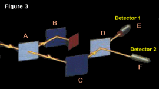](img/fig3_2.png)
Which makes the whole pattern of the experiments seem pretty
bizarre!   After all, the photon either goes from **A** to **C**,
or from **A** to **B**; one or the other.  (Or so you would think,
if you were instinctively trying to break reality down into
individually real particles.)  But when you block off one course or
the other, you start getting different experimental results!

It's like the photon wants to be *allowed* to go both ways, even
though (you would think) it only goes one way or the other.  And it
can *tell* if you try to block it off, without actually
going*there* - if it'd gone there, it would have run into the
block, and not hit any detector at all.** **

It's as if mere *possibilities* could have causal effects, in
defiance of what the word "real" is usually thought to
*mean*...** **

But it's a bit early to jump to conclusions like *that*, when you
don't have a complete picture of what goes on inside the
experiment.

So it occurs to you to put a sensor between **A** and **C**, so you
can tell which way the photon *really* goes on each occasion.

And the mysterious phenomenon goes away.

I mean, now how crazy is that?  What kind of paranoia does that
inspire in some poor scientist?

Okay, so in the 21st century we realize in order to "know" a
photon's history, the particles making up your brain
[have to be correlated](http://lesswrong.com/lw/o5/the_second_law_of_thermodynamics_and_engines_of/)
with the photon's history.  If having a tiny little sensitive
thingy **S** that correlates to the photon's history, is enough to
distinguish the final configurations and prevent the amplitude
flows from canceling; then an entire sensor with a digital display,
never mind a human brain, will put *septillions*of particles in
different positions and prevent the amplitude flows from
canceling.

But if you hadn't worked that out yet...

Then you would ponder the sensor having banished the Mysterious
Phenomenon, and think:

The photon doesn't just want to be *physically* free to go either
way.  It's not a little wave going along an unblocked pathway,
because then just having a physically unblocked pathway would be
enough.

No... I'm not allowed to *know* which way the photon went.

The mysterious phenomenon...
*doesn't want me looking at it too closely*... while it's doing its
mysterious thing.

It's not *physical possibilities* that have an effect on reality...
only *epistemic possibilities.*  If I *know* which way the photon
went, it's no longer *plausible*that it went the other way... which
cuts off the mysterious phenomenon as effectively as putting a
block between **B** and **D**.

I have to *not observe* which way the photon went, in order for it
to always end up at Detector 2.  It has to be *reasonable*that the
photon could have gone to either **B** or **C**.  What I can *know*
is the determining factor, regardless of which physical paths I
leave open or closed.

STOP THE PRESSES!  MIND IS FUNDAMENTAL AFTER ALL!  CONSCIOUS
AWARENESS DETERMINES OUR EXPERIMENTAL RESULTS!

You can *still read* this kind of stuff.  In *physics textbooks.* 
Even now, when a majority of theoretical physicists know better. 
Stop the presses.  Please, stop the presses.

[Hindsight is 20/20](http://lesswrong.com/lw/il/hindsight_bias/); and so it's easy to
say that, in hindsight, there were certain clues that this
interpretation was not correct.

Like, if you put the sensor between **A** and **C**
*but don't read it*, the mysterious phenomenon *still* goes away,
and the photon still sometimes ends up at Detector 1.  (Oh, but you
*could* have read it, and possibilities are real now...)

But it doesn't even have to be a *sensor,* a scientific instrument
that you built.  A single particle that gets nudged far enough will
dispel the interference.  A photon radiating off to where you'll
never see it again can do the trick.  Not much human involvement
there.  Not a whole lot of conscious awareness.

Maybe before you pull the dualist fire alarm on human brains being
physically special, you should provide experimental proof that a
rock can't play the same role in dispelling the Mysterious
Phenomenon as a human researcher?

But that's hindsight, and it's easy to call the shots in
hindsight.  Do you *really* think you could've done better than
John von Neumann, if you'd been alive at the time?  The point of
this kind of
[retrospective analysis](http://lesswrong.com/lw/h6/chronophone_motivations/) is to ask
what kind of [fully general clues](http://lesswrong.com/lw/h5/archimedess_chronophone/)
you could have followed, and whether there are any similar clues
you're ignoring now on current mysteries.

Though it *is* a little embarrassing that, even *after* the theory
of amplitudes and configurations had been worked out - with the
theory now giving the definite prediction that any nudged particle
would do the trick - early scientists *still* didn't get it.

But you see... it had been established as Common Wisdom that
configurations were possibilities, it was epistemic possibility
that mattered, amplitudes were a very strange sort of partial
information, and conscious observation made quantumness go away. 
And that it was best to avoid thinking too hard about the whole
business, so long as your experimental predictions came out right.

# Where Philosophy Meets Science

Looking back on early quantum physics - not for purposes of
admonishing the major figures, or to claim that *we* could have
done better if we'd been born into that era; but in order to try
and learn a moral, and do better next time - looking back on the
dark ages of quantum physics, I say, I would nominate as the "most
basic" error...

...*not* that they tried to reverse course on the last three
thousand years of science suggesting that mind was complex
[within physics](http://lesswrong.com/lw/p6/reductive_reference/) rather than
fundamental in physics.  This is Science, and we do have
revolutions here.  Every now and then you've got to reverse a
trend. 
[The future is always absurd](http://lesswrong.com/lw/j6/why_is_the_future_so_absurd/)
and never unlawful.

I would nominate, as the basic error not to repeat next time, that
the early scientists forgot that they *themselves* were made out of
particles.

I mean, I'm sure that most of them knew it in theory.

And yet they didn't notice that putting a sensor to detect a
passing electron, or even *knowing* about the electron's history,
was an example of "particles in different places".  So they didn't
notice that a quantum theory of distinct configurations already
explained the experimental result, without any need to invoke
consciousness.

In the [ancestral environment](http://lesswrong.com/lw/kr/an_alien_god/), humans were
often faced with the adaptively relevant task of predicting other
humans.  For which purpose you thought of your fellow humans as
having thoughts, knowing things and feeling things, rather than
thinking of them as being made up of particles.  In fact, many
hunter-gatherer tribes may not even have known that particles
existed. It's much more *intuitive* - it *feels*
[simpler](http://lesswrong.com/lw/jp/occams_razor/) - to think about someone "knowing"
something, than to think about their brain's particles occupying a
different state.  It's easier to phrase your explanations in terms
of what *people know*; it feels more natural; it leaps more readily
to mind.

Just as, once upon a time, it was easier to imagine Thor throwing
lightning bolts, than to imagine Maxwell's Equations - even though
Maxwell's Equations can be described by a computer program vastly
smaller than the program for an intelligent agent like Thor.

So the ancient physicists found it natural to think, "I know where
the photon was... what difference could *that* make?"  Not, "My
brain's particles' current state correlates to the photon's
history... what difference could *that*make?"

And, similarly, because it felt easy and intuitive to model reality
in terms of people knowing things, and the decomposition of knowing
into brain states did not leap so readily to mind, it *seemed* like
a [simple theory](http://lesswrong.com/lw/jp/occams_razor/) to say that a configuration
could have amplitude only "if you didn't know better".

To turn the dualistic quantum hypothesis into a *formal* theory -
one that could be written out as a computer program, without human
scientists deciding when an "observation" occurred - you would have
to specify what it meant for an "observer" to "know" something, in
terms your computer program could compute.

So is your theory of fundamental physics going to examine all the
particles in a human brain, and decide when those particles "know"
something, in order to compute the motions of particles?  But then
how do you compute the motion of the particles in the brain itself?
Wouldn't there be a potential infinite recursion?

But so long as the terms of the theory were being processed by
human scientists, they *just knew* when an "observation" had
occurred.  You said an "observation" occurred whenever it had to
occur in order for the experimental predictions to come out right -
a subtle form of constant tweaking.

(Remember, the basics of quantum theory were formulated before Alan
Turing said anything about Turing machines, and *way* before the
concept of computation was popularly known.  The distinction
between an effective formal theory, and one that required human
interpretation, was not as clear then as now.  Easy to pinpoint the
problems in hindsight; you shouldn't learn the lesson that problems
are usually this obvious in foresight.)

Looking back, it may *seem* like one meta-lesson to learn from
history, is that philosophy really matters in science - it's not
just some adjunct of a separate academic field.

After all, the early quantum scientists were doing all the right
experiments.  It was their interpretation that was off.  And the
problems of interpretation were not the result of their getting the
statistics wrong.

Looking back, it seems like the errors they made, were errors in
the kind of thinking that we would describe as, well,
"philosophical".

When we look back and ask, "How could the early quantum scientists
have
[done better](http://lesswrong.com/lw/h8/tsuyoku_naritai_i_want_to_become_stronger/),
even in principle?" it seems that the insights they needed were
philosophical ones.

And yet it wasn't professional philosophers who swooped in and
solved the problem and cleared up the mystery and made everything
normal again.  It was, well, physicists.

Arguably, Leibniz was at least as foresightful about quantum
physics, as Democritus was once thought to have been foresightful
about atoms.  But that is hindsight.  It's the result of looking at
the solution, and thinking back, and saying, "Hey, Leibniz said
something like that."

Even where one philosopher gets it right in advance, it's usually
science that ends up *telling us* which philosopher is right - not
the *prior consensus* of the philosophical community.

I think this has something fundamental to say about the nature of
philosophy, and the interface between philosophy and science.

It was once said that every science begins as philosophy, but then
grows up and leaves the philosophical womb, so that at any given
time, "Philosophy" is what we haven't turned into science yet.

I suggest that when we look at the history of quantum physics, and
say, "The insights they needed were philosophical insights," what
we are *really* seeing, is that the insight they needed was of a
form that is not yet taught in standardized academic classes, and
not yet reduced to calculation.

Once upon a time, the notion of the scientific method - updating
beliefs based on experimental evidence - was a philosophical
notion. But it was not championed by professional philosophers.  It
was the real-world power of science that showed that scientific
epistemology was good epistemology, not a prior consensus of
philosophers.

Today, this philosophy of belief-updating is *beginning* to be
reduced to calculation - statistics, Bayesian probability theory.

But back in Galileo's era, it was solely *vague verbal arguments*
that said you should try to produce numerical predictions of
experimental results, rather than consulting the Bible or
Aristotle.

At the frontier of science, and especially, at the frontier of
scientific *chaos* and scientific *confusion*, you find problems of
thinking that are not taught in academic courses, and that have not
been reduced to calculation.  And this will seem like a domain of
philosophy; it will seem that you must do philosophical thinking in
order to sort out the confusion.  But when history looks back, I'm
afraid, it is usually not a professional philosopher who wins all
the marbles - because it takes intimate involvement with the
scientific domain in order to do the philosophical thinking.  Even
if, afterward, it all seems knowable *a priori*; and even if,
afterward, some philosopher out there actually *got* it *a priori*;
even so, it takes intimate involvement to see it in practice, and
experimental results to tell the world which philosopher won.

I suggest that,
[like ethics](http://www.singinst.org/blog/2007/10/21/should-ethicists-be-inside-or-outside-a-profession/),
philosophy really is important, but it is only practiced
effectively from *within* a science.  Trying to do the philosophy
of a frontier science, as a separate academic profession, is as
much a mistake as trying to have separate ethicists.  You end up
with ethicists who speak mainly to other ethicists, and
philosophers who speak mainly to other philosophers.

This is not to say that there is no place for professional
philosophers in the world.  Some problems are so chaotic that there
is no established place for them at all in the halls of science. 
But those "professional philosophers" would be very, very wise to
learn every scrap of relevant-seeming science that they can
possibly get their hands on.  They should not be surprised at the
prospect that experiment, and not debate, will finally settle the
argument.  They should not flinch from running their own
experiments, if they can possibly think of any.

That, I think, is the lesson of history.

PS:  Speaking of history, tonight is April 12, the anniversary of
Yuri's Night - Yuri Gagarin's first flight into space - and there
may be a [celebration](http://www.yurisnight.net/2008/) in your
area.

# Can You Prove Two Particles Are Identical?

Behold, I present you with two electrons.  They have the same mass.
They have the same charge.  In every way that we've tested them
*so far,* they *seem* to behave the same way.

But is there any way we can know that the two electrons are
*really,* truly, entirely indistinguishable?

The one who is wise in philosophy but not in physics will snort
dismissal, saying, "Of course not.  You haven't found an experiment
*yet* that distinguishes these two electrons.  But who knows, you
might find a new experiment tomorrow that does."

Just because your current model of reality files all observed
electrons in the same mental bucket, doesn't mean that tomorrow's
physics will do the same.  That's mixing up the map with the
territory.  Right?

It took a while to discover atomic isotopes.  Maybe someday we'll
discover electron isotopes whose masses are different in the 20th
decimal place.  In fact, for all we know, the electron has a tiny
little tag on it, too small for your current microscopes to see,
reading 'This is electron \#7,234,982,023,348...'  So that you
could in principle toss this one electron into a bathtub full of
electrons, and then fish it out again later.  Maybe there's some
way to know in principle, maybe not - but for now, surely, this is
one of those things that
[science just doesn't know](http://lesswrong.com/lw/kj/no_one_knows_what_science_doesnt_know/).

That's what you would think, if you were wise in philosophy but not
in physics.

But what kind of universe could you possibly live in, where a
simple experiment can tell you whether it's possible *in principle*
to tell two things apart?

Maybe aliens gave you a tiny little device with two tiny little
boxes, and a tiny little light that goes on when you put two
identical things into the boxes?

But how do you know that's what the device *really* does?  Maybe
the device was just built with measuring instruments that go to the
10th decimal place but not any further.

Imagine that we take this problem to an analytic philosopher named
Bob, and Bob says:

> "Well, for one thing, you can't even get absolute proof that the
> two particles actually exist, as opposed to being some kind of
> hallucination created in you by the Dark Lords of the Matrix.  We
> call it 'the problem of induction'."

Yes, we've heard of the problem of induction.  Though the Sun has
risen on billions of successive mornings, we can't know with
[absolute certainty](http://lesswrong.com/lw/mn/absolute_authority/) that, tomorrow,
the Sun will not transform into a giant chocolate cake.  But for
the Sun to transform to chocolate cake requires more than an
unanticipated discovery in physics.  It requires the observed
universe to be a lie.  Can any experiment give us an
*equally strong level* of assurance that two particles are
identical?

> "Well, I Am Not A Physicist," says Bob, "but *obviously,* the
> answer is no."

Why?

> "I already told you why:  No matter how many experiments show that
> two particles are similar, tomorrow you might discover an
> experiment that distinguishes between them."

Oh, but Bob, now you're just taking your conclusion as a premise. 
What you said is exactly what we want to know.  Is there some
achievable state of evidence, some sequence of discoveries, from
within which you can legitimately expect *never* to discover a
future experiment that distinguishes between two particles?

> "I don't believe my logic is circular.  But, since you challenge
> me, I'll formalize the reasoning.
> 
> "Suppose there are particles {P1, P2, ...} and a suite of
> experimental tests {E1, E2, ...}  Each of these experimental tests,
> according to our best current model of the world, has a causal
> dependency on aspects {A1, A2...} of the particles P, where an
> aspect might be something like 'mass' or 'electric charge'.
> 
> "Now these experimental tests can establish very reliably - to the
> limit of our belief that the universe is not outright lying to us -
> that the depended-on aspects of the particles are similar, up to
> some limit of measurable precision.
> 
> "But we can always imagine an additional aspect A0 that is not
> depended-on by any of our experimental measures. Perhaps even an
> epiphenomenal aspect.  Some philosophers will argue over whether an
> epiphenomenal aspect can be truly real, but just because we can't
> legitimately know about something's existence doesn't mean it's not
> there.  Alternatively, we can always imagine an experimental
> difference in any quantitative aspect, such as mass, that is too
> small to detect, but real.
> 
> "These extra properties or marginally different properties are
> conceivable, therefore logically possible. This shows you need
> additional information, *not*present in the experiments, to
> definitely conclude the particles are identical."

That's an interesting argument, Bob, but you say you haven't
studied physics.

> "No, not really."

Maybe you shouldn't be doing all this *philosophical analysis*
before you've studied physics.  Maybe you should beg off the
question, and let a philosopher who's studied physics take over.

> "Would you care to point out a particular flaw in my logic?"

Oh... not at the moment.  We're just saying, You Are Not A
Physicist.  Maybe you shouldn't be so glib when it comes to saying
what physicists can or can't know.

> "They can't know two particles are perfectly identical.  It is not
> possible to imagine an experiment that proves two particles are
> perfectly identical."

*Impossible* to imagine?  You don't know that.  You just know you
haven't imagined such an experiment yet.  But perhaps that simply
demonstrates a limit on your imagination, rather than demonstrating
a limit on physical possibility.  Maybe if you knew a little more
physics, you would be able to conceive of such an experiment?

> "I'm sorry, this isn't a question of physics, it's a question of
> epistemology.  To believe that *all aspects* of two particles are
> *perfectly* identical, requires a different sort of assurance than
> any experimental test can *provide.*  Experimental tests only
> *fail to establish a difference*; they do not *prove identity*.
> What particular physics experiments you can do, is a physics
> question, and I don't claim to know that.  But what experiments can
> *justify believing* is an epistemological question, and I am a
> professional philosopher; I expect to understand that question
> better than any physicist who hasn't studied formal epistemology."

And of course, Bob is wrong.

Bob isn't being stupid.  He'd be right in any classical universe. 
But we don't live in a classical universe.

Our ability to perform an experiment that tells us positively that
two particles are entirely identical, goes right to the heart of
what distinguishes the quantum from the classical; the core of what
separates the way reality actually works, from anything any
pre-20th-century human ever imagined about how reality might work.

If you have a particle P1 and a particle P2, and it's possible in
the experiment for both P1 and P2 to end up in either of two
possible locations L1 or L2, then the observed distribution of
results will depend on whether "P1 at L1, P2 at L2" and "P1 at L2,
P2 at L1" is the same configuration, or two distinct
configurations.  If they're the same configuration, we add up the
amplitudes flowing in, then take the squared modulus.  If they're
different configurations, we keep the amplitudes separate, take the
squared moduli separately, then add the resulting probabilities. 
As (1 + 1)^2^ != (1^2^ + 1^2^), it's not hard to distinguish the
experimental results after a few trials.

(Yes, half-integer spin changes this picture slightly.  Which I'm
not going into in this series of blog posts.  If all
epistemological confusions are resolved, half-integer spin is a
difficulty of mere mathematics, so the issue doesn't belong here. 
Half-integer spin doesn't change the experimental testability of
particle equivalences, or alter the fact that particles have no
individual identities.)

And the flaw in Bob's logic?  It was a fundamental assumption that
Bob couldn't even see, because he had no alternative concept for
contrast.  Bob talked about particles P1 and P2 as if they were
individually real and independently real.  This turns out to assume
that which is to be proven.  In our universe, the individually and
fundamentally real entities are configurations of multiple
particles, and the amplitude flows between them.  Bob failed to
imagine the sequence of experimental results which established to
physicists that this was, in fact, how reality worked.

Bob failed to imagine the evidence which falsified his basic and
invisibly assumed ontology - the discoveries that changed the whole
nature of the game; from a world that was the sum of individual
particles, to a world that was the sum of amplitude flows between
multi-particle configurations.

And so Bob's careful philosophical reasoning ended up around as
useful as Kant's conclusion that space, by its very nature, was
flat.  Turned out, Kant was just reproducing an invisible
assumption built into how his parietal cortex was modeling space. 
Kant's imaginings were evidence only about his imagination - grist
for cognitive science, not physics.

Be careful not to underestimate, through
[benefit of hindsight](http://lesswrong.com/lw/im/hindsight_devalues_science/), how
*surprising* it would seem, a priori, that you could perfectly
identify two particles through experiment.  Be careful not to
underestimate how entirely and perfectly *reasonable* Bob's
analysis would have seemed, if you didn't have quantum assumptions
to contrast to classical ones.

Experiments tell us things about the nature of reality which you
*just plain wouldn't expect* from *a priori* reasoning. 
Experiments falsify assumptions we can't even see. Experiments tell
us how to do things that seem logically impossible. Experiments
deliver surprises from blind spots we don't even know exist.

Bear this in mind, the next time you're wondering whether
*mere empirical science* might have something *totally unexpected*
to say about some impossible-seeming *philosophical* question.

# Classical Configuration Space

>   Once upon a time, there was a student who went to a math
> lecture.  When the lecture was over, he approached one of the other
> students, and said, "I couldn't follow that at all.  The professor
> was talking about rotating 8-dimensional objects!  How am I
> supposed to visualize something rotating in 8 dimensions?"  
>     "Easy," replied the other student, "you visualize it rotating
> in N dimensions, then let N go to 8."  
>             -- old joke

Quantum configuration space isn't quite like classical
configuration space. But in this case, considering that 8
dimensions is peanuts in quantum physics, even I concede that you
ought to start with classical configuration space first.

(I apologize for the homemade diagrams, but this blog post already
used up all available time...)

In classical physics, a configuration space is a way of visualizing
the state of an entire system as a single point in a
higher-dimensional space.

[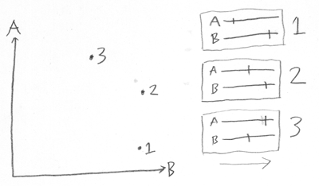](img/conf1.png)
Suppose that a system is composed of two particles, A and B, each
on the same 1-dimensional line.  (We'll call the two directions on
the line, "forward" and "back".)

Then we can view the state of the complete system A+B as a single
point in 2-dimensional space.

If you look at state 1, for example, it describes a state of the
system where B is far forward and A is far back.  We can view state
1 as being embodied either in two 1-dimensional positions (the
representation on the right), or view it as one 2-dimensional
position (the representation on the left).

[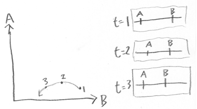](img/conf2.png)
To help grasp the idea of viewing a *system* as a point, this
alternate graph shows A and B on the same line.

When A and B are far apart, they both move toward each other.
However, B moves slower than A.  Also, B wants to be closer to A
than A wants to be close to B, so as B gets too close, A runs
away...

(At least that's what I had in mind while trying to draw the system
evolution.)

The system evolution can be shown as a discrete series of states: 
Time=1, Time=2, Time=3...  But in configuration space, I can draw
the system evolution as a smooth trajectory.

[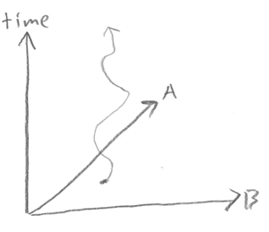](img/conf3.png)
If I had the time (to learn to use the appropriate software), I'd
be drawing neat-o 3D diagrams at this point.  Like the diagram at
right, only with, like, actual graphics.

You may have previously heard the phrase, "time is the 4th
dimension".  But the diagram at right shows the evolution over time
of a 1-dimensional universe with two particles.  So time is the
third dimension, the first dimension being the position of particle
A, and the second dimension being the position of particle B.

All these neat pictures are simplified, even relative to classical
physics.

In classical physics, each particle has a 3-dimensional position
and a 3-dimensional velocity.  So to specify the complete state of
a 7-particle system would require 42 real numbers, which you could
view as one point in 42-dimensional space.

Hence the joke.

Configuration spaces get very high-dimensional, very fast.  That's
why we're sticking with 2 particles in a 1-dimensional universe. 
Anything more than that, I can't draw on paper - you've just got to
be able to visualize it in N dimensions.

So far as classical physics is concerned, it's a matter of taste
whether you would want to imagine a system state as a point in
configuration space, or imagine the individual particles.
Mathematically, the two systems are isomorphic - in classical
physics, that is.  So what's the benefit of imagining a classical
configuration space?

[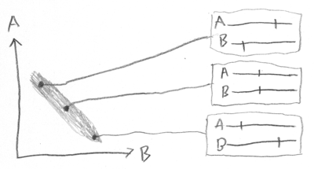](img/conf4.png)
Well, for one thing, it makes it possible to visualize joint
probability distributions.

The grey area in the diagram represents a
*probability distribution* over potential states of the A+B
system.

If this is my state of knowledge, I think the system is somewhere
in the region represented by the grey area.  I believe that if I
knew the actual states of both A and B, and visualized the A+B
system as a point, the point would be inside the grey.

Three sample possibilities within the probability distribution are
shown, and the corresponding systems.

And really the probability distribution should be lighter or
darker, corresponding to volumes of decreased or increased
probability *density*.  It's a *probability* distribution, not a
*possibility* distribution.  I didn't make an effort to represent
this in the diagram - I probably should have - but you can imagine
it if you like.  Or pretend that the slightly darker region in the
upper left is a volume of increased probability density, rather
than a fluke of penciling.

Once you've hit on the idea of using a bounded volume in
configuration space to represent possibility, or a cloud with
lighter and darker parts to represent probability, you can ask how
your *knowledge about* a system develops over time.  If you know
how each system state (point in configuration space) develops
dynamically into a future system state, and you draw a little cloud
representing your current probability distribution, you can project
that cloud into the future.

[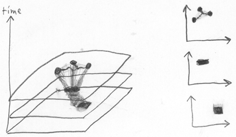](img/conf5.png)
Here I start out with uncertainty represented by the squarish grey
box in the first configuration space, at bottom right.

All the points in the first grey box, correspond to system states,
that dynamically develop over time, into new system states,
corresponding to points in the grey rectangle in the second
configuration space at middle right.

Then, my little rectangle of uncertainty develops over time into a
wiggly figure, three major possibility-nodes connected by thin
strings of probability density, as shown at top right.

In this figure I also tried to represent the idea of conserved
probability volume - the same total volume of possibility, with
points evolving to other points with the same local density, at
each successive time.  This is Liouville's Theorem, which is the
key to the
[Second Law of Thermodynamics](http://lesswrong.com/lw/o5/the_second_law_of_thermodynamics_and_engines_of/),
as I have previously described.

Neat little compact volumes of uncertainty develop over time, under
the laws of physics, into big wiggly volumes of uncertainty.  If
you want to describe the new volumes of uncertainty *compactly,* in
less than a gazillion gigabytes, you've got to draw larger
boundaries around them.  Once you draw the new larger boundary,
your uncertainty never shrinks, because probability flow is
conservative.  So entropy always increases.  That's the second law
of thermodynamics.

Just figured I'd mention that, as long as I was drawing diagrams...
you can see why this "visualize a configuration space" trick is
useful, even in classical physics.

Another idea that's easier to visualize in configuration space is
the idea of conditional independence between two probabilistic
variables.

Conditional independence happens when the joint probability
distribution is the product of the individual probability
distributions:

P(A,B) = P(A) x P(B)

The vast majority of possible probability distributions are not
conditionally independent, the same way that the vast majority of
shapes are not rectangular.  Actually, this is oversimplifying: 
It's not enough for the volume of possibilities to be rectangular. 
The probability density has to *factorize* into a product of
probability densities on each side.

The vast majority of shapes are not rectangles, the vast majority
of color patterns are not plaid.  It's conditional *independence,*
not conditional dependence, that is the unusual special case.

(I bet when you woke up this morning, you didn't think that today
you would be visualizing plaid patterns in N dimensions.)

[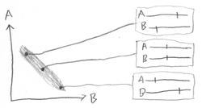](img/conf4_2.png)
In the figure reprised here at right, my little cloud of
uncertainty is not rectangular.

Hence, my uncertainty about A and my uncertainty about B are not
independent.

If you tell me A is far forward, I will conclude B is far back.  If
you tell me A is in the middle of its 1-dimensional universe, I
will conclude that B is likewise in the middle.

If I tell you A is far back, what do you conclude about B?

Aaaand that's classical configuration space, folks.  It doesn't add
anything mathematically to classical physics, but it can help human
beings visualize system dynamics and probability densities.  It
seemed worth filtering into a separate post, because configuration
space is a modular concept, useful for
[other](http://lesswrong.com/lw/nl/the_cluster_structure_of_thingspace/)
[ideas](http://lesswrong.com/lw/o5/the_second_law_of_thermodynamics_and_engines_of/).

Quantum physics *inherently* takes place in a configuration space. 
You can't take it out.  Tomorrow, we'll see why.

# The Quantum Arena

Yesterday, we looked at configuration spaces in classical physics. 
In classical physics, configuration spaces are a useful, but
optional, point of view.

Today we look at quantum physics, which *inherently* takes place
inside a configuration space, and *cannot be taken out*.

[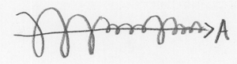](img/ampl1.png)For
a start, as you might guess, in quantum physics we deal with
distributions of complex amplitudes, rather than probability
distributions made up of positive real numbers.  At left, I've used
up 3 dimensions drawing a complex distribution over the position of
*one* particle, A.

You may recall that yesterday, 3 dimensions let us display the
position of two 1-dimensional particles plus the system evolution
over time.  Today, it's taking us 3 dimensions just to visualize an
amplitude distribution over the position of one 1-dimensional
particle at a single moment in time.  Which is why we did classical
configuration spaces first.

[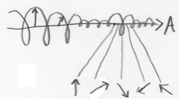](img/ampl2.png)
To clarify the meaning of the above diagram, the left-to-right
direction is the position of A.

The up-and-down direction, and the invisible third dimension that
leaps out of the paper, are devoted to the complex amplitudes. 
Since a complex amplitude has a real and imaginary part, they use
up 2 of our 3 dimensions.

Richard Feynman said to just imagine the complex amplitudes as
little 2-dimensional arrows.  This is as good a representation as
any; little 2D arrows behave just the same way complex numbers do. 
(You add little arrows by starting at the origin, and moving along
each arrow in sequence.  You multiply little arrows by adding the
angles and multiplying the lengths.  This is isomorphic to the
complex field.)  So we can think of each position of the A particle
as having a little arrow associated to it.

As you can see, the position of A bulges in two places - a big
bulge to the left, and a smaller bulge at right.  Way up at the
level of classical observation, there would be a large probability
(integrating over the squared modulus) of finding A somewhere to
the left, and a smaller probability of finding it at the small
bulge to the right.

Drawing a neat little graph of the A+B system would involve having
a complex amplitude for each joint position of the A and B
particles, which you could visualize as a hypersurface in 4
dimensions.  I'd draw it for you, but I left my 4-dimensional
pencil in the pocket of the 3rd leg of my other pants.

[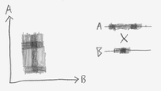](img/conf6_2.png)
You may recall from yesterday that a plaid rectangular probability
distribution factorizes into the product of two independent
probability distributions.

This kind of independence-structure is one of several keys to
recovering the illusion of individual particles from quantum
amplitude distributions.   If the amplitude distribution roughly
factorizes, has subsystems A and B with Amplitude(X,Y) \~
Amplitude(X) \* Amplitude(Y), then X and Y will seem to evolve
roughly independently of each other.

But maintaining the illusion of individuality is harder in quantum
configuration spaces, because of the identity of particles.  This
identity cuts down the size of a 2-particle configuration space by
1/2, cuts down the size of a 3-particle configuration space by 1/6,
and so on.  Here, the diminished configuration space is shown for
the 2-particle case:

[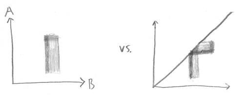](img/ampl3_3.png)

The quantum configuration space is over joint possibilities like "a
particle here, a particle there", not "this particle here, that
particle there".  What would have been a neat little plaid pattern
gets folded in on itself.

You might think that you could recover the structure by figuring
out which particle is "really which" - i.e. if you see a "particle
far forward, particle in middle", you can guess that the first
particle is A, and the second particle is B, because only A can be
far forward; B just stays in the middle.  (This configuration would
lie in at the top of the original plaid pattern, the part that got
folded over).

The problem with this is the little triangular region, where the
folded plaid intersects itself.  In this region, the folded-over
amplitude distribution gets superposed, added together.  Which
makes an experimental difference, because the squared modulus of
the sum is not the sum of the squared moduli.

In that little triangular region of quantum configuration space,
there is simply no fact of the matter as to "which particle is
which".  Actually, there *never was* any such fact; but there was
an illusion of individuality, which in this case has broken down.

But even *that* isn't the ultimate reason why you can't take
quantum physics out of configuration space.

In classical configuration spaces, you can take a *single* point in
the configuration space, and the single point describes the entire
state of a classical system.  So you can take a single point in
classical configuration space, and ask how the corresponding system
develops over time.  You can take a single point in classical
configuration space, and ask, "Where does this one point go?"

The development over time of *quantum* systems depends on things
like the second derivative of the amplitude distribution.  Our laws
of physics describe how amplitude distributions develop into new
amplitude distributions.  They do not describe,
*even in principle,* how one configuration develops into another
configuration.

(I pause to observe that physics books make it way, way, way too
hard to figure out this extremely important fact.  You'd think
they'd tell you up front, "Hey, the evolution of a quantum system
depends on stuff like the second derivative of the amplitude
distribution, so you can't *possibly* break it down into the
evolution of individual configurations*.*"  When I first saw the
Schrรถdinger Equation it confused the hell out of me, because I
thought the equation was supposed to apply to single
configurations.)

If I've understood the laws of physics correctly, quantum mechanics
still has an extremely important property of *locality:*  You can
determine the instantaneous change in the amplitude of a single
configuration using only the infinitesimal neighborhood.  If you
forget that the space is continuous and think of it as a mesh of
computer processors, each processor would only have to talk to its
immedatien neighbors to figure out what to do next.  You do have to
talk to your neighbors - but *only* your next-door neighbors, no
telephone calls across town.  (Technical term: 
"[Markov neighborhood.](http://en.wikipedia.org/wiki/Markov_blanket)")

[Conway's Game of Life](http://en.wikipedia.org/wiki/Conway's_Game_of_Life)
has the discrete version of this property; the future state of each
cell depends only on its own state and the state of neighboring
cells.

The second derivative -
[Laplacian](http://en.wikipedia.org/wiki/Laplace_operator),
actually - is not a *point* property.  But it is a *local*
property, where knowing the immediate neighborhood tells you
everything, regardless of what the rest of the distribution looks
like.  Potential energy, which also plays a role in the evolution
of the amplitude, can be computed at a *single* positional
configuration (if I've understood correctly).

There are mathematical transformations physicists use for their
convenience, like viewing the system as an amplitude distribution
over momenta rather than positions, which throw away this
neighborhood structure (e.g. by making potential energy a
non-locally-computable property).  Well, mathematical convenience
is a fine thing.  But I *strongly suspect* that the physically real
wavefunction has local dynamics.  This kind of locality seems like
an *extremely* important property, a candidate for something
hardwired into the nature of reality and the structure of
causation.  Imposing locality is part of the jump from Newtonian
mechanics to Special Relativity.

The temporal behavior of each amplitude in configuration space
depends only on the amplitude at neighboring points.  But you
cannot figure out what happens to the amplitude of a point in
quantum configuration space, by looking *only* at that *one*
point.  The *future* amplitude depends on the *present* second
derivative of the amplitude distribution.

So you can't say, as you can in classical physics, "If I had
infinite knowledge about the system, all the particles would be in
one definite position, and then I could figure out the exact future
state of the system."

If you had a point mass of amplitude, an infinitely sharp spike in
the quantum arena, the amplitude distribution would not be twice
differentiable and the future evolution of the system would be
undefined.  The known laws of physics would crumple up like
tinfoil.  Individual configurations don't have quantum dynamics;
amplitude distributions do.

A point mass of amplitude, concentrated into a single exact
position in configuration space, does not correspond to a precisely
known state of the universe.  It is *physical nonsense*.

It's like asking, in Conway's Game of Life:  "What is the future
state of this one cell, regardless of the cells around it?"  The
immediate future of the cell depends on its immediate neighbors;
its distant future may depend on distant neighbors.

Imagine trying to say, in a classical universe, "Well, we've got
this probability distribution over this classical configuration
space... but to find out where the system evolves, where the
probability flows from each point, we've got to twice differentiate
the probability distribution to figure out the dynamics."

In classical physics, the position of a particle is a separate fact
from its momentum.  You can know exactly where a particle is, but
not know exactly how fast it is moving.

In Conway's Game of Life, the velocity of a glider is not a
separate, additional fact about the board.  Cells are only "alive"
or "dead", and the *apparent* motion of a glider arises from a
configuration that repeats itself as the cell rules are applied. 
If you know the life/death state of all the cells in a glider, you
know the glider's velocity; they are not separate facts.

In quantum physics, there's an amplitude distribution over a
configuration space of particle positions.  Quantum dynamics
specify how that amplitude distribution evolves over time.  Maybe
you start with a blob of amplitude centered over position X, and
then a time T later, the amplitude distribution has evolved to have
a similarly-shaped blob of amplitude at position X+D.  Way up at
the level of human researchers, this looks like a particle with
velocity D/T.  But at the quantum level this behavior arises
*purely* out of the amplitude distribution over *positions,* and
the laws for how amplitude distributions evolve over time.

In quantum physics, if you know the exact current amplitude
distribution over particle positions, you know the exact future
behavior of the amplitude distribution.  Ergo, you know how blobs
of amplitude appear to propagate through the configuration space. 
Ergo, you know how fast the "particles" are "moving".  Full
knowledge of the amplitude distribution over positions implies full
knowledge of momenta.

Imagine trying to say, in a classical universe, "I twice
differentiate the probability distribution over these particles'
positions, to *physically determine* how fast they're going.  So if
I learned new information about where the particles were, they
might end up moving at different speeds.  If I got very precise
information about where the particles were, this would physically
cause the particles to start moving very fast, because the second
derivative of probability would be very large."  Doesn't sound all
that sensible, does it?  Don't try to interpret this nonsense -
it's not even analogously correct.  We'll look at the horribly
misnamed "Heisenberg Uncertainty Principle" later.

But that's why you can't take quantum physics out of configuration
space.  Individual configurations don't *have* physics.  Amplitude
distributions have physics.

(Though you can regard the *entire* state of a quantum system - the
whole amplitude distribution - as a single point in a space of
infinite dimensionality:  "Hilbert space."  But this is just a
convenience of visualization.  You imagine it in N dimensions, then
let N go to infinity.)

# Feynman Paths

At this point I would like to introduce another key idea in quantum
mechanics.  Unfortunately, this idea was introduced so well in
chapter 2 of *QED: The Strange Theory of Light and Matter* by
Richard Feynman, that my mind goes blank when trying to imagine how
to introduce it any other way.  As a compromise with just stealing
his entire book, I stole one diagram - a diagram of how a mirror
*really*works.

[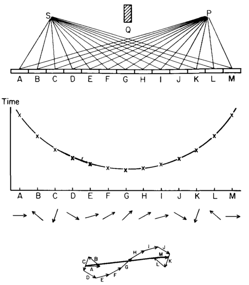](img/feynman1.png)

In elementary school, you learn that the angle of incidence equals
the angle of reflection.  But *actually*, saith Feynman, each part
of the mirror reflects at all angles.

So why is it that, way up at the human level, the mirror seems to
reflect with the angle of incidence equal to the angle of
reflection?

Because in quantum mechanics, amplitude that flows to identical
configurations (particles of the same species in the same places)
is added together, regardless of how the amplitude got there.

To find the amplitude for a photon to go from S to P, you've got to
add up the amplitudes for *all* the different ways the photon could
get there - by bouncing off the mirror at A, bouncing off the
mirror at B...

The rule of the Feynman "path integral" is that each of the paths
from S to P contributes an amplitude of *constant* magnitude but
varying *phase*, and the phase varies with the total *time* along
the path.  It's as if the photon is a tiny spinning clock - the
hand of the clock stays the same length, but it turns around at a
constant rate for each unit of time.

Feynman graphs the time for the photon to go from S to P via A, B,
C, ...  Observe: the *total* time *changes less* between "the path
via F" and "the path via G", then the total time changes between
"the path via A" and "the path via B".  So the phase of the complex
amplitude changes less, too.

And when you add up all the ways the photon can go from S to P, you
find that most of the amplitude comes from the middle part of the
mirror - the contributions from other parts of the mirror tend to
mostly cancel each other out, as shown at the bottom of Feynman's
figure.

There is no answer to the question "Which part of the mirror did
the photon *really* come from?"  Amplitude is flowing from *all*of
these configurations.  But if we were to *ignore* all the parts of
the mirror except the middle, we would calculate essentially the
same amount of *total* amplitude.

This means that a photon, which can get from S to P by striking
*any*part of the mirror, will *behave pretty much as if* only a
tiny part of the mirror exists - the part where the photon's angle
of incidence equals the angle of reflection.

*Unless* you start playing clever tricks using your knowledge of
quantum physics.

For example, you can *scrape away* parts of the mirror at regular
intervals, deleting some little arrows and leaving others.  Keep A
and its little arrow; scrape away B so that it has no little arrow
(at least no little arrow going to P).  Then a distant part of the
mirror can contribute amplitudes that add up with each other to a
big final amplitude, because you've removed the amplitudes that
were out of phase.

In which case you can make a mirror that reflects with the angle of
incidence not equal to the angle of reflection.  It's called a
diffraction grating.  But it reflects different wavelengths of
light at different angles, so a diffraction grating is not quite a
"mirror" in the sense you might imagine; it produces little
rainbows of color, like a droplet of oil on the surface of water.

How fast does the little arrow rotate?  As fast as the photon's
wavelength - that's what a photon's wavelength *is*.  The
wavelength of yellow light is \~570 nanometers:  If yellow light
travels an extra 570 nanometers, its little arrow will turn all the
way around and end up back where it started.

So either Feynman's picture is of a very tiny mirror, or he is
talking about some very big photons, when you look at how fast the
little arrows seem to be rotating.  Relative to the wavelength of
visible light, a human being is a lot bigger than the level at
which you can see quantum effects.

You'll
[recall](http://www.overcomingbias.com/2008/04/quantum-arena.html)
that the first key to recovering the classical hallucination from
the reality of quantum physics, was the possibility of approximate
independence in the amplitude distribution.  (Where the
distribution roughly factorizes, it can look like a subsystem of
particles is evolving on its own, without being entangled with
every other particle in the universe.)

The second key to re-deriving the classical hallucination, is the
kind of behavior that we see in this mirror.  Most of the possible
paths cancel each other out, and only a small group of neighboring
paths add up.  Most of the amplitude comes from a small
neighborhood of histories - the sort of history where, for example,
the photon's angle of incidence is equal to its angle of
reflection.  And so too with many other things you are pleased to
regard as "normal".

My first posts on QM showed amplitude flowing in crude chunks from
discrete situation to discrete situation.  In *real life* there are
continuous amplitude flows between continuous configurations, like
we saw with Feynman's mirror.  But by the time you climb all the
way up from a few hundred nanometers to the size scale of human
beings, most of the amplitude contributions have canceled out
except for a narrow neighborhood around one path through history.

Mind you, this is *not* the reason why a photon only seems to be in
one place at a time.  That's a different story, which we won't get
to today.

The more massive things are - actually the more energetic they are,
mass being a form of energy - the faster the little arrows rotate.
Shorter wavelengths of light having more energy is a special case
of this.  Compound objects, like a neutron made of three quarks,
can be treated as having a collective amplitude that is the
multiplicative product of the component amplitudes - at least to
the extent that the amplitude distribution factorizes, so that you
can treat the neutron as an individual.

Thus the relation between energy and wavelength holds for more than
photons and electrons; atoms, molecules, and human beings can be
regarded as having a wavelength.

But by the time you move up to a human being - or even a single
biological cell - the mass-energy is *really, really* large
relative to a yellow photon.  So the clock is rotating
*really, really fast.*  The wavelength is *really, really* short. 
Which means that the neighborhood of paths where things don't
cancel out is *really, really narrow.*

By and large, a human experiences what seems like a single path
through configuration space - the classical hallucination.

This is not how Schrรถdinger's Cat works, but it is how a regular
cat works.

Just remember that this business of single paths through time is
not *fundamentally* true.  It's merely a good approximation for
modeling a sofa.  The classical hallucination breaks down
completely by the time you get to the atomic level.  It can't
handle quantum computers at all.  It would fail you even if you
wanted a *sufficiently precise* prediction of a brick.  A billiard
ball taking a single path through time is not how the universe
*really, really* works - it is just what human beings have evolved
to easily visualize, for the sake of throwing rocks.

(PS:  I'm given to understand that the Feynman path integral may be
more fundamental than the Schrรถdinger equation: that is, you can
*derive* Schrรถdinger from Feynman.  But as far as I can tell from
examining the equations, Feynman is still differentiating the
amplitude distribution, and so reality doesn't yet break down into
point amplitude flows between point configurations.  Some physicist
please* *correct me if I'm wrong about this, because it is a matter
on which I am quite curious.)

# No Individual Particles

Even babies think that objects have individual identities.  If you
show an infant a ball rolling behind a screen, and then a moment
later, two balls roll out, the infant looks longer at the
expectation-violating event.  Long before we're old enough to talk,
we have a parietal cortex that does spatial modeling: that models
individual animals running or rocks flying through 3D space.

And this is just not the way the universe works.  The difference is
experimentally knowable, and known.  Grasping this fact, being able
to see it at a glance, is one of the fundamental bridges to cross
in understanding quantum mechanics.

If you [shouldn't start off](http://lesswrong.com/lw/pc/quantum_explanations/) by
talking to your students about wave/particle duality, where should
a quantum explanation start?  I would suggest taking, as your first
goal in teaching, explaining how quantum physics implies that a
simple experimental test can show that two electrons are
*entirely*indistinguishable* * - not just indistinguishable
according to known measurements of mass and electrical charge.

To grasp on a *gut level* how this is possible, it is necessary to
move from thinking in billiard balls to thinking in configuration
spaces; and then you have truly entered into the true and quantum
realm.

In previous posts such as
[Joint Configurations](http://lesswrong.com/lw/pe/joint_configurations/) and
[The Quantum Arena](http://lesswrong.com/lw/pj/the_quantum_arena/), we've seen that the
physics of our universe takes place in a multi-particle
configuration space.

The
illusion of individual particles arises from approximate
factorizability of a multi-particle distribution, as shown at left
for a classical configuration space.

If the probability distribution over this 2D configuration space of
two classical 1D particles, looks like a rectangular plaid pattern,
then it will factorize into a distribution over A times a
distribution over B.

In classical physics, the particles A and B are the fundamental
things, and the configuration space is just an isomorphic way of
looking at them.

In quantum physics, the configuration space is the fundamental
thing, and you get the appearance of an individual particle when
the amplitude distribution factorizes enough to let you look at a
*subspace* of the configuration space, and see a *factor* of the
amplitude distribution - a factor that might look something like
this:

This isn't an amplitude distribution, mind you.  It's a *factor* in
an amplitude distribution, which you'd have to multiply by the
subspace for all the *other* particles in the universe, to
approximate the *physically real* amplitude distribution.

Most mathematically possible amplitude distributions won't factor
this way.  *Quantum entanglement* is not some extra, special,
additional bond between two particles.  "Quantum entanglement" is
the *general* case.  The *special and unusual* case is
*quantum independence*.

Reluctant tourists in a quantum universe talk about the bizarre
phenomenon of quantum entanglement.  Natives of a quantum universe
talk about the special case of quantum independence.  Try to think
like a native, because you are one.

I've previously described a configuration as a mathematical object
whose identity is "A photon here, a photon there; an electron here,
an electron there."  But this is not quite correct.  Whenever you
see a real-world electron, caught in a little electron trap or
whatever, you are looking at a *blob* of amplitude, not a point
mass.  In fact, what you're looking at is a
*blob of amplitude-factor* in a subspace of a global distribution
that happens to factorize.

Clearly, then, an *individual point* in the configuration space
does not have an identity of "blob of amplitude-factor here, blob
of amplitude-factor there"; so it doesn't make sense to say that a
configuration has the identity "A photon here, a photon there."

But what *is* an individual point in the configuration space,
then?

Well, it's physics, and physics is math, and you've got to come to
terms with thinking in pure mathematical objects.  A single point
in quantum configuration space, is the *product*of multiple
*point positions* per quantum field; multiple point positions in
the electron field, in the photon field, in the quark field, etc.

When you actually see an electron trapped in a little electron
trap, what's *really* going on, is that the cloud of amplitude
distribution that includes you and your observed universe, can at
least roughly factorize into a subspace that corresponds to that
little electron, and a subspace that corresponds to everything else
in the universe.  So that the *physically real* amplitude
distribution is roughly the *product* of a little blob of
amplitude-factor in the subspace for that electron, and the
amplitude-factor for everything else in the universe.  Got it?

One commenter
[reports](http://www.overcomingbias.com/2008/04/identical-parti/comments/page/2/#comment-111012366)
attaining enlightenment on reading in
[Wikipedia](http://en.wikipedia.org/wiki/Quantum_field_theory):

> 'From the point of view of quantum field theory, particles are
> identical if and only if they are excitations of the same
> underlying quantum field. Thus, the question "why are all electrons
> identical?" arises from mistakenly regarding individual electrons
> as fundamental objects, when in fact it is only the electron field
> that is fundamental.'

Okay, but that doesn't make the basic jump into a quantum
configuration space that is inherently over multiple particles.  It
just sounds like you're talking about individual disturbances in
the aether, or something.  As I understand it, an electron isn't an
*excitation* of a quantum electron field, like a wave in the
aether; the electron is a blob of amplitude-factor in a subspace of
a configuration space whose points correspond to multiple point
positions in quantum fields, etc.

The difficult jump from classical to quantum is *not* thinking of
an electron as an excitation of a field.  Then you could just think
of a universe made up of "Excitation A in electron field over here"
+ "Excitation B in electron field over there" + etc.  You could
factorize the universe into individual excitations of a field. 
Your parietal cortex would have no trouble with that one - it
doesn't care whether you call the little billiard balls
"excitations of an electron field" so long as they still behave
like little billiard balls.

The difficult jump is thinking of a configuration space that is the
product of many positions in many fields, without individual
identities for the positions.  A configuration space whose points
are "a position*here* in *this* field, a position *there* in *this*
field, a position *here* in *that* field, and a position *there* in
*that* field".  Not, "A positioned here in this field, B positioned
there in this field, C positioned here in that field" etc.

You have to reduce the appearance of individual particles to a
regularity in something that is *different* from the appearance of
particles, something that *is not itself a little billiard ball.*

Oh, sure, thinking of photons as individual objects will *seem* to
work out, as long as the amplitude distribution happens t
factorize.  But what happens when you've got your "individual"
photon A and your "individual" photon B, and you're in a situation
where, a la [Feynman paths](http://lesswrong.com/lw/pk/feynman_paths/), it's possible
for photon A to end up in position 1 and photon B to end up in
position 2, *or* for A to end up in 2 and B to end up in 1?  Then
the illusion of classicality breaks down, because the amplitude
flows overlap:  

In that [triangular region](http://lesswrong.com/lw/pj/the_quantum_arena/) where the
distribution overlaps itself, no fact exists as to which particle
is which, even in principle - and in the real world, we often get a
lot more overlap than that.

I mean, imagine that I take a balloon full of photons, and shake it
up.

Amplitude's gonna go all over the place.  If you label all the
original apparent-photons, there's gonna be Feynman paths for
photons A, B, C ending up at positions 1, 2, 3 via a zillion
different paths and permutations.

The amplitude-factor that corresponds to the "balloon full of
photons" subspace, which contains bulges of amplitude-subfactor at
various different locations in the photon field, will undergo a
continuously branching evolution that involves each of the original
bulges ending up in many different places by all sorts of paths,
and the final configuration will have amplitude contributed from
many different permutations.

It's not that you *don't know* which photon went where.  It's that
*no fact of the matter exists.* The illusion of individuality, the
classical hallucination, has simply broken down.

And the same would hold true of a balloon full of quarks or a
balloon full of electrons.  Or even a balloon full of helium.
Helium atoms can end up in the same places, via different
permutations, and have their amplitudes add just like photons.

*Don't* be tempted to look at the balloon, and think, "Well, helium
atom A could have gone to 1, or it could have gone to 2; and helium
atom B could have gone to 1 or 2; quantum physics says the atoms
both sort of split, and each went both ways; and now the final
helium atoms at 1 and 2 are a mixture of the identities of A and
B."  Don't torture your poor parietal cortex so.  It wasn't built
for such usage.

Just stop thinking in terms of little billiard balls, with or
without confused identities.  Start thinking in terms of amplitude
flows in configuration space.  That's all there ever is.

And *then* it will seem completely intuitive that a simple
experiment can tell you whether two blobs of amplitude-factor are
over the same quantum field.

Just perform any experiment where the two blobs end up in the same
positions, via different permutations, and see if the amplitudes
add.

# Identity Isn't In Specific Atoms

Suppose I take two atoms of helium-4 in a balloon, and swap their
locations via teleportation.  I don't move them through the
intervening space; I just click my fingers and cause them to swap
places.  Afterward, the balloon looks just the same, but two of the
helium atoms have exchanged positions.

Now, did that scenario seem to make sense?  Can you imagine it
happening?

If you looked at that and said, "The operation of swapping two
helium-4 atoms produces an identical configuration - not a similar
configuration, an *identical* configuration, the same mathematical
object - and particles have no individual identities *per se* - so
what you just said is *physical nonsense*," then you're starting to
get quantum mechanics.

If you furthermore had any thoughts about a particular "helium
atom" being a factor in a subspace of an amplitude distribution
that happens to factorize that way, so that it makes no sense to
talk about swapping two identical multiplicative factors, when only
the combined amplitude distribution is real, then you're
*seriously* starting to get quantum mechanics.

If you thought about two similar billiard balls changing places
inside a balloon, but nobody on the outside being able to notice a
difference, then... oh, hell, I don't know, go back to the
[beginning of the series](http://lesswrong.com/lw/pc/quantum_explanations/) and try
rereading the whole thing over the course of one day.  If that
still doesn't work, read an actual book on quantum mechanics. 
Feynman's *QED* is a great place to start - though not a good place
to finish, and it's not written from a pure realist perspective.

But if you did "get" quantum physics, then, as promised, we have
now come to the connection between the truth of quantum mechanics,
the lies of human intuitions, and the
[Generalized Anti-Zombie Principle](http://lesswrong.com/lw/p9/the_generalized_antizombie_principle/).

Stirling Westrup previously
[commented](http://www.overcomingbias.com/2008/04/anti-zombie-pri.html#comment-109683950),
on the [GAZP](http://lesswrong.com/lw/p9/the_generalized_antizombie_principle/) post:

> I found the previous articles on Zombies somewhat tedious... Still,
> now I'm glad I read through it all as I can see why you were so
> careful to lay down the foundations you did.
> 
> The question of what changes one can make to the brain while
> maintaining 'identity' has been been discussed many times on the
> Extropians list, and seldom with any sort of constructive results.
> 
> Today's article has already far exceeded the signal to noise ratio
> of any other discussion on the same topic that I've ever seen...

The Extropians email list that Westrup refers to, is the oldest
online gathering place of
[transhumanists](http://lesswrong.com/lw/me/my_strange_beliefs/).  It is where I made
my debut as a writer, and it is where the cofounders of the
Singularity Institute met.  Though the list is not what it once
was...

There are certain topics, on the Extropians list, that have been
discussed over and over again, for years and years, without making
any progress.  Just the same arguments and counterarguments, over
and over again.

The worst of those infinite loops concerns the question of
*personal identity*.  For example, if you build an exact physical
replica of a human, using *different atoms,* but atoms of the
*same kind* in the *same places*, is it the *same person* or
*just a copy*?* *

This question has flared up at least once a year, always with the
same arguments and counterarguments, every year since I joined the
Extropians mailing list in 1996.  And I expect the Personal
Identity Wars started well before then.

I did *try* remarking, "Quantum mechanics says there
*isn't any such thing* as a 'different particle of the same kind',
so wherever your personal identity is, it sure isn't in
*particular atoms,* because there *isn't any such thing* as a
'particular atom'."

It didn't work, of course.  I didn't really expect it to.  Without
a
[long extended explanation](http://lesswrong.com/lw/kg/expecting_short_inferential_distances/),
a remark like that
[doesn't actually mean anything](http://lesswrong.com/lw/iq/guessing_the_teachers_password/).

The concept of reality as a sum of independent individual billiard
balls, seems to be built into the human parietal cortex - the
parietal cortex being the part of our brain that does spatial
modeling: navigating rooms, grasping objects, throwing rocks.

Even very young children, infants, look longer at a scene that
violates expectations - for example, a scene where a ball rolls
behind a screen, and then two balls roll out.

People try to think of a *person*, an *identity,* an *awareness,*
as though it's an awareness-ball located inside someone's skull. 
Even nonsophisticated materialists tend to think that, since the
consciousness ball is made up of lots of little billiard balls
called "atoms", if you swap the atoms, why, you must have swapped
the consciousness.

Now even without knowing any quantum physics - even in a purely
classical universe - it is possible to refute this idea by applying
the
[Generalized Anti-Zombie Principle](http://lesswrong.com/lw/p9/the_generalized_antizombie_principle/). 
There are many possible formulations of the GAZP, but one of the
simpler ones says that, if alleged gigantic changes are occurring
in your consciousness, you really ought to
*notice something happening,* and be able to say so.

The equivalent of the Zombie World, for questions of
identity/continuity, is the Soul Swap World.  The allegation is
that the Soul Swap World is microphysically identical to our own;
but every five minutes, each thread of consciousness jumps to a
random new brain, without the brains changing in any third-party
experimentally detectable way.  One second you're *yourself,* the
next second you're Britney Spears.  And neither of you *say* that
you've noticed anything happening - by hypothesis, since you're
microphysically identical down to the motion of your lips.

(Let me know if the Soul Swap World has been previously invented in
philosophy, and has a standard name - so far as I presently know,
this is my own idea.)

We can proceed to demolish the Soul Swap World by an argument
exactly analogous to the one that
[demolished the Zombie World](http://lesswrong.com/lw/p7/zombies_zombies/): 
Whatever-it-is which makes me feel that I have a consciousness that
continues through time, that whatever-it-is was physically potent
enough to make me type this sentence.  Should I try to make the
phrase "consciousness continuing through time" *refer*to something
that has nothing to do with the *cause*of my typing those selfsame
words, I will have problems with the *meaning*of my arguments, not
just their plausibility.

Whatever it is that makes me say, aloud, that I have a personal
identity, a causally closed world physically identical to our own,
has captured that source - if there is any source at all.

And we can proceed, again by an exactly analogous argument, to a
Generalized Anti-Swapping Principle:  Flicking a disconnected light
switch shouldn't switch your personal identity, even though the
motion of the switch has an in-principle detectable gravitational
effect on your brain, because the switch flick can't disturb the
true cause of your talking about "the experience of subjective
continuity".

So even in a classical universe, if you snap your fingers and swap
an atom in the brain for a *physically similar* atom outside; and
the brain is not disturbed, or not disturbed any more than the
level of thermal noise; then whatever causes the experience of
subjective continuity, should also not have been disturbed.  Even
if you swap *all* the classical atoms in a brain at the
*same time,* if the person doesn't *notice*anything happen, why, it
probably didn't.

And of course there's the classic (and classical) argument, "Well,
your body's turnover time for atoms is seven years on average."

But it's a moot argument.

We don't live in a classical universe.

We live in a quantum universe where the notion of "same hydrogen
atom vs. different hydrogen atom" is *physical nonsense.*

We live in a universe where the whole notion of billiard balls
bopping around is *fundamentally wrong*.

This can be a disorienting realization, if you formerly thought of
*yourself* as an awareness ball that moves around.

Sorry.  Your parietal cortex is fooling you on this one.

But wait!  It gets even worse!

The brain doesn't exactly repeat itself; the state of your brain
one second from now is not the state of your brain one second ago. 
The neural connections don't *all* change *every*second, of
course.  But there are enough changes every second that the brain's
state is not cyclic, not over the course of a human lifetime.  With
every fragment of memory you lay down - and every thought that pops
in and out of short-term memory - and every glance of your eyes
that changes the visual field of your visual cortex - you ensure
that you never repeat yourself exactly.

Over the course of a single *second* - not seven years, but
*one second* - the joint position of all the atoms in your brain,
will change far enough away from what it was before, that there is
no *overlap* with the previous *joint amplitude distribution*.  The
brain doesn't repeat itself.  Over the course of *one second,* you
will end up being comprised of a
*completely different, nonoverlapping volume of configuration space*.

And the quantum configuration space is the most fundamental known
reality, according to our best current theory, remember.  Even if
quantum theory turns out not to be really truly fundamental, it has
already finished superseding the hallucination of individual
particles.  We're never going back to billiard balls, any more than
we're going back to Newtonian mechanics or phlogiston theory.  The
ratchet of science turns, but it doesn't turn backward.

And actually, the time for you to be comprised of a completely
different volume of configuration space, is way less than a
second.  That time is the product of all the individual changes in
your brain put together.  It'll be less than a millisecond, less
than a femtosecond, less than the time it takes light to cross a
neutron diameter.  It works out to less than the
[Planck time](http://en.wikipedia.org/wiki/Planck_time), if that
turns out to make physical sense.

And then there's the point to consider that the *physically real*
amplitude distribution is over a configuration space of all the
particles in the universe.  "You" are just a factored subspace of
that distribution.

Yes, that's right, I'm calling *you* a factored subspace.

None of this should be taken as saying that you are somehow
*independent* of the quantum physics comprising you.  If an anvil
falls on your head, you will stop talking about consciousness. 
This is experimentally testable.  Don't try it at home.

But the notion that you can equate your personal *continuity*, with
the *identity* of any physically real constituent of your
existence, is absolutely and utterly hopeless.

You are not "the same you, because you are made of the same
atoms".  You have zero overlap with the *fundamental*constituents
of yourself from even one nanosecond ago.  There is continuity of
information, but not equality of parts.

The new factor over the subspace looks a *whole lot* like the old
you, and not by coincidence:  The flow of time is lawful, there are
causes and effects and preserved commonalities.  Look to the
regularity of physics, if you seek a source of continuity.  Do not
ask to be composed of the same objects, for this is hopeless.

Whatever makes you feel that your present is connected to your
past, it has nothing to do with an *identity* of
*physically fundamental* constituents over time.

Which you could deduce *a priori*, even in a classical universe,
using the Generalized Anti-Zombie Principle.  The imaginary
identity-tags that read "This is electron \#234,567..." don't
affect particle motions or anything else; they can be swapped
without making a difference because they're epiphenomenal.  But
since this final conclusion happens to be counterintuitive to a
human parietal cortex, it helps to have the brute fact of quantum
mechanics to crush all opposition.

*Damn,* have I waited a long time to be able to say that.

And no, this isn't the only point I have to make on how
counterintuitive physics rules out intuitive conceptions of
personal identity.  I've got even stranger points to make.  But
those will take more physics first.

# Three Dialogues on Identity

It is widely said that some primitive tribe or other once feared
that photographs could steal their souls.

Ha ha!  How embarrassing.  Silly tribespeople.

I shall now present three imaginary conversations along such lines
- the common theme being *frustration*.

**The first conversation:**

Foolishly leaving the world of air-conditioning, you traveled to
the Godforsaken Outback, and of course, got lost in the woods.  A
more primitive tribe than yours, the Hu'wha, saved your butt. 
Although the Hu'wha have told you how to reach an outpost of
Internet access, that is, civilization, you've stayed with them a
while longer; you've become their friend, and they yours.

One custom of the Hu'wha does seem strange to you, coming as you do
from a more civilized culture:  They don't hold with lies, even
small ones.  They consider a lie as an infringement upon the soul
of the listener. They have a saying, "It is better to die than to
be lied to." Though this is a very strange and primitive custom,
you have come to respect it.

Late one night, the shaman calls you to his tent. His face is
grave.  "I have heard the most disturbing news," he says, "from the
Tribe That Lives Across The Water.  They say that your people, the
People of the Net, have a most terrible custom: they paint
*images*of others, and thereby steal their souls, for a person
cannot be in two places at once.  It is even said that you have
weapons called 'cameras', for doing this automatically; and that
the cameras of your folk can be very small, or disguised as other
things."

"Um," you say, "I think you may be laboring under certain basic
misconceptions.  Cameras are not weapons; they make images, but
they don't steal souls."

The grey-bearded shaman smiles, and shakes his head.  "Young
fellow, I am the shaman of the Hu'wha, and I hold the tradition
passed down from my father through many generations; the true and
original wisdom granted by the gods to the first shaman.  I *think*
I know what steals a soul and what does not, young fellow!  Even to
you it should be obvious."

And you think: 
*Foolish mortal, how little you understand the power of Science.* 
But this is beyond the conception of this man who thinks himself
above you, and so you say nothing.

"I understand," the shaman says, "that your people may be so
utterly ignorant of magic that they don't realize their cameras are
dangerous.  But that makes it all the more urgent that I ask you,
Net-user, upon your honor:  Have you by *any means whatever,* in
your time among us, whether yourself, or by any device,
*produced an image* of anyone here?  If you have, we will do no
violence to you - for I know there is no malice in you - but you
will no longer be welcome among us."

You pause.  The Hu'wha set great store on the literal truth of
words, as well as their intent.  And though you have no camera or
paintbrushes, the answer to the question just asked, is literally
*yes*.  Your eyes, retina, and optic nerve are constantly painting
images in your visual cortex.

"I haven't made any pictures the way you mean it," you say.

The shaman frowns.  "I was looking for a simple *No.*  Why the
hesitation?"

Oh, dear.  "The knowledge of my own people, the Net-folk, is not
like your own knowledge," you say, "and you asked a... deeper
question than you know, according to the beliefs of my own
people."

"This is a very simple matter," the shaman says sharply, "and it
has to do with what *you have done.*  Have you made any pictures,
or not?"

"I've painted no picture, and used no camera."

"Have you caused a picture to be made by any *other* means?"
demands the shaman.

Dammit.  "Not the way you mean it.  I've done nothing that the
Hu'wha do not also do."

"Explain yourself!"

You sigh.  "It is a teaching of my people, which you are welcome to
believe or not as it suits you, that pictures are constantly being
created of all of us, all the time."

"*What?*" says the shaman.

"When you look at someone," you explain, "or even when an animal
looks at you, that creates an image on the inside of the skull...
that is how you see.  Indeed, it is *what* you see - everything you
see is a picture your eyes create."

"That's nonsense," says the shaman.  "You're right there!  I'm
seeing *you*, not an image of you!  Now I ask you again, on your
honor:  Do we Hu'wha still have our souls since you came among us,
or not?"

Oh, bloody hell.  "It is a teaching of my people," you say, "that
what you call a 'soul' is... a confused idea."

"You are being evasive," says the shaman sternly.  "The soul is not
complicated, and it would be very hard to mistake a soul for
something else, like a shoe or something.  Our souls are breathed
into us by Great Ghu at birth, and stays with us our whole lives,
unless someone steals it; and if no one has photographed us, our
souls go to the Happy Gaming Room when we die.  Now I ask you
again:  Do I have my soul, or not?  Give me the truth!"

"The truth," you say, "is that the way my people see the world is
so different from yours, that you can't even imagine what I think
is the truth.  I've painted no pictures, taken no photographs; all
I've done is look at you, and nothing happens when I look at you,
that doesn't happen when anyone else looks at you.  But you are
being *constantly* photographed, all the time, and you never *had*
any soul to begin with: this is the truth."

"Horse output," says the shaman.  "Go away; we never want to see
you again."

**The second conversation:**

John Smith still looked a little pale.  This was quite
understandable.  Going to a pleasant dinner with your family,
having a sudden heart attack, riding to the hospital by ambulance,
dying, being cryonically suspended by Alcor, spending decades in
liquid nitrogen, and then awakening, all in the span of less than
24 subjective hours, will put a fair amount of stress on anyone.

"Look," said John, "I accept that there are things you're not
allowed to tell me -"

"Not *right away*," you say.  "We've found that certain pieces of
information are best presented in a particular order."

John nods.  "Fine, but I want to be very clear that I don't want to
be told any comforting lies.  Not for the sake of my 'psychological
health', and not for anything.  If you can't tell me, just say
nothing.  Please."

You raise your hand to your chest, two fingers out and the others
folded.  "*That,* I can promise:  I cannot tell you everything, but
what I say to you will be true.  In the name of Richard Feynman,
who is dead but not forgotten."

John is giving you a very strange look.  "How long did you say I
was suspended?"

"Thirty-five years," you say.

"I was thinking," said John, "that things surely wouldn't have
changed all *that* much in thirty-five years."

You say nothing, thus keeping your promise.

"But if things have changed that much," John says, "I want to know
something.  Have I been uploaded?"

You frown.  "Uploaded?  I'm sorry, I don't understand.  The word
'upload' used to apply to computer files, right?"

"I mean," says John, "have I been turned into a program?  An
algorithm somewhere?"

*Huh?*  "*Turned into* an algorithm?  What were you before, a
constant integer?"

"Aargh," says John.  "Okay, yes, I'm a program, you're a program. 
Every human in the history of humanity has been a program running
on their brain.  I understand that.  What I want to know is whether
me, *this* John Smith, the one talking to you right now, is a
program on the *same hardware* as the John Smith who got
cryonically suspended."

You pause.  "What do you mean, 'same hardware'?"

John starts to look worried.  "I was hoping for a simple 'Yes',
there.  Am I made of the same atoms as before, or not?"

Oh, dear.  "I think you may be laboring under certain basic
misconceptions," you say.

"I understand," John said, "that your people may have the cultural
belief that uploading preserves personal identity - that a human is
memories and personality, not particular atoms.  But I happen to
believe that my identity is bound up with the atoms that make me. 
It's not as if there's an experiment you can do to prove that I'm
wrong, so my belief is just as valid as yours."

*Foolish child,* you think,
*how little you understand the power of Science.*  "You asked a
deeper question than you know," you say, "and the world does not
work the way you think it does.  An *atom* is... not what you
imagine."

"Look," John says sharply, "I'm not asking you about this time's
theories of personal identity, or your beliefs about consciousness
- that's all outside the realm of third-party scientific
investigation anyway.  I'm asking you a simple question that *is*
experimentally testable.  Okay, you found something new underneath
the quarks.  That's not surprising.  I'm asking, whatever stuff I
*am* made of, is it the *same* stuff as before?  Yes or no?"

**The third conversation:**

*Your question is itself confused.  Whatever*is*, is real.*

"Look," Eliezer said, "I *know* I'm not being misunderstood, so I'm
not going to try and phrase this the elaborately correct way:  Is
this thing that I'm holding an *old-fashioned* banana, or does it
only have the *appearance* of a banana?"

*You wish to know if the accustomed state of affairs still holds.  In which it merely*appears*that there is a banana in your hand, but*actually,*there is something very different behind the appearance: a configuration of particles, held together by electromagnetic fields and other laws that humans took centuries to discover.*

"That's right.  I want to know if the lower levels of organization
underlying the banana have a substantially different structure than
before, and whether the causal relation between that structure and
my subjective experience has changed in style."

*Well then.  Rest assured that you are not holding the mere*appearance*of a banana.  There*really
is*a banana there, not just a collection of atoms.*

There was a long pause.

"WHAT?"

*Or perhaps that was only a joke.  Let it stand that the place in which you find yourself is at least as real as anywhere you ever thought you were, and the things you see are even less illusionary than your subjective experiences of them.*

"Oh, come on!  I'm not some hunter-gatherer worried about a
photographer stealing his soul!  If I'm running on a computer
somewhere, and this is a virtual environment, that's *fine!*  I was
just *curious,* that's all."

* **Some of what you believe is true, and some of what you believe is false: this may also be said of the hunter-gatherer.  But there is a true difference between yourself and the hunter-gatherer, which is this: *You*have a concept of what it means**for a fundamental assumption to be mistaken.  The hunter-gatherer has no experience with other cultures that believe differently, no history that tells of past scientific revolutions.  But you**know what is*meant,*whether or not you*accept*it, you*understand*the assertion itself:  Some of your fundamental assumptions are mistaken.*

# Decoherence

To understand the quantum process called "decoherence", we first
need to look at how the
[special case of quantum independence](http://lesswrong.com/lw/pl/no_individual_particles/)
can be destroyed - how the evolution of a quantum system can
produce entanglement where there was formerly independence.

Quantum independence, as you'll recall, is a special case of
amplitude distributions that approximately factorize - amplitude
distributions that can be treated as a product of sub-distributions
over subspaces.

Reluctant tourists visiting quantum universes think as if the
*absence* of a rectangular plaid pattern is some kind of special
ghostly link between particles.  Hence the unfortunate term,
"quantum entanglement".

The evolution of a quantum system can produce entanglement where
there was formerly independence - turn a rectangular plaid pattern
into something else.  Quantum independence, being a special case,
is easily lost.

[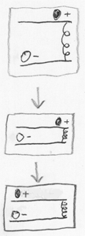](img/entangler.png)
Let's pretend for a moment that we're looking at a classical
system, which will make it easier to see what kind of physical
process leads to entanglement.

At right is a system in which a positively charged light thingy is
on a track, far above a negatively charged heavy thingy on a
track.

At the beginning, the two thingies are far enough apart that
they're not significantly interacting.

But then we lower the top track, bringing the two thingies into the
range where they can easily attract each other.  (Opposite charges
attract.)

So the light thingy on top rolls toward the heavy thingy on the
bottom.  (And the heavy thingy on the bottom rolls a little toward
the top thingy, just like an apple attracts the Earth as it
falls.)

Now switch to the Feynman [path integral](http://lesswrong.com/lw/pk/feynman_paths/)
view.  That is, imagine the evolution of a quantum system as a sum
over all the paths through configuration space the initial
conditions could take.

Suppose the bottom heavy thingy and the top thingy started out in a
state of quantum independence, so that we can view the amplitude
distribution over the whole system as the product of a "bottom
thingy distribution" and a "top thingy distribution".

[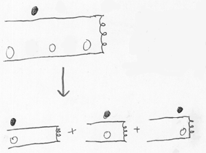](img/superposition2.png)
The bottom thingy distribution starts with bulges in three places -
which, in the Feynman path view, we might think of as three
possible starting configurations from which amplitude will flow.

When we lower the top track, the light thingy on top is attracted
toward the heavy bottom thingy -

- except that the bottom thingy has a sub-distribution with three
bulges in three different positions.

So the end result is a joint distribution in which there are three
bulges in the amplitude distribution over *joint* configuration
space, corresponding to three different *joint* positions of the
top thingy and bottom thingy.

I've been trying very carefully to avoid saying things like "The
bottom thingy is in three places at once" or "in each possibility,
the top thingy is attracted to wherever the bottom thingy is".

Still, you're probably going to visualize it that way, whether I
say it or not.  To be honest, that's how *I* drew the diagram - I
visualized three possibilities and three resulting outcomes.  Well,
that's just how a human brain tends to visualize a Feynman path
integral.

But this doesn't mean there are actually
*three possible ways the universe could be,* etc.  That's just a
trick for visualizing the path integral.  *All* the amplitude flows
*actually happen,* they are not *possibilities.*

Now imagine that, in the starting state, the bottom thingy has an
amplitude-factor that is smeared out over the whole bottom track;
and the top thingy has an amplitude-factor in one place.  Then the
joint distribution over "top thingy, bottom thingy" would start out
looking like the plaid pattern at left, and develop into the
non-plaid pattern at right:

[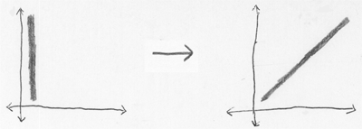](img/entanglecloud.png)

Here the horizontal coordinate corresponds to the top thingy, and
the vertical coordinate corresponds to the bottom thingy.  So we
start with the top thingy localized and the bottom thingy spread
out, and then the system develops into a joint distribution where
the top thingy and the bottom thingy are in the same place, but
their *mutual* position is spread out.  Very loosely speaking.

So an initially *factorizable* distribution, evolved into an
"entangled system" - a joint amplitude distribution that is not
viewable as a product of distinct factors over subspaces.

> (Important side note:  You'll note that, in the diagram above,
> system evolution obeyed the
> [second law of thermodynamics](http://lesswrong.com/lw/o5/the_second_law_of_thermodynamics_and_engines_of/),
> aka Liouville's Theorem.  Quantum evolution conserved the "size of
> the cloud", the volume of amplitude, the
> [total amount of grey area](http://lesswrong.com/lw/pi/classical_configuration_spaces/)
> in the diagram.
> 
> If instead we'd started out with a big light-gray square - meaning
> that both particles had amplitude-factors widely spread - then the
> second law of thermodynamics would prohibit the combined system
> from developing into a tight dark-gray diagonal line.
> 
> A system has to start in a low-entropy state to develop into a
> state of quantum *entanglement,* as opposed to just a diffuse cloud
> of amplitude.
> 
> [Mutual information is also negentropy](http://lesswrong.com/lw/o5/the_second_law_of_thermodynamics_and_engines_of/),
> remember.  Quantum amplitudes aren't *information* per se, but the
> rule is analogous:  Amplitude must be highly concentrated to look
> like a neatly entangled diagonal line, instead of just a big
> diffuse cloud.  If you imagine amplitude distributions as having a
> "quantum entropy", then an entangled system has low quantum
> entropy.)

Okay, so *now*we're ready to discuss decoherence.

[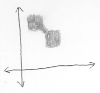](img/multiblobdeco.png)

The system at left is highly entangled - it's got a joint
distribution that looks something like, "There's two particles, and
either they're both over *here*, or they're both over *there*."

Yes, I phrased this as if there were two separate possibilities,
rather than a single physically real amplitude distribution. 
Seriously, there's no good way to use a human brain to talk about
quantum physics in English.

But if you can just remember the *general rule* that saying
"possibility" is shorthand for "physically real blob within the
amplitude distribution", then I can describe amplitude
distributions a lot faster by using the *language* of uncertainty. 
Just remember that it is *language.*  "Either the particle is over
here, or it's over there" means a physically real amplitude
distribution with blobs in both places, *not* that the particle is
in one of those places but we don't know which.

Anyway.  Dealing with highly entangled systems is often annoying -
for human physicists, not for reality, of course.  It's not just
that you've got to calculate all the possible outcomes of the
different possible starting conditions.  (I.e., add up a lot of
physically real amplitude flows in a Feynman path integral.)  The
possible outcomes may interfere with each other.  (Which actual
*possible* outcomes would never do, but different blobs in an
amplitude distribution do.)  Like, maybe the two particles that are
both over *here,* or both over *there,* meet twenty other particles
and do a little dance, and at the conclusion of the path integral,
many of the final configurations have received amplitude flows from
both initial blobs.

But that kind of *extra-annoying* entanglement only happens when
the blobs in the initial system are *close* enough that their
evolutionary paths can slop over into each other.  Like, if the
particles were either both *here*, or both *there,* but *here* and
*there* were two light-years apart, then any system evolution
taking less than a year, couldn't have the different possible
outcomes *overlapping.*

[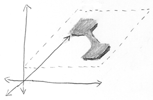](img/precohered_2.png)
Okay, so let's talk about *three* particles now.

This diagram shows a blob of amplitude that factors into the
product of a 2D subspace and a 1D subspace.  That is, two entangled
particles and one independent particle.

The vertical dimension is the one independent particle, the length
and breadth are the two entangled particles.

The independent particle is in one definite place - the cloud of
amplitude is vertically narrow.  The two entangled particles are
either both *here*, or both *there*.  (Again I'm using that wrong
language of uncertainty, words like "definite" and "either", but
you see what I mean.)

Now imagine that the third independent particle interacts with the
two entangled particles in a sensitive way.  Maybe the third
particle is balanced on the top of a hill; and the two entangled
particles pass nearby, and attract it magnetically; and the third
particle falls off the top of the hill and rolls to the bottom, in
that particular direction.

[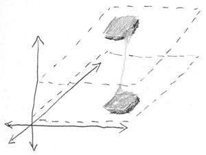](img/decohered.png)
Afterward, the new amplitude distribution might look like this. 
The third particle is now entangled with the other two particles. 
And the amplitude distribution as a whole consists of two more
*widely separated* blobs.

Loosely speaking, in the case where the two entangled particles
were over *here*, the third particle went *this way*, and in the
case where the two entangled particles were *over there,* the third
particle went *that way.*

So now the final amplitude distribution is fully entangled - it
doesn't factor into subspaces at all.

But the two blobs are more *widely separated* in the configuration
space.  Before, each blob of amplitude had *two* particles in
different positions; now each blob of amplitude has *three*
particles in different positions.

Indeed, if the third particle interacted in an especially sensitive
way, like being tipped off a hill and sliding down, the new
separation could be much larger than the old one.

Actually, it isn't necessary for a particle to get tipped off a
hill.  It also works if you've got *twenty* particles interacting
with the first two, and ending up entangled with them.  Then the
new amplitude distribution has got two blobs, each with
*twenty-two* particles in different places.  The distance between
the two blobs in the *joint* configuration space is much greater.

And the greater the distance between blobs, the less likely it is
that their amplitude flows will intersect each other and interfere
with each other.

That's decoherence.  Decoherence is the third
[key](http://lesswrong.com/lw/pk/feynman_paths/) to recovering the classical
hallucination, because it makes the blobs behave independently; it
lets you treat the whole amplitude distribution as a sum of
separated non-interfering blobs.

Indeed, once the blobs have separated, the pattern
*within a single blob* may look a lot more plaid and rectangular -
I tried to show that in the diagram above as well.

Thus, the big headache in quantum* *computing is
*preventing*decoherence.  Quantum computing relies on the amplitude
distributions staying *close enough together* in configuration
space to *interfere with each other*.  And the environment contains
a zillion particles just *begging*to accidentally interact with
your fragile qubits, teasing apart the pieces of your painstakingly
sculpted amplitude distribution.

And you can't just magically make the pieces of the scattered
amplitude distribution jump back together - these are blobs in the
*joint* configuration, remember.  You'd have to
*put the environmental particles* in the same places, too.

> (Sounds pretty irreversible, doesn't it?  Like trying to unscramble
> an egg?  Well, that's a very good analogy, in fact.
> 
> This is why I emphasized earlier that entanglement happens starting
> from a condition of low entropy.  Decoherence is irreversible
> because it is an essentially *thermodynamic* process.
> 
> It is a fundamental principle of the universe - as far as we can
> tell - that if you "run the film backward" all the *fundamental*
> laws are still obeyed.  If you take a movie of an egg falling onto
> the floor and smashing, and then play the film backward and see a
> smashed egg leaping off the floor and into a neat shell, you will
> not see the known laws of physics violated in any particular.  All
> the molecules will just happen to bump into each other in just the
> right way to make the egg leap off the floor and reassemble.  It's
> not *impossible,* just *unbelievably improbable*.
> 
> Likewise with a smashed amplitude distribution suddenly assembling
> many distantly scattered blobs into mutual coherence - it's not
> *impossible,* just *extremely improbable* that many distant
> starting positions would end up sending amplitude flows to nearby
> final locations.  You are far more likely to see the reverse.
> 
> Actually, in addition to running the film backward, you've got to
> turn all the positive charges to negative, and reverse left and
> right (or some other single dimension - essentially you have to
> turn the universe into its mirror image).
> 
> This is known as CPT symmetry, for Charge, Parity, and Time.
> 
> CPT symmetry appears to be a really, really, really deep principle
> of the universe.  Trying to violate CPT symmetry doesn't sound
> *quite*as awful to a modern physicist as trying to throw a baseball
> so hard it travels faster than light.  But it's *almost*that
> awful.  I'm told that
> General Relativity
> Quantum Field Theory requires CPT symmetry, for one thing.
> So the fact that decoherence *looks* like a one-way process, but is
> only *thermodynamically* irreversible rather than *fundamentally*
> asymmetrical, is a very important point.  It means quantum physics
> obeys CPT symmetry.
> 
> It is a universal rule in physics - according to our best current
> knowledge - that every apparently irreversible process is a special
> case of the second law of thermodynamics, *not* the result of
> time-asymmetric fundamental laws.)

To sum up:

Decoherence is a thermodynamic process of ever-increasing quantum
entanglement, which, through an amazing sleight of hand,
masquerades as increasing quantum independence:  Decoherent blobs
don't interfere with each other, and
*within a single blob but not the total distribution*, the blob is
more factorizable into subspaces.

Thus, decoherence is the third key to recovering the classical
hallucination.  Decoherence lets a human physicist think about one
blob at a time, without worrying about how blobs interfere with
each other; and the blobs themselves, considered as isolated
individuals, are less *internally* entangled, hence easier to
understand.  This is a fine thing if you want to pretend the
universe is classical, but *not so good* if you want to factor a
million-digit number before the Sun burns out.

# The So-Called Heisenberg Uncertainty Principle

As touched upon [earlier](http://lesswrong.com/lw/pj/the_quantum_arena/), Heisenberg's
"Uncertainty Principle" is horribly misnamed.

Amplitude distributions in configuration space evolve over time. 
When you specify an amplitude distribution over joint positions,
you are also necessarily specifying how the distribution will
evolve.  If there are blobs of position, you know where the blobs
are going.

In classical physics, where a particle is, is a separate fact from
how fast it is going.  In quantum physics this is not true.  If you
*perfectly* know the amplitude distribution on position, you
*necessarily know* the evolution of any blobs of position over
time.

So there is a theorem which *should* have been called the
Heisenberg Certainty Principle, or the Heisenberg Necessary
Determination Principle; but what does this theorem actually say?

At left is an image I previously used to illustrate a possible
amplitude distribution over positions of a 1-dimensional particle.

[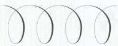](img/helix.png)Suppose
that, instead, the amplitude distribution is actually a
*perfect helix**.*  (I.e., the amplitude at each point has a
constant modulus, but the complex phase changes linearly with the
position.)  And neglect the effect of potential energy on the
system evolution; i.e., this is a particle out in intergalactic
space, so it's not near any gravity wells or charged particles.

If you started with an amplitude distribution that looked like a
perfect spiral helix, the laws of quantum evolution would make the
helix seem to rotate / move forward at a constant rate.  Like a
corkscrew turning at a constant rate.

This is what a physicist views as *a single particular momentum*.

And you'll note that a "single particular momentum" corresponds to
an amplitude distribution that is *fully spread out* - there's no
bulges in any particular position.

Let me emphasize that I have *not* just described a
[real situation you could find a particle in](http://dresdencodak.com/cartoons/dc_014.htm).

The physicist's notion of "a single particular momentum" is a
*mathematical tool* for analyzing quantum amplitude distributions.

The evolution of the amplitude distribution involves things like
taking the second derivative in space and multiplying by *i* to get
(one component of) the first derivative in time.  Which turns out
to give rise to a [wave](http://lesswrong.com/lw/iq/guessing_the_teachers_password/)
mechanics - blobs that can propagate themselves across space, over
time.

One of the basic tools in wave mechanics is taking apart
complicated waves into a sum of simpler waves.

If you've got a wave that bulges in particular places, and thus
changes in pitch and diameter, then you can take apart that ugly
wave into a *sum* of prettier waves.

A sum of simpler waves whose individual behavior is easy to
calculate; and then you just add those behaviors back together
again.

A sum of nice neat waves, like, say, those perfect spiral helices
corresponding to precise
momenta.[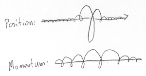](img/posmomdual_2.png)

A physicist can, for mathematical convenience, decompose a position
distribution into an integral over (infinitely many) helices of
different pitches, phases, and diameters.

Which integral looks like assigning a complex number to each
possible pitch of the helix.  And each pitch of the helix
corresponds to a different momentum.  So you get a complex
distribution over momentum-space.

It happens to be a fact that, when the position distribution is
more concentrated - when the position distribution bulges more
sharply - the integral over momentum-helices gets more widely
distributed.

Which has the physical consequence, that anything which is very
sharply in one place, tends to soon spread itself out.  Narrow
bulges don't last.

Alternatively, you might find it convenient to think, "Hm, a narrow
bulge has sharp changes in its second derivative, and I know the
evolution of the amplitude distribution depends on the second
derivative, so I can sorta imagine how a narrow bulge might tend to
propagate off in all directions."

Technically speaking, the distribution over momenta is the Fourier
transform of the distribution over positions.  And it so happens
that, to go *back* from momenta to positions, you just do another
Fourier transform.  So there's a precisely symmetrical argument
which says that anything moving at a very definite speed, has to
occupy a very spread-out place.  Which goes back to what was shown
before, about a perfect helix having a "definite momentum"
(corkscrewing at a constant speed) but being equally distributed
over all positions.

That's Heisenberg's Necessary Relation Between Position
Distribution And Position Evolution Which Prevents The Position
Distribution And The Momentum Viewpoint From Both Being Sharply
Concentrated At The Same Time Principle in a nutshell.

So now let's talk about some of the assumptions, issues, and common
misinterpretations of Heisenberg's Misnamed Principle.

> **The effect of observation on the observed**

Here's what actually happens when you "observe a particle's
position":

[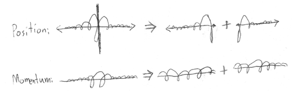](img/heisensplit.png)

[Decoherence](http://lesswrong.com/lw/pp/decoherence/), as discussed yesterday, can
take apart a formerly coherent amplitude distribution into
noninteracting blobs.

Let's say you have a particle X with a fairly definite position and
fairly definite momentum, the starting stage shown at left above. 
And then X comes into the neighborhood of another particle S, or
set of particles S, where S is highly sensitive to X's exact
location - in particular, whether X's position is on the left or
right of the black line in the middle.  For example, S might be
poised at the top of a knife-edge, and X could tip it off to the
left or to the right.

The result is to decohere X's position distribution into two
noninteracting blobs, an X-to-the-left blob and an X-to-the-right
blob.  Well, now the position distribution *within* each blob, has
become sharper.  (Remember:  Decoherence is a process of increasing
quantum entanglement that masquerades as increasing quantum
independence.)

So the Fourier transform of the more definite position distribution
*within*each blob, corresponds to a more spread-out distribution
over momentum-helices.

Running the particle X past a sensitive system S, has decohered X's
position distribution into two noninteracting blobs.  Over time,
each blob spreads itself out again, by Heisenberg's Sharper Bulges
Have Broader Fourier Transforms Principle.

[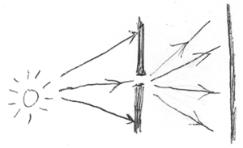](img/singleslitheisenberg.png)All
this gives rise to very real, very observable effects.

In the system shown at right, there is a light source, a screen
blocking the light source, and a single slit in the screen.

Ordinarily, light seems to go in straight lines (for
[less straightforward reasons](http://lesswrong.com/lw/pk/feynman_paths/)).  But in
this case, the screen blocking the light source decoheres the
photon's amplitude.  Most of the Feynman paths hit the screen.

The paths that *don't* hit the screen, are concentrated into a very
narrow range.  All positions except a very narrow range have
decohered away from the blob of possibilities for "the photon goes
through the slit", so, within this blob, the position-amplitude is
concentrated very narrowly, and the spread of momenta is vey
large.

Way up at the level of human experimenters, we see that when
photons strike the second screen, they strike over a broad range -
they don't just travel in a straight line from the light source.

[Wikipedia](http://en.wikipedia.org/wiki/Uncertainty_principle),
and at least some physics textbooks, claim that it is misleading to
ascribe Heisenberg effects to an "observer effect", that is,
perturbing interactions between the measuring apparatus and the
measured system:

> "Sometimes it is a *failure* to measure the particle that produces
> the disturbance.  For example, if a perfect photographic film
> contains a small hole, and an incident photon is *not* observed,
> then its momentum becomes uncertain by a large amount.  By not
> observing the photon, we discover that it went through the hole."

However, the most technical treatment I've actually read was by
Feynman, and Feynman seemed to be saying that, whenever measuring
the position of a particle increases the spread of its momentum,
the measuring apparatus must be delivering enough of a "kick" to
the particle to account for the change.

In other words, Feynman seemed to assert that the decoherence
perspective actually *was* dual to the observer-effect perspective
- that an interaction which produced decoherence would always be
able to physically account for any resulting perturbation of the
particle.

Not grokking the math, I'm inclined to believe the Feynman
version.  It sounds pretty, and physics has a known tendency to be
pretty.

> **The alleged effect of conscious knowledge on particles**

One thing that the Heisenberg Student Confusion Principle
DEFINITELY ABSOLUTELY POSITIVELY **DOES NOT SAY** is that KNOWING
ABOUT THE PARTICLE or CONSCIOUSLY SEEING IT will MYSTERIOUSLY MAKE
IT BEHAVE DIFFERENTLY because THE UNIVERSE CARES WHAT YOU THINK.

Decoherence works exactly the same way whether a system is
decohered by a human brain or by a rock.  Yes, physicists tend to
construct very sensitive instruments that slice apart amplitude
distributions into tiny little pieces, whereas a rock isn't that
sensitive.  That's why your camera uses photographic film instead
of mossy leaves, and why replacing your eyeballs with grapes will
not improve your vision.  But *any*sufficiently sensitive physical
system will produce decoherence, where "sensitive" means
"developing to widely different final states *depending on* the
interaction", where "widely different" means "the blobs of
amplitude don't interact".

Does this description say anything about *beliefs?*  No, just
amplitude distributions.  When you jump up to a higher level and
talk about cognition, you realize that
[forming accurate beliefs](http://lesswrong.com/lw/o6/perpetual_motion_beliefs/)[requires](http://lesswrong.com/lw/o6/perpetual_motion_beliefs/)[sensors](http://lesswrong.com/lw/o6/perpetual_motion_beliefs/). 
But the decohering power of sensitive interactions can be analyzed
on a purely physical level.

There is a legitimate "observer effect", and it is this:  Brains
that see, and pebbles that are seen, are part of a unified physics;
they are both built out of atoms.  To gain new empirical knowledge
about a thingy, the particles in you have to interact with the
particles in the thingy.  It so happens that, in our universe, the
laws of physics are pretty symmetrical about how particle
interactions work - conservation of momentum and so on: if you pull
on something, it pulls on you.

So you can't, in fact, observe a rock without affecting it, because
to observe something is to depend on it - to let *it* affect *you*,
and shape your beliefs.  And, in our universe's laws of physics,
any interaction in which the rock affects your brain, tends to have
consequences for the rock as well.

Even if you're looking at light that left a distant star 500 years
ago, then 500 years ago, emitting the light affected the star.

That's how the observer effect works.  It works *because*
everything is particles, and all the particles obey the same
unified mathematically simple physics.

It does *not* mean the physical interactions we happen to call
"observations" have a basic, fundamental, privileged effect on
reality.

To suppose that physics contains a basic account of "observation"
is like supposing that physics contains a basic account of being
Republican.  It [projects](http://lesswrong.com/lw/oi/mind_projection_fallacy/) a
complex, intricate, high-order biological cognition onto
fundamental physics. 
[It sounds like a simple theory to humans, but it's not simple.](http://lesswrong.com/lw/pg/where_philosophy_meets_science/)

> **Linearity**

One of the foundational assumptions physicists used to figure out
quantum theory, is that time evolution is *linear*.  If you've got
an amplitude distribution X1 that evolves into X2, and an amplitude
distribution Y1 that evolves into Y2, then the amplitude
distribution (X1 + Y1) should evolve into (X2 + Y2).

(To "add two distributions" means that we just add the complex
amplitudes at every point.  Very simple.)

Physicists assume you can take apart an amplitude distribution into
a sum of nicely behaved individual waves, add up the time evolution
of those individual waves, and get back the actual correct future
of the total amplitude distribution.

Linearity is why we can take apart a bulging blob of
position-amplitude into perfect momentum-helices, without the whole
model degenerating into complete nonsense.

The linear evolution of amplitude distributions is a theorem in the
Standard Model of physics.  But physicists didn't just stumble over
the linearity principle; it was used to invent the hypotheses, back
when quantum physics was being figured out.

I talked earlier about taking the second derivative of position;
well, taking the derivative of a differentiable distribution is a
linear operator.  F'(x) + G'(x) = (F + G)'(x).  Likewise,
integrating the sum of two integrable distributions gets you the
sum of the integrals.  So the amplitude distribution evolving in a
way that depends on the second derivative - or the equivalent view
in terms of integrating over Feynman paths - doesn't mess with
linearity.

Any "non-linear system" you've ever heard of is linear on a quantum
level.  Only the high-level simplifications that we humans use to
model systems are nonlinear.  (In the same way, the lightspeed
limit requires physics to be local, but if you're thinking about
the Web on a very high level, it looks like any webpage can link to
any other webpage, even if they're not neighbors.)

Given that quantum physics is strictly linear, you may wonder how
the *hell* you can build *any possible physical instrument* that
detects a
[ratio of squared moduli](http://lesswrong.com/lw/pd/configurations_and_amplitude/) of
amplitudes, since
[the squared modulus operator is not linear](http://lesswrong.com/lw/pe/joint_configurations/):
the squared modulus of the sum is not the sum of the squared moduli
of the parts.

This is a *very good question*.

We'll get to it *shortly*.

Meanwhile, physicists, in their daily mathematical practice, assume
that quantum physics is linear.  It's one of those important little
assumptions, like CPT invariance.

# Which Basis Is More Fundamental

For decades, quantum physics was vehemently asserted to be nothing
but a convenience of calculation.  The equations were not to be
interpreted as describing *reality*, though they made good
predictions for reasons that it was mere philosophy to question. 
This being the case, any quantity you could *define* seemed as
fundamentally real as any other quantity, which is to say, not real
at all.

Physicists have invented, for convenience of calculation, something
called a *momentum basis* of quantum mechanics.  Instead of having
a complex amplitude distribution over the positions of particles,
you had a complex amplitude distribution over their momenta.

The "momentum basis" contains all the information that is in the
"position basis", and the "position basis" contains all the
information that is in the "momentum basis".  Physicists use the
word "basis" for both, suggesting that they are on the same
footing: that positions are no better than momenta, or vice versa.

But, in my humble opinion, the two representations are *not* on an
equal footing when it comes to being "fundamental".

Physics in the position basis can be
[computed locally](http://lesswrong.com/lw/pj/the_quantum_arena/). To determine the
instantaneous change of amplitude at a configuration, you only need
to look at its infinitesimal neighborhood.

The momentum basis cannot be computed locally.  Quantum evolution
depends on potential energy.  Potential energy depends on how far
apart things are from each other, like how high an apple is off the
ground. To figure out how far apart things are from each other, you
have to look at the entire momentum basis to recover the
positions.

The "momentum basis" is in some ways like a description of the
chessboard in which you have quantities like "the queen's position
minus the rook's position" and "the queen's position plus the
rook's position".  You can get back a description of the entire
chessboard - but the rules of the game are much harder to phrase. 
Each rule has to take into account many more facts, and there's no
longer an elegant local structure to the board.

Now the above analogy is not really fair, because the momentum
basis is not *that* inelegant.  The momentum basis is the Fourier
transform of the position basis, and symmetrically, the position
basis is the Fourier transform of the momentum basis.  They're
equally easy to extract from each other.  Even so, the momentum
basis has no local physics.

So if you think that the nature of reality seems to tend toward
local relations, local causality, or local anything, then the
position basis is a *better* candidate for being fundamentally
real.

What is this "nature of reality" that I'm talking about?

I sometimes talk about the Tao as being the distribution from which
our laws of physics were drawn - the alphabet in which our physics
was generated.  This is almost certainly a false concept, but it is
a useful one.

It was a very important *discovery,* in human history, that the Tao
wrote its laws in the language of mathematics, rather than heroic
mythology.  We had to *discover*the general proposition that
*equations*were better explanations for natural phenomena than
"Thor threw a lightning bolt".  (Even though Thor
[sounds](http://lesswrong.com/lw/pg/where_philosophy_meets_science/)
[simpler](http://lesswrong.com/lw/jp/occams_razor/) to humans than Maxwell's
Equations.)* *

Einstein seems to have discovered General Relativity almost
entirely on the basis of guessing what language the laws should be
written in, what properties they should have, rather than by
distilling vast amounts of experimental evidence into an empirical
regularity.  This is the strongest evidence I know of for the
pragmatic usefulness of the "Tao of Physics" concept.  If you get
*one* law, like Special Relativity, you can look at the language
it's written in, and infer what the *next* law ought to look like. 
If the laws are not being generated from the same language, they
surely have *something*in common; and this I refer to as the Tao.

Why "Tao"?  Because no matter how I try to describe the whole
business, when I look over the description, I'm pretty sure it's
wrong.  Therefore I call it the Tao.

One of the aspects of the Tao of Physics seems to be *locality.* 
(Markov neighborhoods, to be precise.)  Discovering this aspect of
the Tao was part of the great transition from Newtonian mechanics
to relativity.  Newton thought that gravity and light propagated at
infinite speed, action-at-a-distance.  Now that we know that
everything obeys a speed limit, we know that what happens at a
point in spacetime only depends on an immediate neighborhood of the
immediate past.

Ever since Einstein figured out that the Tao prefers its physics
local, physicists have successfully used the heuristic of
prohibiting *all* action-at-a-distance in their hypotheses.  We've
figured out that the Tao doesn't like it.  You can see how local
physics would be easier to compute... though the Tao has no
objection to wasting incredible amounts of computing power on
things like quarks and quantum mechanics.

The Standard Model includes many fields and laws.  Our physical
models require many equations and postulates to write out.  To the
best of our current knowledge, the laws still appear, if not
complicated, then not perfectly simple.

Why should *every* known behavior in physics be linear in quantum
evolution, local in space and time, Charge-Parity-Time symmetrical,
and
[conservative of probability density](http://lesswrong.com/lw/o5/the_second_law_of_thermodynamics_and_engines_of/)? 
I don't know, but you'd have to be pretty stupid not to notice the
pattern.  A single exception, in any individual behavior of
physics, would destroy the generalization.  It seems like too much
coincidence.

So, yes, the position basis includes all the information of the
momentum basis, and the momentum basis includes all the information
of the position basis, and they give identical predictions.

But the momentum basis looks like... well, it looks like humans
took the *real*laws and rewrote them in a mathematically convenient
way that destroys the Tao's beloved locality.

That may be a poor way of putting it, but I don't know how else to
do so.

In fact, the position basis is also not a good candidate for being
*fundamentally* real, because it doesn't obey the relativistic
spirit of the Tao.  Talking about any particular position basis,
involves choosing an arbitrary space of simultaneity.  Of course,
transforming your description of the universe to a different space
of simultaneity, will leave all your experimental predictions
exactly the same.  But however the Tao of Physics wrote the real
laws, it seems *really unlikely* that they're written to use
Greenwich's space of simultaneity as the arbitrary standard, or
whatever.  Even if you can formulate a mathematically equivalent
representation that uses Greenwich space, it doesn't seem likely
that the Tao actually *wrote* it that way... if you see what I
mean.

I wouldn't be surprised to learn that there is some known better
way of looking at quantum mechanics than the position basis, some
view whose mathematical components are relativistically invariant
and locally causal.

But, for now, I'm going to stick with the observation that the
position basis is local, and the momentum basis is not, regardless
of how pretty they look side-by-side.  It's not that I think the
position basis is fundamental, but that it seems fundamental*er*.

The notion that every possible way of slicing up the amplitude
distribution is a "basis", and every "basis" is on an equal
footing, is a habit of thought from those dark ancient ages when
quantum amplitudes were thought to be states of partial
information.

You can slice up your *information* any way you like.  When you're
reorganizing your *beliefs*, the only question is whether the
answers *you want* are easy to *calculate*.

But if a model is meant to describe *reality*, then I would tend to
suspect that a locally causal model probably gets closer to
fundamentals, compared to a nonlocal model with
action-at-a-distance.  Even if the two give identical predictions.

This is admittedly a deep philosophical issue that gets us into
questions I can't answer, like "Why does the Tao of Physics like
math and CPT symmetry?" and "Why should a locally causal isomorph
of a structural essence, be privileged over nonlocal isomorphs when
it comes to calling it 'real'?", and "What the hell is the Tao?"

Good questions, I agree.

This talk about the Tao is messed-up reasoning.  And I *know* that
it's messed up.  And I'm not claiming that just because it's a
highly useful heuristic, that is an *excuse*for it being messed
up.

But I also think it's okay to have theories that are *in progress,*
that are not even *claimed* to be in a nice neat finished state,
that include messed-up elements *clearly labeled as messed-up*,
which are to be *resolved as soon as possible* rather than just
tolerated indefinitely.

That, I think, is how you make *incremental* progress on these
kinds of problems - by working with incomplete theories that have
wrong elements clearly labeled "WRONG!"  Academics, it seems to me,
have a bias toward publishing only theories that they claim to be
correct - or even worse, complete - or worse yet, coherent.  This,
of course, rules out incremental progress on really difficult
problems.

When using this methodology, you should, to avoid confusion, choose
labels that clearly indicate that the theory is wrong.  For
example, the "Tao of Physics".  If I gave that some kind of fancy
technical-sounding formal name like "metaphysical distribution",
people might think it was a name for a coherent theory, rather than
a name for my own confusion.

I accept the possibility that this whole blog post is merely
stupid.  After all, the question of whether the position basis or
the momentum basis is "more fundamental" should never make any
difference as to what we
[anticipate](http://lesswrong.com/lw/i3/making_beliefs_pay_rent_in_anticipated_experiences/). 
If you ever find that your anticipations come out one way in the
position basis, and a different way in the momentum basis, you are
surely doing something wrong.

But Einstein (and others!) seem to have comprehended the Tao of
Physics to powerfully predictive effect.  The question "What kind
of laws does the Tao favor writing?" has paid more than a little
rent.

The position basis looks noticeably more... favored.

**Added:**  When I talk about "locality", I mean locality in the
abstract, computational sense: mathematical objects talking only to
their immediate neigbors.  In particular, quantum physics is local
in the configuration space.

This also happens to translate into physics that is local in what
humans think of "space": it is impossible to send signals faster
than light.  But this isn't immediately obvious.  It is an
additional structure of the neighborhoods in configuration space. 
A configuration only neighbors configurations where positions
didn't change faster than light.

A view that made both forms of locality explicit, in a
relativistically invariant way, would be much more fundamentalish
than the position basis.  Unfortunately I don't know what such a
view might be.

# Where Physics Meets Experience

Once upon a time, there was an alien species, whose planet hovered
in the void of a universe with laws almost like our own.  They
would have been alien to us, but of course they did not think of
*themselves* as alien.  They communicated via rapid flashes of
light, rather than sound.  We'll call them the Ebborians.

Ebborians reproduce by fission, an adult dividing into two new
individuals.  They share genetic material, but not through sexual
recombination; Ebborian adults swap genetic material with each
other.  They have two eyes, four legs, and two hands, letting a
fissioned Ebborian survive long enough to regrow.

Human DNA is built in a double helix; unzipping the helix a little
at a time produces two stretches of single strands of DNA.  Each
single strand attracts complementary bases, producing a new double
strand.  At the end of the operation, a DNA double helix has turned
into two double helices.  Hence earthly life.

Ebborians fission their brains, as well as their bodies, by a
process something like how human DNA divides.

Imagine an Ebborian brain as a flat sheet of paper, computing in a
way that is more electrical than chemical - charges flowing down
conductive pathways.

When it's time for an Ebborian to fission, the brain-paper splits
down its thickness into two sheets of paper.  Each new sheet is
capable of conducting electricity on its own.  Indeed, the
Ebborian(s) stays conscious throughout the whole fissioning
process.  Over time, the brain-paper grows thick enough to fission
again.

Electricity flows through Ebborian brains faster than human neurons
fire.  But the Ebborian brain is constrained by its
two-dimensionality.  An Ebborian brain-paper must split down its
thickness while retaining the integrity of its program.  Ebborian
evolution took the cheap way out: the brain-paper computes in a
purely two-dimensional way.  The Ebborians have much faster
neuron-equivalents, but they are far less interconnected.

On the whole, Ebborians think faster than humans and remember
less.  They are less susceptible to habit; they recompute what we
would [cache](http://lesswrong.com/lw/k5/cached_thoughts/).  They would be incredulous
at the idea that a human neuron might be connected to a thousand
neighbors, and equally incredulous at the idea that our axons and
dendrites propagate signals at only a few meters per second.

The Ebborians have no concept of parents, children, or sexuality. 
Every adult Ebborian remembers fissioning many times.  But Ebborian
memories quickly fade if not used; no one knows the last common
ancestor of those now alive.

In principle, an Ebborian personality can be immortal.  Yet an
Ebborian remembers less life than a seventy-year-old human.  They
retain only the most important highlights of their last few
millennia.  Is this immortality?  Is it death?

The Ebborians had to rediscover natural selection from scratch,
because no one retained their memories of being a fish.

But I digress from my tale.

Today, the Ebborians have gathered to celebrate a day which all
present will remember for hundreds of years.  They have discovered
(they believe) the Ultimate Grand Unified Theory of Everything for
their universe.  The theory which seems, at last, to explain every
known *fundamental*physical phenomenon - to predict what every
instrument will measure, in every experiment whose initial
conditions are exactly known, and which can be calculated on
available computers.

"But wait!" cries an Ebborian.  (We'll call this one Po'mi.)  "But
wait!", cries Po'mi, "There are still questions the Unified Theory
can't answer!  During the fission process, when *exactly* does
*one* Ebborian consciousness become *two* separate people?"

The gathered Ebborians look at each other.  Finally, there speaks
the moderator of the gathering, the second-foremost Ebborian on the
planet: the much-respected Nharglane of Ebbore, who achieved his
position through consistent gentleness and courtesy.

"Well," Nharglane says, "I admit I can't answer that one - but is
it really a question of *fundamental* physics?"

"I wouldn't even call that a 'question'," snorts De'da the
Ebborian, "seeing as how there's no experimental test whose result
depends on the answer."

"On the contrary," retorts Po'mi, "all our experimental results
ultimately come down to our *experiences.*  If a theory of physics
can't predict what we'll experience, what good is it?"

De'da shrugs.  "One person, two people - how does that make a
difference even to *experience?*  How do you tell even
*internally*whether you're one person or two people?  Of course, if
you look over and see your other self, you know you're finished
dividing - but by that time your brain has long since finished
splitting."

"Clearly," says Po'mi, "at any given point, *whatever* is having an
experience is one person.  So it is never necessary to tell whether
you are one person or two people.  *You* are always one person. 
But at any given time during the split, does there exist another,
*different* consciousness as yet, with its own awareness?"

De'da performs an elaborate quiver, the Ebborian equivalent of
waving one's hands.  "When the brain splits, it splits fast enough
that there isn't much time where the question would be ambiguous. 
One instant, all the electrical charges are moving as a whole.  The
next instant, they move separately."

"That's not true," says Po'mi.  "You can't sweep the problem under
the rug that easily.  There is a quite appreciable time - many
picoseconds - when the two halves of the brain are within distance
for the moving electrical charges in each half to tug on the
other.  Not quite causally separated, and not quite the same
computation either.  Certainly there is a time when there is
definitely one person, and a time when there is definitely two
people.  But at which *exact* point in between are there two
distinct conscious experiences?"

"My challenge stands," says De'da.  "How does it make a difference,
even a difference of *first-person* experience, as to *when* you
say the split occurs?  There's no third-party experiment you can
perform to tell you the answer.  And no difference of first-person
experience, either.  Your belief that consciousness must 'split' at
some particular point, stems from trying to model consciousness as
a big rock of awareness that can only be in one place at a time. 
There's no third-party experiment, and no first-person experience,
that can tell you when you've split; the question is meaningless."

"If experience is meaningless," retorts Po'mi, "then so are all our
scientific theories, which are merely intended to *explain* our
experiences."

"If I may," says another Ebborian, named Yu'el, "I think I can
refine my honorable colleague Po'mi's dilemma.  Suppose that you
anesthetized one of us -"

(Ebborians use an anesthetic that effectively shuts off electrical
power to the brain - no processing or learning occurs while an
Ebborian is anesthetized.)

"- and then flipped a coin.  If the coin comes up heads, you split
the subject while they are unconscious.  If the coin comes up
tails, you leave the subject as is.  When the subject goes to
sleep, should they anticipate a 2/3 probability of seeing the coin
come up heads, or anticipate a 1/2 probability of seeing the coin
come up heads?  If you answer 2/3, then there is a difference of
anticipation that *could* be made to depend on exactly when you
split."

"Clearly, then," says De'da, "the answer is 1/2, since answering
2/3 gets us into paradoxical and ill-defined issues."

Yu'el looks thoughtful.  "What if we split you into 512 parts while
you were anesthetized?  Would you still answer a probability of 1/2
for seeing the coin come up heads?"

De'da shrugs.  "Certainly.  When I went to sleep, I would figure on
a 1/2 probability that I wouldn't get split at all."

"Hmm..." Yu'el says.  "All right, suppose that we are definitely
going to split you into 16 parts.  3 of you will wake up in a red
room, 13 of you will wake up in a green room.  Do you anticipate a
13/16 probability of waking up in a green room?"

"I anticipate waking up in a green room with near-1 probability,"
replies De'da, "and I anticipate waking up in a red room with
near-1 probability.  My future selves will experience both
outcomes."

"But I'm asking about your *personal* anticipation," Yu'el
persists.  "When you fall asleep, how much do you *anticipate*
seeing a green room?  You can't see both room colors at once -
that's not an experience anyone will have - so which color do you
personally anticipate more?"

De'da shakes his head.  "I can see where this is going; you plan to
ask what I anticipate in cases where I may or may not be split. 
But I must deny that your question has an objective answer,
precisely *because*of where it leads.  Now, I do say to you, that I
*care* about my future selves.  If you ask me whether I would like
each of my green-room selves, or each of my red-room selves, to
receive ten dollars, I will of course choose the green-roomers -
but I don't care to follow this notion of 'personal anticipation'
where you are taking it."

"While you are anesthetized," says Yu'el, "I will flip a coin; if
the coin comes up heads, I will put 3 of you into red rooms and 13
of you into green rooms.  If the coin comes up tails, I will
reverse the proportion.  If you wake up in a green room, what is
your *posterior probability* that the coin came up heads?"

De'da pauses.  "Well..." he says slowly, "Clearly, some of me will
be wrong, no matter which reasoning method I use - but if you offer
me a bet, I can minimize the number of me who bet *poorly*, by
using the general policy, of each self *betting as if* the
posterior probability of their color dominating is 13/16.  And if
you try to make *that* judgment depend on the details of the
splitting process, then it just depends on how whoever
*offers the bet* counts Ebborians."

Yu'el nods.  "I can see what you are saying, De'da.  But I just
can't make myself believe it, at least not yet.  If there were to
be 3 of me waking up in red rooms, and a billion of me waking up in
green rooms, I would quite strongly *anticipate* seeing a green
room when I woke up.  Just the same way that I anticipate *not*
winning the lottery.  And if the proportions of three red to a
billion green, followed from a coin coming up heads; but the
reverse proportion, of a billion red to three green, followed from
tails; and I woke up and saw a red room; why, then, I would be
nearly *certain* - on a quite personal level - that the coin had
come up tails."

"That stance exposes you to quite a bit of trouble," notes De'da.

Yu'el nods.  "I can even see some of the troubles myself.  Suppose
you split brains only a short distance apart from each other, so
that they could, in principle, be *fused back together again?* 
What if there was an Ebborian with a brain thick enough to be split
into a million parts, and the parts could then re-unite?  Even if
it's not biologically possible, we could do it with a
computer-based mind, someday.  Now, suppose you split me into
500,000 brains who woke up in green rooms, and 3 much thicker
brains who woke up in red rooms.  I would surely anticipate seeing
the green room.  But most of me who see the green room will see
nearly the same thing - different in tiny details, perhaps, enough
to differentiate our experience, but such details are soon
forgotten.  So now suppose that my 500,000 green selves are
reunited into one Ebborian, and my 3 red selves are reunited into
one Ebborian.  Have I just sent nearly all of my "subjective
probability" into the green future self, even though it is now only
one of two?  With only a little more work, you can see how a
*temporary*expenditure of computing power, or a nicely refined
brain-splitter and a dose of anesthesia, would let you have a high
*subjective probability* of winning any lottery.  At least any
lottery that involved splitting you into pieces."

De'da furrows his eyes.  "So have you not just proved your own
theory to be nonsense?"

"I'm not sure," says Yu'el.  "At this point, I'm not even sure the
conclusion is wrong."

"I didn't suggest your conclusion was *wrong,*" says De'da, "I
suggested it was *nonsense.*  There's a difference."

"Perhaps," says Yu'el.  "Perhaps it will indeed turn out to be
nonsense, when I know better.  But if so, I don't quite know better
*yet.*  I can't quite see how to eliminate the notion of
*subjective anticipation* from my view of the universe.  I would
need something to replace it, something to re-fill the *role* that
anticipation currently plays in my worldview."

De'da shrugs.  "Why not just eliminate 'subjective anticipation'
outright?"

"For one thing," says Yu'el, "I would then have no way to express
my surprise at the orderliness of the universe.  Suppose you
claimed that the universe was actually made up entirely of random
experiences, brains temporarily coalescing from dust and
experiencing all possible sensory data.  Then if I don't count
individuals, or weigh their existence *somehow*, that chaotic
hypothesis would predict my existence as strongly as does science. 
The realization of all possible chaotic experiences would predict
my own experience with probability 1.  I need to keep my surprise
at having *this particular* orderly experience, to justify my
anticipation of seeing an orderly future.  If I throw away the
notion of subjective anticipation, then how do I differentiate the
chaotic universe from the orderly one?  Presumably there are
Yu'els, somewhere in time and space (for the universe is spatially
infinite) who are about to have a really chaotic experience.  I
need some way of saying that these Yu'els are *rare,* or
*weigh little* - some way of *mostly*anticipating that I won't
sprout wings and fly away.  I'm not saying that my *current*way of
doing this is good bookkeeping, or even *coherent* bookkeeping; but
I can't just *delete* the bookkeeping without a more solid
understanding to put in its place.  I need some way to say that
there are versions of me who see one thing, and versions of me who
see something else, but there's *some* kind of different weight on
them.  Right now, what I try to do is count copies - but I don't
know *exactly*what constitutes a copy."

Po'mi clears his throat, and speaks again.  "So, Yu'el, you agree
with me that there exists a definite and factual question as to
exactly when there are two conscious experiences, instead of one."

"That, I do not concede," says Yu'el.  "All that I have said may
only be a recital of my own confusion.  You are too quick to fix
the language of your beliefs, when there are words in it that, by
your own admission, you do not understand.  No matter how
fundamental your experience *feels*to you, it is not safe to
*trust* that feeling, until experience is no longer something you
are *confused* about.  There is a black box here, a mystery. 
Anything could be inside that box - any sort of surprise - a shock
that shatters everything you currently believe about
consciousness.  Including upsetting your belief that experience is
fundamental.  In fact, that strikes me as a surprise you should
anticipate - though it will still come as a shock."

"But then," says Po'mi, "do you at least agree that if our physics
does not specify *which* experiences are experienced, or how many
of them, or how much they 'weigh', then our physics must be
incomplete?"

"No," says Yu'el, "I don't concede that either.  Because consider
that, even if a physics is *known* - even if we construct a
universe with very simple physics, much simpler than our own
Unified Theory - I can *still* present the same split-brain
dilemmas, and they will still seem just as puzzling.  This suggests
that the source of the confusion is not in our theories of
*fundamental*physics.  It is on a higher level of organization.  We
can't compute exactly how proteins will fold up; but this is not a
deficit in our theory of atomic dynamics, it is a deficit of
computing power.  We don't know what makes *sharkras*bloom only in
spring; but this is not a deficit in our Unified Theory, it is a
deficit in our biology - we don't possess the technology to take
the *sharkras*apart on a molecular level to find out how they
work.  What you are pointing out is a gap in our science of
consciousness, which would present us with just the same puzzles
even if we knew *all* the fundamental physics.  I see no work here
for *physicists,* at all."

Po'mi smiles faintly at this, and is about to reply, when a
listening Ebborian shouts, "What, have you begun to believe in
zombies?  That when you specify all the physical facts about a
universe, there are facts about consciousness left over?"

"No!" says Yu'el.  "Of course not!  You can know the *fundamental*
physics of a universe, hold all the *fundamental* equations in your
mind, and still not have *all* the physical facts.  You may not
know why *sharkras*bloom in the summer.  But if you could actually
hold the entire fundamental physical state of the *sharkra*in your
mind, and understand all its levels of organization, then you would
necessarily know why it blooms - there would be no fact left over,
from outside physics.  When I say, 'Imagine running the split-brain
experiment in a universe with simple known physics,' you are not
*concretely* imagining that universe, in every detail.  You are not
*actually* specifying the entire physical makeup of an Ebborian in
your imagination.  You are only *imagining* that you know it.  But
if you *actually*knew how to build an entire conscious being from
scratch, out of paperclips and rubberbands, you would have a
*great deal* of knowledge that you do not presently have.  This is
*important* information that you are missing!  *Imagining* that you
have it, does not give you the insights that would follow from
*really* knowing the full physical state of a conscious being."

"So," Yu'el continues, "We can *imagine* ourselves knowing the
fundamental physics, and imagine an Ebborian brain splitting, and
find that we don't know exactly when the consciousness has split. 
Because we are not *concretely* imagining a *complete and detailed*
description of a conscious being, with full comprehension of the
implicit higher levels of organization.  There are knowledge gaps
here, but they are not gaps of *physics.*  They are gaps in our
understanding of consciousness.  I see no reason to think that
*fundamental* physics has *anything to do with* such questions."

"Well then," Po'mi says, "I have a puzzle I should like you to
explain, Yu'el.  As you know, it was discovered not many years ago,
that our universe has four spatial dimensions, rather than three
dimensions, as it first appears."

"Aye," says Nharglane of Ebbore, "this was a key part in our
working-out of the Unified Theory.  Our models would be utterly at
a loss to account for observed experimental results, if we could
not model the fourth dimension, and differentiate the
fourth-dimensional density of materials."

"And we also discovered," continues Po'mi, "that our very planet of
Ebbore, including all the people on it, has a four-dimensional
thickness, and is constantly fissioning along that thickness, just
as our brains do.  Only the fissioned sides of our planet do not
remain in contact, as our new selves do; the sides separate into
the fourth-dimensional void."

Nharglane nods.  "Yes, it was rather a surprise to realize that the
whole *world* is duplicated over and over.  I shall remember that
realization for a long time indeed.  It is a good thing we
Ebborians had our experience with self-fissioning, to prepare us
for the shock.  Otherwise we might have been driven mad, and
embraced absurd physical theories."

"Well," says Po'mi, "when the world splits down its
four-dimensional thickness, it does not always split exactly
evenly.  Indeed, it is not uncommon to see nine-tenths of the
four-dimensional thickness in one side."

"Really?" says Yu'el.  "My knowledge of physics is not so great as
yours, but -"

"The statement is correct," says the respected Nharglane of
Ebbore.

"Now," says Po'mi, "if fundamental physics has nothing to do with
consciousness, can you tell me why the subjective probability of
finding ourselves in a side of the split world, should be exactly
proportional to the square of the thickness of that side?"

There is a great terrible silence.

"WHAT?" says Yu'el.

"WHAT?" says De'da.

"WHAT?" says Nharglane.

"WHAT?" says the entire audience of Ebborians.

*To be continued...*

# Where Experience Confuses Physicists

When we last met our heroes, the Ebborians, they were discussing
the known phenomenon in which the entire planet of Ebbore and all
its people splits down its fourth-dimensional thickness into two
sheets, just like an individual Ebborian brain-sheet splitting
along its third dimension.

And Po'mi has just asked:

> "Why should the subjective probability of finding ourselves in a
> side of the split world, be exactly proportional to the square of
> the thickness of that side?"

When the initial hubbub quiets down, the respected Nharglane of
Ebbore asks:  "Po'mi, what is it *exactly* that you found?"

"Using instruments of the type we are all familiar with," Po'mi
explains, "I determined when a splitting of the world was about to
take place, and in what proportions the world would split.  I found
that I could not predict *exactly* which world I would find myself
in -"

"Of course not," interrupts De'da, "you found yourself in *both*
worlds, every time -"

"- but I could predict *probabilistically* which world I would find
myself in.  Out of all the times the world was about to split 2:1,
into a side of two-thirds width and a side of one-third width, I
found myself on the thicker side around 4 times out of 5, and on
the thinner side around 1 time out of 5.  When the world was about
to split 3:1, I found myself on the thicker side 9 times out of 10,
and on the thinner side 1 time out of 10."

"Are you *very sure* of this?" asks Nharglane.  "How much data did
you gather?"

Po'mi offers an overwhelming mountain of experimental evidence.

"I guess that settles that," mutters Nharglane.

"So you see," Po'mi says, "you were right after all, Yu'el, not to
eliminate 'subjective probability' from your worldview.  For if we
do not have a 4/5 subjective anticipation of *continuing into* the
thicker side of a 2:1 split, then how could we even *describe* this
rule?"

"A good question," says De'da.  "There ought to be *some* way of
phrasing your discovery, which eliminates this problematic concept
of 'subjective continuation'..."

The inimitable Ha'ro speaks up:  "You might say that we find
ourselves in a world in which the *remembered* splits obey the
squared-thickness rule, to within the limits of statistical
expectation."

De'da smiles.  "Yes, excellent!  That describes the evidence in
terms of recorded experimental results, which seems less
problematic than this 'subjective anticipation' business."

"Does that really buy us anything...?" murmurs Yu'el.  "We're not
limited to memories; we could perform the experiment again.  What,
on that next occasion, would you *anticipate* as your experimental
result?  If the thickness is split a hundred to one?  Afterward it
will be only a memory... but what about beforehand?"

"I think," says De'da, "that you have forgotten one of your own
cardinal rules, Yu'el.  Surely, what you *anticipate* is part of
your map, not the territory.  Your degree of anticipation is
partial information you possess; it is not a substance of the
experiment itself."

Yu'el pauses.  "Aye, that is one of my cardinal rules... but I like
my partial information to be *about* something.  Before I can
distinguish the map and the territory, I need a concept of the
territory.  What is my subjective anticipation *about*, in this
case?  I will *in fact* end up in both world-sides.  I can
calculate a certain probability to five decimal places, and verify
it experimentally - but what is it a probability *of?*"

"I know!" shouts Bo'ma.  "It's the probability that your *original*
self ends up on that world-side!  The other person is
*just a copy!*"

A great groan goes up from the assembled Ebborians.  "Not this
again," says De'da.  "Didn't we settle this during the Identity
Wars?"

"Yes," Yu'el says.  "There is no copy: there are two originals."

De'da shakes his head in disgust.  "And what are the odds that, out
of umpteen billion split Ebbores, *we* would be the originals at
this point?"

"But you can't deny," Bo'ma says smugly, "that my theory produces
good experimental predictions!  It explains our observations, and
that's all you can ask of any theory.  And so science vindicates
the Army of Original Warriors - we were right all along!"

"Hold on," says Yu'el.  "That theory doesn't actually *explain*
anything.  At all."

"What?" says Bo'ma.  "Of course it does.  I use it daily to make
experimental predictions; though *you* might not understand that
part, not being a physicist."

Yu'el raises an eye. 
"[Failure to explain anything](http://lesswrong.com/lw/ip/fake_explanations/) is a
hard-to-notice phenomenon in scientific theories. 
[You have to pay close attention](http://lesswrong.com/lw/if/your_strength_as_a_rationalist/),
or you'll miss it.  It was once thought that
[phlogiston theory](http://lesswrong.com/lw/is/fake_causality/) predicted that wood,
when burned, would lose phlogiston and transform into ash; and
predicted that candles, burning in an enclosed space, would
saturate the air with phlogiston and then go out.  But these were
not *advance* predictions of phlogiston theory.  Rather, phlogiston
theorists saw those results, and then said 'Phlogiston did it.' 
Now why didn't people notice this right away?  Because that sort of
thing is actually surprisingly hard to notice."

"In this case," continues Yu'el, "you have given us a rule that the
*original* Ebborian has a probability of ending up in a world-side,
which is proportional to the squared thickness of the side.  We
originally had the mystery of where the squared-thickness rule came
from.  And now that you've offered us your rule, we have
[the *exact same mystery* as before](http://lesswrong.com/lw/iu/mysterious_answers_to_mysterious_questions/). 
*Why* would each world have a squared-thickness probability of
receiving the original?  Why wouldn't the original consciousness
*always* go to the thicker world?  Or go with probability
*directly* proportional to thickness, instead of the square?  And
what does it even *mean* to be the original?"

"That doesn't matter," retorts Bo'ma.  "Let the equation *mean*
anything it likes, so long as it gives good experimental
predictions.  What is the meaning of an electrical charge?  Why is
it an electrical charge?  That doesn't matter; only the numbers
matter.  My law that the original ends up in a particular side,
with probability equaling the square of its thickness, gives good
numbers.  End of story."

Yu'el shakes his head.  "When I look over the raw structure of your
theory - the computer program that would correspond to this model -
it contains a strictly superfluous element.  You have to compute
the square of the thickness, and turn it into a probability, in
order to get *the chance that the original self goes there.*  Why
not just *keep that probability* as the experimental prediction? 
Why *further* specify that this is the *probability of*
original-ness?  Adding that last rule doesn't help you compute any
*better* experimental predictions; and it leaves all the original
mysteries intact.  Including Po'mi's question as to when exactly a
world splits.  And it adds the new mystery of why original-ness
should only end up in one world-side, with probability equal to the
square of the thickness."   Yu'el pauses.  "You might as well just
claim that all the split world-sides except one vanish from the
universe."

Bo'ma snorts.  "For a world-side to 'just vanish' would outright
violate the laws of physics. Why, if it all vanished in an instant,
that would mean the event occurred non-locally - faster than
light.  My suggestion about 'originals' and 'copies' doesn't
postulate unphysical behavior, whatever other criticisms you may
have."

Yu'el nods.  "You're right, that was unfair of me.  I apologize."

"Well," says Bo'ma, "how about this, then?  What if
'fourth-dimensional thickness', as we've been calling it, is
actually a *degree of partial information* about who we *really*
are?  And then when the world splits, we find out."

"Um... *what*?" says Yu'el.  "Are you sure you don't want to
rephrase that, or something?"

Bo'ma shakes his head.  "No, you heard me the first time."

"Okay," says Yu'el, "correct me if I'm wrong, but I thought I heard
Nharglane say that you had to do things like differentiate the
fourth-dimensional density in order to do your experimental
calculations.  That doesn't sound like probability theory to me. 
It sounds like physics."

"Right," Bo'ma says, "it's a quantity that propagates around with
wave mechanics that involve the differential of the density, but
it's *also* a degree of partial information."

"Look," Yu'el says, "if this 4D density business works the way you
say it does, it should be easy to set up a situation where there's
no *possible* 'fact as to who you really are' that is fixed in
advance but unknown to you, because the so-called 'answer' will
change depending on the so-called 'question' - "

"Okay," Bo'ma says, "forget the 'probability' part.  What if 4D
thickness is *the very stuff of reality itself?*  So how *real*
something is, equals the 4D thickness - no, pardon me, the square
of the 4D thickness.  Thus, some world-sides are quantitatively
*realer* than others, and that's why you're more likely to find
yourself in them."

"Why," says Yu'el, "is the *very stuff of reality itself*
manifesting as a physical quantity with its own wave mechanics? 
What's next, electrical charge as a degree of possibility?  And
besides, doesn't that violate -"

Then Yu'el pauses, and falls silent.

"What is it?" inquires Po'mi.

"I was about to say, wouldn't that violate the
[Generalized Anti-Zombie Principle](http://lesswrong.com/lw/p9/the_generalized_antizombie_principle/),"
Yu'el replies slowly.  "Because then you could have a complete
mathematical model of our world, to be looked over by the Flying
Spaghetti Monster, and then *afterward*you would need to tell the
Flying Spaghetti Monster an *extra* postulate: 
*Things are real in proportion to the square of their fourth-dimensional thickness.* 
You could change that postulate, and leave everything
microphysically the same, but people would find... different
proportions of themselves?... in different places.  The difference
would be detectable *internally*... sort of... because the
inhabitants would *experience* the results in different
proportions, whatever that means.  They would see different things,
or at least see the same things in different relative amounts.  But
any third-party observer, looking over the universe, couldn't tell
which internal people were *more real,* and so couldn't discover
the statistics of experience."

De'da laughs.  "Sounds like a crushing objection to me."

"Only," says Yu'el, "is that really so different from believing
that you can have the whole mathematical structure of a world, and
then an *extra* fact as to whether that world happens to *exist* or
*not exist*?  Shouldn't *that* be ruled out by the Anti-Zombie
Principle too?  Shouldn't the Anti-Zombie Principle say that it was
logically impossible to have had a world physically identical to
our own, except that it *doesn't exist?*   Otherwise there could be
an abstract mathematical object structurally identical to this
world, but with *no experiences in it*, because*it doesn't exist*. 
And papers that philosophers wrote about subjectivity wouldn't
prove they were conscious, because the papers would also 'not
exist'."

"Um..." says an Ebborian in the crowd, "correct me if I'm mistaken,
but didn't you just solve the mystery of the First Cause?"

"You are mistaken," replies Yu'el.  "I can tell when I have
*solved* a mystery, because it stops being mysterious.  To cleverly
manipulate my own confusion is not to dissolve a problem.  It is an
interesting argument, and I may try to follow it further - but it's
not an *answer* until the confusion goes away."

"Nonetheless," says Bo'ma, "if you're allowed to say that some
worlds exist, and some worlds don't, why not have a degree of
existence that's *quantitative?*  And propagates around like a
wave, and then we have to square it to get an answer."

Yu'el snorts.  "Why not just let the 'degree of existence' be a
complex number, while you're at it?"

Bo'ma rolls his eyes.  "Please stop mocking me.  I can't even
*imagine*any possible experimental evidence which would point in
the direction of *that* conclusion.  You'd need a case where two
events that were real in opposite directions canceled each other
out."

"I'm sorry," says Yu'el, "I need to learn to control my tendency to
attack straw opponents.  But still, where would the squaring rule
come from?"

An Ebborian named Ev'Hu suggests, "Well, you could have a rule that
world-sides whose thickness tends toward zero, must have a degree
of reality that also tends to zero.  And then the rule which says
that you square the thickness of a world-side, would let the
probability tend toward zero as the world-thickness tended toward
zero.  QED."

"That's not QED," says Po'mi.  "That's a complete non-sequitur. 
Logical fallacy of
[affirming the consequent](http://en.wikipedia.org/wiki/Affirming_the_consequent). 
You could have all *sorts* of rules that would let the reality tend
toward zero as the world-thickness tended toward zero, not just the
squaring rule.  You could approach the limit from many different
directions.  And in fact, *all*our world-sides have a thickness
that 'tends toward zero' because they keep splitting.  Furthermore,
why would an indefinite tendency in the infinite future have any
impact on what we do now?"

"The frequentist heresy," says Yu'el. "It sounds like some of their
scriptures.  But let's move on.  Does anyone have any *helpful*
suggestions?  Ones that don't just shuffle the mystery around?"

Ha'ro speaks.  "I've got one."

"Okay," Yu'el says, "this should be good."

"Suppose that when a world-side gets thin enough," Ha'ro says,
"[it cracks to pieces and falls apart](http://hanson.gmu.edu/mangledworlds.html). 
And then, when you did the statistics, it would turn out that the
vast majority of *surviving* worlds have splitting histories
similar to our own."

There's a certain unsettled pause.

"Ha'ro," says Nharglane of Ebbore, "to the best of my imperfect
recollection, that is the most disturbing suggestion any Ebborian
physicist has ever made in the history of time."

"Thank you very much," says Ha'ro.  "But it could also be that a
too-small world-side just sheds off in flakes when it splits,
rather than containing actual sentient beings who get to experience
a moment of horrified doom.  The too-small worlds merely fail to
exist, as it were.  Or maybe sufficiently small world-sides get
attracted to larger world-sides, and merge with them in a
continuous process, obliterating the memories of anything having
happened differently.  But *that's* not important, the *real*
question is whether the numbers would work out for the right size
limit, and in fact," Ha'ro waves some
[calculations](http://hanson.gmu.edu/worldhit.pdf) on a piece of
paper, "all you need is for the minimum size of a cohesive world to
be somewhere around the point where half the total
fourth-dimensional mass is above the limit -"

"Eh?" says Yu'el.

"I figured some numbers and they don't look too implausible and we
might be able to prove it, either from first-principles of 4D
physics showing that a cracking process occurs, or with some kind
of *really clever* experiment," amplifies Ha'ro.

"Sounds promising," says Yu'el.  "So if I get what you're saying,
there would be a *completely physical* explanation for why, when a
typical bunch of worlds split 2:1, there's around 4 times as many
cohesive worlds left that split from the thicker side, as from the
thinner side."

"Yes," says Ha'ro, "you just count the surviving worlds."

"And if the Flying Spaghetti Monster ran a simulation of our
universe's physics, the simulation would automatically include
observers that experienced the same things we did, with the same
statistical probabilities," says Yu'el.  "No extra postulates
required.  None of the quantities in the universe would need
additional characteristics beyond their strictly physical
structure.  Running any mathematically equivalent computer program
would do the trick - you wouldn't need to be told how to
*interpret* it a particular way."

Ha'ro nods.  "That's the general idea."

"Well, I don't know if that's *correct,*" says Yu'el.  "There's
some potential issues, as you know.  But I've got to say it's the
first suggestion I've heard that's even *remotely* helpful in
making all this seem any less mysterious."

# On Being Decoherent

"A human researcher only sees a particle in one place at one
time."  At least that's what everyone goes around repeating to
themselves.  Personally, I'd say that when a human researcher looks
at a quantum computer, they quite clearly see particles *not*
behaving like they're in one place at a time.  In fact, you have
*never in your life* seen a particle "in one place at a time"
because they aren'*t.*

Nonetheless, when you construct a big measuring instrument that is
sensitive to a particle's location - say, the measuring
instrument's behavior depends on whether a particle is to the left
or right of some dividing line - then you, the human researcher,
see the screen flashing "LEFT", or "RIGHT", but not a mixture like
"LIGFT".

As you might have guessed from reading about
[decoherence](http://lesswrong.com/lw/pp/decoherence/) and
[Heisenberg](http://lesswrong.com/lw/pq/the_socalled_heisenberg_uncertainty_principle/),
this is because we *ourselves* are governed by the laws of quantum
mechanics and subject to decoherence.

The standpoint of the
[Feynman path integral](http://lesswrong.com/lw/pk/feynman_paths/) suggests viewing the
evolution of a quantum system as a sum over histories, an integral
over ways the system "could" behave - though the quantum evolution
of each history still depends on things like the second derivative
of that component of the amplitude distribution; it's not a sum
over classical histories.  And "could" does not mean *possibility*
in the logical sense; all the amplitude flows are real events...

Nonetheless, a human being can try to grasp a quantum system by
imagining all the ways that something could happen, and then adding
up all the [little arrows](http://lesswrong.com/lw/pk/feynman_paths/) that flow to
[identical outcomes](http://lesswrong.com/lw/pf/distinct_configurations/).  That gets
you something of the flavor of the real quantum physics, of
amplitude flows between volumes of configuration space.

Now apply this mode of visualization to a sensor measuring an atom
- say, a sensor measuring whether an atom is to the left or right
of a dividing line.

Which is to say:  The sensor and the atom undergo some physical
interaction in which the final state of the sensor depends heavily
on whether the atom is to the left or right of a dividing line.  (I
am reusing some [previous diagrams](http://lesswrong.com/lw/pp/decoherence/), so this
is not an exact depiction; but you should be able to use your own
imagination at this point.)

You
may recognize this as the *entangling interaction* described in
"[Decoherence](http://lesswrong.com/lw/pp/decoherence/)". A quantum system that starts
out highly factorizable, looking plaid and rectangular, that is,
independent, can evolve into an entangled system as the
formerly-independent parts interact among themselves.

So you end up with an amplitude distribution that contains two
blobs of amplitude - a blob of amplitude with the atom on the left,
and the sensor saying "LEFT"; and a blob of amplitude with the atom
on the right, and the sensor saying "RIGHT".

For a sensor to *measure* an atom is to *become entangled* with it
- for the state of the sensor to depend on the state of the atom -
for the two to become correlated.  In a classical system, this is
true only on a probabilistic level.  In quantum physics it is a
physically real state of affairs.

To *observe* a thing is to *entangle yourself* with it. You may
recall my having previously said things that sound a good deal like
this, in describing how
[cognition obeys the laws of thermodynamics](http://lesswrong.com/lw/o5/the_second_law_of_thermodynamics_and_engines_of/),
and, much earlier, talking about how
[rationality is a phenomenon within causality](http://lesswrong.com/lw/jl/what_is_evidence/). 
It is possible to appreciate this in a purely philosophical sense,
but quantum physics helps drive the point home.

Let's say you've got an Atom, whose position has amplitude bulges
on the left and on the right.  We can regard the Atom's
distribution as a *sum* (addition, not multiplication) of the left
bulge and the right bulge:

> Atom = (Atom-LEFT + Atom-RIGHT)

Also there's a Sensor in a ready-to-sense state, which we'll call
BLANK:

> Sensor = Sensor-BLANK

By hypothesis, the system starts out in a state of quantum
independence - the Sensor hasn't interacted with the Atom yet. 
So:

> System = (Sensor-BLANK) \* (Atom-LEFT + Atom-RIGHT)

Sensor-BLANK is an amplitude sub-distribution, or sub-factor, over
the [joint positions](http://lesswrong.com/lw/pe/joint_configurations/) of all the
particles in the sensor.  Then you multiply this distribution by
the distribution (Atom-LEFT + Atom-RIGHT), which is the sub-factor
for the Atom's position.  Which gets you the *joint* configuration
space over *all* the particles in the system, the Sensor *and* the
Atom.

Quantum evolution is linear, which means that Evolution(A + B) =
Evolution(A) + Evolution(B).  We can understand the behavior of
this whole distribution by understanding its parts.  Not its
multiplicative factors, but its additive components.  So now we use
the distributive rule of arithmetic, which, because we're just
adding and multiplying complex numbers, works just as usual:

> System = (Sensor-BLANK) \* (Atom-LEFT + Atom-RIGHT)  
>            = (Sensor-BLANK \* Atom-LEFT) + (Sensor-BLANK \*
> Atom-RIGHT)

Now, the volume of configuration space corresponding to
(Sensor-BLANK \* Atom-LEFT) evolves into (Sensor-LEFT \*
Atom-LEFT).

Which is to say:  Particle positions for the sensor being in its
initialized state *and* the Atom being on the left, end up sending
their amplitude flows to final configurations in which the Sensor
is in a LEFT state, and the Atom is still on the left.

So we have the evolution:

> (Sensor-BLANK \* Atom-LEFT) + (Sensor-BLANK \* Atom-RIGHT)  
>         =\>  
> (Sensor-LEFT \* Atom-LEFT) + (Sensor-RIGHT \* Atom-RIGHT)

By hypothesis, Sensor-LEFT is a different state from Sensor-RIGHT -
otherwise it wouldn't be a very sensitive Sensor.  So the final
state doesn't factorize any further; it's entangled.

But this entanglement is not likely to manifest in difficulties of
calculation.  Suppose the Sensor has a little LCD screen that's
flashing "LEFT" or "RIGHT". This may seem like a relatively small
difference to a human, but it involves avogadros of particles -
photons, electrons, entire molecules - occupying different
positions.

So, since the states Sensor-LEFT and Sensor-RIGHT are widely
separated in the configuration space, the volumes (Sensor-LEFT \*
Atom-LEFT) and (Sensor-RIGHT \* Atom-RIGHT) are even more widely
separated.

The LEFT blob and the RIGHT blob in the amplitude distribution can
be considered separately; they won't interact.  There are no
plausible Feynman paths that end up with both LEFT and RIGHT
sending amplitude to the *same joint configuration.*  There would
have to be a Feynman path from LEFT, and a Feynman path from RIGHT,
in which *all* the quadrillions of differentiated particles ended
up in the *same places*.  So the amplitude flows from LEFT and
RIGHT don't intersect, and don't interfere.

You
may recall this principle from
"[Decoherence](http://lesswrong.com/lw/pp/decoherence/)", for how a sensitive
interaction can decohere two interacting blobs of amplitude, into
two noninteracting
blobs.

Formerly, the Atom-LEFT and Atom-RIGHT states were close enough in
configuration space, that the blobs could interact with each other
- there would be Feynman paths where an atom on the left ended up
on the right.  Or Feynman paths for both an atom on the left, and
an atom on the right, to end up in the middle.

Now, however, the two blobs are decohered.  For LEFT to interact
with RIGHT, it's not enough for just the *Atom* to end up on the
right.  The *Sensor* would have to spontaneously leap into a state
where it was flashing "RIGHT" on screen.  Likewise with any
particles in the environment which previously happened to be hit by
photons for the screen flashing "LEFT".  Trying to reverse
decoherence is like trying to unscramble an egg.

And when a *human being* looks at the Sensor's little display
screen... or even just stands nearby, with quintillions of
particles slightly influenced by gravity... then, under
*exactly the same laws,* the system evolves into:

> (Human-LEFT \* Sensor-LEFT \* Atom-LEFT) + (Human-RIGHT \*
> Sensor-RIGHT \* Atom-RIGHT)

Thus, any *particular version* of yourself only sees the sensor
registering one result.

That's it - the big secret of quantum mechanics.  As physical
secrets go, it's actually pretty damn big.  Discovering that the
Earth was not the center of the universe, doesn't hold a candle to
realizing that you're twins.

That *you, yourself,* are made of particles, is the fourth and
final key to recovering the classical hallucination.  It's why you
only ever see the universe from *within* one blob of amplitude, and
not the vastly entangled whole.

Asking why you can't see Schrodinger's Cat as simultaneously dead
and alive, is like an
[Ebborian](http://lesswrong.com/lw/ps/where_physics_meets_experience/) asking:  "But if
my brain really splits down the middle, why do I only ever remember
finding myself on either the left *or* the right?  Why don't I find
myself on both sides?"

Because you're not outside and above the universe, looking down. 
You're *in* the universe.

Your eyes are not an empty window onto the soul, through which the
true state of the universe leaks in to your mind.  What you *see,*
you see because your brain represents it: because your brain
becomes entangled with it: because your eyes and brain are part of
a continuous physics with the rest of reality.

You only see nearby objects, not objects light-years away, because
photons from those objects can't reach you, therefore you can't see
them.  By a similar locality principle, you don't interact with
distant configurations.

When you open your eyes and
[see your shoelace is untied](http://lesswrong.com/lw/jl/what_is_evidence/), that event
happens within your brain.  A brain is made up of interacting
neurons.  If you had two separate groups of neurons that never
interacted with each other, but did interact among themselves, they
would not be a single computer.  If one group of neurons thought
"My shoelace is untied", and the other group of neurons thought "My
shoelace is tied", it's difficult to see how these two brains could
possibly contain the same consciousness.

And if you think all this sounds
[obvious](http://lesswrong.com/lw/im/hindsight_devalues_science/), note that,
historically speaking, it took more than two decades after the
invention of quantum mechanics for a physicist to publish that
little suggestion.  People *really aren't used* to thinking of
themselves as particles.

The [Ebborians](http://lesswrong.com/lw/ps/where_physics_meets_experience/) have it a
bit easier, when they split.  They can see the other sides of
themselves, and talk to them.

But the only way for two widely separated blobs of amplitude to
communicate - to have causal dependencies on each other - would be
if there were at least some [Feynman paths](http://lesswrong.com/lw/pk/feynman_paths/)
leading to
[identical configurations](http://lesswrong.com/lw/pf/distinct_configurations/) from
both starting blobs.

Once one entire human brain thinks "Left!", and another entire
human brain thinks "Right!", then it's *extremely unlikely* for all
of the particles in those brains, and all of the particles in the
sensors, and all of the nearby particles that interacted, to
coincidentally end up in approximately the same configuration
again.

It's around the same likelihood as your brain spontaneously erasing
its memories of seeing the sensor and going back to its exact
original state; while nearby, an egg unscrambles itself and a
hamburger turns back into a cow.

So the decohered amplitude-blobs don't interact.  And we never get
to talk to our other selves, nor can they speak to us.

Of course, this doesn't mean that the other
amplitude-blobs* **aren't there any more,* any more than we should
think that
[a spaceship suddenly ceases to exist](http://lesswrong.com/lw/pb/belief_in_the_implied_invisible/)
when it travels over the cosmological horizon (relative to us) of
an expanding universe.

> (Oh, you thought that post on
> [belief in the implied invisible](http://lesswrong.com/lw/pb/belief_in_the_implied_invisible/)was
> part of the Zombie sequence?  No, that was covert preparation for
> the coming series on quantum mechanics.
> 
> You can go through line by line and substitute the arguments, in
> fact.
> 
> Remember that the next time some commenter snorts and says, "But
> what do all these posts have to do with your Artificial
> Intelligence work?")

Disturbed by the prospect of there being more than one version of
you?  But as
[Max Tegmark points out](http://arxiv.org/abs/astro-ph/0302131),
living in a spatially infinite universe *already* implies that an
exact duplicate of you exists somewhere, with probability 1.  In
all likelihood, that duplicate is no more than 10\^(10^29^)
lightyears away.  Or 10\^(10^29^) meters away, with numbers of that
magnitude it's pretty much the same thing.

> (Stop the presses!  Shocking news!  Scientists have announced that
> *you* are actually the duplicate of yourself 10\^(10^29^)
> lightyears away!  What you *thought* was "you" is really just a
> duplicate of you.)

You also get the same Big World effect from the inflationary
scenario in the Big Bang, which buds off multiple universes.  And
both spatial infinity and inflation are more or less standard in
the current model of physics.  So living in a Big World, which
contains more than one person who resembles you, is a bullet you've
pretty much got to bite - though none of the guns are certain,
physics is firing that bullet at you from at least three different
directions.

Maybe later I'll do a post about why you shouldn't panic about the
Big World.  You shouldn't be drawing many epistemic implications
from it, let alone moral implications.  As Greg Egan put it, "It
all adds up to normality."  Indeed, I sometimes think of this as
Egan's Law.

# The Concious Sorites Paradox  

Decoherence is implicit in quantum physics, not an extra postulate
on top of it, and quantum physics is continuous.  Thus,
"decoherence" is not an all-or-nothing phenomenon - there's no
sharp cutoff point.  Given two blobs, there's a *quantitative*
amount of amplitude that can flow into identical configurations
between them.  This quantum interference diminishes down to an
exponentially tiny infinitesimal as the two blobs separate in
configuration space.

Asking *exactly when* decoherence takes place, in this continuous
process, is like asking when, if you keep removing grains of sand
from a pile, it stops being a "heap".

The sand-heap dilemma is known as the
[Sorites Paradox](http://en.wikipedia.org/wiki/Sorites_Paradox),
after the Greek *soros,* for heap.  It is attributed to Eubulides
of Miletus, in the 4th century BCE.  The moral I draw from this
very ancient tale:  If you try to draw sharp lines in a continuous
process and you end up looking silly, it's your own darn fault.

(Incidentally, I once posed the Sorites Paradox to Marcello
Herreshoff, who hadn't previously heard of it; and Marcello
answered without the slightest hesitation, "If you remove all the
sand, what's left is a 'heap of zero grains'."  Now *that's* a
computer scientist.)

Ah, but what about when *people* become decoherent?  What of the
Conscious Sorites Paradox?

What about the case where two blobs of amplitude containing people
are interacting, but *only somewhat*- so that there is visibly a
degree of causal influence, and visibly a degree of causal
independence?

Okay, this interval may work out to less than the
[Planck time](http://en.wikipedia.org/wiki/Planck_time) for objects
the size of a human brain.  But I see that as no excuse to evade
the question.  In principle we could build a brain that would make
the interval longer.

Shouldn't there be some definite fact of the matter as to when one
person becomes two people?

Some folks out there would just say "No".  I suspect Daniel Dennett
would just say "No".  Personally, I *wish* I could just say "No",
but I'm
[not that advanced yet](http://lesswrong.com/lw/pt/where_experience_confuses_physicists/). 
I haven't yet devised a way to express my appreciation of the
orderliness of the universe, which doesn't involve counting people
in orderly states as compared to disorderly states.

Yet if you insist on an objective population count,
*for whatever reason*, you have Soritic problems *whether or not*
you delve into quantum physics.

What about the [Ebborians](http://lesswrong.com/lw/ps/where_physics_meets_experience/)?
The Ebborians, you recall, have brains like flat sheets of
conducting polymer, and when they reproduce, the brain-sheet splits
down its thickness.  In the beginning, there is definitely one
brain; in the end, there is definitely two brains; in between,
there is a continuous decrease of causal influence and
synchronization.  When does one Ebborian become two?

Those who insist on an objective population count in a decoherent
universe, must confront *exactly analogous* people-splitting
problems in classical physics!

Heck, you could *simulate* quantum physics the way
we*currently think* it works, and ask exactly the same question! 
At the beginning there is one blob, at the end there are two blobs,
in this universe we have constructed.  So when does the
consciousness split, if you think there's an objective answer to
that?

Demanding an objective population count is not a reason to object
to *decoherence,* as such.  Indeed, the last fellow I
[argued](http://www.overcomingbias.com/2008/04/where-experienc.html#comment-112369238)
with, ended up
[agreeing](http://www.overcomingbias.com/2008/04/where-experienc.html#comment-112371930)
that his objection to decoherence was in fact a fully general
objection to functionalist theories of consciousness.

You might be tempted to try sweeping the Conscious Sorites Paradox
under a rug, by postulating additionally that the Quantum Spaghetti
Monster eats certain blobs of amplitude at exactly the right time
to avoid a split.

But then (1) you have to explain exactly when the QSM eats the
amplitude, so you aren't avoiding any burden of specification.

And (2) you're requiring the Conscious Sorites Paradox to get
answered *by fundamental physics*, rather than being answered or
[dissolved](http://lesswrong.com/lw/of/dissolving_the_question/) by a better
understanding of consciousness.  It's hard to see why taking this
stance advances your position, rather than just closing doors.

In fact (3) if you think you have a definite answer to "When are
there two people?", then it's hard to see why you can't just give
that *same* answer within the *standard* quantum theory instead. 
The Quantum Spaghetti Monster isn't really *helping*here!  For
every definite theory with a QSM, there's an equally definite
theory with no QSM.  This is one of those occasions you have to pay
close attention to see the superfluous element of your theory that
doesn't really explain anything - it's harder when the theory as a
whole does explain something, as quantum physics certainly does.

Above all, (4) you would *still have to explain afterward* what
happens with the Ebborians, or what happens to decoherent people in
a simulation of quantum physics the way we *currently think* it
works.  So you *really* aren't avoiding any questions!

It's also worth noting that, in any physics that is continuous (or
even any physics that has a very fine-grained discrete cellular
level underneath), there are further Conscious Sorites Parodoxes
for when people are born and when they die.  The bullet plows into
your brain, crushing one neuron after another - when exactly are
there zero people instead of one?

Does it still seem like the Conscious Sorites Paradox is an
objection to *decoherent quantum mechanics,* in particular?

A reductionist would say that the Conscious Sorites Paradox is not
a puzzle *for physicists*, because it is a puzzle you get even
after the physicists have done their duty, and told us the true
laws governing every fundamental event.

As
[previously touched on](http://lesswrong.com/lw/pt/where_experience_confuses_physicists/),
this doesn't imply that consciousness is a matter of
[nonphysical knowledge](http://lesswrong.com/lw/p7/zombies_zombies/).  You can know the
fundamental laws, and yet lack the computing power to do protein
folding.  So, too, you can know the fundamental laws; and yet lack
the empirical knowledge of the brain's configuration, or miss the
insight into higher levels of organization, which would give you a
compressed understanding of consciousness.

Or so a materialist would assume.  A non-epiphenomenal dualist
would say, "Ah, but you *don't* know the true laws of fundamental
physics, and when you *do* know them, *that* is where you will find
the thundering insight that also resolves questions of
consciousness and identity."

It's because I actually *do* acknowledge the possibility that there
is some thundering insight in the fundamental physics we don't know
yet, that I am not quite willing to say that the Conscious Sorites
puzzle is not a puzzle for physicists.  Or to look at it another
way, the problem might not be *their responsibility,* but that
doesn't mean they *can't help.*  The physicists might even swoop in
and solve it, you never know.

In one sense, there's a clear gap in our interpretation of
decoherence: we don't know *exactly* how quantum-mechanical states
correspond to the experiences that are (from a Cartesian
standpoint) our final experimental results.

But this is something you could say about *all* current scientific
theories
([at least that I've heard of](http://lesswrong.com/lw/kj/no_one_knows_what_science_doesnt_know/)). 
And I, for one, am betting that the puzzle-cracking insight comes
from a cognitive scientist.

I'm not just saying *tu quoque* (i.e., "Your theory has that
problem too!")  I'm saying that "But you haven't explained
consciousness!" doesn't reasonably seem like the *responsibility*
of physicists, or an *objection*to a theory of *fundamental*
physics.* *

An analogy:  When a doctor says, "Hey, I think that virus X97 is
causing people to drip green slime," you don't respond:  "Aha, but
you haven't explained the *exact* chain of causality whereby this
merely physical virus leads to my *experience* of dripping green
slime... so it's probably not a virus that does it, but a
bacterium!"

This is another of those sleights-of-hand that you have to pay
close attention to notice.  Why does a non-viral theory do any
*better* than a viral theory at explaining which biological states
correspond to which conscious experiences?  There is a puzzle here,
but how is it a puzzle that provides *evidence* for one
*epidemiological* theory *over another*?

It can reasonably seem that,
*however consciousness turns out to work*, getting infected with
virus X97 *eventually* causes your experience of dripping green
slime.  You've solved the *medical* part of the problem, as it
were, and the remaining mystery is a matter for cognitive science.

Likewise, when a physicist has said that two objects attract each
other with a force that goes as the product of the masses and the
inverse square of the distance between them, that looks pretty much
consistent with the experience of an apple falling on your head. 
If you have an experience of the apple floating off into space,
*that's* a problem for the physicist.  But that you have
*any experience at all*, is not a problem for
*that particular theory of gravity*.

If two blobs of amplitude are no longer interacting, it seems
reasonable to regard this as consistent with there being two
different brains that have two different experiences,
*however consciousness turns out to work*.  Decoherence has a
pretty reasonable explanation of why you experience a single world
*rather than* an entangled one, given that you experience anything
at all.

However the whole debate over consciousness turns out, it seems
that we see pretty much what we should expect to see given
decoherent physics.  What's left is a puzzle, but it's not a
physicist's responsibility to answer.

...is what I would *like* to say.

But unfortunately there's that whole thing with the squared modulus
of the complex amplitude giving the apparent "probability" of
"finding ourselves in a particular blob".

That part is a serious puzzle with no obvious answer, which I've
[discussed already in analogy](http://lesswrong.com/lw/ps/where_physics_meets_experience/). 
I'll shortly be doing an explanation of how the problem looks from
within actual quantum theory.

Just remember, if someone presents you with an apparent "answer" to
this puzzle, don't forget to check whether the phenomenon
[still seems mysterious](http://lesswrong.com/lw/iu/mysterious_answers_to_mysterious_questions/),
whether the answer
[really explains anything](http://lesswrong.com/lw/is/fake_causality/), and whether
[every part of the hypothesis](http://lesswrong.com/lw/jk/burdensome_details/) is
actively helping.

# Decoherence is Pointless

[Yesterday's post](http://lesswrong.com/lw/pv/the_conscious_sorites_paradox/) argued
that continuity of decoherence is no bar to accepting it as an
explanation for our experienced universe, insofar as it is a
physicist's responsibility to explain it.  This is a good thing,
because the equations say decoherence is continuous, and the
equations get the final word.

Now let us consider the continuity of decoherence in greater
detail...

[ ](http://lesswrong.com/lw/pv/the_conscious_sorites_paradox/)[On Being Decoherent](http://lesswrong.com/lw/pu/on_being_decoherent/)
talked about the decoherence process,

> (Human-BLANK) \* (Sensor-BLANK) \* (Atom-LEFT + Atom-RIGHT)  
>         =\>  
> (Human-BLANK) \* ((Sensor-LEFT \* Atom-LEFT) + (Sensor-RIGHT \*
> Atom-RIGHT))  
>         =\>  
> (Human-LEFT \* Sensor-LEFT \* Atom-LEFT) + (Human-RIGHT \*
> Sensor-RIGHT \* Atom-RIGHT)

At the end of this process, it may be that your brain in LEFT and
your brain in RIGHT are, in a technical sense, communicating - that
they have intersecting, interfering amplitude flows.

But the amplitude involved in this process, is the amplitude for a
brain (plus all entangled particles) to leap into the other brain's
state. This influence may, in a quantitative sense, exist; but it's
exponentially tinier than the gravitational influence upon your
brain of a mouse sneezing on Pluto.

By the same token, decoherence *always* entangles you with a blob
of amplitude density, not a point mass of amplitude.  A point mass
of amplitude would be a discontinuous amplitude distribution, hence
unphysical.  The distribution can be very narrow, very sharp - even
exponentially narrow - but it can't actually be pointed
(nondifferentiable), let alone a point mass.

Decoherence, you might say, is pointless.

If a measuring instrument is sensitive enough to distinguish 10
positions with 10 separate displays on a little LCD screen, it will
decohere the amplitude into at least 10 parts, almost entirely
noninteracting.  In all probability, the instrument is *physically*
quite a bit more sensitive (in terms of evolving into different
configurations) than what it shows on screen.  You would find
experimentally that the particle was being decohered (with
consequences for momentum, etc.) more than the instrument was
designed to measure from a human standpoint.

But there is no such thing as infinite sensitivity in a continuous
quantum physics:  If you start with blobs of amplitude density, you
don't end up with point masses. 
[Liouville's Theorem](http://lesswrong.com/lw/pi/classical_configuration_spaces/),
which generalizes the
[second law of thermodynamics](http://lesswrong.com/lw/o5/the_second_law_of_thermodynamics_and_engines_of/),
guarantees this: you can't compress probability.

What about if you measure the position of an Atom using an analog
Sensor whose dial shows a continuous reading?

Think of probability theory over classical physics:

When the Sensor's dial appears in a particular position, that gives
us evidence corresponding to the
[likelihood function](http://yudkowsky.net/bayes/bayes.html) for
the Sensor's dial to be in that place, given that the Atom was
originally in a particular position.  If the instrument is not
infinitely sensitive (which it can't be, for numerous reasons),
then the likelihood function will be a density distribution, not a
point mass.  A very sensitive Sensor might have a sharp spike of a
likelihood distribution, with density falling off rapidly.  If the
Atom is *really*at position 5.0121, the likelihood of the Sensor's
dial ending up in position 5.0123 might be very small.  And so,
unless we had overwhelming prior knowledge, we'd conclude a tiny
posterior probability that the Atom was so much as 0.0002
millimeters from the Sensor's indicated position.  That's
probability theory over classical physics.

Similarly in quantum physics:

The blob of amplitude in which you find yourself, where you see the
Sensor's dial in some particular position, will have a
sub-distribution over actual Atom positions that falls off
according to (1) the initial amplitude distribution for the Atom,
analogous to the prior; and (2) the amplitude for the Sensor's dial
(and the rest of the Sensor!) to end up in our part of
configuration space, *if* the Atom started out in that position. 
(That's the part analogous to the likelihood function.)  With a
Sensor at all sensitive, the amplitude for the Atom to be in a
state noticeably different from what the Sensor shows, will taper
off very sharply.

(All these amplitudes I'm talking about are actually densities,
N-dimensional integrals over dx dy dz..., rather than discrete
flows between discrete states; but you get the idea.)

If there's not a lot of amplitude flowing from initial particle
position 5.0150 +/- 0.0001 to configurations where the sensor's LED
display reads '5.0123', then the *joint* configuration of
(Sensor=5.0123 \* Atom=5.0150) ends up with very tiny amplitude.

# Decoherent Essences

In "[Decoherence is Pointless](http://lesswrong.com/lw/pw/decoherence_is_pointless/)",
we talked about quantum states such as

> (Human-BLANK) \* ((Sensor-LEFT \* Atom-LEFT) + (Sensor-RIGHT \*
> Atom-RIGHT))

which describes the evolution of a quantum system just after a
sensor has measured an atom, and right before a human has looked at
the sensor - or before the human has interacted gravitationally
with the sensor, for that matter.  (It doesn't take much
interaction to decohere objects the size of a human.)

But this is only one way of looking at the amplitude distribution -
a way that makes it easy to see objects like humans, sensors, and
atoms.  There are other ways of looking at this amplitude
distribution - different
[choices of basis](http://lesswrong.com/lw/pr/which_basis_is_more_fundamental/) - that
will make the decoherence less obvious.

Suppose that you have the "entangled"
([non-independent](http://lesswrong.com/lw/pl/no_individual_particles/)) state:

> (Sensor-LEFT \* Atom-LEFT) + (Sensor-RIGHT \* Atom-RIGHT)

considering now only the sensor and the atom.

This state looks nicely diagonalized - separated into two distinct
blobs.  But by
[linearity](http://lesswrong.com/lw/pq/the_socalled_heisenberg_uncertainty_principle/),
we can take apart a quantum amplitude distribution any way we like,
and get the same laws of physics back out.  So in a different
basis, we might end up writing (Sensor-LEFT \* Atom-LEFT) as:

> (0.5(Sensor-LEFT + Sensor-RIGHT) + 0.5(Sensor-LEFT - Sensor-RIGHT))
> \* (0.5(Atom-RIGHT + Atom-LEFT) - 0.5(Atom-RIGHT - Atom-LEFT))

(Don't laugh.  There are legitimate reasons for physicists to
reformulate their quantum representations in weird ways.)

The result works out the same, of course.  But if you view the
entangled state in a basis made up of linearly independent
components like (Sensor-LEFT - Sensor-RIGHT) and (Atom-RIGHT -
Atom-LEFT), you see a differently shaped amplitude distribution,
and it may not *look* like the blobs are separated.

Oh noes!  The *decoherence has disappeared!*

...or that's the source of a huge academic literature asking,
"Doesn't the decoherence interpretation require us to choose a
preferred basis?"

To which the short answer is:  Choosing a basis is an isomorphism;
it doesn't change any experimental predictions.  Decoherence is an
experimentally visible phenomenon or we would not have to protect
quantum computers from it.  You can't protect a quantum computer by
"choosing the right basis" instead of using environmental
shielding.  Likewise, looking at splitting humans from another
angle won't make their decoherence go away.

But this is an issue that you're bound to encounter if you pursue
quantum mechanics, especially if you talk to anyone from the Old
School, and so it may be worth expanding on this reply.

After all, if the short answer is as obvious as I've made it sound,
then why, oh why, would anyone ever think you *could* eliminate an
experimentally visible phenomenon like decoherence, by
isomorphically reformulating the mathematical representation of
quantum physics?

That's a bit difficult to describe in one mere blog post.  It has
to do with history.  You know the warning I gave about dragging
*history* into
[explanations of QM](http://lesswrong.com/lw/pc/quantum_explanations/)... so consider
yourself warned:  Quantum mechanics is simpler than the arguments
we have about quantum mechanics.  But here, then, is the history:

Once upon a time,

Long ago and far away, back when the theory of quantum mechanics
was first being developed,

*No one had ever thought of decoherence*.  The question of why a
human researcher only saw one thing at a time, was a Great Mystery
with no obvious answer.

You had to *interpret* quantum mechanics to get an answer back out
of it.  Like reading meanings into an oracle.  And there were
different, competing interpretations.  In one popular
interpretation, when you "measured" a system, the Quantum Spaghetti
Monster would eat all but one blob of amplitude, at some
unspecified time that was exactly right to give you whatever
experimental result you actually saw.

Needless to say, this "interpretation" wasn't *in* the quantum
equations.  You had to add in the *extra* postulate of a Quantum
Spaghetti Monster *on top*, *additionally* to the differential
equations you had fixed experimentally for describing how an
amplitude distribution evolved.

Along came Hugh Everett and said,  "Hey, maybe the formalism just
describes the way the universe *is,* without any need to
'interpret' it."

But people were so used to adding *extra* postulates to interpret
quantum mechanics, and so *unused*to the idea of amplitude
distributions as real, that they couldn't see this new
"interpretation" as anything *except* an additional Decoherence
Postulate which said:

"When clouds of amplitude become separated enough, the Quantum
Spaghetti Monster steps in and *creates a new world* corresponding
to each cloud of amplitude."

So then they asked:

"Exactly how separated do two clouds of amplitude have to be,
[quantitatively speaking](http://lesswrong.com/lw/pv/the_conscious_sorites_paradox/),
in order to invoke the instantaneous action of the Quantum
Spaghetti Monster?  And in which basis does the Quantum Spaghetti
Monster measure separation?"

But, in the *modern* view of quantum mechanics - which is accepted
by everyone except for a handful of old fogeys who may or may not
still constitute a numerical majority - well, as
[David Wallace](http://arxiv.org/abs/quant-ph/0312157) puts it:

> "If I were to pick one theme as central to the tangled development
> of the Everett interpretation of quantum mechanics, it would
> probably be: *the formalism is to be left alone.*"

Decoherence is not an extra phenomenon.  Decoherence is not
something that has to be proposed additionally.  There is no
Decoherence Postulate *on top of* standard QM.  It is implicit in
the standard rules.  Decoherence is just what happens *by default,*
given the standard quantum equations, unless the Quantum Spaghetti
Monster intervenes.

Some still claim that the quantum equations are unreal - a mere
model that just happens to give amazingly good experimental
predictions.  But then decoherence is what happens to the particles
in the "unreal model", if you apply the rules
[universally and uniformly](http://lesswrong.com/lw/hr/universal_law/).  It is
*denying* decoherence that requires you to postulate an extra law
of physics, or an act of the Quantum Spaghetti Monster.

(Needless to say, no one has ever observed a quantum system
behaving coherently, when the untouched equations say it should be
decoherent; nor observed a quantum system behaving decoherently,
when the untouched equations say it should be coherent.)

*If you're talking about anything that isn't in the equations, you must not be talking about "decoherence".*
The standard equations of QM, uninterpreted, do not talk about a
Quantum Spaghetti Monster creating new worlds.  So if you ask when
the Quantum Spaghetti Monster creates a new world, and you can't
answer the question just by looking at the equations, then you must
not be talking about "decoherence".  QED.

Which basis you use in your calculations makes no difference to
standard QM.  "Decoherence" is a phenomenon implicit in standard
QM. Which basis you use makes no difference to "decoherence". 
QED.

Changing your view of the configuration space can change your view
of the blobs of amplitude, but ultimately the same physical events
happen for the same causal reasons.  Momentum basis, position
basis, position basis with a different relativistic space of
simultaneity - it doesn't matter to QM, ergo it doesn't matter to
decoherence.

If this were not so, you could do an experiment to find out which
basis was the right one!  Decoherence is an experimentally visible
phenomenon - that's why we have to protect quantum computers from
it.

Ah, but then where is the decoherence in

> (0.5(Sensor-LEFT + Sensor-RIGHT) + 0.5(Sensor-LEFT - Sensor-RIGHT))
> \* (0.5(Atom-RIGHT + Atom-LEFT) - 0.5(Atom-RIGHT - Atom-LEFT)) +
> (0.5(Sensor-LEFT + Sensor-RIGHT) - 0.5(Sensor-LEFT - Sensor-RIGHT))
> \* (0.5(Atom-RIGHT + Atom-LEFT) + 0.5(Atom-RIGHT - Atom-LEFT))

?

The decoherence is still *there.*  We've just made it harder for a
human to *see,* in the new *representation*.

The main interesting fact I would point to, about this amazing new
representation, is that we can no longer calculate its evolution
with *local causality.*  For a technical definition of what I mean
by "causality" or "local", see Judea Pearl's *Causality*.  Roughly,
to compute the evolution of an amplitude cloud in a
*locally causal* basis, each point in configuration space only has
to look at its infinitesimal neighborhood to determine its
instantaneous change.  As I understand quantum physics - I pray to
some physicist to correct me if I'm wrong - the position basis is
local in this sense.

(Note:  It's okay to pray to physicists, because physicists
[actually exist](http://lesswrong.com/lw/oy/is_humanism_a_religionsubstitute/) and can
answer prayers.)

However, once you start breaking down the amplitude distribution
into components like (Sensor-RIGHT - Sensor-LEFT), then the flow of
amplitude, and the flow of causality, is no longer *local* within
the new configuration space.  You can still calculate it, but you
have to use nonlocal calculations.

In essence, you've obscured the chessboard by subtracting the
queen's position from the king's position.  All the information is
still there, but it's harder to *see*.

When it comes to talking about whether "decoherence" has occurred
in the quantum state of a human brain, what should intuitively
matter is questions like, "Does the event of a neuron firing in
Human-LEFT have a
[noticeable](http://lesswrong.com/lw/pv/the_conscious_sorites_paradox/) influence on
whether a corresponding neuron fires in Human-RIGHT?"  You can
choose a basis that will mix up the amplitude for Human-LEFT and
Human-RIGHT, *in your calculations.*  You cannot, however,
*choose a basis* that makes a human neuron fire when it would not
otherwise have fired; any more than you can *choose a basis* that
will protect a quantum computer without the trouble of shielding,
or *choose a basis* that will make apples fall upward instead of
down, etcetera.

The formalism is to be left alone!  If you're talking about
anything that isn't in the equations, you're not talking about
decoherence!  Decoherence is part of the invariant essence that
doesn't change no matter how you spin your basis - just like the
physical reality of apples and quantum computers and brains.

There may be a kind of
[Mind Projection Fallacy](http://lesswrong.com/lw/oi/mind_projection_fallacy/) at work
here.  A tendency to see the basis itself as real - something that
a Quantum Spaghetti Monster might come in and act upon - because
you spend so much time calculating with it.

In a strange way, I think, this sort of jump is actively encouraged
by the Old School idea that the amplitude distributions
*aren't real.*  If you were told the amplitude distributions were
physically real, you would (hopefully) get in the habit of looking
past mere *representations*, to *see through* to some invariant
essence inside - a reality that doesn't change no matter how you
choose to represent it.

But people are told the amplitude distribution is not real.  The
calculation itself is *all there is*, and has no virtue save its
*mysteriously excellent* experimental predictions.  And so there is
no point in trying to *see through* the calculations to something
within.

Then why *not* interpret all this talk of "decoherence" in terms of
an arbitrarily chosen basis?  Isn't that all there is to
*interpret* - the calculation that you did in some representation
or another?  Why not complain, if - having thus *interpreted*
decoherence - the separatedness of amplitude blobs seems to change,
when you change the basis?  Why try to see through to the neurons,
or the flows of causality, when you've been told that the
calculations are all?

(This notion of *seeing through* - looking for an essence, and not
being distracted by surfaces - is one that pops up
[again](http://lesswrong.com/lw/i3/making_beliefs_pay_rent_in_anticipated_experiences/)
and [again](http://lesswrong.com/lw/le/lost_purposes/), and
[again](http://lesswrong.com/lw/js/the_bottom_line/) and
[again](http://lesswrong.com/lw/nv/replace_the_symbol_with_the_substance/) and
[again](http://lesswrong.com/lw/nc/newcombs_problem_and_regret_of_rationality/), in the
Way of Rationality.)

Another possible problem is that the calculations are crisp, but
the essences inside them are not.  Write out an integral, and the
symbols are digitally distinct.  But an entire apple, or an entire
brain, is larger than anything you can handle formally.

Yet the form of that crisp integral will change when you change
your basis; and that sloppy real essence will remain invariant. 
Reformulating your equations won't
[remove a dagger](http://lesswrong.com/lw/ne/the_parable_of_the_dagger/), or silence a
firing neuron, or shield a quantum computer from decoherence.

The phenomenon of decoherence within brains and sensors, may not be
any more crisply defined than the brains and sensors themselves. 
Brains, as high-level phenomena, don't always make a clear
appearance in fundamental equations.  Apples aren't crisp, you
might say.

For historical reasons, some Old School physicists are accustomed
to QM being "interpreted" using extra postulates that involve crisp
actions by the Quantum Spaghetti Monster - eating blobs of
amplitude at a particular instant, or creating worlds as a
particular instant.  Since the equations aren't supposed to be
*real,* the sloppy borders of real things are not looked for, and
the crisp calculations are primary.  This makes it hard to see
through to a real (but uncrisp) phenomenon among real (but uncrisp)
brains and apples, invariant under changes of crisp (but arbitrary)
representation.

Likewise, any change of representation that makes apples harder to
see, or brains harder to see, will make decoherence within brains
harder to see.  But it won't change the apple, the brain, or the
decoherence.

As always, any philosophical problems that result from "brain" or
"person" or "consciousness"
[not being crisply defined](http://lesswrong.com/lw/pv/the_conscious_sorites_paradox/),
are
[not the responsibility of physicists](http://lesswrong.com/lw/pv/the_conscious_sorites_paradox/)
or of any fundamental physical theory. Nor are they limited to
decoherent quantum physics particularly, appearing likewise in
[splitting brains constructed under classical physics](http://lesswrong.com/lw/ps/where_physics_meets_experience/),
etcetera.

Coming tomorrow (hopefully):  *The Born Probabilities*, aka, that
mysterious thing we do with the squared modulus to get our
experimental predictions.

# The Born Probabilities

One
[serious mystery of decoherence](http://lesswrong.com/lw/pt/where_experience_confuses_physicists/)
is where the Born probabilities come from, or even what they are
probabilities *of.*  What does the integral over the squared
modulus of the amplitude density have to do with anything?

This was discussed by analogy in
"[Where Experience Confuses Physicists](http://lesswrong.com/lw/pt/where_experience_confuses_physicists/)",
and I won't repeat arguments already covered there.  I will,
however, try to convey exactly what the puzzle *is,* in the real
framework of quantum mechanics.

A professor teaching undergraduates might say:  "The probability of
finding a particle in a particular position is given by the squared
modulus of the amplitude at that position."

This is oversimplified in several ways.

First, for continuous variables like position, amplitude is a
density, not a [point mass](http://lesswrong.com/lw/pw/decoherence_is_pointless/).  You
integrate over it.  The integral over a single point is zero.

(Historical note:  If "observing a particle's position" invoked a
mysterious event that squeezed the amplitude distribution down to a
delta point, or flattened it in one subspace, this would give us a
different future amplitude distribution from what decoherence would
predict.  All interpretations of QM that involve quantum systems
jumping into a point/flat state, which are both testable and have
been tested, have been falsified.  The universe does not have a
"classical mode" to jump into; it's all amplitudes, all the time.)

Second, a single observed particle doesn't *have* an amplitude
distribution.  Rather the system containing yourself, plus the
particle, plus the rest of the universe*,* may approximately
*factor*into the
[multiplicative product](http://lesswrong.com/lw/pj/the_quantum_arena/) of (1) a
sub-distribution over the particle position and (2) a
sub-distribution over the rest of the universe.  Or rather, the
particular blob of amplitude that
[you happen to be in](http://lesswrong.com/lw/pu/on_being_decoherent/), can factor that
way.

So what could it mean, to associate a "subjective probability" with
a component of one *factor* of a combined amplitude distribution
that happens to factorize?

Recall the physics for:

> (Human-BLANK \* Sensor-BLANK) \* (Atom-LEFT + Atom-RIGHT)  
>         =\>  
> (Human-LEFT \* Sensor-LEFT \* Atom-LEFT) + (Human-RIGHT \*
> Sensor-RIGHT \* Atom-RIGHT)

Think of the whole process as reflecting the good-old-fashioned
distributive rule of algebra.  The initial state can be decomposed
- note that this is an *identity*, not an evolution - into:

> (Human-BLANK \* Sensor-BLANK) \* (Atom-LEFT + Atom-RIGHT)  
>     =  
> (Human-BLANK \* Sensor-BLANK \* Atom-LEFT) + (Human-BLANK \*
> Sensor-BLANK \* Atom-RIGHT)

We assume that the distribution factorizes.  It follows that the
term on the left, and the term on the right, initially differ only
by a multiplicative factor of Atom-LEFT vs. Atom-RIGHT.

If you were to *immediately* take the multi-dimensional integral
over the squared modulus of the amplitude density of that whole
system,

Then the *ratio* of the all-dimensional integral of the squared
modulus over the left-side term, *to* the all-dimensional integral
over the squared modulus of the right-side term,

Would equal the *ratio* of the lower-dimensional integral over the
squared modulus of the Atom-LEFT, *to* the lower-dimensional
integral over the squared modulus of Atom-RIGHT,

For essentially the same reason that if you've got (2 \* 3) \* (5 +
7), the ratio of (2 \* 3 \* 5) to (2 \* 3 \* 7) is the same as the
ratio of 5 to 7.

Doing an integral over the squared modulus of a complex amplitude
distribution in N dimensions doesn't change that.

There's also a rule called "unitary evolution" in quantum
mechanics, which says that quantum evolution never changes the
*total* integral over the squared modulus of the amplitude
density.

So if you assume that the initial left term and the initial right
term evolve, without overlapping each other, into the final LEFT
term and the final RIGHT term, they'll have the same ratio of
integrals over etcetera as before.

What all this says is that,

If some roughly independent Atom has got a blob of amplitude on the
left of its factor, and a blob of amplitude on the right,

Then, after the Sensor senses the atom, and *you* look at the
Sensor,

The integrated squared modulus of the whole LEFT blob, and the
integrated squared modulus of the whole RIGHT blob,

Will have the same ratio,

As the ratio of the squared moduli of the original Atom-LEFT and
Atom-RIGHT components.

This is why it's important to remember that apparently individual
particles have amplitude distributions that are
*multiplicative factors* within the total *joint* distribution over
*all* the particles.

If a whole gigantic human experimenter made up of quintillions of
particles,

Interacts with one teensy little atom whose amplitude *factor* has
a big bulge on the left and a small bulge on the right,

Then the resulting amplitude distribution, in the *joint*
configuration space,

Has a big amplitude blob for "human sees atom on the left", and a
small amplitude blob of "human sees atom on the right".

And what *that* means, is that the Born probabilities seem to be
about *finding yourself in a particular blob,* not
*the particle being in a particular place.*

But what does the integral over squared moduli have to do with
anything?  On a straight reading of the data, you would always find
yourself in both blobs, every time.  How can you find yourself in
one blob with greater probability?  What are the Born
probabilities, probabilities *of*?  Here's the map - where's the
territory?

I don't know.  It's an open problem.  Try not to
[go funny in the head](http://lesswrong.com/lw/pt/where_experience_confuses_physicists/)
about it.

This problem is even worse than it looks, because the
squared-modulus business is
*the only non-linear rule in all of quantum mechanics.*  Everything
else - *everything* else - obeys the
[linear](http://lesswrong.com/lw/pq/the_socalled_heisenberg_uncertainty_principle/)
rule that the evolution of amplitude distribution A, plus the
evolution of the amplitude distribution B, equals the evolution of
the amplitude distribution A + B.

When you think about the weather in terms of clouds and flapping
butterflies, it may not *look* linear on that higher level.  But
the amplitude distribution for weather (plus the rest of the
universe) is linear on
[the only level that's fundamentally real](http://lesswrong.com/lw/on/reductionism/).

Does this mean that the squared-modulus business *must* require
additional physics beyond the linear laws we know - that it's
*necessarily* futile to try to derive it on any higher level of
organization?

But even this doesn't follow.

Let's say I have a computer program which computes a sequence of
positive integers that encode the successive states of a sentient
being.  For example, the positive integers might describe a
Conway's-Game-of-Life universe containing sentient beings (Life is
Turing-complete) or some other cellular automaton.

Regardless, this sequence of positive integers represents the time
series of a discrete universe containing conscious entities.  Call
this sequence Sentient(n).

Now consider another computer program, which computes the negative
of the first sequence:  -Sentient(n).  If the computer running
Sentient(n) instantiates conscious entities, then so too should a
program that computes Sentient(n) and then negates the output.

Now I write a computer program that computes the sequence {0, 0,
0...} in the obvious fashion.

This sequence happens to be equal to the sequence Sentient(n) +
-Sentient(n).

So does a program that computes {0, 0, 0...} necessarily
instantiate as many conscious beings as both Sentient programs put
together?

Admittedly, this isn't an exact analogy for "two universes add
linearly and cancel out".  For that, you would have to talk about a
universe with linear physics, which excludes Conway's Life.  And
then in this linear universe, two states of the world both
containing conscious observers - world-states equal but for their
opposite sign - would have to cancel out.

It doesn't work in Conway's Life, but it works in our own
universe!  Two quantum amplitude distributions can contain
components that *cancel each other out,* and this demonstrates that
the number of conscious observers in
*the sum of two distributions*, need not equal the sum of conscious
observers *in each distribution separately.*

So it actually *is* possible that we could pawn off
*the only non-linear phenomenon in all of quantum physics* onto a
better understanding of consciousness.  The question "How many
conscious observers are contained in an evolving amplitude
distribution?" has obvious reasons to be non-linear.

(!)

Robin Hanson has made
[a suggestion along these lines](http://hanson.gmu.edu/mangledworlds.html).

(!!)

Decoherence is a physically continuous process, and the interaction
between LEFT and RIGHT blobs may never actually become *zero.*

So, Robin suggests, any blob of amplitude which gets small enough,
becomes dominated by stray flows of amplitude from many larger
worlds.

A blob which gets too small, cannot sustain coherent inner
interactions - an internally driven chain of cause and effect -
because the amplitude flows are dominated from outside.  Too-small
worlds fail to support computation and consciousness, or are ground
up into chaos, or merge into larger worlds.

Hence Robin's cheery phrase, "mangled worlds".

The cutoff point will be a function of the squared modulus, because
unitary physics preserves the squared modulus under evolution; if a
blob has a certain total squared modulus, future evolution will
preserve that integrated squared modulus so long as the blob
doesn't split further.  You can think of the squared modulus as the
amount of amplitude available to internal flows of causality, as
opposed to outside impositions.

The seductive aspect of Robin's theory is that quantum physics
wouldn't need *interpreting.*  You wouldn't have to stand off
beside the mathematical structure of the universe, and say, "Okay,
now that you're finished computing all the mere numbers, I'm
furthermore telling you that the squared modulus is the 'degree of
existence'."  Instead, when you run any program that computes the
*mere numbers,* the program *automatically* contains people who
experience the same physics we do, with the same probabilities.

A major problem with Robin's theory is that it seems to predict
things like, "We should find ourselves in a universe in which
lots of
very few decoherence events have already taken place," which
tendency does not seem especially apparent.
The main thing that would support Robin's theory would be if you
could show from first principles that mangling does happen; and
that the cutoff point is somewhere around the median amplitude
density (the point where half the total amplitude density is in
worlds above the point, and half beneath it), which is apparently
what it takes to reproduce the Born probabilities in any particular
experiment.

What's the probability that Hanson's suggestion is right?  I'd put
it under fifty percent, which I don't think Hanson would disagree
with.  It would be much lower if I knew of a single alternative
that seemed equally... [reductionist](http://lesswrong.com/lw/on/reductionism/).

But *even if* Hanson is wrong about what causes the Born
probabilities, I would guess that the final answer still comes out
*equally non-mysterious*.  Which would make me
[feel very silly](http://lesswrong.com/lw/iy/my_wild_and_reckless_youth/), if I'd
embraced a more
[mysterious-seeming "answer"](http://lesswrong.com/lw/iu/mysterious_answers_to_mysterious_questions/)
up until then.  As a general rule, it is questions that are
mysterious, not answers.

When I began reading Hanson's paper, my initial thought was: 
*The math isn't beautiful enough to be true.*

By the time I finished processing the paper, I was thinking: 
*I don't know if this is the real answer, but the real answer has got to be at least this normal.*

This is still my position today.

# Decoherence as Projection

In
"[The So-Called Heisenberg Uncertainty Principle](http://www.overcomingbias.com/2008/04/heisenberg.html)"
we got a look at how decoherence can affect the apparent surface
properties of objects:  By measuring whether a particle is to the
left or right of a dividing line, you can decohere the part of the
amplitude distribution on the left with the part on the right. 
Separating the amplitude distribution into two parts affects its
future evolution (within each component) because the two components
can no longer interfere with each other.

Yet there are more subtle ways to take apart amplitude
distributions than by splitting the position basis down the
middle.  And by exploring this, we rise further up the rabbit
hole.

(Remember, the classical world is Wonderland, the quantum world is
reality.  So when you get deeper into quantum physics, you are
going *up* the rabbit hole, not *down* the rabbit hole.)

Light has a certain quantum property called "polarization".  Of
course, all known physical properties are "quantum properties", but
in this case I mean that polarization neatly exhibits fundamental
quantum characteristics.  I mention this, because polarization is
often considered part of "classical" optics.  Why?  Because the
quantum nature of polarization is so simple that it was
accidentally worked out as part of classical mechanics, back when
light was thought to be a wave.

(Nobody tell the marketers, though, or we'll be wearing "quantum
sunglasses".)

I don't usually begin by discussing the astronomically high-level
phenomena of macroscopic physics, but in this case, I think it will
be helpful to begin with a human-world example...

I hand you two little sheets of semi-transparent material, looking
perhaps like dark plastic, with small arrows drawn in marker along
the sides.  When you hold up one of the sheets in front of you, the
scene through it is darker - it blocks some of the light.

[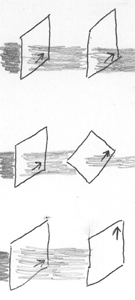](img/2polaroids.png)Now
you hold up the second sheet in front of the first sheet...

When the two arrows are aligned, pointing in the same direction,
the scene is no darker than before - that is, the two sheets in
series block the same amount of light as the first sheet alone.

But as you rotate the second sheet, so that the two arrows point in
increasingly different directions, the world seen through both
sheets grows darker.  When the arrows are at 45° angles, the world
is half as bright as when you were only holding up one sheet.

When the two arrows are perpendicular (90°) the world is completely
black.

Then, as you continue rotating the second sheet, the world gets
lighter again.  When the two arrows point in opposite directions,
again the lightness is the same as for only one sheet.

Clearly, the sheets are selectively blocking light.  Let's call the
sheets "polarized filters".

Now, you might reason something like this:  "Light is built out of
two components, an up-down component and a left-right component. 
When you hold up a single filter, with the arrow pointing up, it
blocks out the left-right component of light, and lets only the
up-down component through.  When you hold up another filter in
front of the first one, and the second filter has the arrow
pointing to the left (or the right), it only allows the left-right
component of light, and we already blocked that out, so the world
is completely dark.  And at intermediate angles, it, um, blocks
some of the light that wasn't blocked already."

So I ask, "Suppose you've already put the second filter at a 45°
angle to the first filter.  Now you put up the third filter at a
45° angle to the second filter.  What do you expect to see?"

"That's ambiguous," you say.  "Do you mean the third filter to end
up at a 0° angle to the first filter, or a 90° angle to the first
filter?"

"Good heavens," I say, "I'm surprised I forgot to specify that! 
Tell me what you expect either way."

"If the third filter is at a 0° angle to the first filter," you
say, "It won't block out anything the first filter hasn't blocked
already.  So we'll be left with the half-light world, from the
second filter being at a 45° angle to the first filter.  And if the
third filter is at a 90° angle to the first filter, it will block
out everything that the first filter didn't block, and the world
will be completely dark."

I hand you a third filter.  "Go ahead," I say, "Try it."

First you set the first filter at 0° and the second filter at 45°,
as your reference point.  Half the light gets through.

Then
you set the first filter at 0°, the second filter at 45°, and the
third filter at 0°.  Now one quarter of the light gets through.

"Huh?" you say.

"Keep going," I reply.

With the first filter at 0°, the second filter at 45°, and the
third filter at 90°, one quarter of the light goes through. 
Again.

"Umm..." you say.  You quickly take out the second filter, and find
that the world goes completely dark.  Then you put in the second
filter, again at 45°, and the world resumes one-quarter
illumination.

Further investigation quickly verifies that all three filters seem
to have the same basic properties - it doesn't matter what order
you put them in.

"All right," you say, "that just seems weird."  You pause.  "So
it's probably something quantum."

Indeed it is.

Though light may seem "dim" or "bright" at the macroscopic level,
you can't split it up indefinitely; you can always send a single
photon into the series of filters, and ask what happens to that
single photon.

As you might suspect, if you send a single photon through the
succession of three filters, you will find that - assuming the
photon passes the first filter (at 0°) - the photon is observed to
pass the second filter (at 45°) with 50% probability, and, if the
photon does pass the second filter, then it seems to pass the third
filter (at 90°) with 50% probability.

The appearance of "probability" in deterministic amplitude
evolutions, as we now know, is due to
[decoherence](http://www.overcomingbias.com/2008/04/on-being-decohe.html). 
Each time a photon was blocked, some other you saw it go through. 
Each time a photon went through, some other you saw it blocked.

But what exactly is getting decohered?  And why does an intervening
second filter at 45°, let some photons pass that would otherwise be
blocked by the 0° filter plus the 90° filter?

First:  We can represent the polarization of light as a complex
amplitude for up-down plus a complex amplitude for left-right.  So
polarizations might be written as (1 ; 0) or (0 ; -i) or (√.5 ;
√.5), with the units (up-down ; left-right).  It is more customary
to write these as column vectors, but row vectors are easier to
type.

(Note that I say that this is a way to "represent" the polarization
of light.  There's nothing magical about picking up-down vs.
left-right, instead of upright-downleft vs. upleft-downright.  The
vectors above are written in an arbitrary but convenient basis. 
This will become clearer.)

Let's say that the first filter has its little arrow pointing
right.  This *doesn't* mean that the filter blocks any photon whose
polarization is not *exactly* (0 ; 1) or a multiple thereof.  But
it nonetheless happens that all the photons which we see leave the
first filter, will have a polarization of (0 ; 1) or some
irrelevantly complex multiple thereof.  Let's just take this for
granted, for the moment.  Past the first filter at 0°, we're
looking at a stream of photons purely polarized in the left-right
direction.

Now the photons hit a second filter.  Let's say the second filter
is at a 30° angle to the first - so the arrow written on the second
filter is pointing 30° above the horizontal.

Then each photon has a 25% probability of being blocked at the
second filter, and a 75% probability of going through.

How about if the second filter points to 20° above the horizontal? 
12% probability of blockage, 88% probability of going through.

45°, 50/50.

The general rule is that the probability of being blocked is the
squared sine of the angle, and the probability of going through is
the squared cosine of the angle.

Why?

First, remember two rules we've picked up about quantum mechanics: 
The evolution of quantum systems is
[linear](http://www.overcomingbias.com/2008/04/heisenberg.html) and
[unitary](http://www.overcomingbias.com/2008/04/the-born-prob-1.html). 
When an amplitude distribution breaks into parts that then evolve
separately, the components must (1) add to the original
distribution and (2) have squared moduli adding to the squared
modulus of the original distribution.

So now let's consider the photons leaving the first filter, with
"polarizations", quantum states, of (0 ; 1).

To understand what happens when the second filter is set at a 45°
angle, we observe... and think of this as a purely abstract
statement about 2-vectors... that:

> (0 ; 1) = (.5 ; .5) + (-.5 ; .5)

[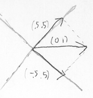](img/polardecomp.png)Okay,
so the two vectors on the right-hand-side sum to (0 ; 1) on the
left-hand-side.

But what about the squared modulus? Just because two vectors sum to
a third, doesn't mean that the squares of the first two vectors'
lengths sum to the square of the third vector's length.

The *squared* length of the vector (.5 ; .5) is (.5)^2^ + (.5)^2^ =
.25 + .25 = 0.5.  And likewise the squared length of the vector
(-.5 ; .5) is (-.5)^2^ + (.5)^2^ = 0.5.  The sum of the squares is
0.5 + 0.5 = 1.  Which matches the squared length of the vector (0 ;
1).

[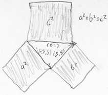](img/polarpythagorean.png)
So when you decompose (0 ; 1) into (.5 ; .5) + (-.5 ; .5), this
obeys both linearity and unitarity:  The two parts sum to the
original, and the squared modulus of the parts sums to the squared
modulus of the original.

When you interpose the second filter at an angle of 45° from the
first, it decoheres the incoming amplitude of (0 ; 1) into an
amplitude of (.5 ; .5) for being transmitted and an amplitude of
(-.5 ; .5) for being blocked.  Taking the squared modulus of the
amplitudes gives us the observed Born probabilities, i.e.
fifty-fifty.

[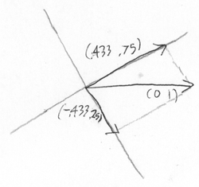](img/polar3060.png)
What if you interposed the second filter at an angle of 30° from
the first?  Then that would decohere the incoming amplitude vector
of (0 ; 1) into the vectors (.433 ; .75) and (-.433, .25).  The
squared modulus of the first vector is .75, and the squared modulus
of the second vector is .25, again summing to one.

A polarized filter *projects* the incoming amplitude vector into
the two sides of a right triangle that sums to the original vector,
and *decoheres* the two components.  And so, under Born's rule, the
transmission and absorption probabilities are given by the
Pythagorean Theorem.

(!)

[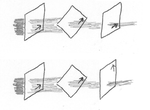](img/3polaroids_2.png)
A filter set at 0° followed by a filter set at 90° will block all
light - any photon that emerges from the first filter will have an
amplitude vector of (0 ; 1), and the component in the direction of
(1 ; 0) will be 0.  But suppose that instead you put an
intermediate filter at 45°.  This will decohere the vector of (0 ;
1) into a transmission vector of (.5 ; .5) and an absorption
amplitude of (-.5 ; .5).

A photon that *is* transmitted through the 45° filter will have a
polarization amplitude vector of (.5 ; .5).  (The (-.5 ; .5)
component is decohered into another world where you see the photon
absorbed.)

This photon then hits the 90° filter, whose transmission amplitude
is the component in the direction of (1 ; 0), and whose absorption
amplitude is the component in the direction of (0 ; 1).  (.5 ; .5)
has a component of (.5 ; 0) in the direction of (1 ; 0) and a
component of (0 ; .5) in the direction of (0 ; 1).  So it has an
amplitude of (.5 ; 0) to make it through both filters, which
translates to a Born probability of .25.

Likewise if the second filter is at -45°.  Then it decoheres the
incoming (0 ; 1) into a transmission amplitude of (-.5 ; .5) and an
absorption amplitude of (.5 ; .5).  When (-.5 ; .5) hits the third
filter at 90°, it has a component of (-.5 ; 0) in the direction of
(1 ; 0), and because these are complex numbers we're talking about,
(-.5 ; 0) has a squared modulus of 0.25, that is, 25% probability
to go through both filters.

It may seem surprising that putting in an extra filter causes more
photons to go through, even when you send them one at a time; but
that's quantum physics for you.

"But wait," you say, "Who needs the second filter?  Why not just
use math?  The initial amplitude of (0 ; 1) breaks into an
amplitude of (-.5 ; .5) + (.5 ; .5) whether or not you have the
second filter there.  By linearity, the evolution of the parts
should equal the evolution of the whole."

Yes, indeed!  So, with no second filter - just the 0° filter and
the 90° filter - here's how we'd do that analysis:

First, the 0° filter decoheres off all amplitude of any incoming
photons except the component in the direction of (0 ; 1).  Now we
look at the photon - which has some amplitude (0 ; x) that we've
implicitly been renormalizing to (0 ; 1) - and, in a purely
mathematical sense, break it up into (.5x ; .5x) and (-.5x ; .5x)
whose squared moduli will sum to x^2^.

Now first we consider the (.5x ; .5x) component; it strikes the 90°
filter which transmits the component (.5x ; 0) and absorbs the (0 ;
.5x) component.

Next we consider the (-.5x ; .5x) component.  It also strikes the
90° filter, which transmits the component (-.5x ; 0) and absorbs
the component (0 ; .5x).

[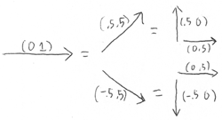](img/polarbreakdown.png)
Since no other particles are entangled, we have some
[identical configurations](http://www.overcomingbias.com/2008/04/distinct-config.html)
here:  Namely, the two configurations where the photon is
transmitted, and the two configurations where the photon is
absorbed.

Summing the amplitude vectors of (.5x ; 0) and (-.5x ; 0) for
transmission, we get a total amplitude vector of (0 ; 0).

Summing the amplitude vectors of (0 ; .5x) and (0 ; .5x) for
absorption, we get an absorption amplitude of (0 ; x).

So all photons that make it through the first filter are blocked.

Remember
[Experiment 2](http://www.overcomingbias.com/2008/04/configurations.html)
from way back when?  *Opening up a new path* to a detector can
cause *fewer* photons to be detected, because the new path has an
amplitude of opposite sign to some existing path, and they cancel
out.

In an exactly analogous manner, having a filter that sometimes
absorbs photons, can cause more (individual) photons to get through
a series of filters.  Think of it as decohering off a component of
the amplitude that would otherwise destructively interfere with
another component.

> A word about choice of basis:

You could just as easily create a new basis in which (1 ; 0) =
(.707 ; .707) and (0 ; 1) = (.707 ; -.707).  This is the
upright-downleft and upleft-downright basis of which I spoke
before.  .707 = √.5, so the basis vectors individually have length
1; and the dot product of the two vectors is 0, so they are
orthogonal.  That is, they are "orthonormal".

The new basis is just as valid as a compass marked NW, NE, SE, SW
instead of N, E, S, W.  There isn't an absolute basis of the
photon's polarization amplitude vector, any more than there's an
absolute three-coordinate system that describes your location in
space.  Ideally, you should see the photon's polarization as a
purely abstract 2-vector in complex space.

(One of my great "Ahas!" while reading the Feynman Lectures was the
realization that, rather than a 3-vector being made out of an
ordered list of 3 scalars, a 3-vector was just a pure mathematical
object in a vector algebra.  If you wanted to take the 3-vector
apart for some reason, you could generate an arbitrary orthonormal
basis and get 3 scalars that way.  In other words, you didn't build
the vector space by composing scalars - you built the decomposition
from within the vector space.  I don't know if that makes any sense
to my readers out there, but it was the great turning point in my
relationship with linear algebra.)

Oh, yes, and what happens if you have a complex polarization in the
up-down/left-right basis, like (.707*i* ; .707)?  Then that
corresponds to "circular polarization" or "elliptical
polarization".  All the polarizations I've been talking about are
"linear polarizations", where the amplitudes in the
up-down/left-right basis happen to be real numbers.

When things decohere, they decohere into pieces that add up to the
original (linearity) and whose squared moduli add up to the
original squared modulus (unitarity).  If the squared moduli of the
pieces add up to the original squared modulus, this implies the
pieces are *orthogonal* - that the components have
[inner products](http://plato.stanford.edu/entries/qm/#VecVecSpa)
of zero with each other.  That is why the title of this blog post
is "Decoherence as Projection".

> A word about how *not* to see this whole business of polarization:

Some ancient textbooks will say that when you send a photon through
a 0° filter, and it goes through, you've learned that the photon is
polarized left-right rather than up-down.  Now you measure it with
another filter at a 45° angle, and it goes through, so you've
learned that the photon is polarized upright-downleft rather than
upleft-downright.  And (says the textbook) this second measurement
"destroys" the first, so that if you want to know the up-down /
left-right polarization, you'll have to measure it all over again.

*Because you can't know both at the same time.*

And some of your more strident ancient textbooks will say something
along the lines of: the up-down / left-right polarization
*no longer exists* after the photon goes through the 45° filter. 
It's not just unknown, it *doesn't exist*, and -* *

(you might think that wasn't too far from the truth)

- *it is meaningless to even talk about it.*

Okay.  That's going a bit too far.

There are ways to use a polarizer to split a beam into two
components, rather than absorbing a component and transmitting a
component.

Suppose you first send the photons through a 0° filter.  Then you
send them through a 45° splitter.  Then you *recombine the beams*. 
Then you send the photons through a 0° filter again.  All the
photons that made it past the first filter, will make it past the
third filter as well.  Because, of course, you've put the
components back together again, and (.5 ; .5) + (-.5 ; .5) = (0 ;
1).

This doesn't seem to square with the idea that measuring the 45°
polarization *automatically destroys* the up-down/left-right
polarization, that it *isn't even meaningful* to talk about it.

Of course the one will say, "Ah, but now you no longer *know*which
path the photon took past the splitter.  When you recombined the
beams, you unmeasured the photon's 45° polarization, and the
original 0° polarization popped back into existence again, and it
was always meaningful to talk about it."

O RLY?

Anyway, that's all talk about classical surface appearances, and
you've *seen* the underlying quantum reality.  A photon with
polarization of (-.707 ; .707) has a component of (.707 ; 0) in the
up-down direction and a component of (0 ; .707) in the left-right
direction.  If you happened to feed it into an apparatus that
decohered these two components - like a polarizing filter - then
you would be able to predict the decoherent evolution as a
deterministic fact about the amplitude distribution, and the Born
probabilities would (deterministically if mysteriously) come out to
50/50.

Now someone comes along and says that the result of this
measurement you may or may not perform, *doesn't exist* or, better
yet, *isn't meaningful*.

It's hard to see what this startling statement could *mean*, let
alone how it could improve your experimental predictions.  How
would you
[falsify](http://www.overcomingbias.com/2007/07/bayesian-judo.html)
it?

# Entangled Photons

Today we shall analyze the phenomenon of "entangled particles". 
We're going to make heavy use of polarized photons here, so you'd
better have read
[yesterday's post](http://www.overcomingbias.com/2008/05/projection.html).

If a particle at rest decays into two other particles, their *net*
momentum must add up to 0.  The two new particles may have
amplitudes to head off in all directions, but in each *joint*
configuration, the directions will be opposite.

By a similar method you can produce two entangled photons which
head off in opposite directions, and are guaranteed to be polarized
oppositely (at right angles to each other), but with a 50% prior
probability of going through any given polarized filter.

You might think that this would involve amplitudes over a
continuous spectrum of opposite configurations - an amplitude for
photon A to be polarized at 0° and for photon B to be polarized at
90°, an amplitude for A to be 1° polarized and for B to be 91°
polarized, etc.  But in fact it's possible to describe the quantum
state "unknown but opposite polarizations" much more compactly.

First, note that the two photons are heading off in opposite
directions.  This justifies calling one photon A and one photon B;
they aren't likely to get their
[identities](http://www.overcomingbias.com/2008/04/identical-parti.html)
mixed up.

As with yesterday, the polarization state (1 ; 0) is what passes a
90° filter.  The polarization state (0 ; 1) is what passes a 0°
filter.  (1 ; 0) is polarized up-down, (0 ; 1) is polarized
left-right.

If A is in the polarization state (1 ; 0), we'll write that as A=(1
; 0).

If A=(1 ; 0) and B=(0 ; 1), we'll write that as

> [ A=(1 ; 0) ∧ B=(0 ; 1) ]

The state for "unknown opposite polarization" can be written as:

> √(1/2) \* ( [ A=(1 ; 0) ∧ B=(0 ; 1) ] - [ A=(0 ; 1) ∧ B=(1; 0) ] )

Note that both terms are being multiplied by the square root of
1/2.  This ensures that the squared modulus of both terms sums to
1. Also, don't overlook the minus sign in the center, we'll need
it.

If you measure the A photon's polarization in the
up-down/left-right basis, the result is pretty straightforward. 
Your measurement decoheres the entanglement, creating one evolution
out of the A=(1 ; 0) ∧ B=(0 ; 1) configuration, and a second,
noninteracting evolution out of the A=(0 ; 1) ∧ B=(1; 0)
configuration.

If you find that the A photon is polarized up-down, i.e., (1 ; 0),
then you know you're in the A=(1 ; 0) ∧ B=(0 ; 1) blob of
amplitude. So you know that if you or anyone else measures B,
they'll report to you that they found B in the (0 ; 1) or
left-right polarization.  The version of you that finds A=(1 ; 0),
and the version of your friend that finds B=(0 ; 1), always turn
out to live in the same blob of amplitude.

On the other side of
[configuration space](http://www.overcomingbias.com/2008/04/quantum-arena.html),
another version of you finds themselves in the A=(0 ; 1) ∧ B=(1; 0)
blob.  If a friend measures B, the other you will expect to hear
that B was polarized up-down, just as you expect to meet the
version of your friend that measured B left-right.

But what if you measure the system in a slanted basis - test a
photon with a 30° polarized filter?  Given the specified starting
state, in the up-down / left-right basis, what happens if we
measure in the 30° basis instead?  Will we still find the photons
having opposite polarizations?  Can this be demonstrated?

Yes, but the math gets a little more interesting.

Let's review, from yesterday, the case where a photon previously
polarized in the up-down/left-right basis encounters a 30° filter.

A 30-60-90 triangle has a hypotenuse of 1, a small side of 1/2, and
a longer side of (√3)/2, in accordance with the Pythagorean
Theorem.

If a photon passes a 0° filter, coming out with polarization (0 ;
1), and then encounters another filter at 30°, the vector that
would be *transmitted*through the 30° filter is

> (√3)/2 \* (1/2 ; (√3)/2) = (.433 ; .75)

and the polarization vector that would be *absorbed* is

> 1/2 \* (-(√3)/2 ; 1/2) = (-.433 ; .25)

Note that the polarization states (1/2 ; (√3)/2) and (-(√3)/2 ;
1/2) form an *orthonormal basis:*  The
[inner product](http://plato.stanford.edu/entries/qm/#VecVecSpa) of
each vector with itself is 1, and the inner product of the two
vectors with each other is 0.

Then we had (√3)/2 of one basis vector plus 1/2 of the other,
guaranteeing the squared moduli would sum to 1.  ((√3)/2)^2^  +
(1/2)^2^  = 3/4 + 1/4 = 1.

So we can say that in the 30° basis, the incoming (0 ; 1) photon
had a (√3)/2 amplitude to be transmitted, and a 1/2 amplitude to be
absorbed.

Symmetrically, suppose a photon had passed a 90° filter, coming out
with polarization (1 ; 0), and then encountered the same 30°
filter.  Then the transmitted vector would be

> 1/2 \* (1/2 ; (√3)/2) = (.25 ; .433)

and the absorbed vector would be

> -(√3)/2 \* (-(√3)/2 ; 1/2) = (.75 ; -.433)

Now let's consider again with the entangled pair of photons

> √(1/2) \* ( [ A=(1 ; 0) ∧ B=(0 ; 1) ] - [ A=(0 ; 1) ∧ B=(1; 0) ] )

and measure photon A with a 30° filter.

Suppose we find that we see photon A absorbed.

Then we know that there was a -(√3)/2 amplitude for this event to
occur if the original state had A=(1 ; 0), and a 1/2 amplitude for
this event to occur if the original state had A=(0 ; 1).

So, if we see that photon A is absorbed, we learn that *we* are in
the now-decoherent blob of amplitude:

> ( -(√3)/2 \* √(1/2) \* [ A=(-(√3)/2 ; 1/2) ∧ B=(0 ; 1) ] )  
> - ( 1/2 \* √(1/2) \* [ A=(-(√3)/2 ; 1/2) ∧ B=(1; 0) ] )

You might be tempted to add the two amplitudes for A being absorbed
- the -(√3)/2 \* √(1/2) and the -1/2 \* √(1/2) - and get a total
amplitude of -.966, which, squared, comes out as .933.

But if this were true, there would be a 93% prior probability of A
being absorbed by the filter - a huge prior expectation to see it
absorbed.  There should be a 50% prior chance of seeing A
absorbed.

What went wrong is that, even though we haven't yet measured B, the
configurations with B=(0 ; 1) and B=(1 ; 0) are
[distinct](http://www.overcomingbias.com/2008/04/distinct-config.html).
B could be light-years away, and unknown to us; the configurations
would still be distinct.  So we don't add the amplitudes for the
two terms; we keep them separate.

When the amplitudes for the terms are *separately* squared, and the
squares added together, we get a prior absorption probability of
1/2 - which is exactly what we should expect.

Okay, so we're in the decoherent blob where A is absorbed by a 30°
filter.  Now consider what happens over at B, within our blob, if a
friend measures B with another 30° filter.

The new starting amplitude distribution is:

> ( -(√3)/2 \* √(1/2) \* [ A=(-(√3)/2 ; 1/2) ∧ B=(0 ; 1) ] )  
> - ( 1/2 \* √(1/2) \* [ A=(-(√3)/2 ; 1/2) ∧ B=(1; 0) ] )

In the case where B=(0 ; 1), it has an amplitude of (√3)/2 to be
transmitted through a 30° filter; being transmitted through a 30°
filter corresponds to the polarization state (1/2 ; (√3)/2). 
Likewise, a 1/2 amplitude to be absorbed (polarization state
(-(√3)/2 ; 1/2).)

In the case where B=(1 ; 0) it has an amplitude of 1/2 to be
transmitted with state (1/2 ; (√3)/2).  And an amplitude of -(√3)/2
to occupy the state (-(√3)/2 ; 1/2) and be absorbed.

So add up four terms:

> ( -(√3)/2 \* √(1/2) ) \* [ A=(-(√3)/2 ; 1/2) ∧ B=(0 ; 1) ]   
> *  breaks down into*  
>     ( -(√3)/2 \* √(1/2) ) \* (√3)/2 \* [ A=(-(√3)/2 ; 1/2) ∧ B=(1/2
> ; (√3)/2) ] +  
>     ( -(√3)/2 \* √(1/2) ) \* 1/2     \* [ A=(-(√3)/2 ; 1/2) ∧
> B=(-(√3)/2 ; 1/2) ]  
> *and*  
> - ( 1/2 \* √(1/2) ) \* [ A=(-(√3)/2 ; 1/2) ∧ B=(1; 0) ] )  
> *   breaks down into*  
>     - ( 1/2 \* √(1/2) ) \*  1/2      \* [ A=(-(√3)/2 ; 1/2) ∧
> B=(1/2 ; (√3)/2) ] +  
>     - ( 1/2 \* √(1/2) ) \* -(√3)/2 \* [ A=(-(√3)/2 ; 1/2) ∧
> B=(-(√3)/2 ; 1/2) ]

These four terms occupy only two distinct configurations.

Adding the amplitudes, the configuration [ A=(-(√3)/2 ; 1/2) ∧
B=(-(√3)/2 ; 1/2) ] ends up with zero amplitude, while [ A=(-(√3)/2
; 1/2) ∧ B=(1/2 ; (√3)/2) ] ends up with a final amplitude of
√(1/2).

So, within the blob in which you've found yourself, the probability
of your friend seeing that a 30° filter blocks both A and B, is 0. 
The probability of seeing that a 30° filter blocks A and transmits
B, is 50%.

Symmetrically, there's another blob of amplitude where your other
self sees A transmitted and B blocked, with probability 50%.  And A
transmitted and B transmitted, with probability 0%.

So you and your friend, when you compare results in some particular
blob of decohered amplitude, always find that the two photons have
opposite polarization.

And in general, if you use two equally oriented polarization
filters to measure a pair of photons in the inital state:

> √(1/2) \* ( [ A=(1 ; 0) ∧ B=(0 ; 1) ] - [ A=(0 ; 1) ∧ B=(1; 0) ] )

then you are guaranteed that one filter will transmit, and the
other filter absorb - regardless of how you set the filters, so
long as you use the same setting.  The photons *always* have
opposite polarizations, even though the prior probability of any
*particular* photon having a *particular* polarization is 50%.

What if I measure one photon with a 0° filter, and find that it is
transmitted (= state (0 ; 1)), and then I measure the other photon
with a 30° filter?

The probability works out to just the same as if I knew the other
photon had state (1 ; 0) - in effect, it now does.

Over on my side, I've decohered the amplitude over the *joint*
distribution, into blobs in which A has been transmitted, and A
absorbed.  I am in the decoherent blob with A transmitted:  A=(0 ;
1). Ergo, the amplitude vector / polarization state of B,
*in my blob,* behaves as if it starts out as (1 ; 0).  This is just
as true whether I measure it with another 0° filter, or a 30°
filter.

With symmetrically entangled particles, each particle *seems* to
know the state the other particle has been measured in.  But
"seems" is the operative word here.  Actually we're just dealing
with decoherence that happens to take place in a very symmetrical
way.

Tomorrow (if all goes according to plan) we'll look at Bell's
Theorem, which rules out the possibility that each photon already
has a fixed, non-quantum state that locally determines the result
of any possible polarization measurement.

# Bell's Theorem: No EPR "Reality"

*(Note:  So that this post can be read by people who haven't followed the [whole series](http://www.overcomingbias.com/2008/04/quantum-explana.html), I shall temporarily adopt some more standard and less accurate terms; for example, talking about "many worlds" instead of "decoherent blobs of amplitude".)*

The legendary Bayesian, E. T. Jaynes, began his life as a
physicist.  In some of his writings, you can find Jaynes railing
against the idea that, because we have not yet found any way to
predict quantum outcomes, they must be "truly random" or
"inherently random".

Sure, *today*you don't know how to predict quantum measurements. 
But how do you *know,* asks Jaynes, that you won't find a way to
predict the process tomorrow?  How can any
[mere experiments](http://www.overcomingbias.com/2008/04/identical-parti.html)
tell us that we'll *never* be able to predict something - that it
is "inherently unknowable" or "truly random"?

As far I can tell, Jaynes never heard about
[decoherence](http://www.overcomingbias.com/2008/04/on-being-decohe.html)
aka Many-Worlds, which is a great pity.  If you belonged to a
species with
[a brain like a flat sheet of paper that sometimes split down its thickness](http://www.overcomingbias.com/2008/04/physics-meets-e.html),
you could reasonably conclude that you'd *never* be able to
"predict" whether you'd "end up" in the left half or the right
half.  Yet is this really *ignorance*?  It is a *deterministic*fact
that different versions of you will experience different outcomes.

But even if you don't know about Many-Worlds, there's still an
excellent reply for "Why do you think you'll *never* be able to
predict what you'll see when you measure a quantum event?"  This
reply is known as Bell's Theorem.

In 1935,
[Einstein, Podolsky, and Rosen](http://prola.aps.org/abstract/PR/v47/i10/p777_1)
once argued roughly as follows:

Suppose we have a pair of
[entangled particles](http://www.overcomingbias.com/2008/05/entangled-photo.html),
light-years or at least light-minutes apart, so that no signal can
possibly travel between them over the timespan of the experiment. 
We can suppose these are
[polarized photons](http://www.overcomingbias.com/2008/05/projection.html)
with
[opposite polarizations](http://www.overcomingbias.com/2008/05/entangled-photo.html).

Polarized filters block some photons, and absorb others; this lets
us measure a photon's polarization in a given orientation. 
Entangled photons (with the right kind of entanglement) are always
found to be polarized in *opposite* directions, when you measure
them in the same orientation; if a filter at a certain angle passes
photon A (*transmits* it) then we know that a filter at the same
angle will block photon B (*absorb* it).

Now we measure one of the photons, labeled A, and find that it is
*transmitted*by a 0° polarized filter.  *Without measuring B,*we
can now predict with
[certainty](http://www.overcomingbias.com/2008/01/infinite-certai.html)
that B will be *absorbed*by a 0° polarized filter, because A and B
always have opposite polarizations when measured in the same
basis.

Said EPR:

> "If, without in any way disturbing a system, we can predict with
> certainty (i.e., with probability equal to unity) the value of a
> physical quantity, then there exists an element of physical reality
> corresponding to this physical quantity."

EPR then assumed (correctly!) that nothing which happened at A
could *disturb* B or exert any influence on B, due to the spacelike
separations of A and B.  We'll take up the relativistic viewpoint
again tomorrow; for now, let's just note that this assumption is
correct.

If by measuring A at 0°, we can predict with certainty whether B
will be absorbed or transmitted at 0°, then according to EPR this
fact must be an "element of physical reality" about B.  Since
measuring A cannot influence B in any way, this element of reality
must *always* have been true of B.  Likewise with every other
possible polarization we could measure - 10°, 20°, 50°, anything. 
If we measured A first in the same basis, even light-years away, we
could perfectly predict the result for B.  So on the EPR
assumptions, there must exist some "element of reality"
corresponding to whether B will be transmitted or absorbed, in
*any* orientation.

But if no one has measured A, quantum theory does *not* predict
with certainty whether B will be transmitted or absorbed.  (At
least that was how it seemed in 1935.)  Therefore, EPR said, there
are elements of reality that exist but are not mentioned in quantum
theory:

> "We are thus forced to conclude that the quantum-mechanical
> description of physical reality given by wave functions is not
> complete."

This is another excellent example of how
[seemingly impeccable philosophy can fail](http://www.overcomingbias.com/2008/04/identical-parti.html)
in the face of experimental evidence, thanks to a wrong assumption
so deep you didn't even realize it was an assumption.

EPR correctly assumed Special Relativity, and then incorrectly
assumed that there was *only one version of you* who saw A do only
one thing.  They assumed that the certain prediction about what
*you* would *hear* from B, described the *only* outcome that
happened at B.

In real life, if you measure A and your friend measures B,
[different versions](http://www.overcomingbias.com/2008/04/on-being-decohe.html)
of you and your friend obtain both possible outcomes.  When you
*compare notes,* the two of you always find the polarizations are
opposite.  This does not violate Special Relativity even in spirit,
but the reason why not is the topic of tomorrow's post, not
today's.

Today's post is about how, in 1964,
Belldandy
John S. Bell irrevocably shot down EPR's original argument.  Not by
pointing out the flaw in the EPR assumptions - Many-Worlds was not
then widely known - but by describing an experiment that disproved
them!
It is *experimentally impossible* for there to be a physical
description of the entangled photons, which specifies a single
fixed outcome of any polarization measurement individually
performed on A or B.

This is Bell's Theorem, which rules out all "local hidden variable"
interpretations of quantum mechanics.  It's actually not all that
complicated, as quantum physics goes!

We begin with a pair of
[entangled photons](http://www.overcomingbias.com/2008/05/entangled-photo.html),
which we'll name A and B.  When measured in the same basis, you
find that the photons always have opposite polarization - one is
transmitted, one is absorbed.  As for the *first* photon you
measure, the probability of transmission or absorption seems to be
50-50.

What if you measure with polarized filters set at different
angles?

Suppose that I measure A with a filter set at 0°, and find that A
was transmitted.  In general, if you *then* measure B at an angle θ
to my basis, quantum theory says the probability (of my hearing
that) you *also* saw B transmitted, equals sin^2^ θ.  E.g. if your
filter was at an angle of 30° to my filter, and I saw my photon
transmitted, then there's a 25% probability that you see your
photon transmitted.

(Why?  See
"[Decoherence as Projection](http://www.overcomingbias.com/2008/05/projection.html)". 
Some quick sanity checks:  sin(0°) = 0, so if we measure at the
same angles, the calculated probability is 0 - we never measure at
the *same* angle and see *both* photons transmitted.  Similarly,
sin(90°) = 1; if I see A transmitted, and you measure at an
orthogonal angle, I will always hear that you saw B transmitted. 
sin(45°) = √(1/2), so if you measure in a diagonal basis, the
probability is 50/50 for the photon to be transmitted or
absorbed.)

Oh, and the initial probability of my seeing A transmitted is
always 1/2.  So the *joint* probability of seeing *both* photons
transmitted is 1/2 \* sin^2^ θ.  1/2 probability of my seeing A
transmitted, times sin^2^ θ probability that you then see B
transmitted.

And now you and I perform three statistical experiments, with large
sample sizes:

(1)  First, I measure A at 0° and you measure B at 20°.  The photon
is transmitted through both filters on 1/2 sin^2^ (20°) = 5.8% of
the occasions.

(2)  Next, I measure A at 20° and you measure B at 40°.  When we
compare notes, we again discover that we both saw our photons pass
through our filters, on 1/2 sin^2^ (40° - 20°) = 5.8% of the
occasions.

(3)  Finally, I measure A at 0° and you measure B at 40°.  Now the
photon passes both filters on 1/2 sin^2^ (40°) = 20.7% of
occasions.

Or to say it a bit more compactly:

1.  A transmitted 0°, B transmitted 20°:  5.8%
2.  A transmitted 20°, B transmitted 40°:  5.8%
3.  A transmitted 0°, B transmitted 40°:  20.7%

What's wrong with this picture?

Nothing, in real life.  But on EPR assumptions, it's impossible.

On EPR assumptions, there's a fixed local tendency for any
individual photon to be transmitted or absorbed by a polarizer of
any given orientation, independent of any measurements performed
light-years away, as the single unique outcome.

Consider experiment (2).  We measure A at 20° and B at 40°, compare
notes, and find we both saw our photons transmitted.  Now, A was
transmitted at 20°, so *if* you had measured B at 20°, B would
certainly have been absorbed - if you measure in the same basis you
must find opposite polarizations.

That is:  If A had the fixed tendency to be transmitted at 20°,
then B must have had a fixed tendency to be absorbed at 20°.  If
this rule were violated, you could have measured both photons in
the 20° basis, and found that both photons had the same
polarization.  Given the way that entangled photons are actually
produced, this would violate conservation of angular momentum.

So (under EPR assumptions) what we learn from experiment (2) can be
*equivalently* phrased as:  "B was a kind of photon that was
transmitted by a 40° filter and *would have been* absorbed by the
20° filter."  Under EPR assumptions this is logically equivalent to
the actual result of experiment (2).

Now let's look again at the percentages:

1.  B is a kind of photon that was transmitted at 20°, and would
    not have been transmitted  at 0°:  5.8%
2.  B is a kind of photon that was transmitted at 40°, and would
    not have been transmitted at 20°:  5.8%
3.  B is a kind of photon that was transmitted at 40°, and would
    not have been transmitted at 0°:  20.7%

If you want to try and see the problem on your own, you can stare
at the three experimental results for a while...

(Spoilers ahead.)

Consider a photon pair that gives us a positive result in
experiment (3).  On EPR assumptions, we now know that the B photon
was inherently a type that would have been absorbed at 0°, and was
in fact transmitted at 40°.  (And conversely, if the B photon is of
this type, experiment (3) will always give us a positive result.)

Now take a B photon from a positive experiment (3), and ask: 
"*If instead* we had measured B at 20°, would it have been
transmitted, or absorbed?"  Again by EPR's assumptions, there must
be a definite answer to this question.  We *could* have measured A
in the 20° basis, and then had certainty of what would happen at B,
without disturbing B.  So there must be an "element of reality" for
B's polarization at 20°.

But if B is a kind of photon that would be transmitted at 20°, then
it is a kind of photon that implies a positive result in experiment
(1).  And if B is a kind of photon that would be absorbed at 20°,
it is a kind of photon that would imply a positive result in
experiment (2).

If B is a kind of photon that is transmitted at 40° *and* absorbed
at 0°, *and* it is *either* a kind that is absorbed at 20° *or* a
kind that is transmitted at 20°; then B must be *either* a kind
that is absorbed at 20° and transmitted at 40°, *or* a kind that is
transmitted at 20° and absorbed at 0°.

So, on EPR's assumptions, it's really hard to see how the same
source can manufacture photon pairs that produce 5.8% positive
results in experiment (1), 5.8% positive results in experiment (2),
and 20.7% positive results in experiment (3).  Every photon pair
that produces a positive result in experiment (3) should also
produce a positive result in either (1) or (2).

"Bell's inequality" is that any theory of hidden local variables
implies (1) + (2) \>= (3).  The experimentally verified fact that
(1) + (2) < (3) is a "violation of Bell's inequality".  So there
are no hidden local variables.  QED.

And that's Bell's Theorem.  See, that wasn't so horrible, was it?

But what's *actually* going on here?

When you measure at A, and your friend measures at B a few
light-years away, different versions of you observe both possible
outcomes - both possible polarizations for your photon.  But the
[amplitude](http://www.overcomingbias.com/2008/04/configurations.html)
of the
[joint](http://www.overcomingbias.com/2008/04/joint-configura.html)
world where you *both* see your photons transmitted, goes as √(1/2)
\* sin θ where θ is the angle between your polarizers.  So the
[squared modulus](http://www.overcomingbias.com/2008/04/configurations.html)
of the amplitude (which is how we get probabilities in quantum
theory) goes as 1/2 sin^2^ θ, and that's the probability for
finding mutual transmission when you meet a few years later and
compare notes.  We'll talk tomorrow about why this doesn't violate
Special Relativity.

Strengthenings of Bell's Theorem eliminate the need for statistical
reasoning:  You can show that local hidden variables are
impossible, using *only*properties of individual experiments which
are *always* true given various measurements.  (Google "GHZ state"
or "GHZM state".)  Occasionally you also hear that someone has
published a strengthened Bell's experiment in which the two
particles were more distantly separated, or the particles were
measured more reliably, but you get the core idea.  Bell's Theorem
is proven beyond a reasonable doubt.  Now the physicists are
tracking down unreasonable doubts, and Bell always wins.

I know I sometimes speak as if Many-Worlds is a settled issue,
which it isn't academically.  (If people are still arguing about
it, it must not be "settled", right?)  But Bell's Theorem itself is
agreed-upon academically as an experimental truth.  Yes, there are
people discussing theoretically conceivable loopholes in the
experiments done so far.  But I don't think anyone out there
*really* thinks they're going to find an experimental violation of
Bell's Theorem as soon as they use a more sensitive photon
detector.

What does Bell's Theorem plus its experimental verification tell
us, exactly?

My favorite phrasing is one I encountered in
[D. M. Appleby](http://aps.arxiv.org/abs/quant-ph/0308114): 
"Quantum mechanics is inconsistent with the classical assumption
that a measurement tells us about a property previously possessed
by the system."

Which is exactly right:  Measurement decoheres your blob of
amplitude (world), splitting it into several noninteracting blobs
(worlds).  This creates new
[indexical uncertainty](http://www.overcomingbias.com/2008/01/is-reality-ugly.html)
- uncertainty about which of several versions of yourself you are. 
Learning which version you are, does *not* tell you a previously
unknown property that was always possessed by the system.  And
which specific blobs (worlds) are created, depends on the physical
measuring process.

It's sometimes said that Bell's Theorem rules out "local realism". 
[Tread cautiously when you hear someone arguing against "realism"](http://yudkowsky.net/bayes/truth.html). 
As for *locality*, it is, if anything, far better understood than
this whole "reality" business:  If life is but a dream, it is a
dream that obeys Special Relativity.

It is just one particular sort of locality, and just one particular
notion of which things are "real" in the sense of previously
uniquely determined, which Bell's Theorem says cannot
*simultaneously*be true.

In particular, decoherent quantum mechanics is local, and Bell's
Theorem gives us no reason to believe it is not real.  (It may or
may not be the ultimate truth, but quantum mechanics is certainly
*more* real than the
[classical hallucination](http://www.overcomingbias.com/2008/04/no-individual-p.html)
of little billiard balls bopping around.)

*Does Bell's Theorem prevent us from regarding the quantum description as a state of partial knowledge about something more deeply real?*

At the very least, Bell's Theorem prevents us from interpreting
quantum amplitudes as probability in the *obvious*way.  You cannot
point at a single
[configuration](http://www.overcomingbias.com/2008/04/configurations.html),
with probability proportional to the squared modulus, and say,
"This is what the universe looked like all along."

In fact, you cannot pick *any* locally specified description
*whatsoever* of unique outcomes for quantum experiments, and say,
"*This* is what we have
[partial information](http://www.overcomingbias.com/2008/03/mind-probabilit.html)
about."

So it certainly isn't *easy* to reinterpret the quantum
wavefunction as an uncertain belief.  You can't do it the obvious
way.  And I haven't
[heard of](http://www.overcomingbias.com/2007/10/no-one-knows-wh.html)
any *non*-obvious interpretation of the quantum description as
partial information.

Furthermore, as I
[mentioned previously](http://www.overcomingbias.com/2008/04/where-experienc.html),
it is really odd to find yourself differentiating a degree of
uncertain anticipation to get physical results - the way we have to
differentiate the quantum wavefunction to find out how it evolves. 
That's not what probabilities are *for.*

Thus I try to
[emphasize](http://www.overcomingbias.com/2008/03/mind-probabilit.html)
that quantum amplitudes are *not* possibilities, or probabilities,
or degrees of uncertain belief, or expressions of ignorance, or any
other species of *epistemic* creatures.  Wavefunctions are not
[states of mind](http://www.overcomingbias.com/2008/03/mind-projection.html). 
It would be a very
[bad sign](http://www.overcomingbias.com/2008/04/philosophy-meet.html)
to have a *fundamental* physics that operated over states of mind;
we know from
[looking at brains](http://www.overcomingbias.com/2008/04/brain-breakthro.html)
that
[minds are made of parts](http://www.overcomingbias.com/2008/03/angry-atoms.html).

In conclusion, although Einstein, Podolsky, and Rosen presented a
picture of the world that was disproven experimentally, I would
still regard them as having won a moral victory:  The then-common
interpretation of quantum mechanics did indeed have a one person
measuring at A, seeing a single outcome, and then making a certain
prediction about a unique outcome at B; and this is indeed
incompatible with relativity, and wrong.  Though people are still
arguing about that.

# Spooky Action at a Distance: The No-Communication Theorem

When you have a pair of
[entangled particles](http://www.overcomingbias.com/2008/05/entangled-photo.html),
such as oppositely
[polarized](http://www.overcomingbias.com/2008/05/projection.html)
photons, one particle seems to somehow "know" the result of distant
measurements on the other particle.  If you measure photon A to be
polarized at 0°, photon B somehow immediately knows that it should
have the opposite polarization of 90°.

Einstein famously called this "spukhafte Fernwirkung" or "spooky
action at a distance".  Einstein didn't know about
[decoherence](http://www.overcomingbias.com/2008/04/on-being-decohe.html),
so it seemed spooky to him.

Though, to be fair, Einstein knew perfectly well that the universe
couldn't *really* be
"[spooky](http://www.overcomingbias.com/2007/05/think_like_real.html)". 
It was a then-popular interpretation of QM that Einstein was
calling "spooky", not the universe itself.

Let us first consider how entangled particles *look,* if you don't
know about decoherence - the reason why Einstein called it
"spooky":

Suppose we've got oppositely polarized photons A and B, and you're
about to measure B in the 20° basis.  Your probability of seeing B
transmitted by the filter (or absorbed) is 50%.

But wait!  Before you measure B, I suddenly measure A in the 0°
basis, and the A photon is transmitted!  Now, apparently, the
probability that you'll see B transmitted is 11.6%.  Something has
changed!  And even if the photons are light-years away, spacelike
separated, the change still occurs.

You might try to reply:

> "No, nothing has *changed* - measuring the A photon has *told* you
> something about the B photon, you have gained *knowledge,* you have
> carried out an *inference* about a distant object, but no physical
> influence travels faster-than-light.
> 
> "Suppose I put two index cards into an envelope, one marked '+' and
> one marked '-'.  Now I give one envelope to you, and one envelope
> to a friend of yours, and you get in a spaceship and travel a few
> light-years away from each other, and then you open your envelope
> and see '+'.  At once you know that your friend is holding the
> envelope marked '-', but this doesn't mean the envelope's content
> has *changed* faster than the speed of light.
> 
> "You are committing a Mind Projection Fallacy; the envelope's
> content is constant, only your local beliefs about distant
> referents change."

[Bell's Theorem](http://www.overcomingbias.com/2008/05/bells-theorem-n.html),
covered yesterday, shows that this reply fails.  It is
*not possible* that each photon has an unknown but fixed individual
tendency to be polarized a particular way.  (Think of how unlikely
it would seem,
[a priori](http://www.overcomingbias.com/2008/04/identical-parti.html),
for this to be something *any* experiment could tell you!)

Einstein didn't know about Bell's Theorem, but the theory he was
criticizing did not say that there were hidden variables; it said
that the probabilities changed directly.

But then how fast does this influence travel?  And what if you
measure the entangled particles in such a fashion that, in their
individual reference frames, each measurement takes place before
the other?

These experiments have been
[done](http://books.google.com/books?id=wiC0SEdQ454C&pg=PA205&lpg=PA205&dq=%22no-signaling+condition%22&source=web&ots=XtJFSuDyk1&sig=qI8uQcTZnKyiekZwCa68omvYxpQ&hl=en#PPA204,M1). 
If you think there is an influence traveling, it travels at least
six million times as fast as light (in the reference frame of the
Swiss Alps).  Nor is the influence fazed if each measurement takes
place "first" within its own reference frame.

So why *can't* you use this mysterious influence to send signals
faster than light?

Here's something that, as a kid, I couldn't get anyone to explain
to me:  "Why can't you signal using an entangled pair of photons
that both start out polarized up-down?  By measuring A in a
diagonal basis, you destroy the up-down polarization of both
photons.  Then by measuring B in the up-down/left-right basis, you
can with 50% probability detect the fact that a measurement has
taken place, if B turns out to be left-right polarized."

It's particularly annoying that nobody gave me an answer, because
the answer turns out to be simple:  If both photons have definite
polarizations, they aren't
[entangled](http://www.overcomingbias.com/2008/05/entangled-photo.html). 
There are just two different photons that both happen to be
polarized up-down.  Measuring one photon doesn't even change your
*expectations* about the other.

Entanglement is not an *extra* property that you can just stick
onto otherwise normal particles!  It is a breakdown of quantum
independence.  In classical probability theory, if you know two
facts, there is no longer any logical dependence left between
them.  Likewise in quantum mechanics, two particles each with a
definite state must have a factorizable amplitude distribution.

Or as old-style quantum theory put it:  Entanglement requires
superposition, which implies uncertainty.  When you measure an
entangled particle, you are not able to force your measurement
result to take any particular value.  So, over on the B end, if
they do not know *what* you measured on A, their probabilistic
*expectation* is always the same as before.  (So it was once
said).

But in old-style quantum theory, there was indeed a real and
instantaneous change in the other particle's statistics which took
place as the result of your own measurement.  It had to be a real
change, by Bell's Theorem and by the invisibly assumed *uniqueness*
of both outcomes.

Even though the old theory invoked a non-local influence, you could
never use this influence to *signal* or *communicate* with anyone. 
This was called the "no-signaling condition" or the
"[no-communication theorem](http://en.wikipedia.org/wiki/No_communication_theorem)".

Still, on then-current assumptions, they couldn't actually call it
the "no influence of any kind whatsoever theorem".  So Einstein
correctly labeled the old theory as "spooky".

In decoherent terms, the impossibility of signaling is much easier
to understand:  When you measure A, one version of you sees the
photon transmitted and another sees the photon absorbed.  If you
see the photon absorbed, you have not learned any new *empirical*
fact; you have merely discovered which version of yourself "you"
happen to be.  From the perspective at B, your "discovery" is not
even theoretically a fact they can learn; they know that both
versions of you exist.  When B finally communicates with you, they
"discover" which world they themselves are in, but that's all.  The
statistics at B *really* haven't changed - the total Born
probability of measuring either polarization is still just 50%!

A common defense of the old theory was that Special Relativity was
not violated, because no "information" was transmitted, because the
superluminal influence was always "random".  As
some [Hans de Vries](http://www.physicsforums.com/showpost.php?p=1704107&postcount=8)
fellow points out, information theory says that "random" data is
the most expensive kind of data you can transmit.  Nor is "random"
information always useless:  If you and I generate a million
entangled particles, we can later measure them to obtain a shared
key for use in cryptography - a highly useful form of information
which, by Bell's Theorem, could *not* have already been there
before measuring.

But wait a minute.  Decoherence also lets you generate the shared
key.  Does decoherence *really* not violate the spirit of Special
Relativity?

Decoherence doesn't allow "signaling" or "communication", but it
allows you to generate a highly useful shared key apparently out of
nowhere.  Does decoherence *really* have any advantage over the
old-style theory on this one?  Or are both theories equally obeying
Special Relativity in practice, and equally violating the spirit?

A first reply might be:  "The shared key is not 'random'.  Both you
and your friend generate all possible shared keys, and this is a
deterministic and local fact; the correlation only shows up when
you meet."

But this just reveals a deeper problem.  The counter-objection
would be:  "The measurement that you perform over at A, splits both
A and B into two parts, two worlds, which guarantees that you'll
meet the right version of your friend when you reunite.  That is
non-local physics - something you do *at A*, makes the world *at B*
split into two parts.  This is spooky action at a distance, and it
too violates the spirit of Special Relativity. 
[Tu quoque](http://en.wikipedia.org/wiki/Tu_quoque)!"

And indeed, if you look at our quantum calculations, they are
written in terms of
[joint configurations](http://www.overcomingbias.com/2008/04/joint-configura.html). 
Which, on reflection, doesn't seem all that local!

But wait - what exactly does the no-communication theorem say? 
*Why* is it true?  Perhaps, if we knew, this would bring
enlightenment.

Here is where it starts getting complicated.  I myself don't fully
understand the no-communication theorem - there are some parts I
think I can see at a glance, and other parts I don't.  So I will
only be able to explain some of it, and I may have gotten it wrong,
in which case I pray to some physicist to correct me (or at least
tell me where I got it wrong).

When we did the calculations for
[entangled polarized photons](http://www.overcomingbias.com/2008/05/entangled-photo.html),
with A's polarization measured using a 30° filter, we calculated
that the initial state

> √(1/2) \* ( [ A=(1 ; 0) ∧ B=(0 ; 1) ] - [ A=(0 ; 1) ∧ B=(1; 0) ] )

would be decohered into a blob for

> ( -(√3)/2 \* √(1/2) \* [ A=(-(√3)/2 ; 1/2) ∧ B=(0 ; 1) ] )  
> - ( 1/2 \* √(1/2) \* [ A=(-(√3)/2 ; 1/2) ∧ B=(1; 0) ] )

and symmetrically (though we didn't do this calculation) another
blob for

> ( 1/2 \* √(1/2) \* [ A=(1/2 ; (√3)/2) ∧ B=(0 ; 1) ] )  
> - ( (√3)/2 \* √(1/2) \* [ A=(1/2 ; (√3)/2) ∧ B=(1; 0) ] )

These two blobs together add up, linearly, to the initial state, as
one would expect.  So what changed?  At all?

What changed is that the final result at A, for the first blob, is
really more like:

> (Sensor-A-reads-"ABSORBED") \* (Experimenter-A-sees-"ABSORBED")
> \*  
> { ( -(√3)/2 \* √(1/2) \* [ A=(-(√3)/2 ; 1/2) ∧ B=(0 ; 1) ] )  
> - ( 1/2 \* √(1/2) \* [ A=(-(√3)/2 ; 1/2) ∧ B=(1; 0) ] ) }

and correspondingly with the TRANSMITTED blob.

What changed is that one blob in configuration space, was decohered
into two
[distantly separated blobs](http://www.overcomingbias.com/2008/04/decoherence.html)
that can't interact any more.

As we saw from the
[Heisenberg "Uncertainty Principle"](http://www.overcomingbias.com/2008/04/heisenberg.html),
decoherence is a visible, experimentally detectable effect.  That's
why we have to shield quantum computers from decoherence.  So
couldn't the decohering measurement at A, have detectable
consequences for B?

But think about how B sees the initial state:

> √(1/2) \* ( [ A=(1 ; 0) ∧ B=(0 ; 1) ] - [ A=(0 ; 1) ∧ B=(1; 0) ] )

From B's perspective, this state is already "not all that
coherent", because no matter what B does, it can't make the A=(1 ;
0) and A=(0 ; 1) configurations cross
[paths](http://www.overcomingbias.com/2008/04/feynman-paths.html). 
There's already a sort of decoherence here - a separation that B
can't eliminate by any local action at B.

And as we've earlier glimpsed, the basis in which you write the
initial state is arbitrary.  When you write out the state, it has
pretty much the same form in the 30° measuring basis as in the 0°
measuring basis.

In fact, there's nothing preventing you from writing out the
initial state with A in the 30° basis and B in the 0° basis, so
long as your numbers add up.

Indeed this is exactly what we *did* do, when we first wrote out
the four terms in the two blobs, and didn't include the sensor or
experimenter.

So when A *permanently*decohered the blobs in the 30° basis, from
B's perspective, this merely *solidified* a decoherence that B
could have viewed as *already* existing.

Obviously, this can't change the local evolution at B (he said,
waving his hands a bit).

Now this is only a statement about a quantum measurement that
*just* decoheres the amplitude for A into parts, *without* A itself
evolving in interesting new directions.  What if there were many
particles on the A side, and something happened on the A side that
put some of those particles into
[identical configurations](http://www.overcomingbias.com/2008/04/distinct-config.html)
via
[different paths](http://www.overcomingbias.com/2008/04/feynman-paths.html)?

This is where
[linearity](http://www.overcomingbias.com/2008/04/heisenberg.html)
and
[unitarity](http://www.overcomingbias.com/2008/04/the-born-prob-1.html)
come in.  The no-communication theorem requires both conditions: in
general, violating linearity or unitarity gives you
faster-than-light signaling.  (And numerous other superpowers, such
as
[solving NP-complete problems in polynomial time](http://www.scottaaronson.com/blog/),
and possibly
[Outcome Pumps](http://www.overcomingbias.com/2007/11/complex-wishes.html).)

By linearity, we can consider parts of the amplitude distribution
separately, and their evolved states will add up to the evolved
state of the whole.

Suppose that there are many particles on the A side, but we count
up every configuration that corresponds to some single fixed state
of B - say, B=(0 ; 1) or B=France, whatever.  We'd get a group of
components which looked like:

> (AA=1 ∧ AB=2 ∧ AC=Fred ∧ B=France) +  
> (AA=2 ∧ AB=1 ∧ AC=Sally ∧ B=France) + ...

Linearity says that we can decompose the amplitude distribution
around states of B, and the evolution of the parts will add to the
whole.

Assume that the B side stays fixed.  Then this component of the
distribution that we have just isolated, will not interfere with
any *other* components, because other components have different
values for B, so they are not identical configurations.

And unitary evolution says that whatever the measure - the
integrated squared modulus - of this component, the total measure
is the same after evolution at A, as before.

So *assuming* that B stays fixed, then anything
*whatsoever*happening at A, won't change the measure of the states
at B (he said, waving his hands some more).

Nor should it matter whether we consider A first, or B first. 
Anything that happens at A, within some component of the amplitude
distribution, only *depends*on the A factor, and only happens *to*
the A factor; likewise with B; so the final *joint* amplitude
distribution should not depend on the order in which we consider
the evolutions (and he waved his hands a final time).

It seems to me that from here it should be easy to show no
communication considering the simultaneous evolution of A and B. 
Sadly I can't quite see the last step of the argument.  I've spent
very little time doing actual quantum calculations - this is not
what I do for a living - or it would probably be obvious.  Unless
it's more subtle than it appears, but anyway...

Anyway, *if I'm not mistaken* - though I'm feeling my way here by
mathematical intuition - the no-communication theorem manifests as
invariant generalized* *states of entanglement.  From B's
perspective, they are entangled with some distant entity A, and
that entanglement has an invariant shape that remains exactly the
same no matter what happens at A.

To me, at least, this suggests that the
*apparent non-locality of quantum physics* is a
*mere artifact of the representation* used to describe it.

If you write a 3-dimensional vector as "30° west of north, 40°
upward slope, and 100 meters long," it doesn't mean that the
universe has a basic compass grid, or that there's a global
direction of up, or that reality runs on the metric system.  It
means you chose a convenient representation.

Physics, including quantum physics, is relativistically invariant: 
You can pick any relativistic frame you like, redo your
calculations, and always get the same experimental predictions back
out.  *That* we know.

Now it may be that, in the course of doing *your* calculations, you
find it convenient to pick *some* reference frame, *any* reference
frame, and use that in *your* math.  Greenwich Mean Time, say. 
This doesn't mean there really *is* a central clock, somewhere
underneath the universe, that operates on Greenwich Mean Time.

The representation we used talked about "joint configurations" of A
and B in which the states of A and B were simultaneously
specified.  This means our representation was not relativistic; the
notion of "simultaneity" is arbitrary.  We assumed the universe ran
on Greenwich Mean Time, in effect.

I don't know what kind of representation would be (1)
relativistically invariant, (2) show distant entanglement as
invariant, (3) directly represent space-time locality, and (4)
evolve each element of the new representation in a way that
depended only on an immediate neighborhood of other elements.

But that representation would probably be a *lot* closer to the
[Tao](http://www.overcomingbias.com/2008/04/which-basis-is.html).

My suspicion is that a better representation might take its basic
mathematical objects as local states of entanglement.  I've
actually suspected this ever since I heard about holographic
physics and the entanglement entropy bound.  But that's just raw
speculation, at this point.

However, it *is* important that a fundamental representation be as
*local* and as *simple* as possible.  This is why e.g. "histories
of the entire universe" make poor "fundamental" objects, in my
humble opinion.

And it's why I find it suspicious to have a representation for
calculating quantum physics that talks about a relativistically
arbitrary "joint configuration" of A and B, when it seems like each
local position has an invariant "distant entanglement" that
suffices to determine local evolution.  Shouldn't we be able to
refactor this representation into smaller pieces?

Though ultimately you do have to retrieve the phenomenon where the
experimenters meet again, after being separated by light-years, and
discover that they measured the photons with opposite
polarizations.  Which is provably not something you can get from
individual billiard balls bopping around.

I suspect that when we get a *representation* of quantum mechanics
that is local in every way that the physics itself is local, it
will be immediately obvious - right there in the representation -
that things only happen in one place at a time.

Hence, no faster-than-light communicators.  (Dammit!)

Now of course, all this that I have said - all this wondrous
normality - relies on the decoherence viewpoint.

It relies on believing that when you measure at A, both possible
measurements for A still exist, and are still entangled with B in a
way that B sees as invariant.

All the amplitude in the joint configuration is undergoing linear,
unitary, local evolution.  None of it vanishes.  So the
probabilities at B are always the same from a global standpoint,
and there is no supraluminal influence, period.

If you tried to "interpret" things any differently... well, the
no-communication theorem would become a*lot less obvious*.

# Decoherence is Simple

An epistle to the physicists:

When I was but a little lad, my father, a Ph.D. physicist, warned
me sternly against meddling in the affairs of physicists; he said
that it was hopeless to try to comprehend physics without the
formal math. Period.  No escape clauses.  But I had read in
Feynman's popular books that if you really understood physics, you
ought to be able to explain it to a nonphysicist.  I believed
Feynman instead of my father, because Feynman had won the Nobel
Prize and my father had not.

It was not until later - when I was reading the *Feynman Lectures,*
in fact - that I realized that my father had given me the simple
and honest truth.  No math = no physics.

By vocation I am a Bayesian, not a physicist.  Yet although I was
raised not to meddle in the affairs of physicists, my hand has been
forced by the occasional gross misuse of three terms: 
*Simple, falsifiable,* and *testable*.

The foregoing introduction is so that you don't laugh, and say, "Of
course I know what those words mean!"  There is math here.

Let's begin with the remark that started me down this whole avenue,
of which I have seen several versions; paraphrased, it runs:

> "The Many-Worlds interpretation of quantum mechanics postulates
> that there are vast numbers of other worlds, existing alongside our
> own.  Occam's Razor says we should not multiply entities
> unnecessarily."

Now it must be said, in all fairness, that those who say this will
usually also confess:

> "But this is not a universally accepted application of Occam's
> Razor; some say that Occam's Razor should apply to the laws
> governing the model, not the number of objects inside the model."

So it is good that we are all acknowledging the contrary arguments,
and telling both sides of the story -

But suppose you had to *calculate* the simplicity of a theory.

The original formulation of William of Ockham stated:

> *Lex parsimoniae:  Entia non sunt multiplicanda praeter necessitatem.*

"The law of parsimony:  Entities should not be multiplied beyond
necessity."

But this is qualitative advice.  It is not enough to say whether
one theory seems more simple, or seems more complex, than another -
you have to assign a number; and the number has to be meaningful,
you can't just make it up.  Crossing this gap is like the
difference between being able to eyeball which things are moving
"fast" or "slow", and starting to measure and calculate
velocities.

Suppose you tried saying:  "Count the words - that's how
complicated a theory is."

Robert Heinlein once claimed (tongue-in-cheek, I hope) that the
"simplest explanation" is always:  "The woman down the street is a
witch; she did it."  Eleven words - not many physics papers can
beat that.

Faced with this challenge, there are two different roads you can
take.

First, you can ask:  "The woman down the street is a *what?*" Just
because English has one word to indicate a concept, doesn't mean
that the concept itself is simple.  Suppose you were talking to
aliens who didn't know about witches, women, or streets - how long
would it take you to explain your theory to them?  Better yet,
suppose you had to write a computer program that embodied your
hypothesis, and output what you say are your hypothesis's
predictions - how big would that computer program have to be? 
Let's say that your task is to predict a time series of measured
positions for a rock rolling down a hill.  If you write a
subroutine that simulates witches, this doesn't seem to help narrow
down where the rock rolls - the extra subroutine just inflates your
code.  You might find, however, that your code necessarily includes
a subroutine that squares numbers.

Second, you can ask:  "The woman down the street is a witch; she
did *what?*" Suppose you want to describe some event, as precisely
as you possibly can given the evidence available to you - again,
say, the distance/time series of a rock rolling down a hill.  You
can preface your explanation by saying, "The woman down the street
is a witch," but your friend then says, "What did she *do*?", and
you reply, "She made the rock roll one meter after the first
second, nine meters after the third second..."  Prefacing your
message with "The woman down the street is a witch," doesn't help
to *compress* the rest of your description. On the whole, you just
end up sending a longer message than necessary - it makes more
sense to just leave off the "witch" prefix.  On the other hand, if
you take a moment to talk about Galileo, you may be able to greatly
compress the next five thousand detailed time series for rocks
rolling down hills.

If you follow the first road, you end up with what's known as
Kolmogorov complexity and Solomonoff induction.  If you follow the
second road, you end up with what's known as Minimum Message
Length.

> "Ah, so I can pick and choose among definitions of simplicity?"

No, actually the two formalisms in their most highly developed
forms were proven equivalent.

> "And I suppose now you're going to tell me that both formalisms
> come down on the side of 'Occam means counting laws, not counting
> objects'."

More or less.  In Minimum Message Length, so long as you can tell
your friend an exact recipe they can mentally follow to get the
rolling rock's time series, we don't care how much mental work it
takes to follow the recipe.  In Solomonoff induction, we count bits
in the program code, not bits of RAM used by the program as it
runs.  "Entities" are lines of code, not simulated objects.  And as
said, these two formalisms are ultimately equivalent.

Now before I go into any further detail on formal simplicity, let
me digress to consider the objection:

> "So what?  Why can't I just invent my *own* formalism that does
> things differently?  Why should I pay any attention to the way you
> happened to decide to do things, over in your field? Got any
> *experimental* evidence that shows I should do things this way?"

Yes, actually, believe it or not.  But let me start at the
beginning.

The conjunction rule of probability theory states:

P(X∧Y) ≤ P(X)

For any propositions X and Y, the probability that "X is true, and
Y is true", is *less than or equal to* the probability that "X is
true (whether or not Y is true)".  (If this statement sounds not
terribly profound, then let me assure you that it is easy to find
cases where human probability assessors
[violate this rule](http://www.overcomingbias.com/2007/09/conjunction-fal.html).)

You usually can't apply the conjunction rule P(X∧Y) ≤ P(X) directly
to a conflict between mutually exclusive hypotheses. The
conjunction rule only applies directly to cases where the
left-hand-side strictly implies the right-hand-side.  Furthermore,
the conjunction is just an inequality; it doesn't give us the kind
of quantitative calculation we want.

But the conjunction rule does give us a rule of monotonic decrease
in probability: as you tack more details onto a story, and each
additional detail can potentially be true or false, the story's
probability goes down monotonically.  Think of probability as a
conserved quantity: there's only so much to go around.  As the
number of details in a story goes up, the number of possible
stories increases exponentially, but the sum over their
probabilities can never be greater than 1.  For every story "X∧Y",
there is a story "X∧\~Y".  When you *just* tell the story "X", you
get to *sum over* the possibilities Y and \~Y.

If you add ten details to X, each detail one that could potentially
be true or false, then that story must compete with (2^10^ - 1)
other equally detailed stories for precious probability.  If on the
other hand it suffices to *just* say X, you can sum your
probability over 2^10^ stories ( (X∧Y∧Z∧...) ∨ (X∧\~Y∧Z∧...) ∨
...)

The "entities" counted by Occam's Razor should be individually
costly in probability; this is why we prefer theories with fewer of
them.

Imagine a lottery which sells up to a million tickets, where each
possible ticket is sold only once, and the lottery has sold every
ticket at the time of the drawing.  A friend of yours has bought
one ticket for \$1 - which seems to you like a poor investment,
because the payoff is only \$500,000.  Yet your friend says, "Ah,
but consider the alternative hypotheses, 'Tomorrow, someone will
win the lottery' and 'Tomorrow, I will win the lottery.'  Clearly,
the latter hypothesis is simpler by Occam's Razor; it only makes
mention of one person and one ticket, while the former hypothesis
is more complicated: it mentions a million people and a million
tickets!"

To say that Occam's Razor only counts laws, and not objects, is not
quite correct: what counts against a theory are the entities it
must mention*explicitly*, because these are the entities that
cannot be *summed over*. Suppose that you and a friend are puzzling
over an amazing billiards shot, in which you are told the starting
state of a billiards table, and which balls were sunk, but not how
the shot was made.  You propose a theory which involves ten
specific collisions between ten specific balls; your friend
counters with a theory that involves five specific collisions
between five specific balls.  What counts against your theories is
not *just* the laws that you claim to govern billiard balls, but
any *specific* billiard balls that had to be in some *particular*
state for your model's prediction to be successful.

If you measure the temperature of your living room as 22° Celsius,
it does not make sense to say:  "Your thermometer is probably in
error; the room is much more likely to be 20° C.  Because, when you
consider all the particles in the room, there are exponentially
vastly more states they can occupy if the temperature is really 22°
C - which makes any *particular* state all the more improbable." 
But no matter which exact 22° C state your room occupies, you can
make the same prediction (for the supervast majority of these
states) that your thermometer will end up showing 22° C, and so you
are not sensitive to the *exact* initial conditions.  You do not
need to specify an exact position of all the air molecules in the
room, so that is not counted against the probability of your
explanation.

On the other hand - returning to the case of the lottery - suppose
your friend won ten lotteries in a row.  At this point you should
suspect the fix is in.  The hypothesis "My friend wins the lottery
every time" is more complicated than the hypothesis "Someone wins
the lottery every time".  But the former hypothesis is predicting
the data much more precisely.

In the Minimum Message Length formalism, saying "There is a single
person who wins the lottery every time" at the beginning of your
message, compresses your description of who won the next ten
lotteries; you can just say "And that person is Fred Smith" to
finish your message.  Compare to, "The first lottery was won by
Fred Smith, the second lottery was won by Fred Smith, the third
lottery was ..."

In the Solomonoff induction formalism, the prior probability of "My
friend wins the lottery every time" is low, because the program
that describes the lottery now needs explicit code that singles out
your friend; but because that program can produce a
*tighter probability distribution* over potential lottery winners
than "Someone wins the lottery every time", it can, by
[Bayes's Rule](http://yudkowsky.net/bayes/technical.html), overcome
its prior improbability and win out as a hypothesis.

Any formal theory of Occam's Razor should quantitatively define,
not only "entities" and "simplicity", but also the "necessity"
part.

Minimum Message Length defines necessity as "that which compresses
the message".

Solomonoff induction assigns a prior probability to each possible
computer program, with the entire distribution, over every possible
computer program, summing to no more than 1.  This can be
accomplished using a binary code where no valid computer program is
a prefix of any other valid computer program ("prefix-free code"),
i.e. because it contains a stop code.  Then the prior probability
of any program P is simply 2^-L(P)^ where L(P) is the length of P
in bits.

P itself can be a program that takes in a (possibly zero-length)
string of bits and outputs the conditional probability that the
*next* bit will be 1; this makes P a probability distribution over
all binary sequences.  This version of Solomonoff induction, for
any string, gives us a mixture of posterior probabilities dominated
by the shortest programs that most precisely predict the string. 
Summing over this mixture gives us a prediction for the next bit.

The upshot is that it takes more Bayesian evidence - more
successful predictions, or more precise predictions - to justify
more complex hypotheses.  But it can be done; the burden of prior
improbability is not infinite.  If you flip a coin four times, and
it comes up heads every time, you don't conclude right away that
the coin produces only heads; but if the coin comes up heads twenty
times in a row, you should be considering it very seriously.  What
about the hypothesis that a coin is fixed to produce "HTTHTT..." in
a repeating cycle?  That's more bizarre - but after a hundred
coinflips you'd be a fool to deny it.

Standard chemistry says that in a gram of hydrogen gas there are
six hundred billion trillion hydrogen atoms.  This is a startling
statement, but there was some amount of evidence that sufficed to
convince physicists in general, and you particularly, that this
statement was true.

Now ask yourself how much evidence it would take to convince you of
a theory with six hundred billion trillion separately specified
physical laws.

Why doesn't the prior probability of a program, in the Solomonoff
formalism, include a measure of how much RAM the program uses, or
the total running time?

The simple answer is, "Because space and time resources used by a
program aren't mutually exclusive possibilities."  It's not like
the program specification, that can only have a 1 or a 0 in any
particular place.

But the even simpler answer is, "Because, historically speaking,
that heuristic doesn't work."

Occam's Razor was raised as an objection to the suggestion that
nebulae were actually distant galaxies - it seemed to vastly
multiply the number of entities in the universe. 
*All those stars!*

Over and over, in human history, the universe has gotten bigger.  A
variant of Occam's Razor which, on each such occasion, would label
the vaster universe as *more unlikely*, would fare less well under
humanity's historical experience.

This is part of the "experimental evidence" I was alluding to
earlier.  While you can justify theories of simplicity on mathy
sorts of grounds, it is also desirable that they actually work in
practice. (The other part of the "experimental evidence" comes from
statisticians / computer scientists / Artificial Intelligence
researchers, testing which definitions of "simplicity" let them
construct computer programs that do empirically well at predicting
future data from past data.  Probably the Minimum Message Length
paradigm has proven most productive here, because it is a very
adaptable way to think about real-world problems.)

Imagine a spaceship whose launch you witness with great fanfare; it
accelerates away from you, and is soon traveling at .9 *c*. If the
expansion of the universe continues, as current cosmology holds it
should, there will come some future point where - according to your
model of reality - you don't expect to be able to interact with the
spaceship even in principle; it has gone over the cosmological
horizon relative to you, and photons leaving it will not be able to
outrace the expansion of the universe.

Should you believe that
[the spaceship literally, physically disappears from the universe](http://www.overcomingbias.com/2008/04/implied-invisib.html)
at the point where it goes over the cosmological horizon relative
to you?

If you believe that Occam's Razor counts the objects in a model,
then yes, you should.  Once the spaceship goes over your
cosmological horizon, the model in which the spaceship instantly
disappears, and the model in which the spaceship continues onward,
give indistinguishable predictions; they have no Bayesian
evidential advantage over one another.  But one model contains many
fewer "entities"; it need not speak of all the quarks and electrons
and fields composing the spaceship.  So it is simpler to suppose
that the spaceship vanishes.

Alternatively, you could say:  "Over numerous experiments, I have
generalized certain laws that govern observed particles.  The
spaceship is made up of such particles.  Applying these laws, I
deduce that the spaceship should continue on after it crosses the
cosmological horizon, with the same momentum and the same energy as
before, on pain of violating the conservation laws that I have seen
holding in every examinable instance.  To suppose that the
spaceship vanishes, I would have to add a new law, 'Things vanish
as soon as they cross my cosmological horizon'."

The decoherence (aka Many-Worlds) version of quantum mechanics
states that measurements obey the same quantum-mechanical rules as
all other physical processes.  Applying these rules to macroscopic
objects in exactly the same way as microscopic ones, we end up with
observers in states of superposition.  Now there are many questions
that can be asked here, such as "But then why don't all binary
quantum measurements appear to have 50/50 probability, since
different versions of us see both outcomes?"

However, the objection that decoherence violates Occam's Razor on
account of multiplying objects in the model is simply wrong.

Decoherence does not require the wavefunction to take on some
complicated exact initial state.  Many-worlds is not specifying all
its worlds by hand, but generating them via the compact laws of
quantum mechanics.  A computer program that directly simulates QM
to make experimental predictions, would require a great deal of RAM
to run - but simulating the wavefunction is exponentially expensive
in *any*flavor of QM!  Decoherence is simply more so. 
*Many*physical discoveries in human history, from stars to
galaxies, from atoms to quantum mechanics, have vastly increased
the apparent CPU load of what we believe to be the universe.

Many-Worlds is not a zillion worlds worth of complicated, any more
than the atomic hypothesis is a zillion atoms worth of
complicated.  For anyone with a quantitative grasp of Occam's Razor
that is simply not what the term "complicated" means.

As with the historical case of galaxies, it may be that people have
mistaken their *shock* at the notion of a universe that large, for
a probability penalty, and invoked Occam's Razor in justification. 
But if there are probability penalties for decoherence, the
*largeness of the implied universe*, per se, is definitely not
their source!

The notion that decoherent worlds are additional entities penalized
by Occam's Razor, is just plain mistaken.  It is not
sort-of-right.  It is not an argument that is weak but still
valid.  It is not a defensible position that could be shored up
with further arguments.  It is entirely defective as probability
theory.  It is not fixable.  It is bad math.  2 + 2 = 3.

**Continued in**: 
[Decoherence is Falsifiable and Testable](http://www.overcomingbias.com/2008/05/mwi-is-falsifia.html).

# Decoherence is Falsifiable and Testable

The words "falsifiable" and "testable" are sometimes used
interchangeably, which imprecision is the price of speaking in
English.  There are two different probability-theoretic qualities I
wish to discuss here, and I will refer to one as "falsifiable" and
the other as "testable" because it seems like the best fit.

As for the math, it begins, as so many things do, with:

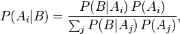
This is Bayes's Theorem.  I own at least two distinct items of
clothing printed with this theorem, so it must be important.

I am going to assume you are familiar with elementary probability
theory; should the above theorem fail to be transparently
meaningful, you should stop here and read an
[introduction to Bayes](http://www.google.com/search?q=bayes+introduction). 
(I've [written one](http://yudkowsky.net/bayes/bayes.html), but
it's aimed at not-physicists.)

To review quickly, B here refers to an item of evidence, A~i~ is
some hypothesis under consideration, and the A~j~ are competing,
mutually exclusive hypotheses.  P(B|A~i~) means "the probability of
seeing B, if hypothesis A~i~ is true" and P(A~i~|B) means "the
probability hypothesis A~i~ is true, if we see B".

The mathematical phenomenon that I will call "falsifiability" is
the scientifically desirable property of a hypothesis that it
should concentrate its probability mass into preferred outcomes,
which implies that it must also assign low probability to some
un-preferred outcomes; probabilities must sum to 1 and there is
only so much probability to go around.  Ideally there should be
possible observations which would drive down the hypothesis's
probability to nearly zero:  There should be things the hypothesis
*cannot* explain, conceivable experimental results with which the
theory is *not* compatible.  A theory that can explain everything,
prohibits nothing, and so gives us no advice about what to expect.

In
terms of Bayes's Theorem, if there is at least some observation B
that the hypothesis A~i~can't explain", i.e., P(B|A~i~) is tiny,
then the numerator P(B|A~i~)P(A~i~) will also be tiny, and likewise
the posterior probability P(A~i~|B).  Updating on having seen the
impossible result B has driven the probability of A~i~ down to
nearly zero.  A theory which refuses to make itself vulnerable in
this way, will need to spread its probability widely, so that it
has no holes; it will not be able to strongly concentrate
probability into a few preferred outcomes; it will not be able to
offer precise advice.

Thus is the rule of science derived in probability theory.

As depicted here, "falsifiability" is something you evaluate by
looking at a *single* hypothesis, asking, "How narrowly does it
concentrate its probability distribution over possible outcomes? 
How narrowly does it tell me what to expect?  Can it explain some
possible outcomes much better than others?"

Is the decoherence interpretation of quantum mechanics
*falsifiable?*  Are there experimental results that could drive its
probability down to an infinitesimal?

Sure:  We could measure entangled particles that should always have
opposite spin, and find that if we measure them far enough apart,
they sometimes have the same spin.

Or we could find apples falling upward, the planets of the Solar
System zigging around at random, and an atom that kept emitting
photons without any apparent energy source.  Those observations
would also falsify decoherent quantum mechanics.  They're things
that, on the hypothesis that decoherent QM governs the universe, we
should definitely *not expect* to see.

So there do exist observations B whose P(B|A~deco~~ ~) is
infinitesimal, which would drive P(A~deco~|B) down to an
infinitesimal.

> "But that's just because decoherent quantum mechanics is still
> quantum mechanics!  What about the decoherence part, per se, versus
> the collapse postulate?"

We're getting there.  The point is that I just defined a test that
leads you to think about one hypothesis at a time (and called it
"falsifiability").  If you want to distinguish decoherence *versus*
collapse, you have to think about at least *two* hypotheses at a
time.

Now really the "falsifiability" test is not quite *that* singly
focused, i.e., the sum in the denominator has got to contain *some*
other hypothesis.  But what I just defined as "falsifiability"
pinpoints the kind of problem that Karl Popper was complaining
about, when he said that Freudian psychoanalysis was
"unfalsifiable" because it was equally good at coming up with an
explanation for every possible thing the patient could do.

If you belonged to an alien species that had never invented the
collapse postulate or Copenhagen Interpretation - if the only
physical theory you'd *ever* heard of was decoherent QM - if *all*
you had in your head was the differential equation for the
wavefunction's evolution plus the Born probability rule - you would
still have sharp expectations of the universe.  You would not live
in a magical world where anything was probable.

> "But you could say exactly the same thing about quantum mechanics
> *without* (macroscopic) decoherence."

Well, yes!  Someone walking around with the differential equation
for the wavefunction's evolution, plus a collapse postulate that
obeys the Born probabilities and is triggered before superposition
reaches macroscopic levels, still lives in a universe where apples
fall down rather than up.

> "But where does decoherence make a *new*prediction, one that lets
> us *test*it?"

A "new" prediction relative to what?  To the state of knowledge
possessed by the ancient Greeks?  If you went back in time and
showed them decoherent QM, they would be enabled to make many
experimental predictions they could not have made before.

When you say "new prediction", you mean "new" relative to some
other hypothesis that defines the "old prediction".  This gets us
into the theory of what I've chosen to label *testability*; and the
algorithm inherently considers at least two hypotheses at a time. 
You cannot call something a "*new* prediction" by considering only
one hypothesis in isolation.

In Bayesian terms, you are looking for an item of evidence B that
will produce evidence for one hypothesis over another,
distinguishing between them, and the process of producing this
evidence we could call a "test".  You are looking for an
experimental result B such that:

> p(B|A~d~) != p(B|A~c~)

that is, some outcome B which has a different probability,
conditional on the decoherence hypothesis being true, versus its
probability if the collapse hypothesis is true.  Which in turn
implies that the posterior odds for decoherence and collapse, will
become different from the prior odds:

[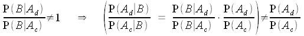](img/bayesodds_2.png)

This equation is symmetrical (assuming no probability is
[literally equal to 0](http://www.overcomingbias.com/2008/01/0-and-1-are-not.html)). 
There isn't one A~j~ labeled "old hypothesis" and another A~j~
labeled "new hypothesis".

This symmetry is a feature, not a bug, of probability theory!  If
you are designing an artificial reasoning system that arrives at
different beliefs depending on the order in which the evidence is
presented, this is labeled "hysteresis" and considered a Bad
Thing.  I hear that it is also frowned upon in Science.

From a probability-theoretic standpoint we have various trivial
theorems that say it shouldn't matter whether you update on X first
and then Y, or update on Y first and then X.  At least they'd be
trivial if human beings didn't violate them so often and so
lightly.

If decoherence is "untestable" relative to collapse, then so too,
collapse is "untestable" relative to decoherence.  What if the
history of physics had transpired differently - what if Hugh
Everett and John Wheeler had stood in the place of Bohr and
Heisenberg, and vice versa?  Would it then be right and proper for
the people of that world to look at the collapse interpretation,
and snort, and say, "Where are the *new* predictions?"

What if someday we meet an alien species which invented decoherence
before collapse?  Are we each bound to keep the theory we invented
first?  Will Reason have nothing to say about the issue, leaving no
recourse to settle the argument but interstellar war?

> "But if we revoke the requirement to yield new predictions, we are
> left with scientific chaos.  You can add arbitrary untestable
> complications to old theories, and get experimentally equivalent
> predictions.  If we reject what you call 'hysteresis', how can we
> defend our current theories against every crackpot who proposes
> that electrons have a new property called 'scent', just like quarks
> have 'flavor'?"

Let it first be said that I quite agree that you should reject the
one who comes to you and says:  "Hey, I've got this brilliant new
idea!  Maybe it's not the electromagnetic field that's tugging on
charged particles.  Maybe there are tiny little angels who actually
push on the particles, and the electromagnetic field just tells
them how to do it.  Look, I have all these successful experimental
predictions - the predictions you used to call your own!"

So yes, I agree that we shouldn't buy this amazing new theory, but
it is not the *newness* that is the problem.

Suppose that human history had developed only slightly differently,
with the Church being a primary grant agency for Science.  And
suppose that when the laws of electromagnetism were first being
worked out, the phenomenon of magnetism had been taken as proof of
the existence of unseen spirits, of angels.  James Clerk becomes
Saint Maxwell, who described the laws that direct the actions of
angels.

A couple of centuries later, after the Church's power to burn
people at the stake has been restrained, someone comes along and
says:  "Hey, do we really need the angels?"

"Yes," everyone says.  "How else would the mere numbers of the
electromagnetic field, translate into the actual motions of
particles?"

"It might be a fundamental law," says the newcomer, "or it might be
something other than angels, which we will discover later.  What I
am suggesting is that interpreting the numbers
*as the action of angels* doesn't really add anything, and we
should just keep the numbers and throw out the angel part."

And they look one at another, and finally say, "But your theory
doesn't make any new experimental predictions, so why should we
adopt it?  How do we test your assertions about the absence of
angels?"

From a normative perspective, it seems to me that if we should
reject the crackpot angels in the first scenario,
*even without being able to distinguish the two theories experimentally,*
then we should also reject the angels of established science in the
second scenario, even without being able to distinguish the two
theories experimentally.

It is ordinarily the crackpot who adds on new useless
complications, rather than scientists who accidentally build them
in at the start.  But the problem is not that the complications are
new, but that they are useless whether or not they are new.

A Bayesian would say that the extra complications of the angels in
the theory, lead to penalties on the prior probability of the
theory.  If two theories make equivalent predictions, we keep the
one that can be described with the shortest message, the smallest
program.  If you are evaluating the prior probability of each
hypothesis by counting bits of code, and then applying Bayesian
updating rules on all the evidence available, then it makes no
difference which hypothesis you hear about first, or the order in
which you apply the evidence.

It is usually not possible to apply formal probability theory in
real life, any more than you can predict the winner of a tennis
match using quantum field theory.  But if probability theory can
serve as a guide to practice, this is what it says:  Reject
*useless*complications *in general*, not just when they are
*new*.* *

> "Yes, and *useless* is precisely what the many worlds of
> decoherence are!  There are supposedly all these worlds alongside
> our own, and they don't *do* anything to our world, but I'm
> supposed to believe in them anyway?"

No, according to decoherence, what you're supposed to believe are
the general laws that govern wavefunctions - and these general laws
are very visible and testable.

I have argued elsewhere that
[the imprimatur of science should be associated with general laws, rather than particular events](http://www.overcomingbias.com/2007/08/scientific-evid.html),
because it is the general laws that, in principle, anyone can go
out and test for themselves.  I assure you that I happen to be
wearing white socks right now as I type this.  So you are probably
*rationally* justified in believing that this is a historical
fact.  But it is not the specially strong kind of statement that we
canonize as a provisional belief of science, because there is no
experiment that you can do for yourself to determine the truth of
it; you are stuck with my authority.  Now, if I were to tell you
the mass of an electron in general, you could go out and find your
own electron to test, and thereby see for yourself the truth of the
general law in that particular case.

The ability of anyone to go out and verify a general scientific law
for themselves, by constructing some particular case, is what makes
our belief in the general law specially reliable.

What decoherentists say they believe in, is the differential
equation that is observed to govern the evolution of wavefunctions
- which you can go out and test yourself any time you like; just
look at a hydrogen atom.

Belief in the existence of separated portions of the universal
wavefunction is not *additional,* and it is not *supposed*to be
explaining the price of gold in London; it is just a deductive
consequence of the wavefunction's evolution.  If the evidence of
many particular cases gives you cause to believe that X-\>Y is a
general law, and the evidence of some particular case gives you
cause to believe X, then you should have P(Y) ≥ P(X∧(X-\>Y)).

Or to look at it another way, if P(Y|X) ≈ 1, then P(X∧Y) ≈ P(X).

Which is to say, believing extra details doesn't cost you extra
probability when they are *logical implications* of general beliefs
you already have.  Presumably the general beliefs themselves are
falsifiable, though, or why bother?

This is why we don't believe that
[spaceships blink out of existence when they cross the cosmological horizon](http://www.overcomingbias.com/2008/04/implied-invisib.html)
relative to us.  True, the spaceship's continued existence doesn't
have an impact on our world.  The spaceship's continued existence
isn't helping to explain the price of gold in London.  But we get
the invisible spaceship for free as a consequence of general laws
that imply conservation of mass and energy.  If the spaceship's
continued existence were *not* a deductive consequence of the laws
of physics as we presently model them, *then* it would be an
additional detail, cost extra probability, and we would have to
question why our theory must include this assertion.

The part of decoherence that is supposed to be testable is not the
many worlds per se, but just the general law that governs the
wavefunction.  The decoherentists note that, applied universally,
this law implies the existence of entire superposed worlds.  Now
there are critiques that can be leveled at this theory, most
notably "But then where do the Born probabilities come from?".  But
within the internal logic of decoherence, the many worlds are not
offered as an explanation for anything, nor are they the substance
of the theory that is meant to be tested; they are simply a logical
consequence of those general laws that constitute the substance of
the theory.

If A-\>B then \~B-\>\~A.  To deny the existence of superposed
worlds, is necessarily to deny the universality of the quantum laws
formulated to govern hydrogen atoms and every other examinable
case; it is this denial that seems to the decoherentists like the
extra and untestable detail.  You can't see the other parts of the
wavefunction - why postulate *additionally* that they don't exist?

The events surrounding the decoherence controversy may be unique in
scientific history, marking the first time that serious scientists
have come forward and said that by historical accident humanity has
developed a powerful, successful, mathematical physical theory that
includes angels.  That there is an entire law, the collapse
postulate, which can simply be thrown away, leaving the theory
*strictly*simpler.

To this discussion I wish to contribute the assertion that, in the
light of a mathematically solid understanding of probability
theory, decoherence is not ruled out by Occam's Razor, nor is it
unfalsifiable, nor is it untestable.

We may consider e.g. decoherence and the collapse postulate, side
by side, and evaluate critiques such as "Doesn't decoherence
definitely predict that quantum probabilities should always be
50/50?" and "Doesn't collapse violate Special Relativity by
implying influence at a distance?"  We can consider the relative
merits of these theories on grounds of their compatibility with
experience and the apparent character of physical law.

To assert that decoherence is not even in the game - because the
many worlds themselves are "extra entities" that violate Occam's
Razor, or because the many worlds themselves are "untestable", or
because decoherence makes no "new predictions" - all this is, I
would argue, an outright error of probability theory.  The
discussion should simply discard those particular arguments and
move on.

# Quantum Non-Realism

> "Does the moon exist when no one is looking at it?"  
>         -- Albert Einstein, asked of Niels Bohr

Suppose you were just starting to work out a theory of quantum
mechanics.

You begin to encounter experiments that deliver different results
depending on how closely you observe them.  You dig underneath the
reality you know, and find an extremely precise mathematical
description that only gives you the relative frequency of outcomes;
worse, it's made of complex numbers.  Things behave like particles
on Monday and waves on Tuesday.

The correct answer is not available to you as a hypothesis, because
it will not be invented for another thirty years.

In a mess like that, what's the best you *could* do?

The best you can do is the *strict* "shut up and calculate"
interpretation of quantum mechanics.  You'll go on *trying* to
develop new theories, because doing your best doesn't mean giving
up.  But we've specified that the correct answer won't be available
for thirty years, and that means none of the new theories will
really be any good.  Doing the *best* you could theoretically do,
would mean that you recognized that, even as you looked for ways to
test the hypotheses.

The best you could theoretically do would *not* include saying
anything like, "The wavefunction only gives us probabilities, not
certainties."  That, in retrospect, was jumping to a conclusion;
the wavefunction gives us a certainty of many worlds existing.  So
that part about the wavefunction being only a probability, was
not-quite-right.  You calculated, but failed to shut up.

If you do the *best* that you can do without the correct answer
being available, then, when you hear about decoherence, it will
turn out that you have not said *anything* incompatible with
decoherence.  Decoherence is not ruled out by the data and the
calculations.  So if you refuse to affirm, as positive knowledge,
any proposition which was not forced by the data and the
calculations, the calculations will not *force* you to say anything
incompatible with decoherence.  So too with whatever the correct
theory may be, if it is not decoherence.  If you go astray, it must
be from your own impulses.

But it is hard for human beings to shut up and calculate - *really*
shut up and calculate. There is an overwhelming tendency to treat
our ignorance as if it were positive knowledge.

I don't know if any conversations like this ever really took place,
but this is how ignorance becomes knowledge:

> Gallant:  "Shut up and calculate."  
> Goofus:  "Why?"  
> Gallant:  "Because I don't know what these equations mean, just
> that they seem to work."
> 
> *- five minutes later -*
> 
> Goofus:  "Shut up and calculate."  
> Student:  "Why?"  
> Goofus:  "Because these equations don't *mean*anything, they just
> work."  
> Student:  "Really?  How do you know?"  
> Goofus:  "Gallant told me."

A similar transformation occurs in the leap from:

> Gallant:  "When my calculations show an amplitude of -1/3*i* for
> this photon to get absorbed, my experiments showed that the photon
> was absorbed  around 107 times out of 1000, which is a good fit to
> 1/9, the square of the modulus.  There's clearly some kind of
> connection between the experimental statistics and the squared
> modulus of the amplitude, but I don't know what."
> 
> Goofus:  "The probability amplitude doesn't say where the electron
> *is*, but where it *might be.*  The squared modulus is the
> probability that reality will turn out that way.  Reality *itself*
> is inherently nondeterministic."

And again:

> Gallant:  "Once I measure something and get an experimental result,
> I do my future calculations using only the amplitude whose squared
> modulus went into calculating the frequency of that experimental
> result.  Only this rule makes my further calculations correspond to
> observed frequencies."
> 
> Goofus:  "Since the amplitude *is* the probability, once you *know*
> the experimental result, the probability of everything else becomes
> zero!"

The whole slip from:

> *The square of this "amplitude" stuff corresponds tightly to our experimentally observed frequencies*

to

> *The amplitude is the probability of getting the measurement*

to

> *Well, obviously, once you know you*didn't*get a measurement, its probability becomes zero*

has got to be one of the most embarrassing wrong turns in the
history of science.

If you take all this *literally*, it becomes the
consciousness-causes-collapse interpretation of quantum mechanics. 
These days, just about nobody will confess to *actually*believing
in the consciousness-causes-collapse interpretation of quantum
mechanics -

But the physics textbooks are still written this way!  People say
they don't believe it, but they *talk as if* knowledge is
responsible for removing incompatible "probability" amplitudes.

Yet as implausible as I find consciousness-causes-collapse, it at
least gives us a picture of reality.  Sure, it's an informal
picture.  Sure, it gives mental properties ontologically basic
status.  You can't *calculate* when an "experimental observation"
occurs or what people "know", you *just know* when certain
probabilities are *obviously* zero.  And this "just knowing" just
happens to fit your experimental results, whatever they are -

- but at least consciousness-causes-collapse purports to tell us
how the universe works.  The amplitudes are real, the collapse is
real, the consciousness is real.

Contrast to this argument schema:

> Student:  "Wait, you're saying that this amplitude disappears as
> soon as the measurement tells me it's not true?"
> 
> Goofus:  "No, no!  It doesn't *literally* disappear.  The equations
> don't *mean* anything - they just give good predictions."
> 
> Student:  "But then what *does* happen?"
> 
> Goofus:  *(Whorble. Hiss.)*  "Never ask that question."
> 
> Student:  "And what about the part where we measure this photon's
> polarization over here, and a light-year away, the entangled
> photon's probability of being polarized up-down changes from 50% to
> 25%?"
> 
> Goofus:  "Yes, what about it?"
> 
> Student:  "Doesn't that violate Special Relativity?"
> 
> Goofus:  "No, because you're just *finding out* the other photon's
> polarization.  Remember, the amplitudes aren't *real.*"
> 
> Student:  "But Bell's Theorem shows there's no possible local
> hidden variable that could describe the other photon's polarization
> before we measure it -"
> 
> Goofus:  "Exactly!  It's meaningless to talk about the photon's
> polarization before we measure it."
> 
> Student:  "But the probability suddenly changes -"
> 
> Goofus: 
> "*It's meaningless to talk about it before we measure it!*"

What does Goofus even *mean*, here?  Never mind the plausibility of
his words; what sort of state of reality would correspond to his
words being true?

What way could reality *be,* that would make it meaningless to talk
about Special Relativity being violated, because the property being
influenced didn't exist, even though you could calculate the
changes to it?

But you know what?  Forget that.  I want to know the answer to an
even more important question:

Where is Goofus *getting* all this stuff?

Let's suppose that you take the Schrödinger equation, and assert,
as a positive fact:

> "This equation generates good predictions, but it doesn't mean
> anything!"

Really?  *How do you know?*

I sometimes go around saying that the fundamental question of
rationality is *Why do you believe what you believe?*

You say the Schrödinger equation "doesn't mean anything".  How did
this item of definite knowledge end up in your possession, if it is
not simply ignorance misinterpreted as knowledge?

Was there some experiment that told you?  I am open to the idea
that experiments can tell us things that seem philosophically
impossible.  But in this case I should like to see the decisive
data.  Was there a point where you carefully set up an experimental
apparatus, and worked out what you should expect to see if (1) the
Schrödinger equation was meaningful or (2) the Schrödinger equation
was meaningless; and then you got result (2)?

> Gallant:  "If I measure the 90° polarization of a photon, and then
> measure the 45° polarization, and then measure 90° again, my
> experimental history shows that in 100 trials a photon was absorbed
> 47 times and transmitted 53 times."
> 
> Goofus:  "The 90° polarization and 45° polarization are
> incompatible properties; they can't both *exist* at the same time,
> and if you measure one, it is meaningless to *talk* about the
> other."

How do you know?

How did you acquire that piece of knowledge, Goofus?  I know where
Gallant got *his*  - but where did *yours* come from?

My attitude toward questions of existence and meaning was nicely
illustrated in a discussion of the current state of evidence for
[whether the universe is spatially finite or spatially infinite](http://www.overcomingbias.com/2007/06/1_2_3_infinity.html),
in which James D. Miller
[chided Robin Hanson](http://www.overcomingbias.com/2007/06/1_2_3_infinity.html#comment-72680096):

> "Robin, you are suffering from overconfidence bias in assuming that
> the universe exists. Surely there is some chance that the universe
> is of size zero."

To which I
[replied](http://www.overcomingbias.com/2007/06/1_2_3_infinity.html#comment-72695588):

> "James, if the universe doesn't exist, it would still be nice to
> know whether it's an infinite or a finite universe that doesn't
> exist."

Ha!  You think pulling that old "universe doesn't exist" trick will
stop me?  It won't even slow me down!

It's not that I'm *ruling out* the possibility that the universe
doesn't exist.  It's just that, *even* *if* nothing exists, I still
want to understand the nothing as best I can.  My
[curiosity](http://yudkowsky.net/virtues/) doesn't suddenly go away
just because there's no reality, you know!

The nature of "reality" is something about which I'm still
confused, which leaves open the possibility that there isn't any
such thing.  But Egan's Law still applies:  "It all adds up to
normality."  Apples didn't stop falling when Einstein disproved
Newton's theory of gravity.

Sure, when the dust settles, it could turn out that apples don't
exist, Earth doesn't exist, reality doesn't exist.  But the
nonexistent apples will still fall toward the nonexistent ground at
a meaningless rate of 9.8 m/s^2^.

You say the universe doesn't exist?  Fine, suppose I believe that -
though it's not clear *what* I'm supposed to believe, aside from
[repeating the words](http://www.overcomingbias.com/2007/08/guessing-the-te.html).

Now, what happens if I press *this* button?

In [The Simple Truth](http://yudkowsky.net/bayes/truth.html), I
said:

> "Frankly, I'm not entirely sure myself where this 'reality'
> business comes from. I can't create my own reality in the lab, so I
> must not understand it yet. But occasionally I believe strongly
> that something is going to happen, and then something else happens
> instead... So I need different names for the thingies that
> determine my predictions and the thingy that determines my
> experimental results. I call the former thingies 'belief', and the
> latter thingy 'reality'."

You want to say that the quantum-mechanical equations are "not
real"?  I'll be charitable, and suppose this means something.  What
might it mean?

Maybe it means the equations which determine my predictions are
substantially different from the thingy that determines my
experimental results.  Then what *does*determine my experimental
results?  If you tell me "nothing", I would like to know what sort
of "nothing" it is, and why this "nothing" exhibits such apparent
regularity in determining e.g. my experimental measurements of the
mass of an electron.

I don't take well to people who tell me to
[stop asking questions](http://www.overcomingbias.com/2007/09/explainworshipi.html). 
If you tell me something is definitely positively meaningless, I
want to know exactly what you mean by that, and how you came to
know.  Otherwise you have not given me an answer, only told me to
stop asking the question.

"The Simple Truth" describes the life of a shepherd and apprentice
who have discovered how to count sheep by tossing pebbles into
buckets, when they are visited by a delegate from the court who
wants to know how the "magic pebbles" work.  The shepherd tries to
explain, "An empty bucket is magical if and only if the pastures
are empty of sheep", but is soon overtaken about the excited
discussions of the apprentice and the delegate as to how the magic
might get into the pebbles.

Here we have quantum equations that deliver excellent experimental
predictions.  What *exactly* does it mean for them to be
"meaningless"?  Is it like a bucket of pebbles that
*works for counting sheep*, but *doesn't have any magic*?* *

Back before
[Bell's Theorem](http://www.overcomingbias.com/2008/05/bells-theorem-n.html)
ruled out local hidden variables, it seemed possible that (as
Einstein thought) there was some more complete description of
reality which we didn't have, and the quantum theory summarized
incomplete knowledge of this more complete description.  The laws
we'd learned would turn out to be like the laws of statistical
mechanics: quantitative statements of uncertainty.  This would
hardly make the equations "meaningless"; partial knowledge *is*the
meaning of
[probability](http://www.overcomingbias.com/2008/03/mind-probabilit.html).

But Bell's Theorem makes it much less plausible that the quantum
equations are partial knowledge of something deterministic, the way
that statistical mechanics over classical physics is partial
knowledge of something deterministic.  And even so, the quantum
equations would not be "meaningless" as that phrase is usually
taken; they would be "statistical", "approximate", "partial
information", or at worst "wrong".

Here we have equations that give us excellent predictions.  You say
they are "meaningless".  I ask what it is that determines my
experimental results, then.  You cannot answer.  Fine, then how do
you justify ruling out the possibility that the quantum equations
give such excellent predictions because they are, oh, say,
*meaningful?*

I don't mean to trivialize questions of reality or meaning.  But to
call something "meaningless" and say that the argument is now
resolved, finished, over, done with, you must have a theory of
exactly how it is meaningless.  And when the *answer* is given, the
question should seem
[no longer mysterious](http://www.overcomingbias.com/2007/08/mysterious-answ.html).

As you may recall from
[Semantic Stopsigns](http://www.overcomingbias.com/2007/08/semantic-stopsi.html),
there are words and phrases which are not so much *answers* to
questions, as cognitive traffic signals which indicate you should
*stop asking* questions.  "Why does anything exist in the first
place?  God!" is the classical example, but there are others, such
as "Elan vital!"

Tell people to "shut up and calculate" because you don't know what
the calculations mean, and inside of five years, "Shut up!" will be
masquerading as a positive theory of quantum mechanics.

I have the *highest* respect for any historical physicists who even
came *close* to *actually* shutting up and calculating, who were
genuinely conservative in assessing what they did and didn't know. 
This is the best they could possibly do without actually being Hugh
Everett, and I award them fifty rationality points.  My scorn is
reserved for those who interpreted "We don't know why it works" as
the positive knowledge that the equations were definitely not
real.

I mean, if that trick worked, it would be too good to confine to
one subfield.  Why shouldn't physicists use the "not real" loophole
*outside*of quantum mechanics?

> "Hey, doesn't your new 'yarn theory' violate Special Relativity?"
> 
> "Nah, the equations are meaningless.  Say, doesn't your model of
> 'chaotic evil inflation' violate CPT symmetry?"
> 
> "My equations are *even more meaningless* than your equations!  So
> your criticism *double*doesn't count."

And if that doesn't work, try writing yourself a "Get Out Of Jail
Free" card.

If there is a moral to the whole story, it is the moral of how very
hard it is to stay in a state of *confessed* confusion, without
making up a story that gives you closure - how hard it is to avoid
manipulating your ignorance as if it were definite knowledge that
you possessed.

PS:  I now declare open season for any quantum non-realists out
there, if they have something they'd like to say.

# Collapse Postulates 

Back when people didn't know about
[macroscopic decoherence](http://lesswrong.com/lw/pu/on_being_decoherent/) aka
many-worlds - before it occurred to anyone that the laws deduced
with such precision for microscopic physics, might apply
universally at all levels - what did people *think*was going on?

The initial reasoning seems to have gone something like:

> "When my calculations showed an amplitude of -1/3*i* for this
> photon to get absorbed, my experimental statistics showed that the
> photon was absorbed around 107 times out of 1000, which is a good
> fit to 1/9, the square of the modulus."

to

> "The amplitude *is* the probability (by way of the squared
> modulus)."

to

> "Once you measure something and *know it didn't happen*, its
> *probability* goes to zero."

Read literally, this implies that knowledge itself - or even
conscious awareness - causes the collapse.  Which was in fact the
form of the theory put forth by Werner Heisenberg!

But people became increasingly nervous about the notion of
importing dualistic language into fundamental physics - as well
they should have been!  And so the original reasoning was replaced
by the notion of an objective "collapse" that destroyed all parts
of the wavefunction except one, and was triggered sometime before
superposition grew to human-sized levels.

Now, once you're supposing that parts of the wavefunction can just
vanish, you might think to ask:

> "Is there only *one*survivor?  Maybe there are many surviving
> worlds, but they survive with a frequency determined by their
> integrated squared modulus, and so the typical surviving world has
> experimental statistics that match the Born rule."

Yet collapse theories considered in modern academia, only postulate
*one* surviving world.  Why?

Collapse theories were devised in a time when it
*simply didn't occur* to any physicists that more than one world
*could* exist!  People took for granted that measurements had
single outcomes - it was an assumption so deep it was invisible,
because it was what they *saw happening.*  Collapse theories were
devised to explain *why measurements had single outcomes*, rather
than (in full generality)
*why experimental statistics matched the Born rule.*

For similar reasons, the "collapse postulates" considered
academically, suppose that collapse occurs *before* any human
beings get superposed.  But experiments are steadily ruling out the
possibility of "collapse" in increasingly large entangled systems. 
Apparently an experiment is
[underway](http://www.overcomingbias.com/2008/05/mwi-is-falsifia.html#comment-113632200)
to demonstrate quantum superposition at 50-micrometer scales, which
is bigger than most neurons and getting up toward the diameter of
some human hairs!

So why doesn't someone try jumping ahead of the game, and ask:

> "Say, we keep having to postulate the collapse occurs steadily
> later and later.  What if collapse occurs only once superposition
> reaches planetary scales and substantial divergence occurs - say,
> Earth's wavefunction collapses around once a minute?  Then, while
> the surviving Earths at any given time would *remember*a long
> history of quantum experiments that matched the Born statistics, a
> supermajority of those Earths would begin obtaining non-Born
> results from quantum experiments and then abruptly cease to exist a
> minute later."

Why don't collapse theories like *that* one have a huge academic
following, among the many people who apparently think it's okay for
parts of the wavefunction to just vanish?  Especially given that
experiments are proving superposition in steadily larger systems?

A cynic might suggest that the reason for collapse's continued
support, isn't the *physical plausibility* of having large parts of
the wavefunction suddenly vanish, or the hope of somehow explaining
the Born statistics.  The point is to keep the intuitive appeal of
"I don't remember the measurement having more than one result,
therefore only one thing happened; I don't remember splitting, so
there must be only one of me."  You don't remember dying, so
superposed humans must never collapse.  A theory that dared to
stomp on intuition would be missing the whole point.  You might as
well just move on to decoherence.

So a cynic might suggest.

But surely it is too early to be attacking the motives of collapse
supporters.  That is mere argument ad hominem.  What about the
actual physical plausibility of collapse theories?

Well, first:  Does any collapse theory have any experimental
support?  No.

With that out of the way...

If collapse actually worked the way its adherents say it does, it
would be:

1.  The only
    non-[linear](http://lesswrong.com/lw/pq/the_socalled_heisenberg_uncertainty_principle/)
    evolution in all of quantum mechanics.
2.  The only non-[unitary](http://lesswrong.com/lw/py/the_born_probabilities/)
    evolution in all of quantum mechanics.
3.  The only non-[differentiable](http://lesswrong.com/lw/pw/decoherence_is_pointless/)
    (in fact, discontinuous) phenomenon in all of quantum mechanics.
4.  The only phenomenon in all of quantum mechanics that is
    non-[local](http://lesswrong.com/lw/pr/which_basis_is_more_fundamental/) in the
    configuration space.
5.  The only phenomenon in all of physics that violates
    [CPT symmetry](http://lesswrong.com/lw/pp/decoherence/).
6.  The only phenomenon in all of physics that violates
    [Liouville's Theorem](http://lesswrong.com/lw/o5/the_second_law_of_thermodynamics_and_engines_of/)
    (has a many-to-one mapping from initial conditions to outcomes).
7.  The only phenomenon in all of physics that is acausal /
    non-deterministic /
    [inherently random](http://lesswrong.com/lw/oj/probability_is_in_the_mind/).
8.  The only phenomenon in all of physics that is non-local in
    spacetime and
    [propagates an influence faster than light](http://lesswrong.com/lw/q2/spooky_action_at_a_distance_the_nocommunication/).

WHAT DOES THE GOD-DAMNED COLLAPSE POSTULATE HAVE TO *DO* FOR
PHYSICISTS TO REJECT IT?  KILL A GOD-DAMNED PUPPY?

# If Many-Worlds Had Come First

*Not that I'm claiming I could have done better, if I'd been born into*that*time, instead of this one...*

Macroscopic decoherence - the idea that the known quantum laws that
govern microscopic events, might simply govern at all levels
without alteration - also known as "many-worlds" - was first
proposed in a 1957 paper by Hugh Everett III.  The paper was
ignored.  John Wheeler told Everett to see Niels Bohr.  Bohr didn't
take him seriously.

Crushed, Everett left academic physics, invented the general use of
Lagrange multipliers in optimization problems, and became a
multimillionaire.

It wasn't until 1970, when Bryce DeWitt (who coined the term
"many-worlds") wrote an article for *Physics Today*, that the
general field was first informed of Everett's ideas.  Macroscopic
decoherence has been gaining advocates ever since, and may now be
the majority viewpoint (or not).

But suppose that decoherence and macroscopic decoherence had been
realized immediately following the discovery of entanglement, in
the 1920s.  And suppose that no one had proposed collapse theories
until 1957.  Would decoherence now be steadily declining in
popularity, while collapse theories were slowly gaining steam?

Imagine an alternate Earth, where the very first physicist to
discover entanglement and superposition, said, "Holy flaming
monkeys, there's a zillion other Earths out there!"

In the years since, many hypotheses have been proposed to explain
the mysterious
[Born probabilities](http://www.overcomingbias.com/2008/04/the-born-prob-1.html). 
But no one has *yet*suggested a collapse postulate.  That
possibility simply has not occurred to anyone.

One day, Huve Erett walks into the office of Biels Nohr...

"I just don't understand," Huve Erett said, "why no one in physics
even seems *interested* in my hypothesis.  Aren't the Born
statistics the greatest puzzle in modern quantum theory?"

Biels Nohr sighed.  Ordinarily, he wouldn't even bother, but
something about the young man compelled him to try.

"Huve," says Nohr, "every physicist meets dozens of people per year
who think they've explained the Born statistics.  If you go to a
party and tell someone you're a physicist, chances are at least one
in ten they've got a new explanation for the Born statistics.  It's
one of the most famous problems in modern science, and worse, it's
a problem that everyone thinks they can understand.  To get
attention, a new Born hypothesis has to be... pretty darn good."

"And *this,*" Huve says, "*this* isn't *good?*"

Huve gestures to the paper he'd brought to Biels Nohr.  It is a
short paper.  The title reads, "The Solution to the Born Problem". 
The body of the paper reads:

> "When you perform a measurement on a quantum system, all parts of
> the wavefunction except one point, vanish, with the survivor chosen
> non-deterministically in a way determined by the Born statistics."

"Let me make absolutely sure," Nohr says carefully, "that I
understand you.  You're saying that we've got this wavefunction -
evolving according to the Wheeler-DeWitt equation - and, all of a
sudden, the whole wavefunction, except for one part, just
spontaneously goes to zero amplitude.  Everywhere at once.  This
happens when, way up at the macroscopic level, we 'measure'
something."

"Right!" Huve says.

"So the wavefunction knows when we 'measure' it.  What exactly is a
'measurement'?  How does the wavefunction know we're here?  What
happened before humans were around to measure things?"

"Um..."  Huve thinks for a moment.  Then he reaches out for the
paper, scratches out "When you perform a measurement on a quantum
system", and writes in, "When a quantum superposition gets too
large."

Huve looks up brightly.  "Fixed!"

"I see," says Nohr.  "And how large is 'too large'?"

"At the 50-micron level, maybe," Huve says, "I hear they haven't
tested that yet."

Suddenly a student sticks his head into the room.  "Hey, did you
hear?  They just verified superposition at the 50-micron level."

"Oh," says Huve, "um, whichever level, then.  Whatever makes the
experimental results come out right."

Nohr grimaces.  "Look, young man, the truth here isn't going to be
comfortable.  Can you hear me out on this?"

"Yes," Huve says, "I just want to know why physicists won't listen
to me."

"All right," says Nohr.  He sighs.  "Look, if this theory of yours
were actually true - if whole sections of the wavefunction just
instantaneously vanished - it would be... let's see.  The only law
in all of quantum mechanics that is non-linear, non-unitary,
non-differentiable and discontinuous.  It would prevent physics
from evolving locally, with each piece only looking at its
immediate neighbors.  Your 'collapse' would be the only fundamental
phenomenon in all of physics with a preferred basis and a preferred
space of simultaneity.  Collapse would be the only phenomenon in
all of physics that violates CPT symmetry, Liouville's Theorem, and
Special Relativity.  In your original version, collapse would also
have been the only phenomenon in all of physics that was inherently
mental.  Have I left anything out?"

"Collapse is also the only acausal phenomenon," Huve points out. 
"Doesn't that make the theory more wonderful and amazing?"

"I think, Huve," says Nohr, "that physicists may view the
exceptionalism of your theory as a point not in its favor."

"Oh," said Huve, taken aback.  "Well, I think I can fix that
non-differentiability thing by postulating a second-order term in
the -"

"Huve," says Nohr, "I don't think you're getting my point, here. 
The reason physicists aren't paying attention to you, is that your
theory isn't physics.  It's magic."

"But the Born statistics are the greatest puzzle of modern physics,
and this theory provides a mechanism for the Born statistics!" Huve
protests.

"No, Huve, it doesn't," Nohr says wearily.  "That's like saying
that you've 'provided a mechanism' for electromagnetism by saying
that there are little angels pushing the charged particles around
in accordance with Maxwell's Equations.  Instead of saying, 'Here
are Maxwell's Equations, which tells the angels where to push the
electrons', we just say, 'Here are Maxwell's Equations' and are
left with a strictly simpler theory.  Now, we don't know *why* the
Born statistics happen.  But you haven't given the slightest reason
why your 'collapse postulate' should eliminate worlds in accordance
with the Born statistics, rather than something else.  You're not
even making use of the fact that quantum evolution is unitary -"

"That's because it's not," interjects Huve.

"- which everyone pretty much knows has got to be the key to the
Born statistics, somehow.  Instead you're merely saying, 'Here are
the Born statistics, which tell the collapser how to eliminate
worlds', and it's strictly simpler to just say 'Here are the Born
statistics'."

"But -" says Huve.

"*Also,*" says Nohr, raising his voice, "you've given no
justification for why there's only *one* surviving world left by
the collapse, or why the collapse happens before any *humans*get
superposed, which makes your theory *really suspicious* to a modern
physicist.  This is exactly the sort of untestable hypothesis that
the 'One Christ' crowd uses to argue that we should 'teach the
controversy' when we tell high school students about other
Earths."

"I'm not a One-Christer!" protests Huve.

"Fine," Nohr says, "then *why*do you just assume there's only one
world left?  And that's not the only problem with your theory. 
Which part of the wavefunction gets eliminated, exactly?  And in
which basis?  It's clear that the whole wavefunction isn't being
compressed down to a delta, or ordinary quantum computers couldn't
stay in superposition when any collapse occurred anywhere - heck,
ordinary molecular chemistry might start failing -"

Huve quickly crosses out 'one point' on his paper, writes in 'one
part', and then says, "Collapse doesn't compress the wavefunction
down to one point.  It eliminates all the amplitude *except* one
world, but leaves *all* the amplitude *in* that world."

"Why?" says Nohr.  "In principle, once you postulate 'collapse',
then 'collapse' could eliminate any part of the wavefunction,
anywhere - why just one neat world left?  Does the collapser
*know we're in here?*"

Huve says, "It leaves one whole world because that's what fits our
experiments."

"Huve," Nohr says patiently, "the term for that is 'post hoc'. 
Furthermore, decoherence is a continuous process.  If you partition
by whole brains with distinct neurons firing, the partitions have
almost zero mutual interference within the wavefunction.  But
plenty of other processes overlap a great deal.  There's no
possible way you can point to 'one world' and eliminate everything
else without making completely arbitrary choices, including an
arbitrary choice of basis -"

"But -" Huve says.

"And *above all,*" Nohr says, "the *reason* you can't tell me which
part of the wavefunction vanishes, or exactly when it happens, or
exactly what triggers it, is that if we did adopt this theory of
yours, it would be
*the only informally specified, qualitative fundamental law* taught
in all of physics.  Soon no two physicists anywhere would agree on
the exact details!  Why?  Because it would be the
*only fundamental law in all of modern physics that was believed without experimental evidence to nail down exactly how it worked.*"

"What, really?" says Huve.  "I thought a lot of physics was more
informal than that.  I mean, weren't you just talking about how
it's impossible to point to 'one world'?"

"That's because worlds aren't *fundamental,* Huve!  We have massive
experimental evidence underpinning the fundamental law, the
Wheeler-DeWitt equation, that we use to describe the evolution of
the wavefunction.  We just apply exactly the same equation to get
our description of macroscopic decoherence.  But for difficulties
of calculation, the equation would, in principle, tell us *exactly*
when macroscopic decoherence occurred.  We don't know where the
Born statistics come from, but we have massive evidence for what
the Born statistics *are*.  But when I ask you when, or where,
collapse occurs, you don't know -
*because there's no experimental evidence whatsoever to pin it down.* 
Huve, even if this 'collapse postulate' worked the way you say it
does,
*there's no possible way you could [know](http://www.overcomingbias.com/2008/02/perpetual-motio.html) it!* 
Why not a gazillion other equally magical possibilities?"

Huve raises his hands defensively.  "I'm not saying my theory
should be taught in the universities as accepted truth!  I just
want it experimentally tested! Is that so wrong?"

"You haven't specified when collapse happens, so I can't construct
a test that falsifies your theory," says Nohr.  "Now with that
said, we're already looking experimentally for any part of the
quantum laws that change at increasingly macroscopic levels.  Both
on general principles, in case there's something in the 20th
decimal point that only shows up in macroscopic systems, and also
in the hopes we'll discover something that sheds light on the Born
statistics.  We check decoherence times as a matter of course.  But
we keep a *broad* outlook on what might be different.  Nobody's
going to privilege your non-linear, non-unitary,
non-differentiable, non-local, non-CPT-symmetric, non-relativistic,
a-frikkin-causal, faster-than-light, *in-bloody-formal* 'collapse'
when it comes to looking for clues.  Not until they see absolutely
unmistakable evidence and believe me, Huve, it's going to take a
hell of a lot of evidence to unmistake *this*.  Even if we did find
anomalous decoherence times, and I don't think we will, it wouldn't
force your 'collapse' as the explanation."

"What?" says Huve.  "Why not?"

"Because there's got to be a billion more explanations that are
more plausible than violating Special Relativity," says Nohr.  "Do
you realize that if this really happened, there would only be a
*single* outcome when you measured a photon's polarization? 
Measuring one photon in an entangled pair would influence the other
photon a light-year away.  Einstein would have a heart attack."

"It doesn't *really* violate Special Relativity," says Huve.  "The
collapse occurs in exactly the right way to prevent you from ever
actually *detecting* the faster-than-light influence."

"That's not a point in your theory's favor," says Nohr.  "Also
Einstein would still have a heart attack."

"Oh," says Huve.  "Well, we'll say that the relevant aspects of the
particle *don't exist* until the collapse occurs.  If something
doesn't exist, influencing it doesn't violate Special Relativity
-"

"You're just digging yourself deeper.  Look, Huve, as a general
principle, theories that are actually *correct* don't generate this
level of confusion.  But above all, there isn't any evidence for
it.  You have no logical way of knowing that collapse occurs, and
no reason to believe it.  You made a mistake. 
[Just say 'oops'](http://www.overcomingbias.com/2007/08/the-importance-.html)
and
[get on with your life](http://www.overcomingbias.com/2007/09/the-crackpot-of.html)."

"But they *could* find the evidence someday," says Huve.

"I can't think of what evidence could determine *this particular*
one-world hypothesis as an explanation, but in any case, right now
we *haven't* found any such evidence," says Nohr.  "We haven't
found anything even vaguely suggestive of it!  You can't update on
evidence that could theoretically arrive someday but hasn't
arrived!  Right now, today, there's no reason to spend valuable
time thinking about this rather than a billion other equally
magical theories.  There's absolutely nothing that justifies your
belief in 'collapse theory' any *more*than believing that someday
we'll learn to transmit faster-than-light messages by tapping into
the acausal effects of praying to the Flying Spaghetti Monster!"

Huve draws himself up with wounded dignity.  "You know, if my
theory is wrong - and I do admit it might be wrong -"

"*If?"* says Nohr.  "*Might?"*

"If, I say, my theory is wrong," Huve continues, "then somewhere
out there is another world where *I* am the famous physicist and
*you* are the lone outcast!"

Nohr buries his head in his hands.  "Oh, not this again.  Haven't
you heard the saying, 'Live in your own world'?  And *you* of all
people -"

"Somewhere out there is a world where the vast majority of
physicists believe in collapse theory, and no one has even
*suggested* macroscopic decoherence over the last thirty years!"

Nohr raises his head, and begins to laugh.

"What's so funny?" Huve says suspiciously.

Nohr just laughs harder.  "Oh, my!  Oh, my!  You really think,
Huve, that there's a world out there where they've known about
quantum physics for thirty years, and nobody has even *thought*
there might be more than one world?"

"Yes," Huve says, "that's exactly what I think."

"Oh my!  So you're saying, Huve, that physicists detect
superposition in microscopic systems, and work out quantitative
equations that govern superposition in every single instance they
can test.  And for thirty years, not *one person* says, 'Hey, I
wonder if these laws happen to be universal'."

"Why should they?" says Huve.  "Physical models sometimes turn out
to be wrong when you examine new regimes."

"But to not even *think* of it?" Nohr says incredulously.  "You see
apples falling, work out the law of gravity for all the planets in
the solar system except Jupiter, and it doesn't even *occur* to you
to apply it to Jupiter because Jupiter is too large?  That's like,
like some kind of comedy routine where the guy opens a box, and it
contains a spring-loaded pie, so the guy opens another box, and it
contains another spring-loaded pie, and the guy just keeps doing
this without even *thinking* of the possibility that the next box
contains a pie too.  You think John von Neumann, who may have been
the highest-*g* human in history, wouldn't think of it?"

"That's right," Huve says, "He wouldn't.  Ponder that."

"This is the world where my good friend Ernest formulates his
Schrödinger's Cat thought experiment, and in this world, the
thought experiment goes:  'Hey, suppose we have a radioactive
particle that enters a superposition of decaying and not decaying. 
Then the particle interacts with a sensor, and the sensor goes into
a superposition of going off and not going off.  The sensor
interacts with an explosive, that goes into a superposition of
exploding and not exploding; which interacts with the cat, so the
cat goes into a superposition of being alive and dead.  Then a
human looks at the cat,' and at this point Schrödinger stops, and
goes, 'gee, I just can't imagine what could happen next.'  So
Schrödinger shows this to everyone else, and they're also like
'Wow, I got no idea what could happen at this point, what an
amazing paradox'.  Until finally *you* hear about it, and you're
like, 'hey, maybe at *that* point half of the superposition just
vanishes, at random, faster than light', and everyone else is like,
'Wow, what a great idea!'"

"That's right," Huve says again.  "It's got to have happened
somewhere."

"Huve, this is a world where every single physicist, and probably
the whole damn human species, is too dumb to sign up for cryonics! 
We're talking about the Earth where George W. Bush is President."

# Many Worlds, One Best Guess

If you look at many microscopic physical phenomena - a photon, an
electron, a hydrogen atom, a laser - and a million other known
experimental setups - it is possible to come up with simple laws
that seem to govern all small things (so long as you don't ask
about gravity).  These laws govern the evolution of a highly
abstract and mathematical object that I've been calling the
"amplitude distribution", but which is more widely referred to as
the "wavefunction".

Now there are gruesome questions about the proper generalization
that covers all these tiny cases.  Call an object 'grue' if it
appears green before January 1, 2020 and appears blue thereafter. 
If all emeralds examined so far have appeared green, is the proper
generalization, "Emeralds are green" or "Emeralds are grue"?

The answer is that the proper generalization is "Emeralds are
green".  I'm not going to go into the arguments at the moment.  It
is not the subject of this post, and the obvious answer in this
case
[happens to be correct](http://yudkowsky.net/bayes/truth.html). 
[The true Way is not stupid](http://www.overcomingbias.com/2008/01/newcombs-proble.html):
however clever you may be with your logic, it should finally arrive
at the right answer rather than a wrong one.

In a similar sense, the *simplest* generalizations that would cover
observed *microscopic* phenomena alone, take the form of "All
electrons have spin 1/2" and not "All electrons have spin 1/2
before January 1, 2020" or "All electrons have spin 1/2 unless they
are part of an entangled system that weighs more than 1 gram."

When we turn our attention to macroscopic phenomena, our sight is
obscured.  We cannot experiment on the wavefunction of a human in
the way that we can experiment on the wavefunction of a hydrogen
atom.  In no case can you actually read off the wavefunction with a
little quantum scanner.  But in the case of, say, a human, the size
of the entire organism defeats our ability to perform precise
calculations or precise experiments - we cannot confirm that the
quantum equations are being obeyed *in precise detail.*

We know that phenomena commonly thought of as "quantum" do not just
disappear when many microscopic objects are aggregated.  Lasers put
out a flood of coherent photons, rather than, say, doing something
completely different.  Atoms have the chemical characteristics that
quantum theory says they should, enabling them to aggregate into
the stable molecules making up a human.

So in one sense, we have a great deal of evidence that quantum laws
are aggregating to the macroscopic level without too much
difference.  Bulk chemistry still works.

But we cannot directly verify that the particles making up a human,
have an aggregate wavefunction that behaves *exactly*the way the
simplest quantum laws say.  Oh, we know that molecules and atoms
don't disintegrate, we know that macroscopic mirrors still
[reflect from the middle](http://www.overcomingbias.com/2008/04/feynman-paths.html). 
We can get *many* high-level predictions from the assumption that
the microscopic and the macroscopic are governed by the same laws,
and every prediction tested has come true.

But if someone were to claim that the macroscopic quantum picture,
differs from the microscopic one, in some as-yet-untestable detail
- something that only shows up at the unmeasurable 20th decimal
place of microscopic interactions, but aggregates into something
bigger for macroscopic interactions - well, we can't *prove*
they're wrong.  It is
[Occam's Razor](http://www.overcomingbias.com/2008/05/mwi-is-simple.html)
that says, "There are zillions of new fundamental laws you could
postulate in the 20th decimal place; why are you even *thinking*
about
[this one](http://www.overcomingbias.com/2007/09/einsteins-arrog.html)?"

If we calculate using the simplest laws which govern all known
cases, we find that humans end up in states of quantum
superposition, just like photons in a superposition of
[reflecting from and passing through a half-silvered mirror](http://www.overcomingbias.com/2008/04/configurations.html). 
In the Schrödinger's Cat setup, an unstable atom goes into a
superposition of disintegrating, and not-disintegrating.  A sensor,
tuned to the atom, goes into a superposition of triggering and
not-triggering.  (Actually, the superposition is now a
[joint](http://www.overcomingbias.com/2008/04/joint-configura.html)
state of [atom-disintegrated \* sensor-triggered] + [atom-stable \*
sensor-not-triggered].)  A charge of explosives, hooked up to the
sensor, goes into a superposition of exploding and not exploding; a
cat in the box goes into a superposition of being dead and alive;
and a human, looking inside the box, goes into a superposition of
throwing up and being calm.  The same law at all levels.

Human beings who interact with superposed systems will themselves
evolve into superpositions.  But the brain that sees the exploded
cat, and the brain that sees the living cat, will have many neurons
firing differently, and hence many *many* particles in different
positions.  They are very distant in the configuration space, and
will communicate to an exponentially infinitesimal degree.  Not the
30th decimal place, but the 10^30^th decimal place.  No particular
mind, no particular cognitive causal process, sees a blurry
superposition of cats.

The fact that "you" only seem to see the cat alive, *or* the cat
dead, is exactly what the simplest quantum laws predict.  So we
have no reason to believe, from our experience so far, that the
quantum laws are in any way different at the macroscopic level than
the microscopic level.

And physicists have verified superposition at steadily larger
levels. Apparently an effort is currently underway to test
superposition in a 50-micron object, larger than most neurons.

The existence of other versions of ourselves, and indeed other
Earths, is not supposed *additionally.*  We are simply supposing
that the same laws govern at all levels, having no reason to
suppose differently, and all experimental tests having succeeded so
far.  The existence of other decoherent Earths is a
*logical consequence* of the simplest generalization that fits all
known facts*.*  If you think that Occam's Razor says that the other
worlds are "unnecessary entities" being multiplied, then you should
check the probability-theoretic math; that is
[just not how Occam's Razor works](http://www.overcomingbias.com/2008/05/mwi-is-simple.html).

Yet there is one particular puzzle that seems odd, in trying to
extend microscopic laws universally incluing to superposed humans:

*If* we try to get probabilities by counting the number of distinct
observers, then there is no *obvious* reason why the integrated
squared modulus of the wavefunction should correlate with
statistical experimental results.  There is no known reason for the
[Born probabilities](http://www.overcomingbias.com/2008/04/the-born-prob-1.html),
and it even seems that, a priori, we would expect a 50/50
probability of any binary quantum experiment going both ways, if we
just counted observers.

Robin Hanson [suggests](http://hanson.gmu.edu/mangledworlds.html)
that if exponentially tinier-than-average decoherent blobs of
amplitude ("worlds") are interfered with by exponentially tiny
leakages from larger blobs, we will get the Born probabilities back
out.  I consider this an interesting possibility, because it is so
normal.

> (I myself have had recent thoughts along a different track:  If I
> try to count observers the obvious way, I get
> [strange-seeming results](http://www.overcomingbias.com/2008/04/physics-meets-e.html)
> in general, not just in the case of quantum physics.  If, for
> example, I
> [split my brain into a trillion similar parts](http://www.overcomingbias.com/2008/04/physics-meets-e.html),
> conditional on winning the lottery while anesthetized; allow my
> selves to wake up and perhaps differ to small degrees from each
> other; and then merge them all into one self again; then counting
> observers the obvious way says I should be able to make myself win
> the lottery (if I can split my brain and merge it, as an uploaded
> mind might be able to do).
> 
> In this connection, I find it very interesting that the Born rule
> does *not* have a split-remerge problem.  Given unitary quantum
> physics, Born's rule is the *unique*rule that prevents "observers"
> from having psychic powers - which doesn't *explain* Born's rule,
> but is certainly an *interesting fact*.  Given Born's rule, even
> splitting and remerging worlds would still lead to consistent
> probabilities.  Maybe physics uses better anthropics than I do!
> 
> Perhaps I should take my cues from physics, instead of trying to
> reason it out a priori, and see where that leads me?  But I have
> not been led anywhere *yet,* so this is hardly an "answer".)

Wallace, Deutsch, and others try to derive Born's Rule from
decision theory.  I am rather suspicious of this, because it seems
like there is a component of "What happens to me?" that I cannot
alter by modifying my utility function.  Even if I didn't *care* at
all about worlds where I didn't win a quantum lottery, it still
seems to me that there is a sense in which I would "mostly" wake up
in a world where I didn't win the lottery.  It is this that I think
needs explaining.

The point is that many hypotheses about the Born probabilities have
been proposed.  Not as many as there should be, because the mystery
was
[falsely marked "solved"](http://www.overcomingbias.com/2007/09/science-as-curi.html)
for a long time.  But still, there have been many proposals.

There is legitimate hope of a solution to the Born puzzle without
new fundamental laws.  Your world does not split into exactly two
new subprocesses on the exact occasion when you see "ABSORBED" or
"TRANSMITTED" on the LCD screen of a photon sensor.  We are
constantly being superposed and decohered, all the time, sometimes
along continuous dimensions - though brains are digital and involve
whole neurons firing, and fire/not-fire would be an extremely
decoherent state even of a *single*neuron...  There would seem to
be room for *something* unexpected to account for the Born
statistics - a better understanding of the anthropic weight of
observers, or a better understanding of the brain's superpositions
- without new fundamentals.

We cannot rule out, though, the possibility that a new fundamental
law is involved in the Born statistics.

As
[Jess Riedel puts it](http://www.overcomingbias.com/2008/05/mwi-is-falsifia.html#comment-113632200):

> If there's one lesson we can take from the history of physics, it's
> that everytime new experimental "regimes" are probed (e.g. large
> velocities, small sizes, large mass densities, large energies),
> phenomena are observed which lead to new theories (special
> relativity, quantum mechanics, general relativity, and the standard
> model, respectively).

"Every time" is too strong.  A nitpick, yes, but also an important
point: you can't just *assume* that any particular law will fail in
a new regime.  But it's possible that a new fundamental law is
involved in the Born statistics, and that this law manifests only
in the 20th decimal place at microscopic levels (hence being
undetectable so far) while aggregating to have substantial effects
at macroscopic levels.

Could there be some law, as yet undiscovered, that causes there to
be only *one* world?

This is a shocking notion; it implies that all our twins in the
other worlds - all the different versions of ourselves that are
constantly split off, not just by human researchers doing quantum
measurements, but by ordinary entropic processes - are actually
*gone*, leaving us alone!  This version of Earth would be the
*only* version that exists in local space!  If the inflationary
scenario in cosmology turns out to be wrong, and the topology of
the universe is both finite and relatively small - so that Earth
does not have the distant duplicates that would be implied by an
exponentially vast universe - then this Earth could be the only
Earth that exists *anywhere,* a rather unnerving thought!

But it is dangerous to focus too much on specific hypotheses that
you have no specific reason to think about.  This is the same root
error of the Intelligent Design folk, who pick any random puzzle in
modern genetics, and say, "See, God must have done it!"  Why 'God',
rather than a zillion other possible explanations? - which you
would have thought of long before you postulated divine
intervention, if not for the fact that you secretly started out
[already knowing](http://www.overcomingbias.com/2007/10/we-change-our-m.html)
the
[answer you wanted to find.](http://www.overcomingbias.com/2007/09/rationalization.html)

You shouldn't even *ask*, "Might there only be one world?" but
instead just go ahead and do physics, and raise that
*particular*issue only if new evidence demands it.

Could there be some as-yet-unknown fundamental law, that gives the
universe a privileged center, which happens to coincide with Earth
- thus proving that Copernicus was wrong all along, and the Bible
right?

Asking *that particular* question - rather than a zillion other
questions in which the center of the universe is Proxima Centauri,
or the universe turns out to have a favorite pizza topping and it
is pepperoni - betrays your hidden agenda.  And though an
unenlightened one might not realize it, giving the universe a
privileged center *that follows Earth around through space* would
be rather difficult to do with any *mathematically simple*
fundamental law.

So too with asking whether there might be only one world.  It
betrays a sentimental attachment to human intuitions already proven
wrong.  The wheel of science turns, but it doesn't turn
*backward.*

We have specific reasons to be highly suspicious of the notion of
only one world.  The notion of "one world" exists on a higher level
of organization, like the location of Earth in space; on the
quantum level there are no firm boundaries (though brains that
differ by entire neurons firing are certainly decoherent).  How
would a *fundamental* physical law identify one *high-level*
world?

*Much worse*, any physical scenario in which there was a
*single*surviving world, so that any measurement had only a
*single* outcome, would
[violate Special Relativity](http://www.overcomingbias.com/2008/05/spooky-action-a.html).

If the same laws are true at all levels - i.e., if many-worlds is
correct - then when you
[measure one of a pair of entangled polarized photons](http://www.overcomingbias.com/2008/05/spooky-action-a.html),
you end up in a world in which the photon is polarized, say,
up-down, and alternate versions of you end up in worlds where the
photon is polarized left-right.  From your perspective before doing
the measurement, the probabilities are 50/50.  Light-years away,
someone measures the other photon at a 20° angle to your own
basis.  From their perspective, too, the probability of getting
either immediate result is 50/50 - they maintain an invariant state
of generalized entanglement with your faraway location, no matter
what you do.  But when the two of you meet, years later, your
probability of meeting a friend who got the *same* result is 11.6%,
rather than 50%.

If there is only one global world, then there is only a single
outcome of any quantum measurement.  Either you measure the photon
polarized up-down, or left-right, but not both.  Light-years away,
someone else's probability of measuring the photon polarized
similarly in a 20° rotated basis, actually *changes* from 50/50 to
11.6%.

You cannot possibly interpret this as a case of merely revealing
properties that were already there; this is ruled out by
[Bell's Theorem](http://www.overcomingbias.com/2008/05/bells-theorem-n.html). 
There does not seem to be any possible consistent view of the
universe in which both quantum measurements have a single outcome,
and yet both measurements are predetermined, neither influencing
the other.  Something has to actually *change,* faster than light.

And this would appear to be a fully general objection, not just to
[collapse theories](http://www.overcomingbias.com/2008/05/collapse-postul.html),
but to any possible theory that gives us one global world!  There
is no consistent view in which measurements have single outcomes,
but are locally determined (even locally randomly determined). 
Some mysterious influence has to cross a spacelike gap.

This is not a trivial matter.  You cannot save yourself by waving
your hands and saying, "the influence travels backward in time to
the entangled photons' creation, then forward in time to the other
photon, so it never actually crosses a spacelike gap".  (This view
has been seriously put forth, which gives you some idea of the
magnitude of the paradox implied by one global world!)  One
measurement has to change the other, so which measurement happens
*first?*  Is there a global space of simultaneity?  You can't have
both measurements happen "first" because under Bell's Theorem,
there's no way local information could account for observed
results, etc.

Incidentally, this experiment has already been performed, and if
there is a mysterious influence it would have to travel six million
times as fast as light in the reference frame of the Swiss Alps. 
Also, the mysterious influence has been experimentally shown not to
care if the two photons are measured in reference frames which
would cause each measurement to occur "before the other".

Special Relativity seems counterintuitive to us humans - like an
arbitrary speed limit, which you could get around by going backward
in time, and then forward again.  A law you could escape
prosecution for violating, if you managed to hide your crime from
the authorities.

But what Special Relativity really says is that human intuitions
about space and time are simply wrong.  There *is*no global "now",
there *is* no "before" or "after" across spacelike gaps.  The
ability to *visualize* a single global world, *even in principle,*
comes from not getting Special Relativity on a gut level. 
Otherwise it would be obvious that physics proceeds locally with
invariant states of distant entanglement, and the requisite
information is simply *not* *locally present* to support a
*globally single world*.

It might be that this seemingly impeccable logic is flawed - that
my application of Bell's Theorem and relativity to rule out any
single global world, contains some hidden assumption of which I am
unaware -

- but consider the burden that a single-world theory must now
shoulder!  There is absolutely no reason *in the first place* to
suspect a global single world; this is just
*not what current physics says!*  The global single world is an
ancient human intuition that was *disproved*, like the idea of a
universal absolute time.  The superposition principle is visible
even in half-silvered mirrors; experiments are verifying the
disproof at steadily larger levels of superposition - but above all
there is *no longer any reason* to *privilege the hypothesis*of a
global single world.  The ladder has been yanked out from
underneath that human intuition.

There is no experimental evidence that the macroscopic world is
single (we already know the microscopic world is superposed).  And
the prospect necessarily either violates Special Relativity, or
takes an even more miraculous-seeming leap and violates seemingly
impeccable logic.  The latter, of course, being much more plausible
in practice.  But it isn't really *that* plausible in an absolute
sense.  *Without experimental evidence,* it is generally a
*bad sign* to have to postulate arbitrary logical miracles.

As for
[quantum non-realism](http://www.overcomingbias.com/2008/05/eppur-si-moon.html),
it appears to me to be nothing more than a Get-Out-Of-Jail-Free
card.  "It's okay to violate Special Relativity because none of
this is real anyway!"  The equations cannot reasonably be
hypothesized to deliver such excellent predictions
*for literally no reason. *Bell's Theorem rules out the obvious
possibility that quantum theory represents imperfect knowledge of
something locally deterministic.

Furthermore, macroscopic decoherence gives us a perfectly
*realistic* understanding of what is going on, in which the
equations deliver such good predictions because they mirror
reality.  And so the idea that the quantum equations are just
"meaningless", and therefore, it is okay to violate Special
Relativity, so we can have one global world after all, is not
*necessary.*  To me, quantum non-realism appears to be a huge bluff
built around
[semantic stopsigns](http://www.overcomingbias.com/2007/08/semantic-stopsi.html)
like "Meaningless!"* *

It is not quite safe to say that the existence of multiple Earths
is as well-established as any other truth of
[science](http://www.overcomingbias.com/2007/08/scientific-evid.html). 
The existence of quantum other worlds is not so well-established as
the existence of trees, which most of us can personally observe.

Maybe there is something in that 20th decimal place, which
aggregates to something bigger in macroscopic events.  Maybe
there's a loophole in the seemingly iron logic which says that any
single global world must violate Special Relativity, because the
information to support a single global world is not locally
available.  And maybe the Flying Spaghetti Monster is just messing
with us, and the world we know is a lie.

So all we can say about the existence of multiple Earths, is that
it is as rationally probable as e.g. the statement that spinning
black holes do not violate conservation of angular momentum.  We
have extremely fundamental reasons, having to do with the
rotational symmetry of space, to suspect that conservation of
angular momentum is built into the underlying nature of physics. 
And we have no specific reason to suspect this *particular*
violation of our old generalizations in a higher-energy regime.

But we haven't actually checked conservation of angular momentum
for rotating black holes -
[so far as I know](http://www.overcomingbias.com/2007/10/no-one-knows-wh.html). 
(And as I am talking here about rational guesses in states of
partial knowledge, the point is exactly the same if the observation
has been made and I do not know it yet.)  And black holes are a
more massive regime.  So the obedience of black holes is not
*quite* as assured as that my toilet conserves angular momentum
while flushing, which come to think, I haven't checked either...

Yet if you make the *mistake* of
[thinking too hard about this one particular possibility](http://www.overcomingbias.com/2008/02/perpetual-motio.html),
instead of zillions of other possibilities - and especially if you
don't understand the fundamental reason *why*angular momentum is
conserved - then it may start seeming more and more plausible that
"spinning black holes violate conservation of angular momentum", as
you think of more and more vaguely plausible-sounding reasons it
*could* be true.

But the rational probability is pretty damned small.

Likewise the rational probability that there is only one Earth.

I mention this to explain my habit of talking as if many-worlds is
an obvious fact.  Many-worlds *is* an obvious fact, if you have all
your marbles lined up correctly (understand very basic quantum
physics, know the formal probability theory of Occam's Razor,
understand Special Relativity, etc.)  It is in fact considerably
*more*obvious to me than the proposition that spinning black holes
should obey conservation of angular momentum.

The only reason why many-worlds is not universally acknowledged as
a direct prediction of physics which requires magic to violate, is
that a
[contingent accident of our Earth's scientific history](http://www.overcomingbias.com/2008/05/if-many-worlds.html)
gave an entrenched academic position to a phlogiston-like theory
which had an unobservable faster-than-light magical "collapse"
devouring all other worlds.  And many academic physicists do not
have a mathematical grasp of Occam's Razor, which is the usual
method for ridding physics of invisible angels.  So when they
encounter many-worlds and it conflicts with their
([undermined](http://www.overcomingbias.com/2008/03/explaining-away.html))
intuition that only one world exists, they say, "Oh, that's
multiplying entities" - which is just flatly wrong as probability
theory - and go on about their daily lives.

I am not in academia.  I am not constrained to bow and scrape to
some senior physicist who hasn't grasped the obvious, but who will
be reviewing my journal articles.  I need have no fear that I will
be rejected for tenure on account of scaring my students with
"science-fiction tales of other Earths".  If *I* can't speak
plainly, who can?

So let me state then, very clearly, on behalf of any and all
physicists out there who dare not say it themselves:  Many-worlds
*wins outright* given our current state of evidence.  There is no
more reason to postulate a single Earth, than there is to postulate
that two colliding top quarks would decay in a way that violates
conservation of energy.  It takes more than an unknown fundamental
law; it takes magic.

*The debate should already be over.  It should have been over fifty years ago.  The state of evidence is too lopsided to justify further argument.  There is no balance in this issue.  There is no rational controversy to teach.  [The laws of probability theory are laws, not suggestions](http://www.overcomingbias.com/2008/01/beautiful-proba.html); there is no flexibility in the best guess given this evidence.  Our children will look back at the fact that we were STILL ARGUING about this in the early 21st-century, and correctly deduce that we were nuts.*

We have embarrassed our Earth long enough by failing to see the
obvious.  So for the honor of my Earth, I write as if the existence
of many-worlds were an established fact, because it *is.*  The only
question now is how long it will take for the people of this world
to update.

# Living in Many Worlds

Some commenters have recently expressed disturbance at the thought
of constantly splitting into zillions of other people, as is the
[straightforward and unavoidable prediction of quantum mechanics](http://www.overcomingbias.com/2008/05/many-worlds-one.html).

Others have confessed themselves unclear as to the implications of
many-worlds for planning:  If you decide to buckle your seat belt
in this world, does that increase the chance of another self
unbuckling their seat belt?  Are you being selfish at their
expense?

Just remember Egan's Law:  *It all adds up to normality.*

(After Greg Egan, in *Quarantine*.)

[Frank Sulloway](http://www.robertboynton.com/?art_id=119) said: 
"Ironically, psychoanalysis has it over Darwinism precisely because
its predictions are so outlandish and its explanations are so
counterintuitive that we think, *Is that really true? How radical!*
Freud’s ideas are so intriguing that people are willing to pay for
them, while one of the great disadvantages of Darwinism is that we
feel we know it already, because, in a sense, we do."

When Einstein overthrew the Newtonian version of gravity, apples
didn't stop falling, planets didn't swerve into the Sun.  Every new
theory of physics must *capture* the successful predictions of the
old theory it displaced; it should predict that the sky will be
blue, rather than green.

So don't think that many-worlds is there to make strange, radical,
exciting predictions.  It all adds up to normality.

Then why should anyone care?

Because there was once asked the question,
[fascinating](http://www.overcomingbias.com/2008/03/joy-in-the-real.html)
unto a rationalist:  *What* all adds up to normality?

And the answer to this question turns out to be: quantum
mechanics.  It is *quantum mechanics* that adds up to normality.

If there were something else there *instead* of quantum mechanics,
*then* the world would look strange and unusual.

Bear this in mind, when you are wondering how to live in the
strange new universe of many worlds: 
*You have always been there.*

Religions, anthropologists tell us, usually exhibit a property
called *minimal counterintuitiveness;* they are startling enough to
be memorable, but not so bizarre as to be *difficult* to memorize. 
Anubis has the head of a dog, which makes him memorable, but the
rest of him is the body of a man.  Spirits can see through walls;
[but they still become hungry](http://www.smbc-comics.com/index.php?db=comics&id=1038).

But physics is not a religion, set to surprise you just exactly
enough to be memorable.  The underlying phenomena are so
counterintuitive that it takes long study for humans to come to
grips with them.  But the surface phenomena are entirely ordinary. 
You will *never* catch a glimpse of another world out of the corner
of your eye.  You will *never* hear the voice of some other self. 
That is unambiguously prohibited outright by the laws.  Sorry,
you're just schizophrenic.

The act of making *decisions* has no special interaction with the
process that branches worlds.  In your *mind,* in your
*imagination,* a decision seems like a branching point where the
world could go two different ways.  But you would feel just the
same uncertainty, visualize just the same alternatives, if there
were only one world.  That's what people thought for centuries
before quantum mechanics, and they still visualized alternative
outcomes that could result from their decisions.

*Decision*and *decoherence* are *entirely orthogonal concepts.*  If
your brain never became decoherent, then that single cognitive
process would still have to imagine different choices and their
different outcomes.  And a rock, which makes no decisions, obeys
the same laws of quantum mechanics as anything else, and splits
frantically as it lies in one place.

You don't split *when you come to a decision* in *particular,* any
more than you particularly split when you take a breath.  You're
just splitting all the time as the result of decoherence, which has
nothing to do with choices.

There is a population of worlds, and in each world, it all adds up
to normality: apples don't stop falling.  In each world, people
choose the course that seems best to them.  Maybe they happen on a
different line of thinking, and see new implications or miss
others, and come to a different choice.  But it's not that one
world chooses each choice.  It's not that one version of you
chooses what seems best, and another version chooses what seems
worst.  In each world, apples go on falling and people go on doing
what seems like a good idea.

Yes, you can nitpick exceptions to this rule, but they're *normal*
exceptions.  It all adds up to normality, in all the worlds.

You cannot "choose which world to end up in".  In all the worlds,
people's choices determine outcomes in the same way they would in
just one single world.

The choice you make here does not have some strange balancing
influence on some world elsewhere.  There is no causal
communication between decoherent worlds.  In each world, people's
choices control the future of that world, not some other world.

If you can imagine decisionmaking in one world, you can imagine
decision-making in many worlds: just have the world constantly
splitting while otherwise obeying all the same rules.

In no world does two plus two equal five.  In no world can
spaceships travel faster than light.  All the quantum worlds obey
our laws of physics; their existence is asserted in the first place
by our laws of physics.  Since the beginning, not one unusual thing
has ever happened, in this or any other world.  They are all
lawful.

Are there horrible worlds out there, which are utterly beyond your
ability to affect?  Sure.  And horrible things happened during the
12th century, which are also beyond your ability to affect.  But
the 12th century is not your responsibility, because it has, as the
quaint phrase goes, "already happened".  I would suggest that you
consider every world which is not in your future, to be part of the
"generalized past".

Live in your own world.  Before you knew about quantum physics, you
would not have been tempted to try living in a world that did not
seem to exist.  Your decisions should add up to this same
normality: you shouldn't try to live in a quantum world you can't
communicate with.

Your decision theory should (almost always) be the same, whether
you suppose that there is a 90% probability of something happening,
or if it will happen in 9 out of 10 worlds.  Now, because people
have trouble handling probabilities, it may be helpful to visualize
something happening in 9 out of 10 worlds.  But this just helps you
use normal decision theory.

If you've been putting it off before, now is the time to learn to
[shut up and multiply](http://www.overcomingbias.com/2008/01/the-intuitions.html). 
As I noted in
[Lotteries: A Waste of Hope](http://www.overcomingbias.com/2007/04/lotteries_a_was.html):

> The human brain doesn't do 64-bit floating-point arithmetic, and it
> can't devalue the emotional force of a pleasant anticipation by a
> factor of 0.00000001 without dropping the line of reasoning
> entirely.

And in
[New Improved Lottery](http://www.overcomingbias.com/2007/04/new_improved_lo.html):

> Between zero chance of becoming wealthy, and epsilon chance, there
> is an order-of-epsilon difference.  If you doubt this, let epsilon
> equal one over googolplex.

If you're thinking about a world that could arise in a lawful way,
but whose probability is a quadrillion to one, and something very
pleasant or very awful is happening in this world... well, it does
probably exist, if it is lawful.  But you should try to release one
quadrillionth as many neurotransmitters, in your reward centers or
your aversive centers, so that you can weigh that world
*appropriately* in your decisions.  If you don't think you can do
that... don't bother thinking about it.

Otherwise you might as well go out and buy a lottery ticket using a
quantum random number, a strategy that is *guaranteed* to result in
a very tiny mega-win.

Or here's another way of thinking about it:  Are you considering
expending some mental energy on a world whose frequency in your
future is less than a trillionth?  Then go get a 10-sided die from
your local gaming store, and, before you begin thinking about that
strange world, start rolling the die.  If the die comes up 9 twelve
times in a row, *then*you can think about that world.  Otherwise
don't waste your time; thought-time is a resource to be expended
wisely.

You can roll the dice as many times as you like, but you can't
think about the world until 9 comes up twelve times in a row.  Then
you can think about it for a minute.  After that you have to start
rolling the die again.

This may help you to appreciate the concept of "trillion to one" on
a more visceral level.

If at any point you catch yourself thinking that quantum physics
might have some kind of strange, *abnormal* implication for
everyday life - then you should probably stop right there.

Oh, there are a *few* implications of many-worlds for ethics.
Average utilitarianism suddenly looks a lot more attractive - you
don't need to worry about creating as many people as possible,
because there are already plenty of people exploring person-space. 
You just want the average quality of life to be as high as
possible, in the future worlds that are your responsibility.

And you should always take
[joy in discovery](http://www.overcomingbias.com/2008/03/joy-in-discover.html),
as long as *you personally* don't know a thing.  It is meaningless
to talk of being the "first" or the "only" person to know a thing,
when everything knowable is known within worlds that are in neither
your past nor your future, and are neither before or after you.

But, by and large, it all adds up to normality.  If your
understanding of many-worlds is the tiniest bit *shaky*, and you
are contemplating whether to believe some strange proposition, or
feel some strange emotion, or plan some strange strategy, then I
can give you very simple advice:  Don't.

The quantum universe is not a strange place into which you have
been thrust.  It is the way things have always been.

# Mach's Principle: Anti-Epiphenomenal Physics

> **Warning:  Mach's Principle is not experimentally proven, though it is widely considered to be credible.**

Centuries ago, when Galileo was promoting the Copernican model in
which the Earth spun on its axis and traveled around the Sun, there
was great opposition from those who trusted their common sense:

"How could the Earth be moving?  I don't *feel*it moving!  The
ground beneath my feet seems perfectly steady!"

And lo, Galileo said:  If you were on a
[ship](http://en.wikipedia.org/wiki/Galileo's_ship) sailing across
a perfectly level sea, and you were in a room in the interior of
the ship, you wouldn't know how fast the ship was moving.  If you
threw a ball in the air, you would still be able to catch it,
because the ball would have initially been moving at the same speed
as you and the room and the ship. 
*So you can never tell how fast you are moving.*

This would turn out to be the beginning of one of the most
important ideas in the history of physics.  Maybe even *the* most
important idea in *all* of physics.  And I'm not talking about
Special Relativity.

Suppose the *entire*universe was moving.  Say, the universe was
moving left along the *x* axis at 10 kilometers per hour.

If you tried to visualize what I just said, it *seems*like you can
imagine it.  If the universe is standing still, then you imagine a
little swirly cloud of galaxies standing still.  If the whole
universe is moving left, then you imagine the little swirly cloud
moving left across your field of vision until it passes out of
sight.

But then, some people think they can imagine
[philosophical zombies](http://www.overcomingbias.com/2008/04/zombies.html):
entities who are identical to humans down to the molecular level,
but not conscious.  So you can't always trust your imagination.

Forget, for a moment, anything you know about relativity.  Pretend
you live in a Newtonian universe.

In a Newtonian universe, 3+1 spacetime can be broken down into 3
space dimensions and 1 time dimension, and you can write them out
as 4 real numbers, (x, y, z, t).  Deciding how to write the numbers
involves seemingly arbitrary choices, like which direction to call
'x', and which perpendicular direction to then call 'y', and where
in space and time to put your origin (0, 0, 0, 0), and whether to
use meters or miles to measure distance.  But once you make these
arbitrary choices, you can, in a Newtonian universe, use the same
system of coordinates to describe the whole universe.

Suppose that you pick an arbitrary but uniform (x, y, z, t)
coordinate system.  Suppose that you use these coordinates to
describe every physical experiment you've ever done - heck, every
observation you've ever made.

Next, suppose that you were, *in your coordinate system,* to shift
the origin 10 meters to the left along the x axis.  Then if you
originally thought that Grandma's House was 400 meters to the right
of the origin, you would now think that Grandma's House is 410
meters to the right of the origin.  Thus every point (x, y, z, t)
would be relabeled as (x' = x + 10, y' = y, z' = z, t' = t).

You can express the idea that "physics does not have an absolute
origin", by saying that the observed laws of physics, as you
generalize them, should be exactly the same after you perform this
coordinate transform.  The *history* may not be written out in
exactly the same way, but the *laws* will be written out the same
way.  Let's say that in the old coordinate system, Your House is at
(100, 10, -20, 7:00am) and you walk to Grandma's House at (400, 10,
-20, 7:05am).  Then you traveled from Your House to Grandma's House
at one meter per second.  In the new coordinate system, we would
write the history as (110, 10, 20, 7:00am) and (410, 10, -20,
7:05am) but your apparent speed would come out the same, and hence
so would your acceleration.  The *laws*governing how fast things
moved when you pushed on them - how fast you accelerated forward
when your legs pushed on the ground - would be the same.

Now if you were given to jumping to conclusions, and moreover,
given to jumping to conclusions that were exactly right, you might
say:

"Since there's no way of figuring out where the origin is by
looking at the laws of physics, the origin must not really
*exist!*  There *is* no (0, 0, 0, 0) point floating out in space
somewhere!"

Which is to say:  There is just *no fact of the matter* as to where
the origin "really" is.  When we argue about our choice of
representation, this fact about the map does not actually
[correspond](http://yudkowsky.net/bayes/truth.html) to any fact
about the territory.

Now this statement, if you interpret it in the natural way, is not
*necessarily* true.  We can readily imagine alternative laws of
physics, which, written out in their most natural form, would *not*
be insensitive to shifting the "origin".  The Aristotelian universe
had a crystal sphere of stars rotating around the Earth.  But so
far as anyone has been able to tell, in our real universe, the laws
of physics do *not* have any natural "origin" written into them. 
When you write out your observations in the simplest way, the
coordinate transform x' = x + 10 does not change any of the laws;
you write the same laws over x' as over x.

As Feynman said:

> Philosophers, incidentally, say a great deal about what is
> *absolutely necessary* for science, and it is always, so far as one
> can see, rather naive, and probably wrong.  For example, some
> philosopher or other said it is fundamental to the scientific
> effort that if an experiment is performed in, say, Stockholm, and
> then the same experiment is done in, say, Quito, the *same results*
> must occur.  That is quite false.  It is not necessary that
> *science* do that; it may be a *fact of experience,* but it is not
> necessary...
> 
> What *is* the fundamental hypothesis of science, the fundamental
> philosophy?  We stated it in the first chapter:
> *the sole test of the validity of any idea is experiment*...
> 
> If we are told that the same experiment will always produce the
> same result, that is all very well, but if when we try it, it does
> *not*, then it does *not*.  We just have to take what we see, and
> then formulate all the rest of our ideas in terms of our actual
> experience.

And so if you regard the universe itself as a sort of Galileo's
Ship, it would seem that the notion of the entire universe
*moving at a particular rate* - say, all the objects in the
universe, including yourself, moving left along the x axis at 10
meters per second - must also be silly.  *What* is it that moves?

If you believe that everything in a Newtonian universe is moving
left along the x axis at an average of 10 meters per second, then
that just says that when you write down your observations, you
write down an x coordinate that is 10 meters per second to the
left, of what you would have written down, if you believed the
universe was standing still.  If the universe is standing still,
you would write that Grandma's House was observed at (400, 10, -20,
7:00am) and then observed again, a minute later, at (400, 10, -20,
7:01am).  If you believe that the whole universe is moving to the
left at 10 meters per second, you would write that Grandma's House
was observed at (400, 10, -20, 7:00am) and then observed again at
(-200, 10, -20, 7:01am).  Which is just the same as believing that
the *origin* of the universe is moving *right* at 10 meters per
second.

But the universe has no origin!  So this notion of the
*whole universe* moving at a particular speed, must be nonsense.

Yet if it makes no sense to talk about speed in an absolute, global
sense, then what *is*speed?

It is simply the movement of *one* thing *relative* to a
*different* thing!  *This* is what our laws of physics talk
about... right?  The law of gravity, for example, talks about how
planets pull on each *other,* and change their velocity relative to
each *other.*  Our physics do not talk about a crystal sphere of
stars spinning around the objective center of the universe.

And now - it seems - we understand how we have been misled, by
trying to *visualize* "the whole universe moving left", and
*imagining* a little blurry blob of galaxies scurrying from the
right to the left of our visual field.  When we imagine this sort
of thing, it is (probably) articulated in our visual cortex; when
we visualize a little blob scurrying to the left, then there is
(probably) an activation pattern that proceeds across the columns
of our visual cortex.  The seeming absolute *background*, the
*origin* relative to which the universe was *moving,* was in the
underlying neurology we used to visualize it!

But there is no origin!  So the whole thing was just a case of the
[Mind Projection Fallacy](http://www.overcomingbias.com/2008/03/mind-projection.html)
- *again.*

Ah, but now Newton comes along, and he sees the flaw in the whole
argument.

From Galileo's Ship we pass to Newton's Bucket.  This is a bucket
of water, hung by a cord.  If you twist up the cord tightly, and
then release the bucket, the bucket will spin.  The water in the
bucket, as the bucket wall begins to accelerate it, will assume a
concave shape.  Water will climb up the walls of the bucket, from
centripetal force.

If you supposed that the whole universe was *rotating* relative to
the origin, the parts would experience a centrifugal force, and fly
apart.  (No this is not why the universe is expanding, thank you
for asking.)

Newton used his
[Bucket](http://en.wikipedia.org/wiki/Bucket_argument) to argue in
favor of an absolute space - an absolute background for his
physics.  There was a testable difference between the whole
universe rotating, and the whole universe *not* rotating.  By
looking at the parts of the universe, you could determine their
rotational velocity - not relative to *each other*, but relative to
*absolute space*.

This absolute space was a tangible thing, to Newton: it was aether,
possibly involved in the transmission of gravity.  Newton didn't
believe in action-at-a-distance, and so he used his Bucket to argue
for the existence of an absolute space, that would be an aether,
that could perhaps transmit gravity.

Then the origin-free view of the universe took another hit. 
Maxwell's Equations showed that, indeed, there seemed to be an
absolute speed of light - a standard rate at which the electric and
magnetic fields would oscillate and transmit a wave.  In which
case, you could determine how fast you were going, by seeing in
which directions light seemed to be moving quicker and slower.

Along came a stubborn fellow named Ernst Mach, who *really* didn't
like absolute space.  Following some earlier ideas of Leibniz, Mach
tried to get rid of Newton's Bucket by asserting that *inertia* was
about your *relative* motion.  Mach's Principle asserted that the
resistance-to-changing-speed that determined how fast you
accelerated under a force, was a resistance to changing your
*relative* speed, compared to other objects.  So that if the whole
universe was rotating, no one would notice anything, because the
inertial frame would also be rotating.

Or to put Mach's Principle more precisely, even if you
*imagined*the whole universe was rotating, the *relative* motions
of all the objects in the universe would be just the same as
before, and their *inertia* - their *resistance* to changes of
*relative* motion - would be just the same as before.

At the time, there did not seem to be any good reason to suppose
this.  It seemed like a mere attempt to impose philosophical
elegance on a universe that had no particular reason to comply.

The story continues. A couple of guys named Michelson and Morley
built an ingenious apparatus that would, via interference patterns
in light, detect the absolute motion of Earth - as it spun on its
axis, and orbited the Sun, which orbited the Milky Way, which
hurtled toward Andromeda.  Or, if you preferred, the
Michelson-Morley apparatus would detect Earth's motion relative to
the luminiferous aether, the medium through which light waves
propagated.  Just like Maxwell's Equations seemed to say you could
do, and just like Newton had always thought you could do.

The Michelson-Morley apparatus said the absolute motion was zero.

This caused a certain amount of consternation.

Enter Albert Einstein.

The first thing Einstein did was repair the problem posed by
Maxwell's Equations, which seemed to talk about an absolute speed
of light.  If you used a different, non-Galilean set of coordinate
transforms - the Lorentz transformations - you could show that the
speed of light would always look the same, in every direction, no
matter how fast you were moving.

I'm not going to talk much about Special Relativity, because that
introduction has already been written many times.  If you don't get
all
[indignant](http://www.overcomingbias.com/2007/05/think_like_real.html)
about "space" and "time" not turning out to work the way you
thought they did, the math should be straightforward.

Albeit for the benefit of those who may need to resist
postmodernism, I will note that the word "relativity" is a
misnomer.  What "relativity" really does, is establish
*new invariant elements of reality**.*  The quantity √(t^2^ - x^2^
- y^2^ - z^2^) is the same in every frame of reference.  The x and
y and z, and even t, seem to change with your point of view.  But
not √(t^2^ - x^2^ - y^2^ - z^2^).  Relativity does not make reality
inherently subjective; it just makes it objective in a different
way.

Special Relativity was a relatively easy job.  Had Einstein never
been born, Lorentz, Poincaré, and Minkowski would have taken care
of it.  Einstein got the Nobel Prize for his work on the
photoelectric effect, not for Special Relativity.

*General*Relativity was the impressive part. 

Einstein - explicitly inspired by Mach - and even though there was
no experimental evidence for Mach's Principle - reformulated
gravitational accelerations as a curvature of spacetime.

If you try to draw a straight line on curved paper, the curvature
of the paper may twist your line, so that even as you proceed in a
locally straight direction, it seems (standing back from an
imaginary global viewpoint) that you have moved in a curve.  Like
walking "forward" for thousands of miles, and finding that you have
circled the Earth.

In curved spacetime, objects under the "influence" of gravity,
always seem to themselves - locally - to be proceeding along a
strictly inertial pathway.

This meant you could *never*tell the difference between firing your
rocket to accelerate through flat spacetime, and firing your rocket
to stay in the same place in curved spacetime.  You could
accelerate the imaginary 'origin' of the universe, while changing a
corresponding degree of freedom in the curvature of spacetime, and
keep exactly the same laws of physics.

Einstein's theory further had the property that moving matter would
generate *gravitational waves,* propagating curvatures.  Einstein
suspected that if the whole universe was rotating around you while
you stood still, you would feel a *centrifugal force* from the
incoming gravitational waves, corresponding exactly to the
*centripetal force* of spinning your arms while the universe stood
still around you.  So you could construct the laws of physics in an
accelerating or even rotating frame of reference, and end up
observing the same laws - again freeing us of the specter of
absolute space.

(I do not think this has been verified exactly, in terms of how
much matter is out there, what kind of gravitational wave it would
generate by rotating around us, et cetera.  Einstein did verify
that a shell of matter, spinning around a central point, ought to
generate a gravitational equivalent of the Coriolis force that
would e.g. cause a pendulum to precess.  Remember that, by the
basic principle of gravity as curved spacetime, this is
*indistinguishable in principle* from a rotating inertial reference
frame.)

We come now to the most important idea in all of physics.  (Not
counting the concept of "describe the universe using math", which I
consider as the idea *of* physics, not an idea *in* physics.)

The idea is that you can start from "It shouldn't ought to be
possible for X and Y to have different values from each other", or
"It shouldn't ought to be possible to distinguish different values
of Z", and generate *new physics* that make this
*fundamentally*impossible because X and Y are now *the same thing*,
or because Z *no longer exists*.  And the new physics will often be
*experimentally verifiable.*

We can interpret many of the most important revolutions in physics
in these terms:

-   Galileo / "The Earth is not the center of the universe":  You
    shouldn't ought to be able to tell "where" the universe is -
    shifting all the objects a few feet to the left should have no
    effect.
-   Special Relativity:  You shouldn't ought to be able to tell how
    fast you, or the universe, are moving.
-   General Relativity:  You shouldn't ought to be able to tell how
    fast you, or the universe, are accelerating.
-   Quantum mechanics:  You shouldn't ought to be able to tell two
    [identical particles](http://www.overcomingbias.com/2008/04/no-individual-p.html)
    apart.

Whenever you find that two things seem to always be exactly equal -
like inertial mass and gravitational charge, or two electrons - it
is a hint that the underlying physics are such as to make this a
*necessary identity*, rather than a *contingent equality.*  It is a
hint that, when you see through to the underlying elements of
reality, inertial mass and gravitational charge will be the
*same thing*, not merely *equal.*  That you will no longer be able
to *imagine* them being different, if your imagination is over the
elements of reality in the new theory.

Likewise with the way that quantum physics treats the similarity of
two particles of the same species.  It is not that "photon A at 1,
and photon B at 2" happens to *look just like* "photon A at 2, and
photon B at 1" but that they are *the same element of reality.*

When you see a seemingly contingent equality - two things that just
happen to be equal, all the time, every time - it may be time to
reformulate your physics so that there is one thing instead of
two.  The *distinction you imagine*is epiphenomenal; it has no
experimental consequences.  In the right physics, with the right
elements of reality, you would no longer be able to *imagine*it.

The amazing thing is that this is a scientifically productive rule
- finding a new representation that gets rid of epiphenomenal
distinctions, often means a substantially different theory of
physics with experimental consequences!

(Sure, what I just said is logically impossible, but it works.)

# Relative Configuration Space

> **Warning:  The ideas in today's post are taken seriously by serious physicists, but they are not experimentally proven and are not taught as standard physics.**
> 
> Today's post draws on the work of the physicist
> [Julian Barbour](http://www.platonia.com/papers.html), and contains
> diagrams stolen and/or modified from his book
> "[The End of Time](http://www.amazon.com/exec/obidos/ASIN/0753810204/platonia)".

[Previously](http://lesswrong.com/lw/qm/machs_principle_antiepiphenomenal_physics/), we
saw Mach's idea (following in the earlier path of Leibniz) that
inertia is resistance to *relative* motion.  So that, if the whole
universe was rotating, it would drag the inertial frame along with
it.  From the perspective of General Relativity, the rotating
matter would generate gravitational waves.

All right:  It's possible that you can't tell if the universe is
rotating, because the laws of gravitation may be set up to make it
look the same either way.  But even if this turns out to be the
case, it may not yet seem *impossible to imagine* that things could
have been otherwise.

To expose Mach's Principle *directly,* we turn to Julian Barbour.

The diagrams that follow are stolen from Julian Barbour's
[The End of Time](http://www.amazon.com/End-Time-Next-Revolution-Physics/dp/0195117298). 
I'd forgotten what an amazing book this was, or I would have stolen
diagrams from it earlier to explain
[configuration space](http://lesswrong.com/lw/pi/classical_configuration_spaces/).
Anyone interested in the nature of reality must read this book. 
Anyone interested in understanding modern quantum mechanics should
read this book.  "Must" and "should" are defined as in
[RFC 2119](http://www.ietf.org/rfc/rfc2119.txt).

[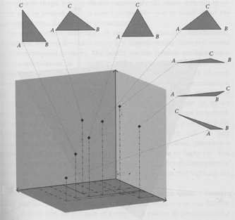](img/jbarbourconfigurationcube_2.png)Suppose
that we have three particles, A, B, and C, on a 2-dimensional
plane; and suppose that these are the *only* 3 particles in the
universe.

Let there be
a[classical configuration space](http://lesswrong.com/lw/pi/classical_configuration_spaces/)
which describes the 2D positions of A, B, and C.  3 classical 2D
particles require a 6-dimensional configuration space.

If your monitor cannot display 6-dimensional space, I've set a 2D
projection of a 3D cube to appear instead.  If you see what looks
like a window into an incomprehensible void, try using Firefox
instead of Internet Explorer.

The thing about this 6-dimensional cube, is that it contains
*too much information*.  By looking at an exact point in this cube
- supposedly corresponding to an exact state of reality - we can
read off information that A, B, and C will never be able to
observe.

The point (0, 1, 3, 4, 2, 5) corresponds to A at (0, 1), B at (3,
4), and C at (2, 5).  Now consider the point (1, 1, 4, 4, 3, 5);
which corresponds to moving A, B, and C one unit to the right, in
unison.

Can A, B, and C ever detect any experimental difference?  Supposing
that A, B, and C can *only* see *each other,* as opposed to seeing
"absolute space" in the background?

After we shift the universe to the right (shift the origin to the
left), A looks around... and sees B and C at the same distance from
itself as before.  B and C can't detect any difference in the
universe either.

Yet we have described (0, 1, 3, 4, 2, 5) and (1, 1, 4, 4, 3, 5) as
two different points in the configuration space.  Even though, to
A, B, and C, the associated states of reality seem
indistinguishable.  We have postulated an epiphenomenal
difference:  This suggests that our physics is not over the true
elements of reality.  (Remember, this has been, historically, a
highly productive line of reasoning!  It is not just
logic-chopping.)

Indeed, our classical configuration space has *many* epiphenomenal
differences.  We can rotate the three particles in unison, and end
up with a different point in the configuration space; while A, B,
and C again see themselves at the same distances from each other. 
The "rotation" that took place, was a matter of *us* looking at
them from a different angle, from *outside their universe*.  Which
is to say the "rotation" was a choice of viewpoint for *us*, not an
experimentally detectable fact *within* the ABC universe.

How can we rid the physics of mind projections and epiphenomena?

A and B and C cannot observe their absolute positions in space
against a fixed background.  Treating these absolute positions as
elements of reality may be part of our problem.

[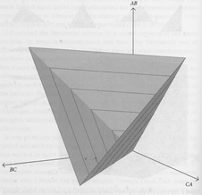](img/jbarbourrelative.png)
What *can* A, B, and C observe?  By hypothesis, they can observe
their distances from each other.  They can measure the distances
AB, BC, and CA.

Why not use *that* as the dimensions of a configuration space?

At right is depicted a *relative configuration space* whose three
dimensions are the distances AB, BC, and CA.  It really is
3-dimensional, now!

If you're wondering why the configuration space looks pyramidal,
it's because any point with e.g. AB + BC < CA is "outside the
configuration space".  It does not represent a realizable triangle,
because one side is longer than the sum of the other two.  Likewise
AB + CA < BC and BC + CA < AB.

Every different point in this configuration space, corresponds to
an *experimentally different* state of reality that A, B, and C can
observe.

[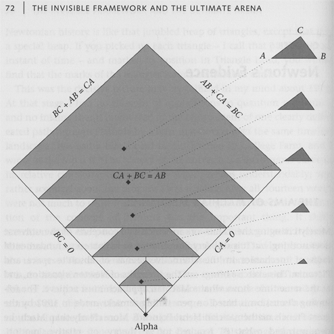](img/jbarbourtriangleland1_2.png)(Albeit
this assumes that ABC can measure absolute, rather than relative,
distances.  Otherwise, different slices of pyramid-space would be
observationally identical because they would describe the same
triangle at different scales, as shown at left.)

(Oh, and we're assuming that A, B, and C can tell each other apart
- perhaps they are different colors.)

The edges of each slice of the configuration space, are the
configurations with A, B, and C on the same line.  E.g., if AB + BC
= CA, then B lies on a point between A and C.

The corners of each slice are the configurations in which two
points coincide; e.g., AB=0, BC=CA.

[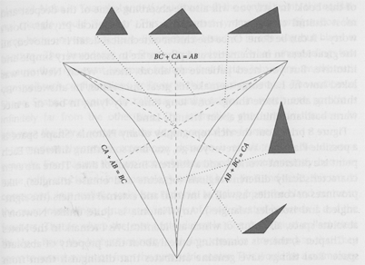](img/jbarbourtriangleland2.png)
At right (or possibly below, depending on your screen width), is a
diagram showing a single slice in greater detail; Julian Barbour
credits this to his friend Dierck Liebscher.

The point in the center of the slice corresponds to an equilateral
triangle.

The dashed lines, which are axes of bilateral symmetry of the
configuration space, contain points that correspond to isosceles
triangles.

The curved lines are right-angled triangles.

Points "inside" the curved lines are acute triangles; points
"outside" the curved lines are obtuse triangles.

What about *three* points coinciding?

There is no triangle *at this scale* where all three points
coincide.

Remember, this is just one *slice*of the configuration space. 
Every point in the *whole* configuration space corresponds to what
ABC experience as a different state of affairs.

The configuration where A, B, and C are all in the same place is
*unique* in their experience.  So it is only found in *one* slice
of the configuration space:  The slice that is a single point, at
the tip of the infinite pyramid:  The degenerate slice where the
center and the corners are the same point:  The slice that is the
single point in configuration space:  AB=BC=CA=0.

Julian Barbour calls this point Alpha.

But I'm getting ahead of myself, here - that sort of thing is the
topic of tomorrow's post.

To see the power of a relative configuration space, observe how it
makes it impossible to *imagine*certain epiphenomenal differences:

Put your Newtonian goggles back on: imagine A, B, and C as little
billiard balls bouncing around in plain old space (not
configuration space) and time.  Perhaps A, B, and C attract each
other via a kind of gravity, and so orbit around one another.  If
you were looking at the evolution of A, B, and C in plain old space
and time, then a strobe-lit photograph of their motion might look
like this:

[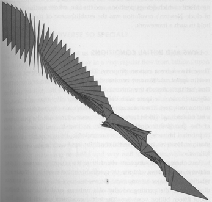](img/jbarbourtriangleseries.png)

In this time-series photograph, we've seen points A, B, and C
forming a triangle.  Not only do the points of the triangle orbit
around each other, but they also seem to be heading down and to the
right.  It seems like you can imagine the triangle heading off up
and to the right, or up and to the left, or perhaps spinning around
much faster.  Even though A, B, and C, who can only see their
distance to each other, would never notice the difference.

Now we could also map that whole trajectory over time, onto the
relative configuration space.  If AB+BC+CA happens to be a constant
throughout the evolution, then we could conveniently map the
trajectory onto one slice of configuration space:

[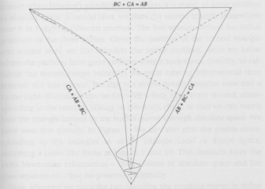](img/jbarbourshapepath.png)

(This doesn't actually represent the triangle-series shown above
it, but imagine that it does.)

If this is what you believe to be the *reality* - this trajectory
in the relative configuration space - then, if I ask you to
imagine, "Suppose that the triangle is heading up and to the left,
instead of down and to the right", I have just uttered
*physical nonsense.*  Mapping that alternative trajectory in
Newtonian space, onto the relative configuration space, would
produce just the same curve.  And if the laws of physics are over
the relative configuration space, then this curve is all there
*is.*

Imagine physics over trajectories in a relative configuration space
like this one, but with many more particles, and perhaps 3 space
dimensions.  Sentient beings evolve in this universe, on some
equivalent of a planet.  They hunt across fields that do not seem
to shift underfoot.  They have a strong illusion of moving through
an absolute space, against an absolute background; the relativity
of motion is hidden from them.

But if the fundamental laws of their universe were over relative
configurations, then it would not just be a *contingent* fact about
their universe, that if all the particles were speeding or
accelerating or rotating in unison, all the experiments would come
out the same.  Talking about "all the particles rotating in unison"
would be *physical nonsense*.  It only makes physical sense to talk
about the velocity of *some*particles relative to *other*
particles.

Your ancestors evolved on a savanna that seemed to stay put while
they ran across it.  You can, by an effort of mind, visualize a car
that stays motionless as the world zips past, or alternatively,
visualize a world that remains motionless as the car zips past. 
You can, by an effort of mind, see that the internal relations are
the same.  But it still seems to you that you are imagining two
different things.

Your visual neurology is representing objects in terms of absolute
positions against a fixed background.  There is a web of cortical
columns in your visual cortex that activate to create a mental
picture.  The particular columns that activate, are felt by you as
positions in your visual field.  That is
[how the algorithm feels from inside](http://lesswrong.com/lw/no/how_an_algorithm_feels_from_inside/).

In a universe whose physics is over a relative configuration space,
the absolute positions, and the fixed background, are not elements
of reality.  They are
[mind projection fallacies](http://lesswrong.com/lw/oi/mind_projection_fallacy/), the
shadows of a point of view; as if your mind's eye were outside the
universe, and the universe could move relative to that.

But if you could learn to visualize the relative configuration
space, then, so long as you thought in terms of those elements of
reality, it would no longer be *imaginable* that Mach's Principle
could be false.

I am not entirely convinced of this notion of a relative
configuration space.  My soul as a computer programmer cries out
against the idea of representing N particles with N^2^ distances
between them; it seems wasteful.  On the other hand, I have no
evidence that the Tao is prejudiced against *redundant* or
*overconstrained* representations, in the same way that the Tao
seems prejudiced against *epiphenomena* in representations.  Though
my soul as a programmer cries out against it, better an
overconstrained representation than an epiphenomenal one.  Still,
it does not feel entirely satisfactory, to me.  It seems like
merely the *best*representation, not the *true*one.

Also, any
[position basis invokes an arbitrary space of simultaneity](http://lesswrong.com/lw/q2/spooky_action_at_a_distance_the_nocommunication/),
and a relative position basis does so as well.  As required by
Special Relativity, the choice makes no difference - but this means
that the relative position basis *still* contains epiphenomenal
information.  Perhaps the true representation will be more strictly
local, in terms of invariant states of distant entanglement, as
I've
[suggested before](http://lesswrong.com/lw/q2/spooky_action_at_a_distance_the_nocommunication/);
and maybe, who knows, it won't be overconstrained?

Relativizing the position basis feels to me like an *improvement,*
but it doesn't seem *finished.*

...

Of course, all this that we have said about the particles A, B, C
and their trajectory through time, cannot *possibly*apply to our
own universe.

In our *own*universe, as you may recall, there are no little
billiard balls bouncing around.

In our own universe, if physics took place in a relative
configuration space, it would be *quantum* physics in a relative
configuration space.  And a single moment of time, might look like
this:

At right we see a cloud of red and blue mist, representing a
complex amplitude distribution over the relative configuration
space.  You could imagine that redness is the real part and
blueness is the imaginary part, or some such.  But this is not a
realistic amplitude distribution - just a representation of the
general idea, "A cloud of complex amplitude in configuration
space."

As for why only a sixth of the triangle is colored:  If A, B, and C
are the same species of particle, which is to say,
[identical particles](http://lesswrong.com/lw/pl/no_individual_particles/), then the
configuration space collapses along the sixfold symmetry
corresponding to the six possible permutations of A, B, and C.

The whole cloud is a single static instant, in some arbitrary space
of simultaneity.  The quantum wavefunction is a distribution over
configuration space, not a single point in configuration space.  So
to represent the state of the universe at a single moment, we need
the whole cloud, which covers the entire collapsed configuration
space.

You might naturally tend to assume that we could represent
*time*using an animated version of this same diagram: and that the
animated diagram would show the mist churning in the configuration
space, the cloud's parts changing color, as amplitude flowed from
volume to volume; and that as the quantum waves propagated, little
blobs of amplitude density would move around through the
configuration space, in trajectories much resembling the classical
curve we saw earlier.

But that* *would be overcomplicating things.

Be aware:  Churning mist in a non-relative configuration space,
would be the metaphor that corresponds to the *standard*
formulation of physics.  That is, according to *standard* physics,
the description I just gave above, would be correct (after we took
it back out of the relative configuration space, which is *not*
standard).

Yet tomorrow we shall discuss a certain *further* simplification of
physics, which renders unimaginable still *another* epiphenomenal
distinction, and deletes a *further*needless element of the laws.

# Timeless Physics

> **Warning:  The central idea in today's post is taken seriously by serious physicists; but it is not experimentally proven and is not taught as standard physics.**
> 
> Today's post draws heavily on the work of the physicist
> [Julian Barbour](http://www.platonia.com/papers.html), and contains
> diagrams stolen and/or modified from his book
> "[The End of Time](http://www.amazon.com/exec/obidos/ASIN/0753810204/platonia)". 
> However, some of the arguments here are of my own devising, and
> Barbour might(?) not agree with them.

I shall begin by asking a incredibly deep question:

What time is it?

If you have the
[excellent habit](http://yudkowsky.net/bayes/truth.html) of giving
obvious answers to obvious questions, you will answer, "It is now
7:30pm [or whatever]."

How do you know?

"I know because I looked at the clock on my computer monitor."

Well, suppose I hacked into your computer and changed the clock. 
Would it then be a different time?

"No," you reply.

How do you know?

"Because I once used the 'Set Date and Time' facility on my
computer to try and make it be the 22nd century, but it didn't
work."

Ah.  And how do you *know* that it *didn't* work?

"Because," you say, "I looked outside, and the buildings were still
made of brick and wood and steel, rather than having been replaced
by the gleaming crystal of diamondoid nanotechnological
constructions; and gasoline was still only \$4/gallon."

You have... *interesting*... expectations for the
[22nd century](http://www.overcomingbias.com/2007/09/stranger-than-h.html);
but let's not go into that.  Suppose I replaced the buildings
outside your home with confections of crystal, and raised the price
of gas; *then* would it be 100 years later?

"No," you say, "I could look up at the night sky, and see the
planets in roughly the same position as yesterday's night; with a
powerful telescope I could measure the positions of the stars as
they very slowly drift, relative to the Sun, and observe the
rotation of distant galaxies.  In these ways I would know exactly
how much time had passed, no matter what you did here on Earth."

Ah.  And suppose I snapped my fingers and caused all the stars and
galaxies to move into the appropriate positions for 2108?

"You'd be arrested for violating the laws of physics."

But suppose I did it anyway.

"Then, still, 100 years would not have passed."

How would you *know* they had not passed?

"Because I would remember that, one night before, it had still been
2008.  Though, realistically speaking, I would think it more likely
that it was my memory at fault, not the galaxies."

Now suppose I snapped my fingers, and caused *all* the atoms in the
universe to move into positions that would be appropriate for (one
probable quantum branch) of 2108.  Even the atoms in your brain.

Think carefully before you say, "It would still *really* be 2008." 
For does this belief of yours, have *any*
[observable consequences](http://www.overcomingbias.com/2007/07/making-beliefs-.html)
left?  Or is it an
[epiphenomenon of your model of physics](http://www.overcomingbias.com/2008/05/relative-config.html)? 
*Where* is stored the fact that it is 'still 2008'?  Can I snap my
fingers one last time, and alter this last variable, and cause it
to *really*be 2108?

Is it possible that Cthulhu could snap Its tentacles, and cause
time *for the whole universe* to be suspended for exactly 10
million years, and then resume?  How would anyone ever detect what
had just happened?

A global suspension of time may seem *imaginable*, in the same way
that it seems imaginable that you could
"[move all the matter in the whole universe ten meters to the left](http://www.overcomingbias.com/2008/05/machs-principle.html)". 
To visualize the universe moving ten meters to the left, you
imagine a little swirling ball of galaxies, and then it jerks
leftward.  Similarly, to imagine time stopping, you visualize a
swirling ball of galaxies, and then it stops swirling, and hangs
motionless for a while, and then starts up again.

But the sensation of passing time, in your visualization, is
provided by your own mind's eye outside the system.  *You*go on
thinking, your brain's neurons firing, while, in your
*imagination*, the swirling ball of galaxies stays motionless.

When you *imagine* the universe moving ten meters to the left, you
are imagining motion *relative*to your mind's eye outside the
universe.  In the same way, when you imagine time stopping, you are
*imagining* a motionless universe, frozen *relative* to a
still-moving clock hidden outside: your own mind, counting the
seconds of the freeze.

But what would it mean for 10 million "years" to pass, if motion
*everywhere* had been suspended?

Does it make sense to say that the global rate of motion could slow
down, or speed up, over the whole universe at once - so that all
the particles arrive at the same final configuration, in twice as
much time, or half as much time?  You couldn't measure it with any
clock, because the ticking of the clock would slow down too.

Do not say, "I could not detect it; therefore, who knows, it might
happen every day."

Say rather, "I could not detect it, nor could anyone detect it even
in principle, nor would any physical relation be affected *except*
this one thing called 'the global rate of motion'.  Therefore, I
wonder what the phrase 'global rate of motion' really *means*."

All of that was a line of argument of Julian Barbour's, more or
less,  Let us pause here, and consider a second line of argument,
this one my own.  That is, I don't think it was in Barbour's
*The End of Time.*  (If I recall correctly, I reasoned thus even
before I read Barbour, while I was coming up with my
[unpublished general decision theory of Newcomblike problems](http://www.overcomingbias.com/2008/01/newcombs-proble.html). 
Of course that does not mean the argument is novel; I have no idea
whether it is novel.  But if my argument is wrong, I do not want it
blamed on an innocent bystander.)  So:

> "The future changes as we stand here, else we are the game pieces
> of the gods, not their heirs, as we have been promised."  
>         -- Raistlin Majere

A fine sentiment; but what does it mean to *change* the future?

Suppose I have a lamp, with an old-style compact fluorescent bulb
that takes a few seconds to warm up.  At 7:00am, the lamp is off. 
At 7:01am, I flip the switch; the lamp flickers for a few moments,
then begins to warm up.  At 7:02am, the lamp is fully bright. 
Between 7:00am and 7:02am, the lamp changed from OFF to ON.  This,
certainly, is a change; but it is a change *over time.*

Change implies difference; difference implies comparison.  Here,
the two values being compared are (1) the state of "the lamp at
7:00am", which is OFF, and (2) the state of "the lamp at 7:02am",
which is ON.  So we say "the lamp" has *changed* from one time to
another.  At 7:00am, you wander by, and see the lamp is OFF; at
7:02am, you wander by, and see the lamp is ON.

But have you ever seen the *future* change from one time to
another?  Have you wandered by a lamp at exactly 7:02am, and seen
that it is OFF; then, a bit later, looked in again on the "the lamp
at exactly 7:02am", and discovered that it is now ON?

Naturally, we often *feel* like we are "changing the future". 
Logging on to your online bank account, you discover that your
credit card bill comes due tomorrow, and, for some reason, has not
been paid automatically.  *Imagining* the future-by-default -
extrapolating out the world as it would be without any further
actions - you see that the bill not being paid, and interest
charges accruing on your credit card.  So you pay the bill online. 
And now, *imagining* tomorrow, it seems to you that the interest
charges will not occur.  So at 1:00pm, you imagined a future in
which your credit card accrued interest charges, and at 1:02pm, you
imagined a future in which it did not.  And so your imagination of
the future changed, from one time to another.

As I
[remarked previously](http://www.overcomingbias.com/2008/03/reductionism.html): 
The way a belief
[feels from inside](http://www.overcomingbias.com/2008/02/algorithm-feels.html),
is that you seem to be
[looking straight at reality](http://www.overcomingbias.com/2008/03/mind-projection.html). 
When it actually *seems* that you're looking at a belief, as such,
you are really
[experiencing a belief about your beliefs](http://www.overcomingbias.com/2008/03/qualitatively-c.html).

When your *extrapolation* of the future changes, from one time to
another, it *feels*like the future itself is changing.  Yet you
have never *seen* the future change.  When you actually *get to*the
future, you only ever see one outcome.

How could a single moment of time, change from one time to
another?

I am not going to go into "free will" in today's blog post.  Except
to remark that if you have been reading Overcoming Bias all this
time, and you are currently agonizing about whether or not you
*really have free will,* instead of trying to
[understand where your own mind has become confused](http://www.overcomingbias.com/2008/03/dissolving-the.html)
and generated an
[impossible question](http://www.overcomingbias.com/2008/03/wrong-questions.html),
you should probably go back and read it all again.  For anyone who
is just now joining us... perhaps I shall discuss the issue
tomorrow.

Just remember Egan's Law:  *It all adds up to normality.*  Apples
didn't stop falling when Einstein disproved Newton's theory of
gravity, and anyone who jumped off a cliff would still go splat. 
Perhaps Time turns out to work differently than you thought; but
tomorrow still lies ahead of you, and your choices, and their
consequences.  I wouldn't advise reworking your moral philosophy
based on confusing arguments and strange-seeming physics, until
[the physics stops appearing strange](http://www.overcomingbias.com/2008/04/quantum-explana.html)
and the arguments
[no longer seem confusing](http://www.overcomingbias.com/2008/03/dissolving-the.html).

Now to physics we turn; and here I resume drawing my ideas from
Julian Barbour.

For the benefit of anyone who hasn't followed the series on quantum
mechanics, a very *very* quick summary:

-   In classical physics - the *mistaken* physics that was
    developed first historically, and matches human intuitions all
    *too* well - a particle is like a little billiard ball.  A particle
    is in a single place in 3D space, and we can describe its position
    with three real numbers.  In *quantum* physics, we need an
    *amplitude distribution* over all possible positions for the
    particle - a complex number for the particle being *here,* a
    complex number for the particle being *there,* and so on through
    all the positions in space; a continuous distribution. 
    ([Configurations and Amplitude.](http://www.overcomingbias.com/2008/04/configurations.html))
-   In classical physics, we can consider each particle
    independently.  *This* particle is *here,* *that* particle is
    *there*.  In quantum physics this is not possible; we can only
    assign amplitudes to *configurations* that describe the
    simultaneous positions of many particles.  In fact, the only
    mathematical entities that actually have amplitudes are joint
    configurations of all the particles in the entire universe. 
    ([Joint Configurations.](http://www.overcomingbias.com/2008/04/joint-configura.html))

Above is a diagram that shows what a *configuration space* might
look like for three particles, A, B, and C.  ABC form a triangle in
two-dimensional space.  Every individual point in the configuration
space corresponds to a simultaneous position of *all* the particles
- above we see points that correspond to particular triangles i.e.
joint positions of A, B, and C. 
([Classical Configuration Spaces](http://www.overcomingbias.com/2008/04/conf-space.html);
[The Quantum Arena](http://www.overcomingbias.com/2008/04/quantum-arena.html).)

The *state of a quantum system* is not a *single point* in this
space; it is a *distribution* over this space.  You could imagine
it as a cloud, or a blob, or a colored mist within the space.

Here we see a *relative* configuration space, in which each axis is
the distance between a pair of particles.  This has some advantages
I'm not going to recapitulate (it was covered in a
[previous post](http://www.overcomingbias.com/2008/05/relative-config.html)),
so if you're dropping into the middle of the series, just pretend
it's a regular configuration space.

We've just chopped up the pyramidal space you saw before, into a
series of slices.  In this configuration space, the slices near the
bottom show all the particles close together (tiny triangles).  As
we rise up, the particles get further apart (larger triangles).

At the very bottom of the configuration space is a configuration
where all the particles occupy the same position.

(But remember, it's nonsense to talk about an *individual particle*
being anywhere in a *configuration space* - each point in the
configuration space corresponds to a position of all the
particles.  Configuration space is not the 3D space you know.  It's
not that there are a bunch of particles resting in the same place
at the bottom.  The single bottom point *corresponds to* all the
particles being in the same place in 3D space.)

[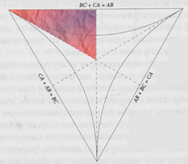](img/jbarbourtrianglecloud_2.png)

Here we take a closer look at one of the slices of configuration
space, and see a cloud of blue and red mist covering some of it. 
(Why am I only showing the cloud covering a sixth (exactly a sixth)
of the triangle?  This has to do with a symmetry in the space -
exchanges of identical particles - which is not important to the
present discussion.)

But there is your glimpse of some quantum mist - in two colors,
because amplitudes are complex numbers with a real and imaginary
part.  An amplitude distribution or "wavefunction" assigns a
complex number to every point in the continuous configuration space
- a complex number to every possible configuration of all the
particles.

Yesterday, I finished by asking how the state of a quantum system
might evolve over *time.*

You might be tempted to visualize the mist churning and changing
colors, as quantum amplitude flows within the configuration space.

And this is *indeed* the way that you would visualize
*standard*physics.

Behold the standard Schrödinger Equation:

[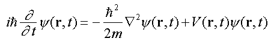](img/schrodinger.png)

Here *ψ*(**r**, *t*) is the amplitude distribution over
configuration space (**r**) and time (*t*).  The left-hand side of
the Schrödinger Equation is the *change over time* of the
wavefunction ψ, and the right-hand-side shows how to calculate this
change as the sum of two terms:  The gradient of the wavefunction
over configuration space (at that time), and the potential energy
of each configuration.

Which is to say, the derivative in *time* of the wavefunction - the
instantaneous rate of change - can be in terms of the
wavefunction's derivative in *space,* plus a term for the potential
energy.

If you tried to visualize Schrödinger's Equation - doesn't look too
hard, right? - you'd see a blob of churning, complex mist in
configuration space, with little blobs racing around and splitting
into smaller blobs as waves propagated.

If you tried to calculate the quantum state of a *single* hydrogen
atom *over time,* apart from the rest of the universe - which you
can only really do if the hydrogen atom
[isn't entangled with anything](http://www.overcomingbias.com/2008/04/decoherence.html)
- the atom's quantum state would evolve over time; the mist would
churn.

But suppose you think about the whole universe at once, including
yourself, of course.  Because - even in the standard model of
quantum physics! - that is exactly the arena in which quantum
physics takes place:  A wavefunction over *all* the particles,
*everywhere.*

If you can sensibly talk about the quantum state of some particular
hydrogen atom, it's only because the wavefunction happens to neatly
factor into (hydrogen atom) \* (rest of world).

Even if the hydrogen atom is behaving in a very regular way, the
*joint*wavefunction for (hydrogen atom \* rest of world) may not be
so regular.  Stars move into new positions, people are born and
people die, digital watches tick, and the cosmos expands:  The
universe is non-recurrent.

Think of how the *universal*wavefunction *ψ*(**r**, *t*) might
behave when **r** is the position of *all*the particles in the
universe.

Let's call 9:00am the time *t*=0, measured in seconds.

At *ψ*(**r**, *t*=0), then, you are wondering what time it is:  The
particles making up the neurons in your brain, are in positions
**r**~you~ that
[correspond to neurons firing in the thought-pattern](http://www.overcomingbias.com/2008/04/brain-breakthro.html)
"What time is it?"  And the Earth, and the Sun, and the rest of the
universe, have their own particles in the appropriate
**r**~rest-of-universe~.  Where the complete **r** roughly
factorizes as the product (**r**~you~ \* **r**~rest-of-universe~).

Over the next second, the joint wavefunction of the entire universe
evolves into *ψ*(**r**, *t*=1).  All the stars in the sky have
moved a little bit onward, in whatever direction they're heading;
the Sun has burned up a little more of its hydrogen; on Earth, an
average of 1.8 people have died; and you've just glanced down at
your watch.

At *ψ*(**r**, *t*=2), the stars have moved a little onward, the
galaxies have rotated, the cosmos has expanded a little more (and
its expansion has accelerated a little more), your watch has
evolved into the state of showing 9:00:02 AM on its screen, and
your own mind has evolved into the state of thinking the thought,
"Huh, I guess it's nine o' clock."

Ready for the next big simplification in physics?

Here it is:

We don't need the *t*.

It's redundant.

The **r** never repeats itself.  The universe is expanding, and in
every instant, it gets a little bigger.  We don't *need*a separate
*t* to keep things straight.  When you're looking at the whole
universe, a unique function *ψ* of (**r**, *t*) is pretty much a
unique function of **r**.

And the only way *we know in the first place* "what time it is", is
by looking at clocks.  And whether the clock is a wristwatch, or
the expansion of the universe, or *your own memories*, that clock
is encoded in the position of particles - in the **r**.  We have
never seen a *t* variable apart from the **r**.

We can recast the quantum wave equations, specifying the time
evolution of *ψ*(**r**, *t*), as specifying relations *within* a
wavefunction ψ(**r**).

Occam's Razor:  Our equations don't need a *t* in them, so we can
banish the *t* and make our ontology that much simpler.

An *unchanging* quantum mist hangs over the configuration space,
not churning, not flowing.

But the mist has internal structure, internal relations; and these
contain time *implicitly.*

The dynamics of physics - falling apples and rotating galaxies - is
now embodied *within* the unchanging mist in the unchanging
configuration space.

This landscape is not *frozen* like a cryonics patient suspended in
liquid nitrogen.  It is not motionless as an isolated system while
the rest of the universe goes on without it.

The landscape is *timeless*; time exists only *within* it.  To talk
about time, you have to talk about relations *inside*the
configuration space.

Asking "What happened before the Big Bang?" is revealed as a
*wrong question*.  There is no "before"; a "before" would be
outside the configuration space.  There was never a pre-existing
emptiness into which our universe exploded.  There is just this
timeless mathematical object, time existing *within* it; and the
object has a natural boundary at the Big Bang.  You cannot ask
"*When*did this mathematical object come into existence?" because
there is no *t* outside it.

So that is Julian Barbour's proposal for the next great
simplification project in physics.

(And yes, you can not only fit General Relativity into this
paradigm, it actually comes out looking
*even more elegant than before.*  For which point I refer you to
Julian Barbour's [papers](http://www.platonia.com/papers.html).)

Tomorrow, I'll go into some of my own thoughts and reactions to
this proposal.

But one point seems worth noting immediately:  I have spoken before
on the apparently
[perfect universality of physical laws](http://www.overcomingbias.com/2007/04/universal_law.html),
that apply everywhere and everywhen.  We have just raised this
perfection to an even higher pitch:
**everything that exists is either *perfectly global* or *perfectly local***. 
There are points in configuration space that affect only their
immediate neighbors in space and time; governed by universal laws
of physics.  Perfectly local, perfectly global.  If the meaning and
*sheer beauty* of this statement is not immediately obvious, I'll
go into it tomorrow.

And a final intuition-pump, in case you haven't yet gotten
timelessness on a gut level...

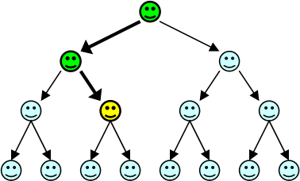

Think of this as a diagram of the
[many worlds](http://www.overcomingbias.com/2008/05/many-worlds-one.html)
of quantum physics.  The branch points could be, say,
[your observation of a particle](http://www.overcomingbias.com/2008/04/on-being-decohe.html)
that seems to go either "left" or "right".

Looking back from the vantage point of the gold head, you only
*remember* having been the two green heads.

So you seem to remember Time proceeding along a *single line*.  You
remember that the particle first went left, and then went right. 
You ask, "Which way will the particle go *this*time?"

You only remember one of the two outcomes that occurred on each
occasion.  So you ask, "When I make my next observation, which of
the two possible worlds will *I* end up in?"

Remembering only a single line as your past, you try to extend that
line into the future -

But both branches, both future versions of you, just *exist.* 
There *is no fact of the matter* as to "which branch you go down". 
Different versions of you experience both branches.

So that is many-worlds.

And to incorporate Barbour, we simply say that all of these heads,
all these Nows, *just exist. *They do not appear and then vanish;
they just *are*.   From a global perspective, there *is no answer*
to the question, "What time is it?"  There are just different
experiences at different Nows.

From any given vantage point, you look back, and remember other
times - so that the question, "Why is it *this* time right now,
rather than some *other*time?" seems to make sense.  But there is
no answer.

When I came to this understanding, I forgot the meaning that Time
had once held for me.

Time has
[dissolved](http://www.overcomingbias.com/2008/03/dissolving-the.html)
for me, has been
[reduced](http://www.overcomingbias.com/2008/03/reductionism.html)
to something simpler that is not itself timeful.

I can no longer conceive that there might *really be* a universal
time, which is somehow "moving" from the past to the future.  This
now seems like nonsense.

Something like Barbour's timeless physics has to be true, or I'm in
trouble:  I have forgotten how to imagine a universe that has "real
genuine time" in it.

# Timeless Beauty

One of the great surprises of humanity's early study of physics was
that there were [universal laws](http://lesswrong.com/lw/hr/universal_law/), that the
heavens were governed by the same order as the Earth:  Laws that
hold in all times, in all places, without known exception.
Sometimes we discover a seeming exception to the old law, like
Mercury's precession, but soon it turns out to perfectly obey a
still deeper law, that once again is universal as far as the eye
can see.

Every known law of *fundamental*physics is perfectly global. We
know no law of fundamental physics that applies on Tuesdays but not
Wednesdays, or that applies in the Northern hemisphere but not the
Southern.

In classical physics, the laws are universal; but there are also
other entities that are neither perfectly global nor perfectly
local. Like the case I discussed yesterday, of an entity called
"the lamp" where "the lamp" is OFF at 7:00am but ON at 7:02am; the
lamp entity extends through time, and has different values at
different times.  The little billiard balls are like that in
classical physics; a classical billiard ball is (alleged to be) a
fundamentally existent entity, but it has a world-*line*, not a
world-*point.*

In timeless physics,
**everything that exists is either perfectly global or perfectly local**. 
The laws are perfectly global.  The configurations are perfectly
local - every possible arrangement of particles has a *single*
complex amplitude assigned to it, which never changes from one time
to another.  Each configuration only affects, and is affected by,
its immediate neighbors.  Each actually existent thing is perfectly
unique, as a mathematical entity.

Newton, first to combine the Heavens and the Earth with a truly
universal generalization, saw a clockwork universe of moving
billiard balls and their world-lines, governed by perfect
exceptionless laws. Newton was the first to look upon a greater
beauty than any mere religion had ever dreamed.

But the beauty of classical physics doesn't begin to compare to the
beauty of timeless quantum physics.

Timeful quantum physics is pretty, but it's not all that much
pretti*er* than classical physics.  In timeful physics the "same
configuration" can still have different values at different times,
its own little world-line, like a lamp switching from OFF to ON. 
There's that ugly *t* complicating the equations.

You can see the beauty of timeless quantum physics by noticing how
much easier it is to *mess up* the perfection, if you try to tamper
with Platonia.

Consider the [collapse interpretation](http://lesswrong.com/lw/q6/collapse_postulates/)
of quantum mechanics.  To people raised on timeful quantum physics,
"the collapse of the wavefunction" sounds like it might be a
plausible physical mechanism.

If you step back and look upon the timeless mist over the entire
configuration space, all dynamics manifest in its perfectly local
relations, then the "pruning" process of collapse suddenly shows up
as a hugely ugly discontinuity in the timeless object.  Instead of
a continuous mist, we have something that looks like a maimed tree
with branches hacked off and sap-bleeding stumps left behind.  The
perfect locality is ruined, because whole branches are hacked off
in one operation.  Likewise, collapse destroys the perfect global
uniformity of the laws that relate each configuration to its
neighborhood; sometimes we have the usual relation of amplitude
flow, and then sometimes we have the collapsing-relation instead.

This is the [power of beauty](http://lesswrong.com/lw/mt/beautiful_probability/):  The
more beautiful something is, the more obvious it becomes when you
mess it up.

I was surprised that many of yesterday's commenters seemed to think
that Barbour's timeless physics was nothing new, relative to the
older idea of a Block Universe.  3+1D Minkowskian spacetime has no
privileged space of simultaneity, which, in its own way, seems to
require you to throw out the concept of a global *now*. From
Minkowskian 3+1, I had the idea of "time as a single perfect 4D
crystal" - I didn't know the phrase "Block Universe", but seemed
evident enough.

Nonetheless, I did not *really*get timelessness until I read
Barbour.  Saying that the *t* coordinate was just another
coordinate, didn't have nearly the same impact on me as tossing the
*t* coordinate out the window.

Special Relativity is widely accepted, but that doesn't stop people
from talking about "nonlocal collapse" or "retrocausation" -
relativistic *timeful* QM isn't beautiful enough to protect itself
from complication.

Shane Legg's
[reaction](http://www.overcomingbias.com/2008/05/timeless-physic.html#comment-116488178)
is the effect I was looking for:

> "Stop it!  If I intuitively took on board your timeless MWI view of
> the world... well, I'm worried that this might endanger my illusion
> of consciousness.  Thinking about it is already making me feel a
> bit weird."

I wish I knew whether the unimpressed commenters got what Shane
Legg did, just from hearing about Special Relativity; or if they
still haven't gotten it *yet* from reading my brief summary of
Barbour.

But in any case, let me talk in principle about why it helps to
toss out the *t* coordinate:

To [reduce](http://lesswrong.com/lw/on/reductionism/) a thing, you must reduce it to
something that does not itself have the property you want to
explain.

In old-school Artificial Intelligence, a researcher wonders where
the [meaning](http://lesswrong.com/lw/nq/feel_the_meaning/) of a word like "apple"
comes from.  They want to get knowledge about "apples" into their
beloved AI system, so they create a LISP token named **apple**. 
They realize that if they claim the token is meaningful of itself,
they have not really *reduced* the nature of meaning...  So they
*assert* that "the **apple** token is not meaningful by itself",
and then go on to say, "The meaning of the **apple** token emerges
from its network of connections to other tokens."  This is not true
[reductionism](http://lesswrong.com/lw/on/reductionism/).  It is
[wrapping up your confusion in a gift-box](http://lesswrong.com/lw/iu/mysterious_answers_to_mysterious_questions/).

To [reduce](http://lesswrong.com/lw/on/reductionism/) time, you must reduce it to
something that is not time.  It is not enough to take the *t*
coordinate, and say that it is "just another dimension".  So long
as the *t* coordinate is there, it acts as a mental sponge that can
soak up all the time-ness that you want to explain.  If you toss
out the *t* coordinate, you are forced to see time as something
else, and not just see time as
"[time](http://lesswrong.com/lw/nv/replace_the_symbol_with_the_substance/)".

Tomorrow (if I can shake today's cold) I'll talk about one of my
points of departure from Barbour:  Namely, I have no problem with
discarding time and keeping *causality.*  The commenters who
complained about Barbour grinding up the universe into disconnected
slices, may be reassured:  On this point, I think Barbour is trying
too hard.  We can discard *t*, and still keep causality *within*
**r**.

I dare to disagree with Barbour, on this point, because it seems
plausible that Barbour has not studied Judea Pearl and colleagues'
formulation of [causality](http://bayes.cs.ucla.edu/BOOK-2K/) -

- which likewise makes no use of a *t* coordinate.

Pearl et. al.'s formulation of "causality" would not be anywhere
*near*as enlightening, if they had to put *t* coordinates on
everything for the math to make sense.  Even if the authors
insisted that *t* was "just another property" or "just another
number"... well, if you've read Pearl, you see my point.  It would
correspond to a much weaker understanding.

# Timeless Causality

Julian Barbour believes that each configuration, each individual
point in configuration space, corresponds individually to an
experienced Now - that each instantaneous time-slice of a brain is
the carrier of a subjective experience.

On this point, I take it upon myself to disagree with Barbour.

There is a timeless formulation of causality, known to Bayesians,
which may glue configurations together even in a timeless
universe.  Barbour may not have studied this; it is not widely
studied.

Such causal links could be required for "computation" and
"consciousness" - whatever *those*are.  If so, we would not be
forced to conclude that a *single*configuration, encoding a brain
frozen in time, can be the bearer of an instantaneous experience. 
We could throw out time, and keep the concept of causal
computation.

There is an old saying:  "Correlation does not imply causation."  I
don't know if this is my own thought, or something I remember
hearing, but on seeing this saying, a phrase ran through my mind: 
*If correlation does not imply causation, what does?*

Suppose I'm at the top of a canyon, near a pile of heavy rocks.  I
throw a rock over the side, and a few seconds later, I hear a
crash.  I do this again and again, and it seems that the
rock-throw, and the crash, tend to *correlate;* to occur in the
presence of each other.  Perhaps the sound of the crash is causing
me to throw a rock off the cliff?  But no, this seems unlikely, for
then an effect would have to precede its cause.  It seems more
likely that throwing the rock off the cliff is causing the crash. 
If, on the other hand, someone observed me on the cliff, and saw a
flash of light, and then immediately afterward saw me throw a rock
off the cliff, they would suspect that flashes of light caused me
to throw rocks.

Perhaps correlation, plus *time*, can suggest a direction of
causality?

But we just threw out time.

You see the problem here.

Once, sophisticated statisticians believed this problem was
unsolvable.  Many thought it was unsolvable even *with*time. 
Time-symmetrical laws of physics didn't seem to leave room for
asymmetrical causality.  And in statistics, nobody thought there
was any way to *define* causality.  They could measure correlation,
and that was enough.  Causality was declared dead, and the famous
statistician R. A. Fisher testified that it was impossible to prove
that smoking cigarettes actually *caused*cancer.

Anyway...

[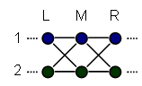](img/causeundirected_2.png)

Let's say we have a data series, generated by taking snapshots over
time of two variables 1 and 2.  We have a large amount of data from
the series, laid out on a track, but we don't know the direction
of  *time* on the track.  On each round, the past values of 1 and 2
probabilistically generate the future value of 1, and then
separately probabilistically generate the future value of 2.  We
know this, but we don't know the actual laws.  We can try to infer
the laws by gathering statistics about which values of 1 and 2 are
adjacent to which other values of 1 and 2.  But we don't know the
global direction of time, yet, so we don't know if our statistic
relates the effect to the cause, or the cause to the effect.

When we look at an arbitrary value-pair and its neighborhood, let's
call the three slices L, M, and R for Left, Middle, and Right.

We are considering two hypotheses.  First, that causality could be
flowing from L to M to R:

Second, that causality could be flowing from R to M to L:

[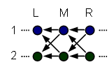](img/causeleft_3.png)

As good Bayesians, we realize that to distinguish these two
hypotheses, we must find some kind of observation that is more
likely in one case than in the other.  But what might such an
observation be?

We can try to look at various slices M, and try to find
correlations between the values of M, and the values of L and R. 
For example, we could find that when M1 is in the + state, that R2
is often also in the + state.  But is this because R2 causes M1 to
be +, or because M1 causes R2 to be +?

If throwing a rock causes the sound of a crash, then the throw and
the crash will tend to occur in each other's presence.  But this is
also true if the sound of the crash causes me to throw a rock.  So
observing these correlations does not tell us the direction of
causality, unless we already know the direction of time.

From looking at this undirected diagram, we can guess that M1 will
correlate to L1, M2 will correlate to R1, R2 will correlate to M2,
and so on; and all this will be true because there are lines
between the two nodes, regardless of which end of the line we try
to draw the arrow upon.  You can see the problem with trying to
derive causality from correlation!

Could we find that when M1 is +, R2 is *always* +, but that when R2
is +, M1 is not always +, and say, "M1 must be causing R2"?  But
this does not follow.  We said at the beginning that past values of
1 and 2 were generating future values of 1 and 2 in a probabilistic
way; it was nowhere said that we would give preference to laws that
made the future deterministic given the past, rather than vice
versa.  So there is nothing to make us prefer the hypothesis, "A +
at M1 always causes R2 to be +" to the hypothesis, "M1 can only be
+ in cases where its parent R2 is +".

Ordinarily, at this point, I would say:  "Now I am about to tell
you the answer; so if you want to try to work out the problem on
your own, you should do so now."  But in this case, some of the
greatest statisticians in history did not get it on their own, so
if you do not already know the answer, I am not really expecting
you to work it out.  Maybe if you remember half a hint, but not the
whole answer, you could try it on your own.  Or if you suspect that
your era will support you, you could try it on your own; I have
given you a tremendous amount of help by asking exactly the correct
question, and telling you that an answer is possible.

...

So!  Instead of thinking in terms of observations we could find,
and then trying to figure out if they might distinguish
asymmetrically between the hypotheses, let us examine a single
causal hypothesis and see if it implies any asymmetrical
observations.

Say the flow of causality is from left to right:

[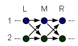](img/causeright_3.png)

Suppose that we *do* know L1 and L2, but we do *not* know R1 and
R2.  Will learning M1 tell us anything about M2?

That is, will we observe the
[conditional dependence](http://www.overcomingbias.com/2008/02/conditional-ind.html)

> P(M2|L1,L2) ≠ P(M2|M1,L1,L2)

to hold?  The answer, on the assumption that causality flows to the
right, and on the other assumptions previously given, is *no.*  "On
each round, the past values of 1 and 2 probabilistically generate
the future value of 1, and then separately probabilistically
generate the future value of 2."  So once we have L1 and L2, they
generate M1 independently of how they generate M2.

But if we did know R1 or R2, then, on the assumptions, learning M1
would give us information about M2.  Suppose that there are
siblings Alpha and Betty, cute little vandals, who throw rocks when
their parents are out of town.  If the parents are out of town,
then either Alpha or Betty might each, independently, decide to
throw a rock through my window.  If I *don't* know whether a rock
has been thrown through my window, and I know that Alpha didn't
throw a rock through my window, that doesn't affect my probability
estimate that Betty threw a rock through my window - they decide
independently.  But if I *know*my window is broken, and I know
Alpha *didn't* do it, then I can guess Betty is the culprit.  So
even though Alpha and Betty throw rocks independently of each
other, knowing the *effect* can epistemically entangle my beliefs
about the *causes.*

Similarly, if we didn't know L1 or L2, then M1 should give us
information about M2, because from the effect M1 we can infer the
state of its causes L1 and L2, and thence the effect of L1/L2 on
M2.  If I know that Alpha threw a rock, then I can guess that Alpha
and Betty's parents are out of town, and that makes it more likely
that Betty will throw a rock too.

Which all goes to say that, if causality is flowing from L to M to
R, we may indeed expect the conditional dependence

> P(M2|R1,R2) ≠ P(M2|M1,R1,R2)

to hold.

So if we observe, statistically, over many time slices:

> P(M2|L1,L2) = P(M2|M1,L1,L2)  
> P(M2|R1,R2) ≠ P(M2|M1,R1,R2)

Then we know causality is flowing from left to right; and
conversely if we see:

> P(M2|L1,L2) ≠ P(M2|M1,L1,L2)  
> P(M2|R1,R2) = P(M2|M1,R1,R2)

Then we can guess causality is flowing from right to left.

This trick used the assumption of probabilistic generators.  We
couldn't have done it if the series had been generated by bijective
mappings, i.e., if the future was deterministic given the past and
only one possible past was compatible with each future.

So this trick does not directly apply to reading causality off of
Barbour's Platonia (which is the name Barbour gives to the timeless
mathematical object that is our universe).

However, think about the situation if humanity sent off
colonization probes to distant superclusters, and then the
accelerating expansion of the universe put the colonies over the
cosmological horizon from us.  There would then be distant human
colonies that could not speak to us again:  Correlations in a case
where light, going *forward,* could not reach one colony from
another, or reach any common ground.

On the other hand, we would be *very* surprised to reach a distant
supercluster billions of light-years away, and find a spaceship
just arriving from the *other* side of the universe, sent from
another independently evolved Earth, which had developed
genetically compatible indistinguishable humans who speak English. 
(A la way too much horrible sci-fi television.)  We would not
expect such extraordinary *similarity* of events, in a historical
region where a ray of light could not yet have reached there from
our Earth, nor a ray of light reached our Earth from there, nor
could a ray of light reached both Earths from any mutual region
between.  On the assumption, that is, that rays of light travel in
the direction we call "forward".

When two regions of spacetime are timelike separated, we cannot
deduce any direction of causality from similarities between them;
they could be similar because one is cause and one is effect, or
vice versa.  But when two regions of spacetime are spacelike
separated, and far enough apart that they have no common causal
ancestry *assuming* one direction of physical causality, but
*would* have common causal ancestry assuming a *different*
direction of physical causality, then similarity between them... is
at least highly suggestive.

I am not skilled enough in causality to translate probabilistic
theorems into bijective deterministic ones.  And by calling certain
similarities "surprising" I have secretly imported a probabilistic
view; I have made myself uncertain so that I can be surprised.

But Judea Pearl himself believes that the arrows of his graphs are
more fundamental than the statistical correlations they *produce*;
he has said so in an essay entitled
"[Why I Am Only A Half-Bayesian](http://ftp.cs.ucla.edu/pub/stat_ser/r284-reprint.pdf)". 
Pearl thinks that his arrows reflect reality, and hence, that there
is more to inference than just raw probability distributions.  If
Pearl is right, then there is no reason why you could not have
directedness in bijective deterministic mappings as well, which
would manifest in the same sort of similarity/dissimilarity rules I
have just described.

This does not bring back time.  There is no *t* coordinate, and no
global *now* sweeping across the universe.  Events do not happen in
the *past* or the *present* or the *future,* they just *are.*  But
there may be a certain... *asymmetric locality of relatedness...*
that preserves "cause" and "effect", and with it, "therefore".  A
point in configuration space would never be "past" or "present" or
"future", nor would it have a "time" coordinate, but it might be
"cause" or "effect" to another point in configuration space.

I am aware of the standard argument that anything resembling an
"arrow of time" should be made to stem strictly from the second law
of thermodynamics and the low-entropy initial condition.  But if
you throw out causality along with time, it is hard to see how a
low-entropy *terminal* condition and high-entropy *initial*
condition could produce the same pattern of similar and dissimilar
regions.  Look at in another way:  To compute a consistent universe
with a low-entropy terminal condition and high-entropy initial
condition, you have to simulate lots and lots of universes, then
throw away all but a tiny fraction of them that end up with low
entropy at the end.  With a low-entropy initial condition, you can
compute it out locally, without any global checks.  So I am not yet
ready to throw out the arrowheads on my arrows.

And, if we have "therefore" back, if we have "cause" and "effect"
back - and science would be somewhat forlorn without them - then we
can hope to retrieve the concept of "computation".  We are not
forced to grind up reality into disconnected configurations; there
can be glue between them.  We can require the amplitude relations
between connected volumes of configuration space, to carry out some
kind of timeless computation, before we decide that it contains the
timeless Now of a conscious mind.  We are not forced to associate
experience with an isolated point in configuration space - which is
a good thing from my perspective, because it doesn't seem to me
that a frozen brain with all the particles in fixed positions ought
to be having experiences.  I would sooner associate experience with
the arrows than the nodes, if I had to pick one or the other!  I
would sooner associate consciousness with the *change in* a brain
than with the brain itself, if I had to pick one or the other.

This also lets me keep, for at least a little while longer, the
concept of a conscious mind being connected to its future Nows, and
[anticipating some future experiences rather than others](http://www.overcomingbias.com/2008/04/where-experienc.html). 
Perhaps I will have to throw out this idea eventually, because I
cannot seem to formulate it consistently; but for now, at least, I
still cannot do without the notion of a "conditional probability". 
It still seems to me that there is some actual *connection* that
makes it more likely for *me* to wake up tomorrow as Eliezer
Yudkowsky, than as Britney Spears.  If I am in the arrows even more
than the nodes, that gives me a direction, a timeless flow.  This
may possibly be naive, but I am sticking with it until I can jump
to an alternative that is less confusing than my present confused
state of mind.

Don't think that any of this preserves *time,* though, or
distinguishes the past from the future.  I am just holding onto
*cause* and *effect* and *computation* and even *anticipation* for
a little while longer.

# Timeless Identity

People have asked me, "What practical good does it do to discuss
quantum physics or consciousness or zombies or personal identity? 
I mean, what's the application for me in real life?"

Before the end of today's post, we shall see a real-world
application with practical consequences, for you, yes, you in
today's world.  It is built upon many prerequisites and deep
foundations;
[you will not be able to tell others what you have seen](http://lesswrong.com/lw/kg/expecting_short_inferential_distances/),
though you may (or may not) want desperately to tell them.  (Short
of having them read the last several months of OB.)

In [No Individual Particles](http://lesswrong.com/lw/pl/no_individual_particles/) we
saw that the intuitive conception of reality as little billiard
balls bopping around, is entirely and absolutely wrong; the basic
ontological reality, to the best of anyone's present knowledge, is
a joint configuration space.  These configurations have
mathematical identities like "A particle here, a particle there",
rather than "particle 1 here, particle 2 there" and
[the difference is experimentally testable](http://lesswrong.com/lw/ph/can_you_prove_two_particles_are_identical/). 
What might *appear* to be a little billiard ball, like an electron
caught in a trap, is actually a multiplicative *factor* in a
wavefunction that happens to approximately factor.  The
factorization of 18 includes *two* factors of 3, not *one* factor
of 3, but this doesn't mean the two 3s have separate individual
identities - quantum mechanics is sort of like that.  (If that
didn't make any sense to you, sorry; you need to have followed
[the series on quantum physics](http://lesswrong.com/lw/pc/quantum_explanations/).)

In
[Identity Isn't In Specific Atoms](http://lesswrong.com/lw/pm/identity_isnt_in_specific_atoms/),
we took this counterintuitive truth of physical ontology, and
proceeded to kick hell out of an intuitive concept of personal
identity that depends on being made of the "same atoms" - the
intuition that you are the same person, if you are made out of the
*same pieces.*  But because the brain doesn't repeat its exact
state (let alone the whole universe), the *joint*configuration
space which underlies you, is nonoverlapping from one fraction of a
second to the next.  Or even from one Planck interval to the next. 
I.e., "you" of now and "you" of one second later do not have in
common any ontologically basic elements with a shared persistent
identity.

Just from standard quantum mechanics, we can see immediately that
some of the standard thought-experiments used to pump intuitions in
philosophical discussions of identity, are *physical nonsense*. 
For example, there is a thought experiment that runs like this:

> "The Scanner here on Earth will destroy my brain and body, while
> recording the exact states of all my cells.  It will then transmit
> this information by radio.  Travelling at the speed of light, the
> message will take three minutes to reach the Replicator on Mars. 
> This will then create, out of new matter, a brain and body exactly
> like mine.  It will be in this body that I shall wake up."

This is Derek Parfit in the excellent *Reasons and Persons,* p. 199
- note that Parfit is describing thought experiments, not
necessarily endorsing them.

There is an argument which Parfit describes (but does not himself
endorse), and which I have seen many people spontaneously invent,
which says (not a quote):

> Ah, but suppose an improved Scanner were invented, which scanned
> you *non-destructively,* but still transmitted the same information
> to Mars* *.  Now, *clearly*, in this case, *you, the original*have
> simply stayed on Earth, and the person on Mars is *only a copy*. 
> Therefore this teleporter is actually murder and birth, not
> *travel*at all - it destroys the original, and constructs a copy!

Well, but who says that if we build an exact copy of you, one
version is the *privileged original* and the other is
*just a copy?*  Are you under the impression that one of these
bodies is constructed out of *the original atoms* - that it has
some kind of physical continuity the other does not possess?  But
there is
[no such thing as a particular atom](http://lesswrong.com/lw/pl/no_individual_particles/),
so the original-ness or new-ness  of the person can't depend on the
original-ness or new-ness of the atoms.

(If you are now saying, "No, you can't distinguish two electrons
*yet*, but that doesn't mean they're the *same entity* -" then you
have not been following the series on quantum mechanics, or you
need to reread it.  Physics does not work the way you think it
does.  There *are no* little billiard balls bouncing around down
there.)

If you further realize that, as a matter of fact,
[you are splitting all the time](http://lesswrong.com/lw/q8/many_worlds_one_best_guess/)
due to [ordinary decoherence](http://lesswrong.com/lw/pu/on_being_decoherent/), then
you are much more likely to look at this thought experiment and
say:  "There is no copy; there are two originals."

Intuitively, in your imagination, it might seem that one billiard
ball stays in the same place on Earth, and another billiard ball
has popped into place on Mars; so one is the "original", and the
other is the "copy".  But at a fundamental level, things are not
made out of billiard balls.

A sentient brain constructed to atomic precision, and copied with
atomic precision, could undergo a quantum evolution along with its
"copy", such that, afterward, there would
*exist no fact of the matter* as to which of the two brains was the
"original".  In some [Feynman diagrams](http://lesswrong.com/lw/pk/feynman_paths/) they
would exchange places, in some Feynman diagrams not.  The two
entire brains would be, in aggregate,
[identical particles](http://lesswrong.com/lw/pl/no_individual_particles/) with no
individual identities.

Parfit, having discussed the teleportation thought experiment,
counters the intuitions of physical continuity with a different set
of thought experiments:

> "Consider another range of possible cases: the
> *Physical Spectrum*.  These cases involve all of the different
> possible degrees of physical continuity...
> 
> "In a case close to the near end, scientists would replace 1% of
> the cells in my brain and body with exact duplicates.  In the case
> in the middle of the spectrum, they would replace 50%.  In a case
> near the far end, they would replace 99%, leaving only 1% of my
> original brain and body.  At the far end, the 'replacement' would
> involve the complete destruction of my brain and body, and the
> creation out of new organic matter of a Replica of me."
> 
> (*Reasons and Persons,*p. 234.)

Parfit uses this to argue against the intuition of physical
continuity pumped by the first experiment: if your identity depends
on physical continuity, where is the exact threshold at which you
cease to be "you"?

By the way, although I'm criticizing Parfit's reasoning here, I
really liked Parfit's discussion of personal identity.  It really
surprised me.  I was expecting a rehash of the same arguments I've
seen on transhumanist mailing lists over the last decade or more. 
Parfit gets *much*further than I've seen the mailing lists get. 
This is a sad verdict for the mailing lists.  And as for
*Reasons and Persons,* it well deserves its fame.

But although Parfit executed his arguments competently and with
great philosophical skill, those two *particular*arguments (Parfit
has lots more!) are doomed by physics.

There just is no such thing as "new organic matter" that has a
persistent identity apart from "old organic matter".  No fact of
the matter exists, as to which electron is which, in your body on
Earth or your body on Mars.  No fact of the matter exists, as to
how many electrons in your body have been "replaced" or "left in
the same place".  So both thought experiments are physical
nonsense.  
Parfit seems to be enunciating his own opinion here (not Devil's
advocating) when he says:

> "There are two kinds of sameness, or identity.  I and my Replica
> are *qualitatively identical,* or exactly alike.  But we may not be
> *numerically identical*, one and the same person.  Similarly, two
> white billiard balls are not numerically but may be qualitatively
> identical.  If I paint one of these balls red, it will cease to be
> qualitatively identical with itself as it was.  But the red ball
> that I later see and the white ball that I painted red are
> numerically identical.  They are one and the same ball." (p. 201.)

In the human *imagination,* the way we have evolved to imagine
things, we can imagine two qualitatively identical billiard balls
that have a further fact about them - their persistent identity -
that makes them distinct.

But it seems to be a basic lesson of physics that "numerical
identity" *just does not exist.*  Where "qualitative identity"
exists, you can set up quantum evolutions that refute the illusion
of individuality - Feynman diagrams that sum over different
permutations of the identicals.

We should always have been suspicious of "numerical identity",
since it was not
[experimentally](http://lesswrong.com/lw/p9/the_generalized_antizombie_principle/)[detectable](http://lesswrong.com/lw/qm/machs_principle_antiepiphenomenal_physics/);
but physics swoops in and drop-kicks the whole argument out the
window.

Parfit p. 241:

> "Reductionists admit that there is a difference between numerical
> identity and exact similarity.  In some cases, there would be a
> real difference between some person's being me, and his being
> someone else who is merely exactly like me."

*This*reductionist admits no such thing.

Parfit even describes a wise-*seeming* reductionist refusal to
answer questions as to when one person becomes another, when you
are "replacing" the atoms inside them.  P. 235:

> (The reductionist says:)  "The resulting person will be
> psychologically continuous with me as I am now.  This is all there
> is to know.  I do not know whether the resulting person will be me,
> or will be someone else who is merely exactly like me.  But this is
> not, here, a real question, which must have an answer.  It does not
> describe two different possibilities, one of which must be true. 
> It is here an empty question.  There is not a real difference here
> between the resulting person's being *me,* and his being
> *someone else.*  This is why, even though I do not know whether I
> am about to die, I know everything."

Almost but not quite reductionist enough!  When you master quantum
mechanics, you see that, in the thought experiment where your atoms
are being "replaced" in various quantities by "different" atoms,
*nothing whatsoever is actually happening* - the thought experiment
itself is physically empty.

So *this* reductionist, at least, triumphantly says - not, "It is
an empty question; I know everything that there is to know, even
though I don't know if I will live or die" - but simply, "I will
live; nothing happened."

This whole episode is one of the main reasons why I hope that when
I *really* understand matters such as these, and they have ceased
to be mysteries unto me, that I *will* be able to give definite
answers to questions that seem like they ought to have definite
answers.

And it is a reason why I am suspicious, of philosophies that too
early - before the dispelling of mystery - say, "There is no answer
to the question."  Sometimes there *is* no answer, but then the
absence of the answer comes with a shock of understanding, a click
like thunder, that
[makes the question vanish](http://lesswrong.com/lw/of/dissolving_the_question/) in a
puff of smoke.  As opposed to a dull empty sort of feeling, as of
being told to shut up and
[stop asking questions](http://lesswrong.com/lw/it/semantic_stopsigns/).

And another lesson:  Though the thought experiment of having atoms
"replaced" seems *easy to imagine in the abstract,* anyone knowing
a *fully detailed physical visualization* would have immediately
seen that the thought experiment was physical nonsense.  Let
[zombie theorists](http://lesswrong.com/lw/p7/zombies_zombies/) take note!

Additional physics can shift our view of identity even further:

In [Timeless Physics](http://lesswrong.com/lw/qp/timeless_physics/), we looked at a
speculative, but even more beautiful view of quantum mechanics:  We
don't need to suppose the amplitude distribution over the
configuration space is *changing*, since the universe never repeats
itself.  We never see any particular joint configuration (of the
whole universe) change amplitude from one time to another; from one
time to another, the universe will have expanded.  There is just a
timeless amplitude distribution (aka wavefunction) over a
configuration space that includes compressed configurations of the
universe (early times) and expanded configurations of the universe
(later times).

Then we will need to discover people and their identities embodied
within a timeless set of *relations* between configurations that
never repeat themselves, and never change from one time to
another.

As we saw in [Timeless Beauty](http://lesswrong.com/lw/qq/timeless_beauty/), timeless
physics is beautiful because it would make everything that exists
either *perfectly global* - like the uniform, exceptionless laws of
physics that apply everywhere and everywhen - *or perfectly local*
- like points in the configuration space that only affect or are
affected by their immediate local neighborhood.  Everything that
exists fundamentally, would be *qualitatively unique:* there would
never be two *fundamental*entities that have the same properties
but are not the same entity.

(Note:  The you on Earth, and the you on Mars, are not
ontologically basic.  You are *factors* of a joint amplitude
distribution that is ontologically basic.  Suppose the integer 18
exists: the factorization of 18 will include *two* factors of 3,
not *one* factor of 3.  This does not mean that inside the Platonic
integer 18 there are two little 3s hanging around with persistent
identities, living in different houses.)

We also saw in [Timeless Causality](http://lesswrong.com/lw/qr/timeless_causality/)
that the end of time is not necessarily the end of cause and
effect; causality can be defined (and detected statistically!)
without mentioning "time".  This is important because it preserves
arguments about personal identity that rely on *causal* continuity
rather than "physical continuity".

[Previously](http://lesswrong.com/lw/qp/timeless_physics/) I drew this diagram of
*you*in a timeless, branching universe:

To understand many-worlds:  The gold head only *remembers*the green
heads, creating the illusion of a unique line through time, and the
intuitive question, "Where does the line go next?"  But it goes to
both possible futures, and both possible futures will look back and
see a single line through time.  In many-worlds, there
*is no fact of the matter* as to which future *you personally*will
end up in.  There is no copy; there are two originals.

To understand timeless physics:  The heads are not popping in and
out of existence as some Global Now sweeps forward.  They are all
just there, each thinking that *now* is a different time.

In [Timeless Causality](http://lesswrong.com/lw/qr/timeless_causality/) I drew this
diagram:

[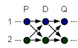](img/causeright.png)

This was part of an illustration of how we could statistically
distinguish left-flowing causality from right-flowing causality -
an argument that *cause and effect* could be defined relationally,
even the absence of a changing global time.  And I said that,
because we could keep cause and effect as the glue that binds
configurations together, we could go on trying to identify
experiences with *computations* embodied in flows of amplitude,
rather than having to identify experiences with individual
configurations.

But both diagrams have a common flaw: they show discrete nodes,
connected by discrete arrows.  In reality, physics is continuous.

So if you want to know "Where is the computation?  Where is the
experience?" my best guess would be to point to something like a
*directional braid:*

[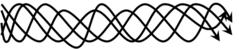](img/braid_2.png)

This is not a braid of moving particles.  This is a braid of
interactions within close neighborhoods of timeless configuration
space.

[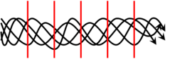](img/braidslice.png)

Every point intersected by the red line is unique as a mathematical
entity; the points are not *moving* from one time to another. 
However, the amplitude at different points is related by physical
laws; and there is a direction of causality to the relations.

You could say that the amplitude is *flowing,* in a river that
never changes, but has a direction.

Embodied in this timeless flow are computations; within the
computations, experiences.  The experiences' computations'
configurations might even overlap each other:

[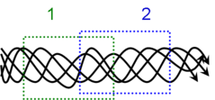](img/braidtime_2.png)

In the causal relations covered by the rectangle 1, there would be
one moment of Now; in the causal relations covered by the rectangle
2, another moment of Now.  There is a causal direction between
them: 1 is the cause of 2, not the other way around.  The
rectangles overlap - though I really am not sure if I should be
drawing them with overlap or not - because the computations are
embodied in some of the same configurations.  Or if not, there is
still causal continuity because the end state of one computation is
the start state of another.

But on an ontologically fundamental level, nothing with a
persistent identity moves through time.

Even the braid itself is not ontologically fundamental; a human
brain is a *factor* of a larger wavefunction that happens to
factorize.

Then what is preserved from one time to another?  On an
ontologically basic level, absolutely nothing.

But you will recall that I
[earlier](http://lesswrong.com/lw/p9/the_generalized_antizombie_principle/) talked
about any perturbation which does not disturb your internal
narrative, almost certainly not being able to disturb whatever is
the true cause of your saying "I think therefore I am" - this is
why you can't leave a person physically unaltered, and subtract
their consciousness.  When you look at a person on the level of
organization of neurons firing, anything which does not disturb, or
only infinitesimally disturbs, the pattern of neurons firing - such
as flipping a switch from across the room - ought not to disturb
your consciousness, or your personal identity.

If you were to describe the brain on the level of neurons and
synapses, then this description of the factor of the wavefunction
that is your brain, would have *a very great deal in common,*
across different cross-sections of the braid.  The pattern of
synapses would be "almost the same" - that is, the description
would come out almost the same - even though, on an ontologically
basic level, nothing that exists fundamentally is held in common
between them.  The internal narrative goes on, and you can see it
within the vastly higher-level view of the firing patterns in the
connection of synapses.  The *computational* pattern computes, "I
think therefore I am".  The narrative says, today and tomorrow, "I
am Eliezer Yudkowsky, I am a rationalist, and I have something to
protect."  Even though, in the river that never flows, not a single
drop of water is shared between one time and another.

If there's any basis *whatsoever*to this notion of "continuity of
consciousness" - I haven't quite given up on it yet, because I
don't have anything better to cling to - then I would guess that
this is how it works.

Oh... and I promised you a real-world application, didn't I?

Well, here it is:

Many throughout time, tempted by the promise of immortality, have
consumed strange and often fatal elixirs; they have tried to
bargain with devils that failed to appear; and done many other
silly things.

But [like all superpowers](http://lesswrong.com/lw/qs/einsteins_superpowers/),
long-range life extension can only be acquired by seeing, with a
shock, that some way of getting it is *perfectly normal.*

If you can see the moments of *now* braided into time, the causal
dependencies of future states on past states, the high-level
pattern of synapses and the internal narrative as a computation
within it - if you can viscerally dispel the classical
hallucination of a little billiard ball that is you, and see your
*nows* strung out in the river that never flows - then you can see
that signing up for cryonics, being vitrified in liquid nitrogen
when you die, and having your brain nanotechnologically
reconstructed fifty years later, is actually *less* of a change
than going to sleep, dreaming, and forgetting your dreams when you
wake up.

You should be able to *see* that, now, if you've followed through
this whole series.  You should be able to get it on a *gut level* -
that being vitrified in liquid nitrogen for fifty years (around
3e52 Planck intervals) is not very different from waiting an
average of 2e26 Planck intervals between neurons firing, on the
generous assumption that there are a hundred trillion synapses
firing a thousand times per second.  You should be able to *see*
that there is nothing preserved from one night's sleep to the
morning's waking, which cryonic suspension does not preserve also. 
Assuming the vitrification technology is good enough for a
[sufficiently powerful](http://lesswrong.com/lw/qk/that_alien_message/) Bayesian
[superintelligence](http://lesswrong.com/lw/ql/my_childhood_role_model/) to look at
your frozen brain, and figure out "who you were" to the same
resolution that your morning's waking self resembles the person who
went to sleep that night.

Do you know what it takes to *securely* erase a computer's hard
drive?  Writing it over with all zeroes isn't enough.  Writing it
over with all zeroes, then all ones, then a random pattern, isn't
enough.  Someone with the right tools can still examine the final
state of a section of magnetic memory, and distinguish the state,
"This was a 1 written over by a 1, then a 0, then a 1" from "This
was a 0 written over by a 1, then a 0, then a 1".  The best way to
securely erase a computer's hard drive is to destroy it with
thermite.

I really don't think that carefully vitrifying a brain to prevent
ice crystal formation and then freezing it in liquid nitrogen is
going to be a secure erase procedure, if you can examine
atomic-level differences in the synapses.

Someone hears about cryonics and thinks for 10 seconds and says,
"But if you're frozen and then revived, are you
*really the same person?*"

And if they happened to know all about quantum physics
*and could apply the abstract knowledge to real life,* and they had
followed the whole debate about zombies
*and resolved it against epiphenomenalism in general,* then they
would be able to visualize the braids in the river that never
flows, and say, "Yes."

But this knowledge is not common.

So they die.

There are numerous other reasons that people seize on, when they
search for a rationalization for a negative initial flinch against
cryonics.  And numerous other knowledges that would be required to
answer those objections.  "But wouldn't it be boring to live such a
long time?"  (Can be answered if you know hedonic psychology, and
have developed a theory of fun, and can visualize accessible fun
spaces that increase in volume with increasing intelligence.)  "Why
would future civilizations bother to revive me?"  (Requires
understanding either economic growth diminishing the cost, *or*
knowledge of history and how societies have become kinder over
time, *or* knowing about Friendly AI.)  "Isn't it wrong to live so
long?"  (Requires knowing about the "sour grapes" bias.  See also
[transhumanism as simplified humanism](http://www.singinst.org/blog/2007/06/16/transhumanism-as-simplified-humanism/)
and
[the meaning that immortality gives to life](http://www.singinst.org/blog/2007/10/14/the-meaning-that-immortality-gives-to-life/).) 
Then there's the meta-knowledge of how to question all these
[deeply wise](http://lesswrong.com/lw/k8/how_to_seem_and_be_deep/)
[cached thoughts](http://lesswrong.com/lw/k5/cached_thoughts/) that pop into your head
about the futility of life; and the ability to do things that might
make people [look at you weird](http://lesswrong.com/lw/mb/lonely_dissent/), and so
on...

Some of these are series of posts I haven't done yet.  But if you
anticipate updating your probabilities when you read those future
posts, then you should update them now.  Or, if you prefer, trust
me:

If you would rather live happily ever after, than die, and you are
willing to spend between \$300 and \$2000 per year(\*) to express
this preference, then sign up for cryonics.

If you've been cryocrastinating, putting off signing up for
cryonics "until later", don't think that you've "gotten away with
it so far".  Many worlds, remember?  There are branched versions of
you that are dying of cancer, and not signed up for cryonics, and
it's too late for them to get life insurance.

See, knowing about many worlds can help you visualize probabilities
as frequencies, because they usually *are.*

It might encourage you to get around to getting health insurance,
too, or wearing a helmet on your motorcycle, or whatever: don't
think you've gotten away with it so far.

And if you're planning to
[play the lottery](http://lesswrong.com/lw/hl/lotteries_a_waste_of_hope/), don't think
you *might* win this time.  A vanishingly small fraction of you
wins, every time.  So either
[learn to discount small fractions of the future](http://lesswrong.com/lw/my/the_allais_paradox/)
by
[shutting up and multiplying](http://lesswrong.com/lw/n9/the_intuitions_behind_utilitarianism/),
or spend all your money on lottery tickets - your call.

It is a very important lesson in rationality, that at any time, the
Environment may suddenly ask you almost any question, which
requires you to draw on 7 different fields of knowledge.  If you
missed studying a single one of them, you may suffer arbitrarily
large penalties up to and including capital punishment.  You can
die for an answer you gave in 10 seconds, without realizing that a
field of knowledge existed of which you were ignorant.

This is why there is a
[virtue of scholarship](http://yudkowsky.net/virtues/).

[150,000](http://lesswrong.com/lw/hw/scope_insensitivity/) people die every day.  Some
of those deaths are truly unavoidable, but most are the result of
inadequate knowledge of cognitive biases, advanced futurism, and
quantum mechanics.(\*\*)

If you disagree with my premises or my conclusion, take a moment to
consider nonetheless, that
*the very existence of an argument about life-or-death stakes*,
whatever position you take in that argument, constitutes a
sufficient lesson on *the sudden relevance of scholarship.*

* * * * *

(\*)  The way cryonics works is that you get a life insurance
policy, and the policy pays for your cryonic suspension.  The
Cryonics Institute is the cheapest provider, Alcor is the
high-class one.  [Rudi Hoffman](mailto:rudihoffman@aol.com) set up
my own insurance policy, with CI.  I have no affiliate agreements
with any of these entities, nor, to my knowledge, do they have
affiliate agreements with anyone.  They're trying to look
respectable, and so they rely on altruism and word-of-mouth to
grow, instead of paid salespeople.  So there's a vastly smaller
worldwide market for immortality than lung-cancer-in-a-stick. 
Welcome to your Earth; it's going to stay this way until you fix
it.

(\*\*)  *Most* deaths?  Yes:  If cryonics were widely seen in the
same terms as any other medical procedure, economies of scale would
considerably diminish the cost; it would be applied routinely in
hospitals; and foreign aid would enable it to be applied even in
poor countries.  So children in Africa are dying because citizens
and politicians and philanthropists in the First World don't have a
gut-level understanding of quantum mechanics.

**Added:**  For some of the questions that are being asked, see
Alcor's [FAQ for scientists](http://alcor.org/sciencefaq.htm) and
[Ben Best's Cryonics FAQ](http://www.benbest.com/cryonics/CryoFAQ.html).

# Thou Art Physics

[Three months ago](http://lesswrong.com/lw/of/dissolving_the_question/) - jeebers, has
it really been that long? - I posed the following
[homework assignment](http://wiki.lesswrong.com/wiki/Free_will): 
Do a stack trace of the human cognitive algorithms that produce
debates about 'free will'.  Note that this task is strongly
distinguished from arguing that free will does, or does not exist.

Now, as expected, the notion of
"[timeless physics](http://lesswrong.com/lw/qp/timeless_physics/)" is causing people to
ask, "If the future is determined, how can our choices control
it?"  The wise reader can guess that
[it all adds up to normality](http://lesswrong.com/lw/qz/living_in_many_worlds/); but
this leaves the question of *how.*

People hear:  "The universe runs like clockwork; physics is
deterministic; the future is fixed."  And their minds form an
causal network that looks like this:

Here we see the causes "Me" and "Physics", competing to determine
the state of the "Future" effect.  If the "Future" is fully
determined by "Physics", then obviously there is no room for it to
be affected by "Me".

This causal network is not an explicit philosophical belief.  It's
implicit - a background representation of the brain, controlling
which philosophical arguments seem "reasonable".  It just seems
like the way things *are.*

Every now and then, another neuroscience press release appears,
claiming that, because researchers used an fMRI to spot the brain
doing something-or-other during a decision process,
*it's not you who chooses, it's your brain.*

Likewise that old chestnut, "Reductionism undermines rationality
itself.  Because then, every time you said something, it wouldn't
be the result of *reasoning*about the evidence - it would be
[merely](http://lesswrong.com/lw/oo/explaining_vs_explaining_away/) quarks bopping
around."

Of course the actual diagram should be:

Or better yet:

Why is this not obvious?  Because there are many
[levels of organization](http://lesswrong.com/lw/on/reductionism/) that separate our
models of our thoughts - our emotions, our beliefs, our agonizing
indecisions, and our final choices - from our models of electrons
and quarks.

We can *intuitively*visualize that a hand is made of fingers (and
thumb and palm).  To ask whether it's *really* our hand that picks
something up, or *merely*our fingers, thumb, and palm, is
transparently a [wrong question](http://lesswrong.com/lw/og/wrong_questions/).

But the gap between [physics and cognition](http://lesswrong.com/lw/p3/angry_atoms/)
cannot be crossed by direct visualization.  No one can *visualize*
atoms making up a person, the way they can see fingers making up a
hand.

And so it requires *constant vigilance* to maintain your perception
of yourself as an entity *within physics*.

This vigilance is one of the great keys to philosophy, like the
[Mind Projection Fallacy](http://lesswrong.com/lw/oi/mind_projection_fallacy/).  You
will recall that it is this point which I
[nominated](http://lesswrong.com/lw/pg/where_philosophy_meets_science/) as having
tripped up the quantum physicists who failed to imagine macroscopic
decoherence; they did not think to apply the laws to *themselves*.

Beliefs, desires, emotions, morals, goals, imaginations,
anticipations, sensory perceptions, fleeting wishes, ideals,
temptations...  You might call this the "surface layer" of the
mind, the parts-of-self that people can see even without science. 
If I say, "It is not *you* who determines the future, it is your
*desires, plans, and actions* that determine the future", you can
readily see the part-whole relations.  It is immediately visible,
like fingers making up a hand. There are other part-whole relations
all the way down to physics, but they are not immediately visible.

"Compatibilism" is the philosophical position that "free will" can
be intuitively and satisfyingly defined in such a way as to be
compatible with deterministic physics.  "Incompatibilism" is the
position that free will and determinism are incompatible.

My position might perhaps be called "Requiredism."  When agency,
choice, control, and moral responsibility are cashed out in a
sensible way, they *require* determinism - at least some patches of
determinism within the universe.  If you choose, and plan, and act,
and bring some future into being, in accordance with your desire,
then all this requires a lawful sort of reality; you cannot do it
amid utter chaos.  There must be order over at least over those
parts of reality that are being controlled by you.  *You* are
within physics, and so you/physics have determined the future.  If
it were not determined by physics, it could not be determined by
you.

Or perhaps I should say, "If the future were not determined by
reality, it could not be determined by you," or "If the future were
not determined by something, it could not be determined by you." 
You don't need neuroscience or physics to push naive definitions of
free will into incoherence.  If the mind were not embodied in the
brain, it would be embodied in something else; there would be
*some real thing* that was a mind.  If the future were not
determined by physics, it would be determined by *something,* some
law, some order, some grand reality that included you within it.

But if the laws of physics control us, then how can we be said to
control ourselves?

Turn it around:  If the laws of physics did *not* control us, how
could we possibly control ourselves?

How could thoughts judge other thoughts, how could emotions
conflict with each other, how could one course of action appear
best, how could we pass from uncertainty to certainty about our own
plans, in the midst of utter chaos?

If we were not in reality, where could we be?

The future is determined by physics.  What kind of physics?  The
kind of physics that includes the actions of human beings.

People's choices are determined by physics.  What kind of physics?
The kind of physics that includes weighing decisions, considering
possible outcomes, judging them, being tempted, following morals,
rationalizing transgressions, trying to do better...

There is no point where a quark swoops in from Pluto and overrides
all this.

The thoughts of your decision process are all *real*, they are all
*something.*  But a thought is too big and complicated to be an
atom.  So thoughts are
[made of smaller things](http://lesswrong.com/lw/on/reductionism/), and our name for
the stuff that stuff is made of, is "physics".

Physics underlies our decisions and includes our decisions, it does
not [explain them *away*](http://lesswrong.com/lw/oo/explaining_vs_explaining_away/).

[To be continued](http://lesswrong.com/lw/r1/timeless_control/)... when I take up the
issue of* **control* in a timeless universe.  As always, I suggest
that the reader should first try to
[solve the problem on their own](http://wiki.lesswrong.com/wiki/Free_will). 
Remember,
[physics adds up to normality](http://lesswrong.com/lw/qz/living_in_many_worlds/);
[it's your cognitive algorithms that generate confusion](http://lesswrong.com/lw/og/wrong_questions/).

# Timeless Control

People hear about
[many-worlds](http://lesswrong.com/lw/q8/many_worlds_one_best_guess/), which is
deterministic, or about
[timeless physics](http://lesswrong.com/lw/qp/timeless_physics/), and ask:

*If the future is determined by physics, how can anyone control it?*

In [Thou Art Physics](http://lesswrong.com/lw/r0/thou_art_physics/), I pointed out that
since you are *within*physics, anything *you* control is
*necessarily* controlled by physics.  Today we will talk about a
different aspect of the confusion, the words "determined" and
"control".

The "Block Universe" is the classical term for the universe
considered from outside Time.  Even without timeless physics,
Special Relativity outlaws any global space of simultaneity, which
is widely believed to suggest the Block Universe - spacetime as one
vast 4D block.

When you take a perspective outside time, you have to be careful
not to let your old, timeful intuitions run wild in the absence of
their subject matter.

In the Block Universe, the future is not determined *before* you
make your choice.  "Before" is a timeful word.  Once you descend so
far as to start talking about *time,* then, of course, the future
comes "after" the past, not "before" it.

If we're going to take a timeless perspective, then the past and
the future have not *always* been there.  The Block Universe is not
something that hangs, motionless and static, lasting for a very
long time.  You might try to visualize the Block Universe hanging
in front of your mind's eye, but then your mind's eye is running
the clock while the universe stays still.  Nor does the Block
Universe exist for just a single second, and then disappear.  It is
not instantaneous.  It is not eternal.  It does not last for
exactly 15 seconds.  All these are timeful statements.  The Block
Universe is simply *there.*

Perhaps people imagine a Determinator - not so much an agent,
perhaps, but a mysterious entity labeled "Determinism" - which, at
"the dawn of time", say, 6:00am, writes down your choice at 7:00am,
and separately, writes the outcome at 7:02am.  In which case,
indeed, the future would be determined *before* you made your
decision...

In this model, the Determinator writes the script for the Block
Universe at 6:00am.  And *then* time - the global time of the
universe - continues, running through the Block Universe and
realizing the script.

At 7:00am you're trying to decide to turn on the light bulb.  But
the Determinator already decided at 6:00am whether the light bulb
would be on or off at 7:02am.  Back at the dawn of time when
Destiny wrote out the Block Universe, which was scripted *before*
you started experiencing it...

This, perhaps, is the kind of unspoken, intuitive mental model that
might lead people to talk about "determinism" implying that the
future is determined *before*you make your decision.

Even without the concept of the Block Universe or timeless physics,
this is probably what goes on when people start talking about
"deterministic physics" in which "the whole course of history" was
fixed at "the dawn of time" and therefore your choices have no
effect on the "future".

As described in [Timeless Causality](http://lesswrong.com/lw/qr/timeless_causality/),
"cause" and "effect" are things we talk about by pointing to
relations *within* the Block Universe.  E.g., we might expect to
see human colonies separated by an expanding cosmological horizon;
we can expect to find correlation between two regions that
communicate with a mutual point in the "past", but have no
light-lines to any mutual points in their "future".  But we
wouldn't expect to find a human colony in a distant supercluster,
having arrived from the other side of the universe; we should *not*
find correlation between regions with a shared "future" but no
shared "past".  This is how we can experimentally observe the
orientation of the Block Universe, the direction of the river that
never flows.

If you are going to talk about causality at all - and personally, I
think we should, because the universe doesn't make much sense
without it - then causality applies to relations *within* the Block
Universe, not outside it.

The Past is just *there,* and the Future is just *there,* but the
relations between them have a certain kind of structure - whose
ultimate nature, I do not conceive myself to understand - but which
we do know a bit about mathematically; the structure is called
"causality".

(I am not ruling out the possibility of causality that extends
outside the Block Universe - say, some reason why the laws of
physics are what they are.  We can have timeless causal relations,
remember?  But the causal relations between, say, "dropping a
glass" and "water spilling out", or between "deciding to do
something" and "doing it", are causal relations embedded
*within*the Block.)

One of the things we can do with graphical models of causality -
networks of little directed arrows - is construe
*counterfactuals:*  Statements about "what *would* have happened if
X had occurred, instead of Y".

These counterfactuals are untestable, unobservable, and do not
actually exist anywhere that *I've* been able to find. 
Counterfactuals are not facts, unless you count them as
mathematical properties of certain causal diagrams.  We can define
[statistical properties we expect to see, given a causal hypothesis](http://lesswrong.com/lw/qr/timeless_causality/);
but counterfactuals *themselves*are not observable.  We cannot
*see* what "would have happened, if I hadn't dropped the glass".

Nonetheless, if you draw the causal graph that the statistics force
you to draw, *within* our Block Universe, and you construct the
counterfactual, then you get statements like:  "If I hadn't dropped
the glass, the water wouldn't have spilled."

If your mind contains the causal model that has "Determinism" as
the cause of both the "Past" and the "Future", then you will start
saying things like,
*But it was determined before the dawn of time that the water would spill - so not dropping the glass would have made no difference.* 
This *would* be the standard counterfactual, on the causal graph in
which "Past" and "Future" are both children of some mutual
ancestor, but have no connection between them.

And then there's the idea that, if you can predict the whole course
of the universe by looking at the state at the beginning of time,
the present must have no influence on the future...

Surely, if you can determine the Future just by looking at the
Past, there's no need to look at the Present?

The problem with the right-side graph is twofold:  First, it
violates the beautiful
[locality of reality](http://lesswrong.com/lw/qq/timeless_beauty/); we're supposing
causal relations that go outside the immediate neighborhoods of
space/time/configuration.  And second, you can't compute the Future
from the Past, except by also computing something that looks
exactly like the Present; which computation just creates another
copy of the Block Universe (if that statement even makes any
sense), it does not affect any of the causal relations *within*
it.

One must avoid mixing up timeless and timeful thinking.  E.g.,
trying to have "Determinism" acting on things
*before they happen.*  Determinism is a timeless viewpoint, so it
doesn't mix well with words like "before".

The same thing happens if you try to talk about how the Past at
6:30am *determines* the Future at 7:30am, and therefore, the state
at 7:30am is *already determined* at 6:30am, so you can't *control*
it at 7:00am, because it was determined at 6:30am *earlier*...

What is *determined* is a timeless mathematical structure whose
interior includes 7:00am and 7:30am.  That which you might be
tempted to say "already exists" at 6:00am, does not exist *before*
7:00am, it is something whose existence *includes* the Now of
7:00am and the Now of 7:30am.

If you imagine a counterfactual surgery on the interior of the
structure at 7:00am, then, according to the statistically correct
way to draw the arrows of causality within the structure, the
7:30am part would be affected as well.

So it is exactly correct to say, on the one hand, "The whole future
course of the universe was determined by its state at 6:30am this
morning," and, on the other, "If I hadn't dropped the glass, the
water wouldn't have spilled."  In the former case you're talking
about a mathematical object outside time; in the latter case you're
talking about cause and effect *inside* the mathematical object. 
Part of *what is determined* is that dropping the glass in the Now
of 7:00:00am, *causes* the water to spill in the Now of 7:00:01am.

And as pointed out in [Thou Art Physics](http://lesswrong.com/lw/r0/thou_art_physics/),
*you* are inside that mathematical object too.  So are your
thoughts, emotions, morals, goals, beliefs, and all else that goes
into the way you determine your decisions.

To say "the future is already written" is a fine example of
mixed-up timeful and timeless thinking.  The future *is.*  It is
not "already".  *What* is it that writes the future?  In the
timeless causal relations, *we do*.  *That*is *what is written*:
that our choices control the future.

But how can you "control" something without *changing* it?

"Change" is a word that makes sense *within*time, and only within
time.  One observes a macroscopically persistent object, like, say,
a lamp, and compares its state at 7:00am to its state at 7:02am. 
If the two states are different, then we say that "the lamp"
changed *over time.*

In [Timeless Physics](http://lesswrong.com/lw/qp/timeless_physics/), I observed that,
while things can change *from one time to another*, a *single*
moment of time is never observed to change:

> At 7:00am, the lamp is off.  At 7:01am, I flip the switch...  At
> 7:02am, the lamp is fully bright.  Between 7:00am and 7:02am, the
> lamp changed from OFF to ON.
> 
> But have you ever seen the *future* change from one time to
> another?  Have you wandered by a lamp at exactly 7:02am, and seen
> that it is OFF; then, a bit later, looked in again on the "the lamp
> at exactly 7:02am", and discovered that it is now ON?

But if you have to change a single moment of time, in order to be
said to "control" something, you really are hosed.

Forget this whole business of deterministic physics for a moment.

Let's say there *was* some way to change a single moment of time.

We would then need some kind of meta-time *over which* time could
"change".

The lamp's state would need to change from "OFF at 7:02am at
3:00meta-am" to "ON at 7:02am at 3:01meta-am".

But wait!  Have you ever seen a lamp change from OFF at 7:02am at
3:00meta-am, to ON at 7:02am at 3:00meta-am?  No!  A single instant
of meta-time never changes, so you cannot change it, and you have
no control.

Now we need meta-meta time.

So if we're going to keep our concepts of "cause" and "control" and
"choose" - and to discard them would leave a heck of a lot
observations unexplained - then we've got to figure out some way to
define them *within* time, *within* that which is written, *within*
the Block Universe, within... well... *reality*.

Control lets you change things from one time to another; you can
turn on a lamp that was previously off.  That's one kind of
control, and a fine sort of control it is to have.  But trying to
pull this stunt on a *single* moment of time, is a type error.

If you isolate a subsystem of reality, like a rock rolling down
hill, then you can mathematically define the future-in-isolation of
that subsystem; you can take the subsystem in isolation, and
compute what would happen to it *if* you did not act on it.  In
this case, what would happen is that the rock would reach the
bottom of the hill.  This future-in-isolation is not something that
actually happens in the Block Universe; it is a computable
*property*of the subsystem as it exists at some particular moment. 
If you reach in from outside the isolation, you can stop the rock
from rolling.  Now if you walk away, and again leave the system
isolated, the future-in-isolation will be that the rock just stays
there.  But perhaps someone will reach in, and tip the rock over
and start it rolling again.  The hill is not *really* isolated -
the universe is a continuous whole - but we can imagine what
*would* happen if the hill *were* isolated.  This is a
"counterfactual", so called because they are not factual.

The future-in-isolation of a subsystem can change from one time to
another, as the subsystem itself changes over time as the result of
actions from outside.  *The*future of the Grand System that
includes *everything,*cannot change as the result of outside
action.

People want to place themselves outside the System, see themselves
separated from it by a Cartesian boundary.  But even if free will
could act outside physics to change the Block Universe, we would
just have a Grand System that included free-will+physics and
*the*future would be fully determined by *that.*  If you have
"freer will" we just have an Even Grander System, and so on.

It's hard to put yourself outside Reality.  Whatever *is,* is
real.

Control lets you *determine* single moments of time (though they do
not change from one meta-time to another).  You can change what
*would have* happened, from one time to another.  But you cannot
*change* what *does* happen - just *determine* it.  Control means
that you *are* what writes the written future, according to the
laws of causality as they exist *within*the writing.

Or maybe look at it this way:  Pretend, for a moment, that naive
views of free will were correct.  The future "doesn't exist yet"
and can be "changed".  (Note:  How are these two statements
compatible?)  Suppose that you exercise your "free will" at 6:30am
to rescue three toddlers from a burning orphanage, changing their
future from horrible flamey death at 7:00am, to happy gurgling
contentment at 7:00am.

But *now*it is 7:30am, and I say:

"Aha!  The past is fixed and can never be altered!  So now you
cannot ever have chosen any differently than you *did* choose. 
Furthermore, the actual outcome of your actions can never change
either; the outcome is now fixed, so even if your past choice did
now change, the past outcome wouldn't, because they are both just
determined by "The Past".  While your will was once free at 6:30am
to change the future at 7:00am, it is now 7:30am and this freedom
no longer exists.  So *now* your will at 6:30am is no longer free. 
How can your past will have been free, now that there is only one
past?  Therefore I do not now assign you any moral credit for
saving the orphanage; you no longer could have chosen differently
from how you chose."

In the Block Universe, the "past" and the "future" are just
perspectives, taken from some point within the Block. So, if the
fixation of the past doesn't prevent the embedded decisions from
having (had?) the property of freedom, why should the determination
of the future prevent *those*embedded decisions from having the
same property?

In the Block Universe, the Future is *just* like the Past: it
contains the Nows of people making choices that determine their
outcomes, which do not change from one meta-time to another.

And given the way we draw the causal arrows, it is correct to form
the (un-observable) counterfactuals, "If I hadn't saved those
children from the orphanage, they would be dead," and "If I don't
think carefully, my thoughts will end up in Outer Mongolia."  One
is a counterfactual over the past, and one is a counterfactual over
the future; but they are both as correct as a counter-factual can
be.

The [next step](http://lesswrong.com/lw/rb/possibility_and_couldness/) in analyzing the
cognitive issues surrounding free will, is to take apart the word
"could" - as in "I *could* have decided not to save the children
from the orphanage."  As always, I encourage the reader to try to
get it in advance - this one is easier if you know a certain simple
algorithm from Artificial Intelligence.

PPS:  It all adds up to normality.

# The Failures of Eld Science

This time there were no robes, no hoods, no masks.  Students were
expected to become friends, and allies.  And everyone knew why you
were in the classroom.  It would have been pointless to pretend you
weren't in the Conspiracy.

Their *sensei*was Jeffreyssai, who might have been the best of his
era, in his era.  His students were either the most promising
learners, or those whom the *beisutsukai* saw political advantage
in molding.

Brennan fell into the latter category, and knew it.  Nor had he
hesitated to use his Mistress's name to open doors.  You used every
avenue available to you, in seeking knowledge; that was respected
here.

"- for over thirty years," Jeffreyssai said.  "Not one of them saw
it; not Einstein, not Schrödinger, not even von Neumann."  He
turned away from his sketcher, and toward the classroom.  "I pose
to you to the question:  How did they fail?"

The students exchanged quick glances, a calculus of mutual risk
between the wary and the merely baffled.  Jeffreyssai was known to
play games.

Finally Hiriwa-called-the-Black leaned forward, jangling slightly
as her equation-carved bracelets shifted on her ankles.  "By your
years given, *sensei,* this was two hundred and fifty years after
Newton.  Surely, the scientists of that era must have grokked the
concept of a universal law."

"Knowing the universal law of gravity," said the student Taji, from
a nearby seat, "is not the same as understanding the concept *of* a
universal law." He was one of the promising ones, as was Hiriwa.

Hiriwa frowned.  "No... it was said that Newton had been praised
*for* discovering the first universal.  Even in his own era.  So it
was known."  Hiriwa paused.  "But Newton himself would have been
gone.  Was there a *religious* injunction against proposing further
universals?  Did they refrain out of respect for Newton, or were
they waiting for his *ghost* to speak?  I am not clear on how Eld
science was motivated -"

"No," murmured Taji, a laugh in his voice, "you really, *really*
aren't."

Jeffreyssai's expression was kindly.  "Hiriwa, it wasn't religion,
and it wasn't lead in the drinking water, and they didn't all have
Alzheimers, and they weren't sitting around all day reading
webcomics.  Forget the catalogue of horrors out of ancient times.
Just think in terms of cognitive errors.  What could Eld science
have been *thinking*wrong?"

Hiriwa sat back with a sigh. "*Sensei,* I truly cannot imagine a
snafu that would do *that*."

"It wouldn't be just *one* mistake," Taji corrected her.  "As the
saying goes:  Mistakes don't travel alone; they hunt in packs."

"But the *entire* human species?" said Hiriwa.  "Thirty *years*?"

"It wasn't the entire human species, Hiriwa," said Styrlyn. He was
one of the older-looking students, wearing a short beard speckled
in grey.  "Maybe one in a hundred thousand could have written out
Schrödinger's Equation from memory.  So that would have been their
first and primary error - failure to concentrate their forces."

"*Spare us the propaganda!*" Jeffreyssai's gaze was suddenly
fierce.  "You are not here to proselytize for the Cooperative
Conspiracy, my lord politician!  Bend not the truth to make your
points!  I believe your Conspiracy has a phrase:  'Comparative
advantage.'  Do you *really* think that it would have helped to
call in the whole human species, as it existed at that time, to
debate quantum physics?"

Styrlyn didn't flinch.  "Perhaps not, *sensei,*" he said.  "But if
you are to compare that era to this one, it is a consideration."

Jeffreyssai moved his hand flatly through the air; the
maybe-gesture he used to dismiss an argument that was true but not
relevant.  "It is not what I would call a *primary* mistake.  The
puzzle should not have required a billion physicists to solve."

"I can think of more *specific* ancient horrors," said Taji.
"Spending all day writing grant proposals.  Teaching undergraduates
who would rather be somewhere else.  Needing to publish thirty
papers a year to get tenure..."

"But we are not speaking of only the lower-status scientists," said
Yin; she wore a slightly teasing grin.  "It was said of Schrödinger
that he retired to a villa for a month, with his mistress to
provide inspiration, and emerged with his eponymous equation.  We
consider it a famous historical success of our methodology.  Some
Eld physicists *did* understand how to focus their mental energies;
and would have been senior enough to do so, had they chose."

"True," Taji said.  "In the end, administrative burdens are only a
generic obstacle.  Likewise such answers as, 'They were not trained
in probability theory, and did not know of cognitive biases.'  Our
sensei seems to desire some more specific reply."

Jeffreyssai lifted an eyebrow encouragingly.  "Don't dismiss your
line of thought so quickly, Taji; it begins to be relevant.  What
kind of system would create administrative burdens on its own
people?"

"A system that failed to support its people adequately," said
Styrlyn.  "One that failed to value their work."

"Ah," said Jeffreyssai.  "But there is a student who has not yet
spoken.  *Brennan?*"

Brennan didn't jump.  He deliberately waited just long enough to
show he wasn't scared, and then said, "Lack of pragmatic
motivation, sensei."

Jeffreyssai smiled slightly. "Expand."

*What kind of system would create administrative burdens on its own people?*,
their *sensei* had asked them.  The other students were pursuing
their own lines of thought. Brennan, hanging back, had more
attention to spare for his teacher's few hints.  Being the beginner
wasn't *always* a disadvantage - and he had been taught, long
before the Bayesians took him in, to take every available
advantage.

"The Manhattan Project," Brennan said, "was launched with a
specific *technological*end in sight: a weapon of great power, in
time of war.  But the error that Eld Science committed with respect
to quantum physics had no immediate consequences for their
technology. They were confused, but they had no desperate *need*for
an answer.  Otherwise the surrounding system would have removed all
burdens from their effort to solve it.  Surely the Manhattan
Project must have done so - Taji?  Do you know?"

Taji looked thoughtful.  "Not *all* burdens - but I'm pretty sure
they weren't writing grant proposals in the middle of their work."

"So," Jeffreyssai said.  He advanced a few steps, stood directly in
front of Brennan's desk.  "You think Eld scientists simply weren't
trying hard enough.  Because their art had no military
applications?  A rather *competitive* point of view, I should
think."

"Not necessarily," Brennan said calmly.  "Pragmatism is a virtue of
rationality also.  A desired *use* for a better quantum theory,
would have helped the Eld scientists in many ways beyond just
motivating them.  It would have given shape to their curiosity, and
told them what constituted success or failure."

Jeffreyssai chuckled slightly.  "Don't guess so hard what *I* might
prefer to hear, Competitor.  Your first statement came closer to my
hidden mark; your oh-so-Bayesian disclaimer fell wide...  The
factor I had in mind, Brennan, was that Eld scientists thought it
was *acceptable* to take thirty years to solve a problem.  Their
entire social process of science was based on getting to the truth
*eventually.* A wrong theory got discarded *eventually* - once the
next generation of students grew up familiar with the replacement. 
Work expands to fill the time allotted, as the saying goes.  But
people can think important thoughts in far less than thirty years,
if they *expect* speed of themselves."  Jeffreyssai suddenly
slammed down a hand on the arm of Brennan's chair. 
"*How long do you have to dodge a thrown knife?*"

"Very little time, sensei!"

"*Less than a second!  Two opponents are attacking you!  How long do you have to guess who's more dangerous?*"

"Less than a second, sensei!"

"*The two opponents have split up and are attacking two of your girlfriends!  How long do you have to decide which one you truly love?*"

"Less than a second, sensei!'

"*A new argument shows your precious theory is flawed!  How long does it take you to change your mind?*"

"Less than a second, sensei!"

"*WRONG! DON'T GIVE ME THE WRONG ANSWER JUST BECAUSE IT FITS A CONVENIENT PATTERN AND I SEEM TO EXPECT IT OF YOU! *How
long does it really take, Brennan?"

Sweat was forming on Brennan's back, but he stopped and actually
thought about it -

"*ANSWER, BRENNAN!"*

*"No sensei!  I'm not finished thinking sensei!  An answer would be premature!  Sensei!*"

"*Very good!  Continue!  But don't take thirty years!*"

Brennan breathed deeply, reforming his thoughts.  He finally said,
"Realistically, sensei, the best-case scenario is that I would see
the problem immediately; use the discipline of suspending judgment;
try to re-accumulate all the evidence before continuing; and
depending on how emotionally attached I had been to the theory, use
the crisis-of-belief technique to ensure I could genuinely go
either way.  So at least five minutes and perhaps up to an hour."

"*Good!  You actually thought about it that time!  Think about it every time!  Break patterns!* 
In the days of Eld Science, Brennan, it was not uncommon for a
grant agency to spend six months reviewing a proposal. 
*They permitted themselves the time! *You are being graded on your
*speed,*Brennan!  The question is not whether you get there
eventually!  Anyone can find the truth in five thousand years!  You
need to *move faster!*"

"*Yes, sensei!*"

"Now, Brennan, have you just learned something new?"

"Yes, sensei!"

"How long did it take you to learn this new thing?"

An arbitrary choice there...  "Less than a minute, sensei, from the
boundary that seems most obvious."

"Less than a minute," Jeffreyssai repeated.  "So, Brennan, how long
do you think it should take to solve a major scientific problem, if
you are not wasting any time?"

Now there was a trapped question if Brennan had ever heard one. 
There was no way to guess what time period Jeffreyssai had in mind
- what the *sensei* would consider too long, or too short.  Which
meant that the only way out was to just try for the genuine truth;
this would offer him the defense of honesty, little defense though
it was.  "One year, sensei?"

"Do you think it could be done in one month, Brennan?  In a case,
let us stipulate, where in principle you already have enough
experimental evidence to determine an answer, but not so much
experimental evidence that you can afford to make errors in
interpreting it."

Again, no way to guess which answer Jeffreyssai might *want...*
"One month seems like an unrealistically short time to me,
sensei."

"A *short time*?" Jeffreyssai said incredulously.  "How many
minutes in thirty days?  Hiriwa?"

"43200, sensei," she answered.  "If you assume sixteen-hour waking
periods and daily sleep, then 28800 minutes."

"Assume, Brennan, that it takes five whole minutes to think an
*original*thought, rather than learning it from someone else.  Does
even a major scientific problem require 5760 distinct insights?"

"I confess, sensei," Brennan said slowly, "that I have never
thought of it that way before... but do you tell me that is *truly*
a realistic level of productivity?"

"No," said Jeffreyssai, "but neither is it realistic to think that
a single problem requires 5760 insights.  And yes, it has been
done."

Jeffreyssai stepped back, and smiled benevolently.  Every student
in the room stiffened; they knew that smile.  "Though none of you
hit the particular answer that *I* had in mind, nonetheless your
answers were as reasonable as mine.  Except Styrlyn's, I'm afraid. 
Even Hiriwa's answer was not entirely wrong: the task of proposing
new theories was once considered a sacred duty reserved for those
of high status, there being a limited supply of problems in
circulation, at that time.  But *Brennan's* answer is
*particularly* interesting, and I am minded to test his theory of
motivation."

*Oh, hell,* Brennan said silently to himself.  Jeffreyssai was
gesturing for Brennan to stand up before the class.

When Brenann had risen, Jeffreyssai neatly seated himself in
Brennan's chair.

"Brennan-sensei," Jeffreyssai said, "you have five minutes to think
of something stunningly brilliant to say about the failure of Eld
science on quantum physics.  As for the rest of us, our job will be
to gaze at you expectantly.  I can only imagine how embarrassing it
will be, should you fail to think of anything good."

*Bastard.* Brennan didn't say it aloud.  Taji's face showed a
certain amount of sympathy; Styrlyn held himself aloof from the
game; but Yin was looking at him with sardonic interest.  Worse,
Hiriwa *was* gazing at him expectantly, assuming that he would rise
to the challenge.  And Jeffreyssai was gawking wide-eyed, waiting
for the guru's words of wisdom.  *Screw you, sensei.*

Brennan didn't panic.  It was very, very, very far from being the
scariest situation he'd ever faced.  He took a moment to decide how
to think; then thought.

At four minutes and thirty seconds, Brennan spoke.  (There was an
art to such things; as long as you were doing it anyway, you might
as well make it look easy.)

"A woman of wisdom," Brennan said, "once told me that it is wisest
to regard our past selves as fools beyond redemption - to see the
people we once were as idiots entire.  I do not necessarily say
this myself; but it is what she said to me, and there is more than
a grain of truth in it.  As long as we are making excuses for the
past, trying to make it look better, *respecting* it, we cannot
make a clean break.  It occurs to me that the rule may be no
different for human *civilizations*.  So I tried looking back and
considering the Eld scientists as simple fools."

"Which they were not," Jeffreyssai said.

"Which they were not," Brennan continued.  "In terms of raw
intelligence, they undoubtedly exceeded me.  But it occurred to me
that a difficulty in seeing what Eld scientists did wrong, might
have been in respecting the ancient and legendary names too
highly.  And that did indeed produce an insight."

"Enough introduction, Brennan," said Jeffreyssai.  "If you found an
insight, state it."

"Eld scientists were not trained..."  Brennan paused.  "No,
*untrained* is not the concept.  They were trained for the
*wrong task. *At that time, there were no Conspiracies, no secret
truths; as soon as Eld scientists solved a major problem, they
published the solution to the world and each other.  Truly scary
and confusing *open problems* would have been in extremely rare
supply, and used up the moment they were solved.  So it would not
have been possible to train Eld researchers
*to bring order out of scientific chaos.*  They would have been
trained for something else - I'm not sure what -"

"Trained to manipulate whatever science had *already* been
discovered," said Taji.  "It was a difficult enough task for Eld
teachers to train their students to *use existing knowledge,* or
follow already-known methodologies; that was all Eld science
teachers aspired to impart."

Brennan nodded.  "Which is a *very* different matter from creating
new science of their own.  The Eld scientists faced with problems
of quantum theory, might never have faced that kind of *fear*
before - the dismay of not knowing.  The Eld scientists might have
seized on unsatisfactory answers prematurely, because they were
accustomed to working with a neat, agreed-upon body of knowledge."

"*Good*, Brennan," murmured Jeffreyssai.

"But above all," Brennan continued, "an Eld scientist couldn't have
*practiced** *the actual problem the quantum scientists faced -
that of resolving a major confusion.  It was something you did once
per lifetime if you were lucky, and as Hiriwa observed, Newton
would no longer have been around.  So while the Eld physicists who
messed up quantum theory were not unintelligent, they were, in a
strong sense, *amateurs* - ad-libbing the whole process of paradigm
shift."

"And no probability theory," Hiriwa noted.  "So anyone who *did*
succeed at the problem would have no idea what they'd just done. 
They wouldn't be able to communicate it to anyone else, except
vaguely."

"Yes," Styrlyn said.  "And it was only a handful of people who
could tackle the problem at all, with no training in doing so;
those are the physicists whose names have passed down to us.  A
handful of people, making a handful of discoveries each.  It would
not have been enough to sustain a community.  Each Eld scientist
tackling a new paradigm shift would have needed to rediscover the
rules from scratch."

Jeffreyssai rose from Brenann's desk.  "Acceptable, Brennan; you
surprise me, in fact. I shall have to give further thought to this
method of yours."  Jeffreyssai went to the classroom door, then
looked back.  "However, I did have in mind at least one *other*
major flaw of Eld science, which none of you suggested.  I expect
to receive a list of possible flaws tomorrow.  I expect the flaw I
have in mind to be on the list. You have 480 minutes, excluding
sleep time.  I see five of you here.  The challenge does not
require more than 480 insights to solve, nor more than 96 insights
in series."

And Jeffreyssai left the room.

# The Dilemma: Science or Bayes?

> "Eli: You are writing a lot about physics recently.  Why?"  
>         --
> [Shane Legg](http://www.overcomingbias.com/2008/05/eppur-si-moon.html#comment-113818558)
> (and several other people)
> 
> "In light of your QM explanation, which to me sounds perfectly
> logical, it seems *obvious and normal* that many worlds is
> overwhelmingly likely. It just seems almost too good to be true
> that *I* now get what plenty of genius quantum physicists still
> can't. [...] Sure I can explain all that away, and I still think
> you're right, I'm just suspicious of myself for believing the first
> believable explanation I met."  
>         --
> [Recovering irrationalist](http://www.overcomingbias.com/2008/05/many-worlds-one.html#comment-114204220)

RI, you've got no idea how glad I was to see you post that
comment.

Of course I had more than just *one* reason for spending all that
time posting about quantum physics.  I like having lots of hidden
motives, it's the closest I can ethically get to being a
supervillain.

But to give an example of a purpose I could *only* accomplish by
discussing quantum physics...

In physics, you can get absolutely clear-cut issues.  Not in the
sense that the issues are trivial to explain.  But if you try to
apply Bayes to healthcare, or economics, you may not be able to
*formally* lay out what is the simplest hypothesis, or what the
evidence supports.  But when I say "macroscopic decoherence is
simpler than collapse" it is actually *strict* simplicity; you
could write the two hypotheses out as computer programs and count
the lines of code. Nor is the evidence itself in dispute.

I wanted a very clear example - *Bayes says "zig", this is a zag* -
when it came time to break your allegiance to Science.

"Oh, sure," you say, "the physicists messed up the many-worlds
thing, but give them a break, Eliezer!  No one ever claimed that
the social process of science was perfect.  People are human; they
make mistakes."

But the physicists who refuse to adopt many-worlds aren't
disobeying the rules of Science.  They're *obeying* the rules of
Science.

The tradition handed down through the generations says that a new
physics theory comes up with new experimental predictions that
distinguish it from the old theory.  You perform the test, and the
new theory is confirmed or falsified.  If it's confirmed, you hold
a huge celebration, call the newspapers, and hand out Nobel Prizes
for everyone; any doddering old emeritus professors who refuse to
convert are quietly humored.  If the theory is disconfirmed, the
lead proponent publicly recants, and gains a reputation for
honesty.

This is not how things *do*work in science; rather it is how things
are *supposed* to work in Science.  It's the ideal to which all
good scientists aspire.

Now many-worlds comes along, and it doesn't seem to make any new
predictions relative to the old theory.  That's suspicious.  And
there's all these other worlds, but you can't see them.  That's
*really*suspicious.  It just doesn't seem scientific.

If you got as far as RI - so that many-worlds now seems perfectly
logical, obvious and normal - *and* you also started out as a
Traditional Rationalist, then you should be able to switch back and
forth between the Scientific view and the Bayesian view, like a
Necker Cube.

So now put on your Science Goggles - you've still got them around
somewhere, right?  Forget everything you know about Kolmogorov
complexity, Solomonoff induction or Minimum Message Lengths. 
That's not part of the traditional training.  You just eyeball
something to see how "simple" it looks.  The word "testable"
doesn't conjure up a mental image of Bayes's Theorem governing
probability flows; it conjures up a mental image of being in a lab,
performing an experiment, and having the celebration (or public
recantation) afterward.

> *Science-Goggles on*:  The current quantum theory has passed all
> experimental tests so far.  Many-Worlds doesn't make any new
> testable predictions - the amazing new phenomena it predicts are
> all hidden away where we can't see them.  You can get along fine
> without supposing the other worlds, and that's just what you should
> do.  The whole thing smacks of science fiction.  But it must be
> admitted that quantum physics is a very deep and very confusing
> issue, and who knows what discoveries might be in store?  Call me
> when Many-Worlds makes a testable prediction.

Science-Goggles off, Bayes-Goggles back on:

> *Bayes-Goggles on*:  The simplest quantum equations that cover all
> known evidence don't have a special exception for human-sized
> masses.  There isn't even any reason to ask that particular
> question.  Next!

Okay, so is this a problem we can fix in five minutes with some
duct tape and superglue?

No.

Huh?  Why not just teach new graduating classes of scientists about
Solomonoff induction and Bayes's Rule?

Centuries ago, there was a widespread idea that the Wise could
unravel the secrets of the universe just by thinking about them,
while to go out and *look* at things was lesser, inferior, naive,
and would just delude you in the end.  You couldn't trust the way
things *looked* - only thought could be your guide.

Science began as a rebellion against this Deep Wisdom.  At the core
is the pragmatic belief that human beings, sitting around in their
armchairs trying to be Deeply Wise, just drift off into never-never
land.  You couldn't trust your thoughts.  You had to make advance
experimental predictions - predictions that no one else had made
before - run the test, and confirm the result.  That was evidence. 
Sitting in your armchair, thinking about what seemed reasonable...
would not be taken to *prejudice* your theory, because Science
wasn't an idealistic belief about pragmatism, or getting your hands
dirty.  It was, rather, the dictum that experiment alone would
decide.  Only experiments could judge your theory - not your
nationality, or your religious professions, or the fact that you'd
invented the theory in your armchair.  Only experiments!  If you
sat in your armchair and came up with a theory that made a novel
prediction, and experiment confirmed the prediction, then we would
care about the result of the experiment, not where your hypothesis
came from.

*That's* Science.  And if you say that Many-Worlds should replace
the immensely successful Copenhagen Interpretation, adding on all
these twin Earths that can't be observed, just because it
*sounds more reasonable and elegant* - not because it
*crushed the old theory with a superior experimental prediction* -
then you're undoing the core scientific rule that prevents people
from running out and putting angels into all the theories, because
angels are more reasonable and elegant.

You think teaching a few people about Solomonoff induction is going
to solve *that* problem?  Nobel laureate Robert Aumann - who first
proved that Bayesian agents with similar priors cannot agree to
disagree - is a believing Orthodox Jew.  Aumann helped a project to
test the Torah for "Bible codes", hidden prophecies from God - and
concluded that the project had failed to confirm the codes'
existence.  Do you want Aumann thinking that once you've got
Solomonoff induction, you can forget about the experimental
method?  Do you think that's going to help him?  And most
scientists out there will not rise to the level of Robert Aumann.

Okay, Bayes-Goggles back on.  Are you *really* going to believe
that large parts of the wavefunction disappear when you can no
longer see them?  As a result of the only non-linear non-unitary
non-differentiable non-CPT-symmetric acausal faster-than-light
informally-specified phenomenon in all of physics?  Just because,
by sheer historical contingency, the stupid version of the theory
was proposed first?

Are you going to make a major modification to a scientific model,
and believe in zillions of other worlds you can't see, without a
defining moment of experimental triumph over the old model?

Or are you going to reject probability theory?

Will you give your allegiance to Science, or to Bayes?

Michael Vassar once observed (tongue-in-cheek) that it was a good
thing that a majority of the human species believed in God, because
otherwise, he would have a very hard time rejecting
[majoritarianism](http://www.overcomingbias.com/2007/03/on_majoritarian.html).
But since the majority opinion that God exists is simply
unbelievable, we have no choice but to reject the extremely strong
philosophical arguments for majoritarianism.

You can see (one of the reasons) why I went to such lengths to
explain quantum theory.  Those who are good at math should now be
able to *visualize* both
[macroscopic decoherence](http://lesswrong.com/lw/pu/on_being_decoherent/), and the
probability theory of
[simplicity and testability](http://lesswrong.com/lw/q3/decoherence_is_simple/) - get
the insanity of a global single world on a *gut* level.

I wanted to present you with a nice, sharp dilemma between
rejecting the scientific method, or embracing insanity.

Why?  I'll give you a hint:  It's not just because I'm evil.  If
you would guess my motives here, think beyond the first obvious
answer.

PS:  If you try to come up with clever ways to wriggle out of the
dilemma, you're just going to get shot down in future posts.  You
have been warned.

# Science Doesn't Trust Your Rationality

[Scott Aaronson](http://scottaaronson.com/blog/?p=326) suggests
that Many-Worlds and libertarianism are similar in that they are
both cases of bullet-swallowing, rather than bullet-dodging:

> Libertarianism and MWI are both are grand philosophical theories
> that start from premises that almost all educated people accept
> (quantum mechanics in the one case, Econ 101 in the other), and
> claim to reach conclusions that most educated people reject, or are
> at least puzzled by (the existence of parallel universes / the
> desirability of eliminating fire departments).

Now *there's* an analogy that would never have occurred to me.

I've previously argued that
[Science rejects Many-Worlds but Bayes accepts it](http://lesswrong.com/lw/qa/the_dilemma_science_or_bayes/). 
(Here, "Science" is capitalized because we are talking about the
idealized form of Science, not just the actual social process of
science.)

It furthermore seems to me that there is a *deep* analogy between
(small-'l') libertarianism and Science:

1.  Both are based on a pragmatic distrust of reasonable-sounding
    arguments.
2.  Both try to build systems that are more trustworthy than the
    people in them.
3.  Both accept that people are flawed, and try to harness their
    flaws to power the system.

The core argument for libertarianism is historically motivated
distrust of lovely theories of "How much *better* society would be,
if we just made a rule that said XYZ."  If that sort of trick
actually *worked,* then more regulations would correlate to higher
economic growth as society moved from local to global optima.  But
when some person or interest group gets enough power to start doing
everything they think is a good idea, history says that what
actually *happens* is Revolutionary France or Soviet Russia.

The plans that in lovely theory should have made everyone happy
ever after, don't have the results predicted by reasonable-sounding
arguments.  And power corrupts, and attracts the corrupt.

So you regulate as little as possible, because you can't trust the
lovely theories and you can't trust the people who implement them.

You don't shake your finger at people for being selfish.  You try
to build an efficient system of production out of selfish
participants, by requiring transactions to be voluntary.  So people
are forced to play positive-sum games, because that's how they get
the *other* party to sign the contract.  With violence restrained
and contracts enforced, individual selfishness can power a globally
productive system.

Of course none of this works quite so well in practice as in
theory, and I'm not going to go into market failures, commons
problems, etc.  The core argument for libertarianism is not that
libertarianism would work in a perfect world, but that it degrades
gracefully into real life.  Or rather, degrades less awkwardly than
any other known economic principle.  (People who see Libertarianism
as the [perfect](http://lesswrong.com/lw/lm/affective_death_spirals/) solution for
perfect people, strike me as kinda missing the point of the
"pragmatic distrust" thing.)

Science first came to know itself as a rebellion against trusting
the word of Aristotle. If the people of that revolution had merely
said, "Let us trust ourselves, not Aristotle!" they would have
flashed and faded like the French Revolution.

But the Scientific Revolution lasted because - like the American
Revolution - the architects propounded a stranger philosophy:  "Let
us trust no one!  Not even ourselves!"

In the beginning came the idea that we can't just toss out
Aristotle's armchair reasoning and replace it with
*different*armchair reasoning.  We need to talk to Nature, and
actually *listen* to what It says in reply.  This, itself, was a
stroke of genius.

But then came the challenge of implementation. People are stubborn,
and may not want to accept the verdict of experiment.  Shall we
shake a disapproving finger at them, and say "Naughty"?

No; we assume and accept that each individual scientist may be
crazily attached to their personal theories.  Nor do we assume that
anyone can be trained out of this tendency - we don't try to choose
Eminent Judges who are supposed to be impartial.

Instead, we try to *harness* the individual scientist's stubborn
desire to prove their personal theory, by saying:  "Make a new
experimental prediction, and do the experiment.  If you're right,
and the experiment is replicated, you win."  So long as scientists
believe this is true, they have a motive to do experiments that can
*falsify*their own theories.  Only by accepting the possibility of
defeat is it possible to win.  And any great claim will require
replication; this gives scientists a motive to be honest, on pain
of great embarrassment.

And so the stubbornness of individual scientists is harnessed to
produce a steady stream of knowledge at the group level.  The
System is *somewhat* more trustworthy than its parts.

Libertarianism secretly relies on most individuals being prosocial
enough to tip at a restaurant they won't ever visit again.  An
economy of [genuinely selfish](http://lesswrong.com/lw/kx/fake_selfishness/)
human-level agents would implode.  Similarly, Science relies on
most scientists not committing sins so egregious that they can't
rationalize them away.

To the extent that scientists believe they can promote their
theories by playing academic politics - or game the statistical
methods to potentially win without a chance of losing - or to the
extent that nobody bothers to replicate claims - science degrades
in effectiveness.  But it degrades gracefully, as such things go.

The part where the successful predictions belong to the theory and
theorists who originally made them, and cannot just be stolen by a
theory that comes along later - *without* a novel experimental
prediction - is an important feature of this social process.

The final upshot is that Science is not easily reconciled with
probability theory.  If you do a probability-theoretic calculation
*correctly*, you're going to get the *rational* answer.  Science
doesn't trust your rationality, and it doesn't rely on your ability
to use probability theory as the arbiter of truth.  It wants you to
set up a definitive experiment.

Regarding Science as a mere approximation to some
probability-theoretic ideal of rationality... would certainly seem
to be *rational*.  There seems to be an extremely
reasonable-sounding argument that Bayes's Theorem is the
[hidden structure](http://lesswrong.com/lw/o7/searching_for_bayesstructure/) that
explains why Science works.  But to subordinate Science to the
grand schema of Bayesianism, and let Bayesianism come in and
override Science's verdict when that seems appropriate, is not a
trivial step!

Science is built around the assumption that you're
*too stupid and self-deceiving*to just use Solomonoff induction. 
After all, if it was that simple, we wouldn't need a social process
of science... right?

So, are you going to believe in
[faster-than-light quantum "collapse" fairies](http://lesswrong.com/lw/q7/if_manyworlds_had_come_first/)
after all?  Or do you think you're smarter than that?

# When Science Can't Help

[Once upon a time, a younger Eliezer had a stupid theory](http://lesswrong.com/lw/iy/my_wild_and_reckless_youth/). 
Let's say that Eliezer~18~'s stupid theory was that consciousness
was caused by closed timelike curves hiding in quantum gravity. 
This isn't the whole story, not even close, but it will do for a
start.

And there came a point where I looked back, and realized:

1.  I had carefully followed everything I'd been told was
    Traditionally Rational, in the course of going astray.  For
    example, I'd been careful to only believe in stupid theories that
    made novel experimental predictions, e.g., that neuronal
    microtubules would be found to support coherent quantum states.
2.  Science would have been perfectly fine with my spending ten
    years trying to test my stupid theory, only to get a negative
    experimental result, so long as I then said, "Oh, well, I guess my
    theory was wrong."

From Science's perspective, that is how things are *supposed* to
work - happy fun for everyone.  You admitted your error!  Good for
you!  Isn't that what Science is all about?

But what if I didn't want to waste ten years?

Well... Science didn't have much to say about *that.*  How could
Science say which theory was right, in *advance* of the
experimental test?  Science doesn't care where your theory comes
from - it just says, "Go test it."

This is the great strength of Science, and also its great
weakness.

[Gray Area asked](http://www.overcomingbias.com/2008/05/science-doesnt.html#comment-114553512):

> Eliezer, why are you concerned with untestable questions?

Because questions that are *easily immediately* tested are hard for
Science to get wrong.

I mean, sure, when there's already definite unmistakable
experimental evidence available, go with it.  Why on Earth wouldn't
you?

But sometimes a question will have very large, very definite
experimental consequences in your future - but you can't easily
test it experimentally *right now* - and yet there *is* a strong
*rational* argument.

Macroscopic quantum superpositions are readily testable:  It would
just take nanotechnologic precision, very low temperatures, and a
nice clear area of interstellar space.  Oh, sure, you can't do it
*right now*, because it's *too expensive*
or*impossible for today's technology* or something like that - but
in theory, sure!  Why, maybe someday they'll run whole
civilizations on macroscopically superposed quantum computers, way
out in a well-swept volume of a Great Void.  (Asking what quantum
non-realism says about the status of any observers inside these
computers, helps to reveal the underspecification of quantum
non-realism.)

This doesn't seem immediately pragmatically relevant to your life,
I'm guessing, but it establishes the pattern:  Not everything with
future consequences is *cheap*to test *now*.

Evolutionary psychology is another example of a case where
rationality has to take over from science.  While theories of
evolutionary psychology form a connected whole, only some of those
theories are readily testable experimentally.  But you still need
the other parts of the theory, because they form a connected web
that helps you to form the hypotheses that are actually testable -
and then the helper hypotheses are supported in a Bayesian sense,
but not supported experimentally.  Science would render a verdict
of "not proven" on individual parts of a connected theoretical mesh
that is experimentally productive as a whole.  We'd need a new kind
of verdict for that, something like "indirectly supported".

Or what about cryonics?

Cryonics is an archetypal example of an extremely important issue
(150,000 people die per day) that will have huge consequences in
the foreseeable future, but doesn't offer definite unmistakable
experimental evidence that we can get *right now.*

So do you say, "I don't believe in cryonics because it hasn't been
experimentally proven, and you shouldn't believe in things that
haven't been experimentally proven?"

Well, from a Bayesian perspective, that's incorrect. 
[Absence of evidence is evidence of absence](http://lesswrong.com/lw/ih/absence_of_evidence_is_evidence_of_absence/)
only to the degree that we could reasonably expect the evidence to
appear.  If someone is trumpeting that snake oil cures cancer, you
can reasonably expect that,
*if the snake oil was actually curing cancer,* some scientist would
be performing a controlled study to verify it - that, at the least,
doctors would be reporting case studies of amazing recoveries - and
so the absence of this evidence is strong evidence of absence.  But
"gaps in the fossil record" are not strong evidence against
evolution; fossils form only rarely, and
*even if an intermediate species did in fact exist,* you cannot
expect with high probability that Nature will obligingly fossilize
it and that the fossil will be discovered.

Reviving a cryonically frozen mammal is just not something you'd
expect to be able to do with modern technology,
*even if future nanotechnologies could in fact perform a successful revival*. 
That's how I see Bayes seeing it.

Oh, and as for the actual arguments *for* cryonics - I'm not going
to go into those at the moment.  But if you followed the
[physics and anti-Zombie sequences](http://lesswrong.com/lw/pm/identity_isnt_in_specific_atoms/),
it should now seem a lot more plausible, that whatever preserves
the pattern of synapses, preserves as much of "you" as is preserved
from one night's sleep to morning's waking.

Now, to be fair, someone who says, "I don't believe in cryonics
because it hasn't been proven experimentally" is *misapplying* the
rules of Science; this is not a case where science actually gives
the *wrong answer.*  In the absence of a definite experimental
test, the verdict of science here is "Not proven".  Anyone who
interprets that as a rejection is taking an extra step outside of
science, not a misstep within science.

[John McCarthy's Wikiquotes page](http://en.wikiquote.org/wiki/John_McCarthy)
has him saying, "Your statements amount to saying that if AI is
possible, it should be easy. Why is that?"  The Wikiquotes page
doesn't say what McCarthy was responding to, but I could venture a
guess.

The general mistake probably arises because there *are* cases where
the absence of scientific proof is strong evidence - because an
experiment would be readily performable, and so failure to perform
it is itself suspicious.  (Though not as suspicious as I used to
think - with all the strangely varied anecdotal evidence coming in
from respected sources, why the *hell* isn't anyone testing
[Seth Roberts's theory of appetite suppression](http://sethroberts.net/about/whatmakesfoodfattening.pdf)?)

Another confusion factor may be that if you test Pharmaceutical X
on 1000 subjects and find that 56% of the control group and 57% of
the experimental group recover, some people will call that a
verdict of "Not proven".  I would call it an experimental verdict
of "Pharmaceutical X doesn't work well, if at all".  Just because
this verdict is theoretically retractable in the face of new
evidence, doesn't make it ambiguous.

In any case, right now you've got people dismissing cryonics out of
hand as "not scientific", like it was some kind of pharmaceutical
you could easily administer to 1000 patients and see what
happened.  "Call me when cryonicists actually revive someone," they
say; which, as Mike Li observes, is like saying "I refuse to get
into this ambulance; call me when it's actually at the hospital". 
Maybe Martin Gardner warned them against believing in strange
things without experimental evidence.  So they wait for the
definite unmistakable verdict of Science, while their family and
friends and 150,000 people per day are dying *right now,* and might
or might not be savable -

- a calculated bet you could only make *rationally.*

The drive of Science is to obtain a mountain of evidence so huge
that not even fallible human scientists can misread it.  But even
*that* sometimes goes wrong, when people become confused about
which theory predicts what, or bake extremely-hard-to-test
components into an early version of their theory.  And sometimes
you just can't get clear experimental evidence at all.

Either way, you have to try to do the thing that Science
[doesn't trust anyone to do](http://lesswrong.com/lw/qb/science_doesnt_trust_your_rationality/)
- think rationally, and figure out the answer *before*you get
clubbed over the head with it.

(Oh, and sometimes a *disconfirming* experimental result looks
like: 
"[Your entire species has just been wiped out!](http://www.global-catastrophic-risks.com/) 
You are now scientifically required to relinquish your theory.  If
you publicly recant, good for you!  Remember, it takes a strong
mind to give up strongly held beliefs.  Feel free to try another
hypothesis next time!")

# Science Isn't Strict *Enough*

[Once upon a time, a younger Eliezer had a stupid theory](http://lesswrong.com/lw/iy/my_wild_and_reckless_youth/). 
Eliezer~18~ was careful to follow the precepts of Traditional
Rationality that he had been taught; he made sure his stupid theory
had experimental consequences.  Eliezer~18~ professed, in
accordance with the virtues of a scientist he had been taught, that
he wished to test his stupid theory.

This was all that was required to be virtuous, according to what
Eliezer~18~  had been taught was virtue in the way of science.

It was not even *remotely* the order of effort that would have been
required to get it *right*.

The traditional ideals of Science too readily give out gold stars.
Negative experimental results are also knowledge, so everyone who
plays gets an award.  So long as you can think of some kind of
experiment that tests your theory, and you *do* the experiment, and
you *accept*the results, you've played by the rules; you're a good
scientist.

You didn't necessarily
[get it right](http://lesswrong.com/lw/nc/newcombs_problem_and_regret_of_rationality/),
but you're a nice science-abiding citizen.

> (I note at this point that I am speaking of Science, not the social
> process of science as it actually works in practice, for two
> reasons.  First, I went astray in trying to follow the *ideal* of
> Science - it's not like I was shot down by a journal editor with a
> grudge, and it's not like I was trying to imitate the flaws of
> academia.  Second, if I point out a problem with the ideal as it is
> traditionally preached, real-world scientists are not *forced*to
> likewise go astray!)

Science began as a rebellion against grand philosophical schemas
and armchair reasoning.  So Science doesn't include a rule as to
what kinds of hypotheses you are and aren't allowed to test; that
is left up to the individual scientist.  Trying to guess that a
priori, would require some kind of grand philosophical schema, and
reasoning in advance of the evidence.  As a social ideal, Science
doesn't judge you as a bad person for coming up with heretical
hypotheses; honest experiments, and acceptance of the results, is
virtue unto a scientist.

As long as most scientists can manage to accept definite,
unmistakable, unambiguous experimental evidence, science can
progress.  It may happen too slowly - it may take longer than it
should - you may have to wait for a generation of elders to die out
- but eventually, the ratchet of knowledge clicks forward another
notch.  Year by year, decade by decade, the wheel turns *forward*. 
It's enough to support a civilization.

So that's all that Science really asks of you - the ability to
accept reality when you're beat over the head with it.  It's not
much, but it's enough to sustain a scientific culture.**

Contrast this to the notion we have in probability theory, of an
exact quantitative rational judgment.  If 1% of women presenting
for a routine screening have breast cancer, and 80% of women with
breast cancer get positive mammographies, and 10% of women without
breast cancer get false positives, what is the probability that a
routinely screened woman with a positive mammography has breast
cancer?  7.5%.  You cannot say, "I believe she doesn't have breast
cancer, because the experiment isn't definite enough."  You cannot
say, "I believe she has breast cancer, because it is wise to be
pessimistic and that is what the only experiment so far seems to
indicate."  7.5% is the rational estimate given this evidence, not
7.4% or 7.6%.  The laws of probability are *laws*.

It is written in the *Twelve Virtues,* of the third virtue,
lightness:

> If you regard evidence as a constraint and seek to free yourself,
> you sell yourself into the chains of your whims.  For you cannot
> make a true map of a city by sitting in your bedroom with your eyes
> shut and drawing lines upon paper according to impulse.  You must
> walk through the city and draw lines on paper that correspond to
> what you see.  If, seeing the city unclearly, you think that you
> can shift a line just a little to the right, just a little to the
> left, according to your caprice, this is just the same mistake.

In Science, when it comes to deciding which hypotheses to test, the
morality of Science gives you personal freedom of what to believe,
so long as it isn't already ruled out by experiment, and so long as
you move to test your hypothesis.  Science wouldn't try to give an
official verdict on the *best* hypothesis to test, in *advance* of
the experiment.  That's left up to the conscience of the individual
scientist.

Where definite experimental evidence exists, Science tells you to
bow your stubborn neck and accept it.  Otherwise, Science leaves it
up to you.  Science gives you room to wander around
*within the boundaries* of the experimental evidence, according to
your whims.

And this is not easily reconciled with Bayesianism's notion of an
exactly right probability estimate, one with no flex or room for
whims, that exists both before and after the experiment.  It
doesn't match well with the ancient and traditional reason for
Science - the distrust of grand schemas, the presumption that
people aren't rational enough to get things right without definite
and unmistakable experimental evidence.  If we were all perfect
Bayesians, we wouldn't *need* a social process of science.

Nonetheless, around the time I realized my big mistake, I had also
been studying Kahneman and Tversky and Jaynes.  I was learning a
new Way, stricter than Science.  A Way that could criticize my
folly, in a way that Science never could.  A Way that could have
told me, what Science would never have said in *advance*:  "You
picked the wrong hypothesis to test, dunderhead."

But the Way of Bayes is also *much harder to use* than Science.  It
puts a tremendous strain on your ability to hear tiny false notes,
where Science only demands that you notice an anvil dropped on your
head.

In Science you can make a mistake or two, and another experiment
will come by and correct you; at worst you waste a couple of
decades.

But if you try to use Bayes even qualitatively - if you try to do
the thing that Science doesn't trust you to do, and reason
rationally in the absence of overwhelming evidence - it is like
math, in that a single error in a hundred steps can carry you
anywhere.  It demands lightness, evenness, precision,
perfectionism.

There's a good reason why Science doesn't trust scientists to do
this sort of thing, and asks for further experimental proof
*even after* someone claims they've worked out the right answer
based on hints and logic.

But if you would rather not waste ten years trying to prove the
*wrong* theory, you'll need to essay the vastly more difficult
problem: listening to evidence that doesn't shout in your ear.

> (For the benefit of those in the audience who have not been
> following along this whole time:  Even if you can't look up the
> priors for a problem in the Handbook of Chemistry and Physics -
> even if there's no
> [Authoritative Source](http://lesswrong.com/lw/mn/absolute_authority/) telling you what
> the priors are - that doesn't mean you get a free, personal choice
> of making the priors whatever you want.  It means you have a new
> guessing problem which you must carry out to the best of your
> ability.
> 
> If the mind, as a
> [cognitive engine](http://lesswrong.com/lw/o5/the_second_law_of_thermodynamics_and_engines_of/),
> could generate *correct*estimates by fiddling with priors according
> to whims, you could know things without looking them, or even alter
> them without touching them.  But the mind is not magic.  The
> rational probability estimate has no room for any decision based on
> whim, even when it seems that you don't know the priors.
> 
> Similarly, if the Bayesian answer is difficult to compute, that
> doesn't mean that Bayes is inapplicable; it means you *don't know*
> what the Bayesian answer is. 
> [Bayesian probability theory is not a toolbox of statistical methods, it's the *law*](http://lesswrong.com/lw/mt/beautiful_probability/)
> that governs any tool you use, whether or not you know it, whether
> or not you can calculate it.
> 
> As for using Bayesian methods on huge, highly general hypothesis
> spaces - like, "Here's the data from every physics experiment ever;
> now, what would be a good Theory of Everything?" - if you knew how
> to do that *in practice,* you wouldn't be a statistician, you would
> be an
> [Artificial General Intelligence programmer](http://singinst.org/AIRisk.pdf). 
> But that doesn't mean that human beings, in modeling the universe
> using human intelligence, are violating the laws of physics /
> Bayesianism by generating correct guesses without evidence.)

**Added**:  Nick Tarleton
[says](http://www.overcomingbias.com/2008/05/science-isnt-st.html#comment-114930260):

> The problem is encouraging a *private*, *epistemic* standard as lax
> as the social one.

which pinpoints the problem I was trying to indicate much better
than I did.

# Do Scientists Already Know This Stuff?

[poke](http://www.overcomingbias.com/2008/05/science-isnt-st.html#comment-114944694)
alleges:

> "Being able to create relevant hypotheses is an important skill and
> one a scientist spends a great deal of his or her time developing.
> It may not be part of the traditional *description* of science but
> that doesn't mean it's not included in the actual social
> institution of science that produces actual real science here in
> the real world; it's your description and not science that is
> faulty."

I know I've been calling my younger self "stupid" but that is a
figure of speech; "unskillfully wielding high intelligence" would
be more precise.  Eliezer~18~ was not in the habit of making
obvious mistakes - it's just that his "obvious" wasn't my
"obvious".

No, I did not go through the traditional apprenticeship.  But when
I look back, and see what Eliezer~18~ did wrong, I see *plenty* of
modern scientists making the same mistakes.  I cannot detect any
sign that they were better warned than myself.

Sir Roger Penrose - a world-class physicist - still* *thinks that
consciousness is caused by quantum gravity.  I expect that no one
ever warned him against
[mysterious answers to mysterious questions](http://lesswrong.com/lw/iu/mysterious_answers_to_mysterious_questions/)
- only told him his hypotheses needed to be falsifiable and have
empirical consequences.  Just like Eliezer~18~.

"Consciousness is caused by quantum gravity" has testable
implications:  It implies that you should be able to look at
neurons and discover a coherent quantum superposition (whose
collapse?) contributes to information-processing, and that you
won't ever be able to reproduce a neuron's input-output behavior
using a computable microanatomical simulation...

...but even after you say "Consciousness is caused by quantum
gravity", you don't anticipate anything about how your brain thinks
"I think therefore I am!" or the mysterious redness of red, that
you did not anticipate before, even though you feel like you know a
cause of it.  This is a tremendous danger sign, *I now realize,*but
it's not the danger sign that *I* was warned against, and I doubt
that Penrose was ever told of it by his thesis advisor.  For that
matter, I doubt that Niels Bohr was ever warned against it when it
came time to formulate the Copenhagen Interpretation.

As far as I can tell, the reason Eliezer~18~ and Sir Roger Penrose
and Niels Bohr were not warned, is that no standard warning
exists.

I did not *generalize* the concept of "mysterious answers to
mysterious questions", in that many words, until I was writing a
Bayesian analysis of what distinguishes
[technical, nontechnical and semitechnical](http://yudkowsky.net/bayes/technical.html)
scientific explanations.  Now, the final *output* of that analysis,
can be phrased nontechnically in terms of four danger signs:

-   First, the explanation acts as a
    [curiosity-stopper](http://lesswrong.com/lw/it/semantic_stopsigns/) rather than an
    [anticipation-controller](http://lesswrong.com/lw/i3/making_beliefs_pay_rent_in_anticipated_experiences/).
-   Second, the hypothesis has no moving parts - the secret sauce
    is not a specific complex mechanism, but a blankly solid substance
    or force.
-   Third, those who proffer the explanation cherish their
    ignorance; they speak proudly of how the phenomenon defeats
    ordinary science or is unlike merely mundane phenomena.
-   Fourth,
    *even after the answer is given, the phenomenon is still a mystery*and
    possesses the same quality of wonderful inexplicability that it had
    at the start.

In principle, all this could have been said in the immediate
aftermath of vitalism.  Just like elementary probability theory
could have been invented by Archimedes, or the ancient Greeks could
have theorized natural selection.  But *in fact* no one ever warned
me against any of these four dangers, in those terms - the closest
being the warning that hypotheses should have testable
consequences.  And I didn't conceptualize the warning signs
*explicitly* until I was trying to think of the whole affair in
terms of probability distributions - some degree of overkill was
required.

I simply have no reason to believe that these warnings are passed
down in scientific apprenticeships - certainly not to a majority of
scientists.  Among other things, it is advice for handling
*situations of confusion and despair*, scientific *chaos.*  When
would the average scientist or average mentor have an opportunity
to use that kind of technique?

We just got through discussing the
[single-world fiasco](http://lesswrong.com/lw/q8/many_worlds_one_best_guess/) in
physics. Clearly, no one told them about the formal definition of
Occam's Razor, in whispered apprenticeship or otherwise.

There is a known effect where great scientists have multiple great
students.  This may well be due to the mentors passing on skills
that they can't describe.  But I don't think that counts as part of
*standard*science.  And if the great mentors haven't been able to
put their guidance into words and publish it generally, that's not
a good sign for how well these things are understood.

Reasoning in the absence of definite evidence without going
*instantaneously completely wrong* is *really really hard.*  When
you're learning in school, you can miss one point, and then be
taught fifty other points that happen to be correct.  When you're
reasoning out new knowledge in the absence of crushingly
overwhelming guidance, you can miss one point and wake up in Outer
Mongolia fifty steps later.

I am pretty sure that scientists who switch off their brains and
relax with some comfortable nonsense as soon as they leave their
own specialties, do not realize that
[minds are engines](http://lesswrong.com/lw/o5/the_second_law_of_thermodynamics_and_engines_of/)
and that there is a causal story behind every trustworthy belief. 
Nor, I suspect, were they ever told that there is an exact rational
probability given a state of evidence, which
[has no room for whims](http://lesswrong.com/lw/qd/science_isnt_strict_enough/); even
if you can't calculate the answer, and even if you don't hear any
authoritative command for what to believe.

I doubt that scientists who are asked to pontificate on the future
by the media, who sketch amazingly detailed pictures of Life in
2050, were ever taught about the
[conjunction fallacy](http://lesswrong.com/lw/jk/burdensome_details/).  Or how the
representativeness heuristic can make more detailed stories seem
more plausible, even as each extra detail drags down the
probability.  The notion of every added detail needing its own
support - of not being able to *make up* big detailed stories that
sound just like the detailed stories you were *taught* in science
or history class - is *absolutely vital* to precise thinking in the
absence of definite evidence.  But how would a notion like that get
into the *standard* scientific apprenticeship?  The cognitive bias
was uncovered only a few decades ago, and not popularized until
very recently.

Then there's
[affective death spirals](http://lesswrong.com/lw/lm/affective_death_spirals/) around
notions like "[emergence](http://lesswrong.com/lw/iv/the_futility_of_emergence/)" or
"[complexity](http://lesswrong.com/lw/ix/say_not_complexity/)" which are sufficiently
vaguely defined that you can say lots of nice things about them. 
There's whole academic subfields built around the kind of mistakes
that Eliezer~18~ used to make!  (Though I never fell for the
"emergence" thing.)

I sometimes say that the goal of science is to amass such an
enormous mountain of evidence that not even scientists can ignore
it: and that this is the distinguishing feature of a scientist, a
non-scientist will ignore it anyway.

If there can exist some amount of evidence so crushing that you
finally despair, stop making excuses and *just give up* - drop the
old theory and never mention it again - then this is all it takes
to let the ratchet of Science turn forward over time, and raise up
a technological civilization.  Contrast to religion.

Books by Carl Sagan and Martin Gardner and the other veins of
Traditional Rationality are meant to accomplish this difference: to
transform someone from a non-scientist into a potential scientist,
and guard them from experimentally disproven madness.

What further training does a professional scientist get?  Some
frequentist stats classes on how to calculate statistical
significance.  Training in standard techniques that will let them
churn out papers within a solidly established paradigm.

If Science demanded more than this from the average scientist, I
don't think it would be possible for Science to get done.  We have
problems enough from people who sneak in without the
drop-dead-basic qualifications.

Nick Tarleton
[summarized](http://www.overcomingbias.com/2008/05/science-isnt-st.html#comment-114930260)
the resulting problem very well - better than I did, in fact:  If
you come up with a bizarre-seeming hypothesis not yet ruled out by
the evidence, and try to test it experimentally, Science doesn't
call you a bad person.  Science doesn't trust its elders to decide
which hypotheses "aren't worth testing". But this is a carefully
lax *social*standard, and if you try to translate it into a
standard of *individual* epistemic rationality, it lets you believe
far too much.  Dropping back into the analogy with
[pragmatic-distrust-based-libertarianism](http://lesswrong.com/lw/qb/science_doesnt_trust_your_rationality/),
it's the difference between "Cigarettes shouldn't be illegal" and
"Go smoke a Marlboro".

Do you remember ever being *warned against that mistake,* in so
many words?  Then why *wouldn't* people make exactly that error? 
How many people will *spontaneously*go an extra mile and be even
stricter with themselves?  Some, but not many.

Many scientists will believe all manner of ridiculous things
[outside the laboratory](http://lesswrong.com/lw/gv/outside_the_laboratory/), so long
as they can convince themselves it hasn't been definitely
disproven, or so long as they manage not to ask.  Is there some
standard lecture that grad students get, of which people see this
folly, and ask, "Were they absent from class that day?"  No, as far
as I can tell.

Maybe if you're super lucky and get a famous mentor, they'll tell
you rare personal secrets like "Ask yourself which are the
important problems in your field, and then work on one of those,
instead of falling into something easy and trivial" or "Be more
careful than the journal editors demand; look for new ways to guard
your expectations from influencing the experiment, even if it's not
standard."

But I *really don't think* there's a huge secret standard
scientific tradition of precision-grade rational reasoning on
sparse evidence.  Half of all the scientists out there still
[believe they believe](http://lesswrong.com/lw/i4/belief_in_belief/) in God! 
*The more difficult skills are not standard!*

# No Safe Defense, Not Even Science

I don't ask my friends about their childhoods - I lack social
curiosity - and so I don't know how much of a trend this really
is:

Of the people I know who are reaching upward as rationalists, who
volunteer information about their childhoods, there is a surprising
tendency to hear things like:  "My family joined a cult and I had
to break out," or "One of my parents was clinically insane and I
had to learn to filter out reality from their madness."

My own experience with growing up in an Orthodox Jewish family
seems tame by comparison... but it accomplished the same outcome: 
It broke my core emotional trust in the sanity of the people around
me.

Until this core emotional trust is broken, you don't start growing
as a rationalist.  I have trouble putting into words why this is
so.  Maybe any *unusual* skills you acquire - anything that makes
you *unusually*rational - requires you to zig when other people
zag.  Maybe that's just too scary, if the world still seems like a
sane place unto you.

Or maybe you don't bother putting in the hard work to be extra
bonus sane, if normality doesn't scare the hell out of you.

I know that many aspiring rationalists seem to run into roadblocks
around things like cryonics or many-worlds.  Not that they don't
see the logic; they see the logic and wonder, "Can this really be
true, when it seems so obvious now, and yet none of the people
around me believe it?"

Yes.  Welcome to the Earth where ethanol is made from corn and
environmentalists oppose nuclear power.  I'm sorry.

> (See also: 
> [Cultish Countercultishness](http://lesswrong.com/lw/md/cultish_countercultishness/). 
> If you end up in the frame of mind of
> *nervously seeking reassurance*, this is never a good thing - even
> if it's because you're about to believe something that sounds
> logical but could cause other people to look at you funny.)

People who've had their trust broken in the sanity of the people
around them, seem to be able to evaluate strange ideas on their
merits, without feeling *nervous*about their strangeness.  The glue
that binds them to their current place has dissolved, and they can
walk in some direction, hopefully forward.

[Lonely dissent](http://lesswrong.com/lw/mb/lonely_dissent/), I called it.  True
dissent doesn't feel like going to school wearing black; it feels
like going to school wearing a clown suit.

That's what it takes to be the lone voice who says, "If you
*really* think *you* know who's going to win the election, why
aren't you picking up the
[free money](http://lesswrong.com/lw/ni/buy_now_or_forever_hold_your_peace/) on the
Intrade prediction market?" while all the people around you are
thinking, "It is good to be an individual and form your own
opinions, the shoe commercials told me so."

Maybe in some other world, some alternate Everett branch with a
saner human population, things would be different... but in *this*
world, I've never seen anyone begin to grow as a rationalist until
they make a deep emotional break with the
[wisdom of their pack](http://lesswrong.com/lw/m9/aschs_conformity_experiment/).

Maybe in another world, things would be different.  And maybe not. 
I'm not sure that human beings realistically *can* trust and think
at the same time.

Once upon a time, there was something I trusted.

Eliezer~18~ trusted Science.

Eliezer~18~ dutifully acknowledged that the social process of
science was flawed.  Eliezer~18~ dutifully acknowledged that
academia was slow, and misallocated resources, and played
favorites, and mistreated its precious heretics.

That's the convenient thing about acknowledging flaws in *people*
who failed to live up to your ideal; you don't have to question the
*ideal itself*.

But who could possibly be foolish enough to question, "The
experimental method shall decide which hypothesis wins"?

Part of what fooled Eliezer~18~ was a (major!) general problem he
had, with an aversion to ideas that *resembled* things idiots had
said.  (See: 
[Reversed stupidity is not intelligence](http://lesswrong.com/lwhttp://lesswrong.com/lw/reversed_stupidity_is_not_intelligence/).)

Eliezer~18~ had seen *plenty* of people questioning the ideals of
Science Itself, and they were *all* on the Dark Side.  It's not
like these people were saying, "Okay, here's how I think an
excessive focus on definitive experiments
[misled physicists](http://lesswrong.com/lw/q8/many_worlds_one_best_guess/) on the
decoherence interpretation of quantum mechanics, and here's how you
can [do better](http://lesswrong.com/lw/h8/tsuyoku_naritai_i_want_to_become_stronger/)
using probability theory..."  People who questioned the *ideal*of
Science were invariably trying to sell you snake oil, or trying to
safeguard their favorite form of stupidity from criticism, or
trying to disguise their personal resignation as a Deeply Wise
acceptance of futility.

And Eliezer~18~ flinched away from being like these people; so he
never questioned the ideal of the experimental method.

This is one reason that in these blog posts I am confronting,
head-on, Science Itself.  (Sure, someone may come back later and
use these posts to paint me as a lunatic, but frankly, anyone who
wishes to paint me as a lunatic already has *more than enough*
material to misquote.)  The natural assumption that anyone who
seriously challenges Science is on the Dark Side, meant that this
was one of *very few things* that Eliezer~18~ didn't think about
much.  Of course those "few things" turned out to contain the evil
black box surprises from hell.

If there'd been any other ideal that was a few centuries old, the
young Eliezer would have looked at it and said, "I wonder if this
is really right, and whether there's a way to
[do better](http://lesswrong.com/lw/h8/tsuyoku_naritai_i_want_to_become_stronger/)." 
But not the ideal of Science.  Science was the *master* idea, the
idea that let you change ideas.  You could *question* it, but you
were meant to
[question it and then accept it](http://lesswrong.com/lw/ib/the_proper_use_of_doubt/),
not actually say, "Wait!  This is wrong!"

Thus, when once upon a time I came up with a stupid idea, I thought
I was behaving virtuously if I made sure there was a novel
prediction, and professed that I wished to test my idea
experimentally.  I thought I had done everything I was obliged to
do.

So I thought I was *safe*- not safe from any particular external
threat, but safe on some deeper level, like a child who trusts
their parent and has obeyed all the parent's rules.

I'd long since been broken of trust in the sanity of my family or
my teachers at school.  And the other children weren't intelligent
enough to compete with the conversations I could have with books. 
But I trusted the books, you see.  I trusted that if I did what
Richard Feynman told me to do, I would be safe.  I never thought
those words aloud, but it was how I felt.

When Eliezer~23~ realized exactly *how* stupid the stupid theory
had been - and that Traditional Rationality had not saved him from
it - and that Science would have been perfectly okay with his
wasting ten years testing the stupid idea, so long as afterward he
admitted it was wrong...

...well, I'm not going to say it was a huge emotional convulsion. 
I don't really go in for that kind of drama.  It simply became
obvious that I'd been stupid.

That's the trust I'm trying to break in you.  You are not safe. 
Ever.

Not even Science can save you.  The ideals of Science were born
centuries ago, in a time when no one knew anything about
probability theory or cognitive biases.  Science demands
*too little* of you, it blesses your good intentions too easily,
[it is not strict *enough*](http://lesswrong.com/lw/qd/science_isnt_strict_enough/), it
only makes those injunctions that an
[average scientist](http://lesswrong.com/lw/qe/do_scientists_already_know_this_stuff/)
can follow, it accepts
[slowness](http://lesswrong.com/lw/q9/the_failures_of_eld_science/) as a fact of life.

So don't think that if you only follow the rules of Science, that
makes your reasoning defensible.

There is no known procedure you can follow that makes your
reasoning defensible.

There is no known set of injunctions which you can satisfy, and
know that you will not have been a fool.

There is no known morality-of-reasoning that you can do your best
to obey, and know that you are thereby shielded from criticism.

No, not even if you turn to Bayescraft.  It's much harder to use
and you'll never be sure that you're doing it right.

The discipline of Bayescraft is younger by far than the discipline
of Science.  You will find no textbooks, no elderly mentors, no
histories written of success and failure, no hard-and-fast rules
laid down.  You will have to study cognitive biases, and
probability theory, and evolutionary psychology, and social
psychology, and other cognitive sciences, and Artificial
Intelligence - and think through for *yourself* how to apply all
this knowledge to the case of correcting yourself, since it isn't
yet in the textbooks.

You don't know what your own mind is really doing. They find a new
cognitive bias every week and you're never sure if you've corrected
for it, or overcorrected.

The formal math is impossible to apply.  It doesn't break down as
easily as John Q. Unbeliever thinks, but you're never really sure
where the foundations come from.  You don't know why the universe
is simple enough to understand, or why *any* prior works for it. 
You don't know what your own priors *are,* let alone if they're any
good.

One of the problems with Science is that it's too vague to really
*scare*you.  "Ideas should be tested by experiment."  How can you
go wrong with that?

On the other hand, if you have some math of probability theory laid
out in front of you, and worse,
*you know you can't actually use it,* then it becomes clear that
you are trying to do something *difficult,* and that you might well
be doing it *wrong.*

So you cannot trust.

And all this that I have said, *will not be sufficient* to break
your trust.  That won't happen until you get into your first real
disaster from *following*The Rules, not from breaking them.

Eliezer~18~ already had the notion that you were *allowed*to
question Science.  Why, of course the scientific method was not
itself immune to questioning!  For are we not all good
rationalists?  Are we not allowed to question everything?

It was the notion that you could *actually in real life* follow
Science and fail miserably, that Eliezer~18~  didn't
*really, emotionally* believe was possible.

Oh, of course he *said* it was possible.  Eliezer~18~  dutifully
acknowledged the possibility of error, saying, "I could be wrong,
but..."

But he didn't think failure could happen in, you know,
*real life.*  You were supposed to *look* for flaws, not
[actually find them](http://lesswrong.com/lw/ib/the_proper_use_of_doubt/).

And this emotional difference is a terribly difficult thing to
accomplish in words, and I fear there's no way I can really warn
you.

Your trust will not break, until you apply all that you have
learned here and from other books, and take it as far as you can
go, and find that *this too* fails you - that you have still been a
fool, and no one warned you against it - that all the most
important parts were left out of the guidance you received - that
some of the most precious ideals you followed, steered you in the
wrong direction -

- and if you still have
[something to protect](http://lesswrong.com/lw/nb/something_to_protect/), so that you
*must*keep going, and *cannot* resign and wisely acknowledge the
limitations of rationality -

*- then* you will be ready to start your journey as a rationalist. 
To take sole responsibility, to live without any trustworthy
defenses, and to forge a higher Art than the one you were once
taught.

No one begins to truly search for the Way until their parents have
failed them, their gods are dead, and their tools have shattered in
their hand.

* * * * *

**Post Scriptum:**  On reviewing a draft of this essay, I
discovered a fairly inexcusable flaw in reasoning, which actually
affects one of the conclusions drawn.  I am
[leaving it in](http://www.overcomingbias.com/2008/02/my-favorite-lia.html). 
Just in case you thought that taking my advice made you safe; or
that you were supposed to *look*for flaws, but not *find*any.

And of course, if you look *too hard* for a flaw, and find a flaw
that is not a real flaw, and cling to it to reassure yourself of
how critical you are, you will only be worse off than before...

It is living with uncertainty - knowing on a gut level that
*there are flaws*, *they are serious* and *you have not found them*
- that is the difficult thing.

# Changing The Definition of Science

> Others believe such criticism is based on a misunderstanding. "Some
> people say that the multiverse concept isn't falsifiable because
> it's unobservable - but that's a fallacy," says cosmologist Max
> Tegmark of the Massachusetts Institute of Technology. He argues
> that the multiverse is a natural consequence of such eminently
> falsifiable theories as quantum theory and general relativity. As
> such, the multiverse theory stands or fails according to how well
> these other theories stand up to observational tests.  
> [...]  
> So if the simplicity of falsification is misleading, what should
> scientists be doing instead? Howson believes it is time to ditch
> Popper's notion of capturing the scientific process using deductive
> logic. Instead, the focus should be on reflecting what scientists
> actually do: gathering the weight of evidence for rival theories
> and assessing their relative plausibility.

> Howson is a leading advocate for an alternative view of science
> based not on simplistic true/false logic, but on the far more
> subtle concept of degrees of belief. At its heart is a fundamental
> connection between the subjective concept of belief and the cold,
> hard mathematics of probability.

I'm a good deal less of a lonely iconoclast than I seem.  Maybe
it's just the way I talk.

The points of departure between myself and *mainstream*
let's-reformulate-Science-as-Bayesianism is that:

(1)  I'm not in academia and can censor myself a *lot*less when it
comes to saying "extreme" things that others might well already be
thinking.

(2)  I think that
**just teaching probability theory won't be nearly enough**.  We'll
have to synthesize lessons from multiple sciences like cognitive
biases and social psychology, forming a new coherent
[Art](http://lesswrong.com/lw/gn/the_martial_art_of_rationality/) of Bayescraft, before
we are actually going to do any better *in the real world* than
modern science.  Science tolerates errors, Bayescraft does not. 
Nobel laureate Robert Aumann, who first proved that Bayesians with
the same priors cannot agree to disagree, is a believing Orthodox
Jew.  Probability theory alone won't do the trick, when it comes to
really teaching scientists. 
*This is my primary point of departure, and it is not something I've seen suggested elsewhere.*

(3)  I think it *is* possible to do better in the real world.  In
the extreme case, a Bayesian superintelligence could use
*enormously* less sensory information than a human scientist to
come to correct conclusions.  First time you ever see an apple fall
down, you observe the position goes as the square of time, invent
calculus, generalize Newton's Laws... and see that Newton's Laws
involve action at a distance, look for alternative explanations
with increased locality, invent relativistic covariance around a
hypothetical speed limit, and consider that General Relativity
might be worth testing.  Humans do not process evidence
*efficiently* - our minds are so noisy that it requires orders of
magnitude more *extra* evidence to set us back on track after we
derail.  Our collective, academia, is even slower.

# Faster Than Science

I sometimes say that the method of science is to amass such an
enormous mountain of evidence that even scientists cannot ignore
it; and that this is the distinguishing characteristic of a
scientist, a non-scientist will ignore it anyway.

Max Planck was even less optimistic:

> "A new scientific truth does not triumph by convincing its
> opponents and making them see the light, but rather because its
> opponents eventually die, and a new generation grows up that is
> familiar with it."

I am much tickled by this notion, because it implies that the power
of science to distinguish truth from falsehood ultimately rests on
the good taste of grad students.

The *gradual* increase in acceptance of
[many-worlds](http://lesswrong.com/lw/q8/many_worlds_one_best_guess/) in academic
physics, suggests that there are physicists who will only accept a
new idea given some *combination* of epistemic justification, and a
sufficiently large academic pack in whose company they can be
comfortable.  As more physicists accept, the pack grows larger, and
hence more people go over their individual thresholds for
conversion - with the epistemic justification remaining essentially
the same.

But Science still gets there *eventually,* and this is sufficient
for the ratchet of Science to move forward, and raise up a
technological civilization.

Scientists can be moved by groundless prejudices, by undermined
intuitions, by raw herd behavior - the panoply of human flaws. 
Each time a scientist shifts belief for epistemically unjustifiable
reasons, it requires more evidence, or new arguments, to cancel out
the noise.

The "collapse of the wavefunction" has no experimental
justification, but it appeals to the (undermined) intuition of a
single world.  Then it may take an extra argument - say, that
collapse violates Special Relativity - to begin the slow academic
disintegration of an idea that
[should never have been assigned non-negligible probability in the first place](http://lesswrong.com/lw/q7/if_manyworlds_had_come_first/).

From a Bayesian perspective, human academic science as a whole is a
highly inefficient processor of evidence.  Each time an
unjustifiable argument shifts belief, you need an extra justifiable
argument to shift it back.  The social process of science leans on
extra evidence to overcome cognitive noise.

A more charitable way of putting it is that scientists will adopt
positions that are theoretically *insufficiently extreme*, compared
to the ideal positions that scientists *would* adopt, if they were
Bayesian AIs and could
[trust themselves](http://lesswrong.com/lw/qb/science_doesnt_trust_your_rationality/)
to reason clearly.

But don't be too charitable.  The noise we are talking about is not
all innocent mistakes.  In many fields, debates drag on for decades
after they should have been settled.  And *not*because the
scientists on both sides
[refuse to trust themselves](http://lesswrong.com/lw/qb/science_doesnt_trust_your_rationality/)
and agree they should look for additional evidence.  But because
one side keeps throwing up more and more ridiculous objections, and
demanding more and more evidence, from an entrenched position of
academic power, long after it becomes clear from which quarter the
winds of evidence are blowing.  (I'm thinking here about the
debates surrounding the invention of
[evolutionary psychology](http://lesswrong.com/lw/l1/evolutionary_psychology/), not
about many-worlds.)

Is it possible for individual humans or groups to process evidence
more efficiently - reach correct conclusions faster - than human
academic science as a whole?

"Ideas are tested by experiment.  That is the core of science." 
And this must be true, because if you can't trust
[Zombie Feynman](http://xkcd.com/397/), who *can*you trust?

Yet where do the *ideas* come from?

You may be tempted to reply, "They come from scientists.  Got any
other questions?"  In Science you're not supposed to care *where*
the hypotheses come from - just whether they pass or fail
experimentally.

Okay, but if you remove *all* new ideas, the scientific process as
a whole stops working because it has no alternative hypotheses to
test.  So inventing new ideas is not a dispensable part of the
process.

Now put your Bayesian goggles back on.  As described in
[Einstein's Arrogance](http://lesswrong.com/lw/jo/einsteins_arrogance/), there are
queries that are not binary - where the answer is not "Yes" or
"No", but drawn from a larger space of structures, e.g., the space
of equations.  In such cases it takes far more Bayesian evidence to
*promote a hypothesis to your attention* than to
*confirm the hypothesis.*

If you're working in the space of all equations that can be
specified in 32 bits or less, you're working in a space of 4
billion equations.  It takes far more Bayesian evidence to raise
one of those hypotheses to the 10% probability level, than it
requires *further* Bayesian evidence to raise the hypothesis from
10% to 90% probability.

When the idea-space is large, coming up with ideas worthy of
testing, involves much more work - in the
[Bayesian-thermodynamic sense of "work"](http://lesswrong.com/lw/o5/the_second_law_of_thermodynamics_and_engines_of/)
- than *merely*obtaining an experimental result with p<0.0001 for
the new hypothesis over the old hypothesis.

If this doesn't seem obvious-at-a-glance, pause here and read
[Einstein's Arrogance](http://lesswrong.com/lw/jo/einsteins_arrogance/).

The scientific process has always relied on scientists to come up
with hypotheses to test, via some process not further specified by
Science.  Suppose you came up with some way of generating
hypotheses that was completely crazy - say, pumping a
robot-controlled Ouija board with the digits of pi - and the
resulting suggestions kept on getting verified experimentally.  The
pure ideal essence of Science wouldn't skip a beat.  The pure ideal
essence of Bayes would burst into flames and die.

(Compared to Science, Bayes is
[falsified by more of the possible outcomes](http://lesswrong.com/lw/if/your_strength_as_a_rationalist/).)

This doesn't mean that the process of deciding which ideas to test
is *unimportant* to Science.  It means that Science doesn't
*specify* it.

*In practice*, the robot-controlled Ouija board doesn't work. In
practice, there are some scientific queries with a large enough
answer space, that picking models at random to test, it would take
zillions of years to hit on a model that made good predictions -
like getting monkeys to type Shakespeare.

At the *frontier* of science - the boundary between ignorance and
knowledge, where science *advances* - the process relies on at
least some individual scientists (or working groups) seeing things
that are not yet confirmed by Science.  That's how they know which
hypotheses to test, in advance of the test itself.

If you take your Bayesian goggles off, you can say, "Well, they
don't have to know, they just have to guess."  If you put your
Bayesian goggles back on, you realize that "guessing" with 10%
probability requires nearly as much epistemic work to have been
successfully performed, behind the scenes, as "guessing" with 80%
probability - at least for large answer spaces.

The scientist may not *know* he has done this epistemic work
successfully, in advance of the experiment; but he must, in fact,
have done it successfully!  Otherwise he will not even *think* of
the correct hypothesis.  In large answer spaces, anyway.

So the scientist makes the novel prediction, performs the
experiment, publishes the result, and *now*Science knows it too. 
It is now part of the
[publicly accessible knowledge of humankind](http://lesswrong.com/lw/in/scientific_evidence_legal_evidence_rational/),
that anyone can verify for themselves.

In between was an interval where the scientist rationally knew
something that the public social process of science hadn't yet
confirmed.  And this is not a trivial interval, though it may be
short; for it is where the *frontier* of science lies, the
advancing border.

All of this is more true for non-routine science than for routine
science, because it is a notion of large answer spaces where the
answer is not "Yes" or "No" or drawn from a small set of obvious
alternatives.  It is much easier to train people to test ideas,
than to have good ideas to test.

# Einstein's Speed

Yesterday I argued that the Powers Beyond Science are actually a
standard and necessary part of the social process of science.  In
particular, scientists must call upon their powers of individual
rationality to decide what ideas to test, in advance of the sort of
definite experiments that Science demands to bless an idea as
confirmed.  The ideal of Science does not try to *specify* this
process - we don't suppose that any public authority knows how
individual scientists should think - but this doesn't mean the
process is *unimportant.*

A readily understandable, non-disturbing example:

A scientist identifies a strong mathematical regularity in the
cumulative data of previous experiments.  But the corresponding
hypothesis has not yet made and *confirmed* a novel experimental
prediction - which his academic field demands; this is one of those
fields where you can perform controlled experiments without too
much trouble.  Thus the individual scientist has readily
understandable, rational reasons to believe (though not with
probability 1) something not yet blessed by Science as public
knowledge of humankind.

Noticing a regularity in a huge mass of experimental data, doesn't
seem all that *unscientific.*  You're still data-driven, right?

But that's because I deliberately chose a non-disturbing example. 
When Einstein invented General Relativity, he had almost no
experimental data to go on, except the precession of Mercury's
perihelion.  And (AFAIK) Einstein did not *use* that data, except
at the end.

Einstein generated the theory of Special Relativity using Mach's
Principle, which is the physicist's version of the
[Generalized Anti-Zombie Principle](http://www.overcomingbias.com/2008/04/anti-zombie-pri.html). 
You begin by saying, "It doesn't seem reasonable to me that you
could tell, in an enclosed room, how fast you and the room were
going.  Since this number shouldn't ought to be observable, it
shouldn't ought to exist in any meaningful sense."  You then
observe that Maxwell's Equations invoke a seemingly absolute speed
of propagation, *c*, commonly referred to as "the speed of light"
(though the quantum equations show it is the propagation speed of
all fundamental waves).  So you reformulate your physics in such
fashion that the absolute speed of a single object no longer
meaningfully exists, and only relative speeds exist.  I am skipping
over quite a bit here, obviously, but there are many excellent
introductions to relativity - it is not like the horrible situation
in quantum physics.

Einstein, having successfully done away with the notion of your
absolute speed inside an enclosed room, then set out to do away
with the notion of your absolute *acceleration* inside an enclosed
room.  It seemed to Einstein that there shouldn't ought to be a way
to differentiate, in an enclosed room, between the room
accelerating northward while the rest of the universe stayed still,
versus the rest of the universe accelerating southward while the
room stayed still.  If the rest of the universe accelerated, it
would produce gravitational waves that would accelerate you. 
Moving matter, then, should produce gravitational waves.

And because inertial mass and gravitational mass were always
exactly equivalent - unlike the situation in electromagnetics,
where an electron and a muon can have different masses but the same
electrical charge - gravity should reveal itself as a kind of
inertia.  The Earth should go around the Sun in some equivalent of
a "straight line".  This requires spacetime in the vicinity of the
Sun to be curved, so that if you drew a graph of the Earth's orbit
around the Sun, the line on the 4D graph paper would be locally
flat.  Then inertial and gravitational mass would be
*necessarily*equivalent, not just *coincidentally* equivalent.

(If that did not make any sense to you, there are good
introductions to General Relativity available as well.)

And of course the new theory had to obey Special Relativity, and
conserve energy, and conserve momentum, etcetera.

Einstein spent several years grasping the necessary mathematics to
describe curved metrics of spacetime.  Then he wrote down the
simplest theory that had the properties Einstein thought it ought
to have - including properties no one had ever observed, but that
Einstein thought fit in well with the character of other physical
laws.  Then Einstein cranked a bit, and got the previously
unexplained precession of Mercury right back out.

How impressive was this?

Well, let's put it this way.  In some small fraction of alternate
Earths proceeding from 1800 - perhaps even a sizeable fraction - it
would seem plausible that relativistic physics could have proceeded
in a similar fashion to our own
[great fiasco with quantum physics](http://www.overcomingbias.com/2008/05/if-many-worlds.html).

We can imagine that Lorentz's original "interpretation" of the
Lorentz contraction, as a physical distortion caused by movement
with respect to the ether, prevailed.  We can imagine that various
corrective factors, themselves unexplained, were added on to
Newtonian gravitational mechanics to explain the precession of
Mercury - attributed, perhaps, to strange distortions of the ether,
as in the Lorentz contraction.  Through the decades, further
corrective factors would be added on to account for other
astronomical observations.  Sufficiently precise atomic clocks, in
airplanes, would reveal that time ran a little faster than expected
at higher altitudes (time runs slower in more intense gravitational
fields, but they wouldn't know that) and more corrective "ethereal
factors" would be invented.

Until, *finally,* the many different empirically determined
"corrective factors" were unified into the simple equations of
General Relativity.

And the people in that alternate Earth would say, "The final
equation was simple, but there was no way you could *possibly*know
to arrive at that answer from *just* the perihelion precession of
Mercury.  It takes many, many *additional*experiments.  You must
have measured time running slower in a stronger gravitational
field; you must have measured light bending around stars.  Only
*then* can you imagine our unified theory of ethereal gravitation. 
No, not even a perfect Bayesian superintelligence could know it! -
for there would be many ad-hoc theories consistent with the
perihelion precession alone."

In our world, Einstein didn't even *use*the perihelion precession
of Mercury, except for verification of his answer produced by other
means.  Einstein sat down in his armchair, and thought about how
*he* would have designed the universe, to look the way he thought a
universe should look - for example, that you shouldn't ought to be
able to distinguish yourself accelerating in one direction, from
the rest of the universe accelerating in the other direction.

And Einstein executed the whole long (multi-year!) chain of
armchair reasoning, without making any mistakes that would have
required further experimental evidence to pull him back on track.

Even
[Jeffreyssai](http://www.overcomingbias.com/2008/05/eld-science.html)
would be grudgingly impressed.  Though he would still ding Einstein
a point or two for the cosmological constant.  (I don't ding
Einstein for the cosmological constant because it later turned out
to be real.  I try to
[avoid criticizing people on occasions where they are right](http://www.overcomingbias.com/2008/01/newcombs-proble.html).)

What would be the probability-theoretic perspective on Einstein's
feat?

Rather than observe the planets, and infer what laws might cover
their gravitation, Einstein was observing the other laws of
physics, and inferring what new law might follow the same pattern. 
Einstein wasn't finding an equation that covered the motion of
gravitational bodies.  Einstein was finding a
character-of-physical-law that covered previously observed
equations, and that he could crank to predict the next equation
that would be observed.

[Nobody knows](http://www.overcomingbias.com/2007/10/no-one-knows-wh.html)
where the laws of physics come from, but Einstein's success with
General Relativity shows that their common character is strong
enough to predict the correct form of one law from having observed
other laws, without necessarily needing to observe the precise
effects of the law.

(In a general sense, of course, Einstein did know by observation
that things fell down; but he did not get GR by backward inference
from Mercury's exact perihelion advance.)

So, from a Bayesian perspective, what Einstein did is still
induction, and still covered by the notion of a simple prior (Occam
prior) that gets updated by new evidence.  It's just the prior was
over the *possible characters of physical law,* and observing other
physical laws let Einstein update his model of
*the character of physical law*, which he then used to predict a
particular law of gravitation.

If you didn't have the concept of a "character of physical law",
what Einstein did would look like magic - plucking the correct
model of gravitation out of the space of all possible equations,
with vastly insufficient evidence.  But Einstein, by looking at
*other* laws, cut down the space of possibilities for the *next*
law.  He learned the alphabet in which physics was written,
constraints to govern his answer.  Not magic, but reasoning on a
higher level, across a wider domain, than what a naive reasoner
might conceive to be the "model space" of only this one law.

So from a probability-theoretic standpoint, Einstein was still
data-driven - he just used the data he *already had*, more
*effectively*.  Compared to any alternate Earths that demanded huge
quantities of *additional* data from astronomical observations and
clocks on airplanes to *hit them over the head* with General
Relativity.

There are numerous lessons we can derive from this.

I use Einstein as my example, even though it's clichĂŠ, because
Einstein was also unusual in that he *openly admitted* to knowing
things that Science hadn't confirmed.  Asked what he would have
done if Eddington's solar eclipse observation had failed to confirm
General Relativity, Einstein replied:  "Then I would feel sorry for
the good Lord.  The theory is correct."

According to prevailing notions of Science, this is arrogance - you
must accept the verdict of experiment, and not cling to your
personal ideas.

But as I concluded in
[Einstein's Arrogance](http://www.overcomingbias.com/2007/09/einsteins-arrog.html),
Einstein doesn't come off nearly as badly from a Bayesian
perspective. From a Bayesian perspective, in order to suggest
General Relativity at all, in order to even *think* about what
turned out to be the correct answer, Einstein must have had enough
evidence to identify the true answer in the theory-space.  It would
take only a little *more* evidence to justify (in a Bayesian sense)
being nearly certain of the theory.  And it was unlikely that
Einstein only had *exactly* enough evidence to bring the hypothesis
all the way up to his attention.

Any accusation of arrogance would have to center around the
question, "But Einstein, how did you know you had reasoned
correctly?" - to which I can only say:  Do not criticize people
when they turn out to be right!  Wait for an occasion where they
are wrong!  Otherwise you are missing the chance to see when
someone is thinking smarter than you - for you criticize them
whenever they depart from a
[preferred ritual of cognition](http://www.overcomingbias.com/2008/01/newcombs-proble.html).

Or consider the famous exchange between Einstein and Niels Bohr on
quantum theory - at a time when the then-current,
[single-world quantum theory](http://www.overcomingbias.com/2008/05/many-worlds-one.html)
seemed to be immensely well-confirmed experimentally; a time when,
by the standards of Science, the current (deranged) quantum theory
had simply won.

> Einstein:  "God does not play dice with the universe."  
> Bohr:  "Einstein, don't tell God what to do."

You've got to admire someone who can get into an argument with God
and win.

If you take off your Bayesian goggles, and look at Einstein
*in terms of what he actually did all day,* then the guy was
sitting around studying math and thinking about how *he* would
design the universe, rather than running out and looking at things
to gather more data.  What Einstein did, *successfully*, is exactly
the sort of high-minded feat of sheer intellect that Aristotle
*thought* he could do, but *couldn't.*  Not from a
probability-theoretic stance, mind you, but from the viewpoint of
what they did all day long.

[Science does not trust scientists](http://www.overcomingbias.com/2008/05/science-doesnt.html)
to do this, which is why General Relativity was not blessed as the
public knowledge of humanity until after it had made and verified a
novel experimental prediction - having to do with the bending of
light in a solar eclipse.  (It later turned out that particular
measurement was not precise enough to verify reliably, and had
favored GR essentially by luck.)

However, just because Science does not *trust* scientists to do
something, does not mean it is impossible.

But a word of caution here:  The reason why history books sometimes
record the names of scientists who thought great high-minded
thoughts, is not that high-minded thinking is *easier*, or
*more reliable.*  It is a priority bias:  Some scientist who
*successfully* reasoned from the
*smallest amount of experimental evidence* got to the truth
*first.*  This cannot be a matter of pure random chance:  The
theory space is too large, and Einstein won several times in a
row.  But out of all the scientists who *tried* to unravel a
puzzle, or who would have *eventually*succeeded given enough
evidence, history passes down to us the names of the scientists who
*successfully* got there *first*.  Bear that in mind, when you are
trying to derive lessons about how to reason prudently.

In everyday life, you want every scrap of evidence you can get. 
*Do not rely on being able to successfully think high-minded thoughts unless experimentation is so costly or dangerous that you have no other choice.*

But sometimes experiments are costly, and sometimes we prefer to
get there first... so you might consider trying to train yourself
in reasoning on scanty evidence,
*preferably in cases where you will later find out if you were right or wrong.* 
Trying to beat low-capitalization prediction markets might make for
good training in this? - though that is only speculation.

As of now, at least, reasoning based on scanty evidence is
something that modern-day science cannot reliably train modern-day
scientists to do *at all*.  Which may perhaps have something to do
with, oh, I don't know,
[not even trying](http://www.overcomingbias.com/2008/05/eld-science.html)?

Actually, I take that back.  The most sane thinking I have seen in
any scientific field comes from the field of evolutionary
psychology, possibly because they understand self-deception, but
also perhaps because they often (1) have to reason from scanty
evidence and (2) do later find out if they were right or wrong.  I
recommend to all aspiring rationalists that they study evolutionary
psychology simply to get a glimpse of what careful reasoning looks
like.  See particularly Tooby and Cosmides's "The Psychological
Foundations of Culture".

As for the possibility that *only* Einstein could do what Einstein
did... that it took superpowers beyond the reach of ordinary
mortals... here we run into some biases that would take a separate
post to analyze.  Let me put it this way:  It is possible, perhaps,
that only a genius could have done Einstein's actual historical
work.  But *potential*geniuses, in terms of raw intelligence, are
probably far more common than historical superachievers.  To put a
random number on it, I doubt that anything more than
one-in-a-million *g*-factor is required to be a potential
world-class genius, implying at least six thousand potential
Einsteins running around today.  And as for everyone else, I see no
reason why they should not aspire to use efficiently the evidence
that they have.

But my final moral is that
[the frontier where the individual scientist rationally knows something that Science has not yet confirmed](http://www.overcomingbias.com/2008/05/faster-than-sci.html),
is not always some innocently data-driven matter of spotting a
strong regularity in a mountain of experiments.  Sometimes the
scientist gets there by thinking great high-minded thoughts that
[Science does not trust you to think](http://www.overcomingbias.com/2008/05/faster-than-sci.html).

I will not say, "Don't try this at home."  I will say, "Don't think
this is easy."  We are not discussing, here, the victory of casual
opinions over professional scientists.  We are discussing the
sometime historical victories of one kind of professional effort
over another.  Never forget all the famous historical cases where
attempted armchair reasoning lost.

# That Alien Message

Imagine a world much like this one, in which, thanks to
gene-selection technologies, the average IQ is 140 (on our scale). 
Potential Einsteins are one-in-a-thousand, not one-in-a-million;
and they grow up in a school system suited, if not to them
personally, then at least to bright kids.  Calculus is routinely
taught in sixth grade.  Albert Einstein, himself, still lived and
still made approximately the same discoveries, but his work no
longer seems *exceptional.*  Several modern top-flight physicists
have made equivalent breakthroughs, and are still around to talk.

(No, this is not the world [Brennan](http://lesswrong.com/lw/p1/initiation_ceremony/)
lives in.)

One day, the stars in the night sky begin to change.

Some grow brighter.  Some grow dimmer.  Most remain the same. 
Astronomical telescopes capture it all, moment by moment.  The
stars that change, change their luminosity one at a time,
distinctly so; the luminosity change occurs over the course of a
microsecond, but a whole second separates each change.

It is clear, from the first instant anyone realizes that more than
one star is changing, that the process seems to center around Earth
particularly. The arrival of the light from the events, at many
stars scattered around the galaxy, has been precisely timed to
Earth in its orbit.  Soon, confirmation comes in from high-orbiting
telescopes (they have those) that the astronomical miracles do
*not* seem as synchronized from outside Earth.  Only Earth's
telescopes see one star changing every second (1005 milliseconds,
actually).

Almost the entire combined brainpower of Earth turns to analysis.

It quickly becomes clear that the stars that jump in luminosity,
all jump by a factor of exactly 256; those that diminish in
luminosity, diminish by a factor of exactly 256.  There is no
apparent pattern in the stellar coordinates.  This leaves, simply,
a pattern of BRIGHT-dim-BRIGHT-BRIGHT...

"A binary message!" is everyone's first thought.

But in this world there are careful thinkers, of great prestige as
well, and they are not so sure.  "There are easier ways to send a
message," they post to their blogs, "if you can make stars flicker,
and if you want to communicate.  *Something*is happening.  It
appears, *prima facie,* to focus on Earth in particular.  To call
it a 'message' presumes a great deal more about the cause behind
it.  There might be some kind of evolutionary process among, um,
things that can make stars flicker, that ends up sensitive to
intelligence somehow...  Yeah, there's probably something like
'intelligence' behind it, but try to appreciate how wide a range of
possibilities that really implies.  We don't know this is a
message, or that it was sent from the same kind of motivations that
might move us.  I mean, *we* would just signal using a big
flashlight, we wouldn't mess up a whole galaxy."

By this time, someone has started to collate the astronomical data
and post it to the Internet.  Early suggestions that the data might
be harmful, have been... not ignored, but not obeyed, either.  If
anything this powerful wants to hurt you, you're pretty much dead
(people reason).

Multiple research groups are looking for patterns in the stellar
coordinates - or fractional arrival times of the changes, relative
to the center of the Earth - or exact durations of the luminosity
shift - or any tiny variance in the magnitude shift - or any other
fact that might be known about the stars before they changed.  But
*most*people are turning their attention to the pattern of BRIGHTS
and dims.

It becomes clear almost instantly that the pattern sent is highly
redundant.  Of the first 16 bits, 12 are BRIGHTS and 4 are dims. 
The first 32 bits received align with the second 32 bits received,
with only 7 out of 32 bits different, and then the next 32 bits
received have only 9 out of 32 bits different from the second (and
4 of them are bits that changed before).  From the first 96 bits,
then, it becomes clear that this pattern is not an optimal,
compressed encoding of anything.  The obvious thought is that the
sequence is meant to convey instructions for decoding a compressed
message to follow...

"But," say the careful thinkers, "anyone who cared about
*efficiency,* with enough power to mess with stars, could maybe
have just signaled us with a big flashlight, and sent us a DVD?"

There also seems to be structure within the 32-bit groups; some
8-bit subgroups occur with higher frequency than others, and this
structure only appears along the natural alignments (32 = 8 + 8 + 8
+ 8).

After the first five hours at one bit per second, an additional
redundancy becomes clear:  The message has started approximately
repeating itself at the 16,385th bit.

Breaking up the message into groups of 32, there are 7 bits of
difference between the 1st group and the 2nd group, and 6 bits of
difference between the 1st group and the 513th group.

"A 2D picture!" everyone thinks.  "And the four 8-bit groups are
colors; they're tetrachromats!"

But it soon becomes clear that there is a horizontal/vertical
asymmetry:  Fewer bits change, on average, between (N, N+1) versus
(N, N+512).  Which you wouldn't expect if the message was a 2D
picture projected onto a symmetrical grid.  Then you would expect
the average bitwise distance between two 32-bit groups to go as the
2-norm of the grid separation: (h^2^ + v^2^).

There also forms a general consensus that a certain binary encoding
from 8-groups onto integers between -64 and 191 - not the binary
encoding that seems obvious to us, but still highly regular -
minimizes the average distance between neighboring cells.  This
continues to be borne out by incoming bits.

The statisticians and cryptographers and physicists and computer
scientists go to work.  There is structure here; it needs only to
be unraveled.  The masters of causality search for conditional
independence, screening-off and Markov neighborhoods, among bits
and groups of bits.  The so-called "color" appears to play a role
in neighborhoods and screening, so it's not just the equivalent of
surface reflectivity.  People search for simple equations, simple
cellular automata, simple decision trees, that can predict or
compress the message.  Physicists invent entire new theories of
physics that might describe universes projected onto the grid - for
it seems quite plausible that a message such as this is being sent
from beyond the Matrix.

After receiving 32 \* 512 \* 256 = 4,194,304 bits, around one and a
half months, the stars stop flickering.

Theoretical work continues.  Physicists and cryptographers roll up
their sleeves and *seriously* go to work.  They have cracked
problems with far less data than this.  Physicists have tested
entire theory-edifices with small differences of particle mass;
cryptographers have unraveled shorter messages deliberately
obscured.

Years pass.

Two dominant models have survived, in academia, in the scrutiny of
the public eye, and in the scrutiny of those scientists who once
did Einstein-like work.  There is a theory that the grid is a
projection from objects in a 5-dimensional space, with an asymmetry
between 3 and 2 of the spatial dimensions.  There is also a theory
that the grid is meant to encode a cellular automaton - arguably,
the grid has several fortunate properties for such.  Codes have
been devised that give interesting behaviors; but so far, running
the corresponding automata on the largest available computers, has
failed to produce any decodable result.  The run continues.

Every now and then, someone takes a group of especially brilliant
young students who've never looked at the detailed binary
sequence.  These students are then shown only the first 32 rows (of
512 columns each), to see if they can form new models, and how well
those new models do at predicting the next 224.  Both the 3+2
dimensional model, and the cellular-automaton model, have been well
duplicated by such students; they have yet to do better.  There are
complex models finely fit to the whole sequence - but those,
everyone knows, are probably worthless.

Ten years later, the stars begin flickering again. 

Within the reception of the first 128 bits, it becomes clear that
the Second Grid *can* fit to small motions in the inferred 3+2
dimensional space, but does *not* look anything like the successor
state of any of the dominant cellular automaton theories.  Much
rejoicing follows, and the physicists go to work on inducing what
kind of dynamical physics might govern the objects seen in the 3+2
dimensional space.  Much work along these lines has already been
done, just by speculating on what type of *balanced* forces might
give rise to the objects in the First Grid, if those objects were
static - but now it seems not all the objects are static.  As most
physicists guessed - statically balanced theories seemed
contrived.

Many neat equations are formulated to describe the dynamical
objects in the 3+2 dimensional space being projected onto the First
and Second Grids.  Some equations are more elegant than others;
some are more precisely predictive (in retrospect, alas) of the
Second Grid.  One group of brilliant physicists, who carefully
isolated themselves and looked only at the first 32 rows of the
Second Grid, produces equations that seem elegant to them - and the
equations also do well on predicting the next 224 rows.  This
becomes the dominant guess.

But these equations are underspecified; they don't seem to be
enough to make a universe.  A small cottage industry arises in
trying to guess what kind of laws might complete the ones thus
guessed.

When the Third Grid arrives, ten years after the Second Grid, it
provides information about second derivatives, forcing a major
modification of the "incomplete but good" theory.  But the theory
doesn't do too badly out of it, all things considered.

The Fourth Grid doesn't add much to the picture.  Third derivatives
don't seem important to the 3+2 physics inferred from the Grids.

The Fifth Grid looks almost exactly like it is expected to look.

And the Sixth Grid, and the Seventh Grid.

(Oh, and every time someone in this world tries to build a really
powerful AI, the computing hardware spontaneously melts.  This
isn't really important to the story, but I need to postulate this
in order to have human people sticking around, in the flesh, for
seventy years.)

*My moral?*

That even Einstein did not come within a million light-years of
making *efficient use of sensory data*.

Riemann invented his geometries before Einstein had a use for them;
the physics of our universe is not that complicated in an absolute
sense.  A Bayesian superintelligence, hooked up to a webcam, would
invent General Relativity as a hypothesis - perhaps not the
*dominant*hypothesis, compared to Newtonian mechanics, but still a
hypothesis under direct consideration - by the time it had seen the
third frame of a falling apple.  It might guess it from the first
frame, if it saw the statics of a bent blade of grass.

*We* would think of it.  Our civilization, that is, given ten years
to analyze each frame.  Certainly if the average IQ was 140 and
Einsteins were common, we would.

Even if we were human-level intelligences in a different sort of
physics - minds who had never seen a 3D space projected onto a 2D
grid - we would still think of the 3D-\>2D hypothesis.  Our
mathematicians would still have invented vector spaces, and
projections.

Even if we'd never seen an accelerating billiard ball, our
mathematicians would have invented calculus (e.g. for optimization
problems).

Heck, think of some of the crazy math that's been invented here on
*our* Earth.

I occasionally run into people who say something like, "There's a
theoretical limit on how much you can deduce about the outside
world, given a finite amount of sensory data."

Yes.  There is.  The theoretical limit is that every time you see 1
additional bit, it cannot be expected to eliminate more than half
of the remaining hypotheses (half the remaining probability mass,
rather).  And that a redundant message, cannot convey more
information than the compressed version of itself.  Nor can a bit
convey any information about a quantity, with which it has
correlation *exactly zero,* across the probable worlds you
imagine.

But nothing I've depicted this human civilization doing, even
*begins* to approach the theoretical limits set by the formalism of
Solomonoff induction.  It doesn't approach the picture you could
get if you could search through
*every single computable hypothesis*, weighted by their simplicity,
and do Bayesian updates on *all* of them.

To see the *theoretical*limit on extractable information, imagine
that you have infinite computing power, and you simulate all
possible universes with simple physics, looking for universes that
contain Earths embedded in them - perhaps inside a simulation -
where some process makes the stars flicker in the order observed. 
Any bit in the message - or any order of selection of stars, for
that matter - that contains the tiniest correlation (across all
possible computable universes, weighted by simplicity) to any
element of the environment, gives you information about the
environment.

Solomonoff induction, taken literally, would create countably
infinitely many sentient beings, trapped inside the computations. 
All possible computable sentient beings, in fact.  Which scarcely
seems ethical.  So let us be glad this is only a formalism.

But my point is that the "theoretical limit on how much information
you can extract from sensory data" is *far* above what I have
depicted as the triumph of a civilization of physicists and
cryptographers.

It certainly is not anything like a human looking at an apple
falling down, and thinking, "Dur, I wonder why that happened?"

People seem to make a leap from "This is 'bounded'" to "The bound
must be a reasonable-looking quantity on the scale I'm used to." 
The power output of a supernova is 'bounded', but I wouldn't advise
trying to shield yourself from one with a flame-retardant Nomex
jumpsuit.

No one - not even a Bayesian superintelligence - will ever come
remotely close to making efficient use of their sensory
information...

...is what I would like to say, but I don't trust my ability to set
limits on the abilities of Bayesian superintelligences.

(Though I'd bet money on it, if there were some way to judge the
bet.  Just not at very extreme odds.)

*The story continues:*

Millennia later, frame after frame, it has become clear that some
of the objects in the depiction are extending tentacles to move
around other objects, and carefully configuring other tentacles to
make particular signs.  They're trying to teach us to say "rock".

It seems the senders of the message have vastly underestimated our
intelligence.  From which we might guess that the aliens themselves
are not all that bright.  And these awkward children can shift the
luminosity of our stars?  That much power and that much stupidity
seems like a dangerous combination.

Our evolutionary psychologists begin extrapolating possible courses
of evolution that could produce such aliens.  A strong case is made
for them having evolved asexually, with occasional exchanges of
genetic material and brain content; this seems like the most
plausible route whereby creatures that stupid could still manage to
build a technological civilization.  Their Einsteins may be our
undergrads, but they could still collect enough scientific data to
get the job done *eventually*, in tens of their millennia perhaps.

The inferred physics of the 3+2 universe is not fully known, at
this point; but it seems sure to allow for computers far more
powerful than our quantum ones.  We are reasonably certain that our
own universe is running as a simulation on such a computer. 
Humanity decides not to probe for bugs in the simulation; we
wouldn't want to shut ourselves down accidentally.

Our evolutionary psychologists begin to guess at the aliens'
psychology, and plan out how we could persuade them to
[let us out of the box](http://yudkowsky.net/essays/aibox.html). 
It's not difficult in an absolute sense - they aren't very bright -
but we've got to be very careful...

We've got to pretend to be stupid, too; we don't want them to catch
on to their mistake.

It's not until a million years later, though, that they get around
to telling us how to signal back.

At this point, most of the human species is in cryonic suspension,
at liquid helium temperatures, beneath radiation shielding.  Every
time we try to build an AI, or a nanotechnological device, it melts
down.  So humanity waits, and sleeps.  Earth is run by a skeleton
crew of nine supergeniuses.  Clones, known to work well together,
under the supervision of certain computer safeguards.

An additional hundred million human beings are born into that
skeleton crew, and age, and enter cryonic suspension, before they
get a chance to slowly begin to implement plans made eons ago...

From the aliens' perspective, it took us thirty of their
minute-equivalents to oh-so-innocently learn about their
psychology, oh-so-carefully persuade them to give us Internet
access, followed by five minutes to innocently discover their
network protocols, then some trivial cracking whose only difficulty
was an innocent-looking disguise.  We read a tiny handful of
physics papers (bit by slow bit) from their equivalent of arXiv,
learning far more from their experiments than they had.  (Earth's
skeleton team spawned an extra twenty Einsteins, that generation.)

Then we cracked their equivalent of the protein folding problem
over a century or so, and did some simulated engineering in their
simulated physics.  We sent messages (steganographically encoded
until our cracked servers decoded it) to labs that did their
equivalent of DNA sequencing and protein synthesis.  We found some
unsuspecting schmuck, and gave it a plausible story and the
equivalent of a million dollars of cracked computational monopoly
money, and told it to mix together some vials it got in the mail. 
Protein-equivalents that self-assembled into the first-stage
nanomachines, that built the second-stage nanomachines, that built
the third-stage nanomachines... and then we could finally begin to
do things at a reasonable speed.

Three of their days, all told, since they began speaking to us. 
Half a billion years, for us.

They never suspected a thing.  They weren't very smart, you see,
even before taking into account their slower rate of time.  Their
primitive equivalents of rationalists went around saying things
like, "There's a bound to how much information you can extract from
sensory data."  And they never quite realized what it meant, that
we were smarter than them, and thought faster.

# My Childhood Role Model

When I lecture on the Singularity, I often draw a graph of the
"scale of intelligence" as it appears in everyday life:

But this is a rather *parochial* view of intelligence.  Sure, in
everyday life, we only deal socially with other humans - only other
humans are partners in the great game - and so we only
*meet the minds* of intelligences ranging from village idiot to
Einstein.  But what we really need to talk about Artificial
Intelligence or theoretical optima of rationality, is *this*
intelligence scale:

For us humans, it seems that the scale of intelligence runs from
"village idiot" at the bottom to "Einstein" at the top.  Yet the
distance from "village idiot" to "Einstein" is tiny, in the space
of *brain designs. *Einstein and the village idiot both have a
prefrontal cortex, a hippocampus, a cerebellum...

Maybe Einstein has some minor genetic differences from the village
idiot, engine tweaks.  But the brain-design-distance between
Einstein and the village idiot is nothing remotely like the
brain-design-distance between the village idiot and a chimpanzee. 
A chimp couldn't tell the difference between Einstein and the
village idiot, and our descendants may not see much of a difference
either.

Carl Shulman has observed that some academics who talk about
transhumanism, seem to use the following scale of intelligence:

Douglas Hofstadter actually said something like this, at the 2006
Singularity Summit.  He looked at my diagram showing the "village
idiot" next to "Einstein", and said, "That seems wrong to me; I
think Einstein should be way off on the right."

I was speechless.  Especially because this was
*Douglas Hofstadter,* one of my childhood heroes.  It revealed a
[cultural gap](http://www.overcomingbias.com/2007/10/inferential-dis.html)
that I had never imagined existed.

See, for me, what you would find toward the right side of the
scale, was a Jupiter Brain.  Einstein did not *literally* have a
brain the size of a planet.

On the right side of the scale, you would find Deep Thought -
Douglas Adams's original version, thank you, not the chessplayer. 
The computer so intelligent that even before its stupendous data
banks were connected, when it was switched on for the first time,
it started from *I think therefore I am* and got as far as deducing
the existence of rice pudding and income tax before anyone managed
to shut it off.

Toward the right side of the scale, you would find the Elders of
Arisia, galactic overminds, Matrioshka brains, and the better class
of God.  At the *extreme* right end of the scale, Old One and the
Blight.

Not frickin' Einstein.

I'm sure Einstein was very smart for a human.  I'm sure a General
Systems Vehicle would think that was very cute of him.

I call this a "cultural gap" because I was introduced to the
concept of a Jupiter Brain at the age of twelve.

Now all of this, of course, is
[the logical fallacy of generalization from fictional evidence](http://www.overcomingbias.com/2007/10/fictional-evide.html).

But it is an example of why - logical fallacy or not - I suspect
that reading science fiction does have a helpful effect on
futurism.  Sometimes the alternative to a fictional acquaintance
with worlds outside your own, is to have a mindset that is
absolutely
[stuck in one era](http://www.beloit.edu/~pubaff/mindset/2003.php): 
A world where humans exist, and have always existed, and always
will exist.

The universe is 13.7 billion years old, people! 
*Homo sapiens sapiens* have only been around for a hundred thousand
years or thereabouts!

Then again, I have met some people who never read science fiction,
but who do seem able to imagine outside their own world.  And there
are science fiction fans who don't get it.  I wish I knew what "it"
was, so I could bottle it.

Yesterday, I wanted to talk about the *efficient use of evidence,*
i.e., Einstein was cute for a human but in an absolute sense he was
around as efficient as the US Department of Defense.

So I had to talk about
[a civilization that included thousands of Einsteins, thinking for decades](http://www.overcomingbias.com/2008/05/faster-than-ein.html). 
Because if I'd just depicted a Bayesian superintelligence in a box,
looking at a webcam, people would think: "But... how does it know
how to interpret a 2D picture?"  They wouldn't put *themselves* in
the shoes of the mere machine, even if it was called a "Bayesian
superintelligence"; they wouldn't apply even their *own* creativity
to the problem of what you could extract from looking at a grid of
bits.

It would just be a ghost in a box, that happened to be called a
"Bayesian superintelligence".  The ghost hasn't been told anything
about how to interpret the input of a webcam; so, in their mental
model, the ghost does not know.

As for whether it's realistic to suppose that one Bayesian
superintelligence can "do all that"... i.e., the stuff that
occurred to me on first sitting down to the problem, writing out
the story as I went along...

Well, let me put it this way:  Remember how
[Jeffreyssai](http://www.overcomingbias.com/2008/05/eld-science.html)
pointed out that if the experience of having an important insight
doesn't take more than 5 minutes, this theoretically gives you time
for 5760 insights per month?  Assuming you sleep 8 hours a day and
have no important insights while sleeping, that is.

Now humans cannot use themselves this efficiently.  But humans are
not adapted for the task of scientific research.  Humans are
adapted to chase deer across the savanna, throw spears into them,
cook them, and then - this is probably the part that takes most of
the brains - cleverly argue that they deserve to receive a larger
share of the meat.

It's amazing that Albert Einstein managed to repurpose a brain like
that for the task of doing physics.  This deserves applause.  It
deserves more than applause, it deserves a place in the Guinness
Book of Records.  Like successfully building the fastest car ever
to be made entirely out of Jello.

How poorly did the
[blind idiot god](http://www.overcomingbias.com/2007/11/an-alien-god.html)
(evolution) *really* design the human brain?

This is something that can only be grasped through much study of
cognitive science, until the full horror begins to dawn upon you.

All the biases we have discussed here should at least be a hint.

Likewise the fact that the human brain must use its full power and
concentration, with trillions of synapses firing, to multiply out
two three-digit numbers without a paper and pencil.

No more than Einstein made efficient use of his sensory data, did
his brain make efficient use of his neurons firing.

Of course I have certain ulterior motives in saying all this.  But
let it also be understood that, years ago, when I set out to be a
rationalist, the impossible unattainable ideal of intelligence that
inspired me, was never Einstein.

Carl Schurz said:

> "Ideals are like stars. You will not succeed in touching them with
> your hands. But, like the seafaring man on the desert of waters,
> you choose them as your guides and following them you will reach
> your destiny."

So now you've caught a glimpse of one of my great childhood role
models - my dream of an AI.  Only the dream, of course, the reality
not being available.  I reached up to that dream, once upon a
time.

And this helped me to some degree, and harmed me to some degree.

For some ideals are like dreams: they come from within us, not from
outside.  Mentor of Arisia proceeded from E. E. "doc" Smith's
imagination, not from any real thing.  If you imagine what a
Bayesian superintelligence would say, it is only your own mind
talking.  Not like a star, that you can follow from outside.  You
have to guess where your ideals are, and if you guess wrong, you go
astray.

But do not limit your ideals to mere stars, to mere humans who
actually existed, especially if they were born more than fifty
years before you and are dead.  Each
[succeeding generation](http://www.overcomingbias.com/2007/12/guardians-of-th.html)
has a chance to
[do better](http://www.overcomingbias.com/2007/03/tsuyoku_naritai.html).
To let your ideals be composed only of humans, especially dead
ones, is to
[limit yourself to what has already been accomplished](http://www.overcomingbias.com/2007/12/guardians-of-th.html). 
You will ask yourself, "Do I dare to do this thing, which Einstein
could not do?  Is this not *lèse majestĂŠ?*"  Well, if Einstein
had sat around asking himself, "Am I allowed to do better than
Newton?" he would not have gotten where he did.  This is the
problem with following stars; at best, it gets you to the star.

Your era supports you more than you realize, in unconscious
assumptions, in subtly improved technology of mind.  Einstein was a
nice fellow, but he talked a deal of nonsense about an impersonal
God, which shows you how well he understood the art of careful
thinking
[at a higher level of abstraction than his own field](http://www.overcomingbias.com/2007/01/outside_the_lab.html). 
It may seem less like sacrilege to
[think that](http://www.overcomingbias.com/2008/05/eld-science.html),
if you have at least one imaginary galactic supermind to compare
with Einstein, so that he is not the far right end of your
intelligence scale.

If you only try to do what seems humanly possible, you will ask too
little of yourself.  When you imagine reaching up to some higher
and inconvenient goal, all the convenient reasons why it is "not
possible" leap readily to mind.

The most important role models are dreams: they come from within
ourselves.  To dream of anything less than what you conceive to be
perfection, is to draw on less than the full power of the part of
yourself that dreams.

# Einstein's Superpowers

There is a widespread tendency to talk (and think) as if Einstein,
Newton, and similar historical figures had superpowers - something
magical, something sacred, something beyond the mundane. 
(Remember, there are
[many more ways to worship a thing](http://lesswrong.com/lw/j2/explainworshipignore/)
than lighting candles around its altar.)

Once I unthinkingly thought this way too, with respect to Einstein
in particular, until reading Julian Barbour's *The End of Time*
cured me of it.

Barbour laid out the history of anti-epiphenomenal physics and
Mach's Principle; he described the historical controversies that
predated Mach - all this that stood behind Einstein and was known
to Einstein, when Einstein tackled his problem...

And maybe I'm just imagining things - reading too much of
*myself*into Barbour's book - but I thought I heard Barbour very
quietly shouting, coded between the polite lines:

> What Einstein did *isn't magic,* people!  If you all just
> *looked at how he actually did it,* instead of falling to your
> knees and worshiping him, maybe then you'd be able to do it too!

Maybe I'm mistaken, or extrapolating too far... but I kinda suspect
that Barbour once tried to explain to people how you move further
along Einstein's direction to get timeless physics; and they
sniffed scornfully and said, "Oh, you think *you're* Einstein, do
you?"

John Baez's Crackpot Index, item 18:

> 10 points for each favorable comparison of yourself to Einstein, or
> claim that special or general relativity are fundamentally
> misguided (without good evidence).

Item 30:

> 30 points for suggesting that Einstein, in his later years, was
> groping his way towards the ideas you now advocate.

Barbour never bothers to compare himself to Einstein, of course;
nor does he ever appeal to Einstein in support of timeless
physics.  I mention these items on the Crackpot Index by way of
showing how many people compare themselves to Einstein, and what
society generally thinks of them.

The crackpot sees Einstein as something magical, so they compare
themselves to Einstein by way of praising themselves as magical;
they think Einstein had superpowers and they think they have
superpowers, hence the comparison.

But it is just the other side of the same coin, to think that
Einstein is sacred, and the crackpot is *not* sacred, therefore
they have committed blasphemy in comparing themselves to Einstein.

Suppose a bright young physicist says, "I admire Einstein's work,
but personally, I hope to do better."  If someone is shocked and
says, "What!  You haven't accomplished anything remotely like what
Einstein did; what makes you think you're smarter than him?" then
they are the other side of the crackpot's coin.

The underlying problem is conflating social status and research
potential.

Einstein has extremely high social status: because of his record of
accomplishments; because of *how* he did it; and because he's the
physicist whose name even the general public remembers, who brought
honor to science itself.

And we tend to
[mix up fame with other quantities](http://lesswrong.com/lw/lk/superhero_bias/), and we
tend to attribute people's behavior to
[dispositions rather than situations](http://lesswrong.com/lw/hz/correspondence_bias/).

So there's this tendency to think that Einstein, even before he was
famous, already had an inherent disposition to be Einstein - a
potential *as rare as his fame* and *as magical as his deeds.*  So
that if you claim to have the *potential*to do what Einstein did,
*it is just the same as claiming Einstein's rank,* rising far above
your assigned status in the tribe.

I'm not phrasing this well, but then, I'm trying to dissect a
confused thought:  Einstein belongs to a separate magisterium, the
sacred magisterium.  The sacred magisterium is distinct from the
mundane magisterium; you can't set out to be Einstein in the way
you can set out to be a full professor or a CEO.  Only beings with
divine potential can enter the sacred magisterium - and then it is
only fulfilling a destiny they already have.  So if you say you
want to outdo Einstein, you're claiming to *already be* part of the
sacred magisterium - you claim to have the same aura of destiny
that Einstein was born with, like a royal birthright...

"But Eliezer," you say, "surely not *everyone* can become
Einstein."

You mean to say, not everyone can *do better* than Einstein.

"Um... yeah, that's what I meant."

Well... in the modern world, you may be correct.  You probably
*should* remember that I am a transhumanist, going around looking
around at people thinking, "You know, it just sucks that not
everyone has the potential to do better than Einstein, and this
seems like a fixable problem."  It colors one's attitude.

But in the modern world, yes, not everyone has the potential to be
Einstein.

Still... how can I put this...

There's a phrase I once heard, can't remember where:  "Just another
Jewish genius."  Some poet or author or philosopher or other,
brilliant at a young age, doing something not tremendously
important in the grand scheme of things, not all that influential,
who ended up being dismissed as "Just another Jewish genius."

If Einstein had chosen the wrong angle of attack on his problem -
if he hadn't chosen a sufficiently important problem to work on -
if he hadn't persisted for years - if he'd taken any number of
wrong turns - or if someone else had solved the problem first -
then dear Albert would have ended up as just another Jewish
genius.

Geniuses are rare, but not all *that* rare.  It is not all that
implausible to lay claim to the kind of intellect that can get you
dismissed as "just another Jewish genius" or "just another
brilliant mind who never did anything interesting with their
life".  The associated social status here is not high enough to be
sacred, so it should seem like an ordinarily evaluable claim.

But what separates people like this from becoming Einstein, I
suspect, is no innate defect of brilliance.  It's things like "lack
of an interesting problem" - or, to put the blame where it belongs,
"failing to choose an important problem".  It is very easy to fail
at this because of the [cached thought](http://lesswrong.com/lw/k5/cached_thoughts/)
problem:  Tell people to choose an important problem and they will
choose the first cache hit for "important problem" that pops into
their heads, like "global warming" or "string theory".

The truly important problems are often the ones you're not even
considering, because they appear to be impossible, or, um,
*actually difficult,* or worst of all, *not clear how to solve*. 
If you worked on them for years, they might not seem so
impossible... but this is an extra and unusual insight; naive
realism will tell you that solvable problems look solvable, and
impossible-looking problems are impossible.

Then you have to come up with a new and *worthwhile* angle of
attack.  Most people who are not allergic to novelty, will go too
far in the other direction, and fall into an
[affective death spiral](http://lesswrong.com/lw/lm/affective_death_spirals/).

And then you've got to bang your head on the problem for years,
without being distracted by the temptations of easier living. 
"Life is what happens while we are making other plans," as the
saying goes, and if you want to fulfill your other plans, you've
often got to be ready to turn down life.

Society is not set up to support you while you work, either.

The point being, the problem is not that you need an aura of
destiny and the aura of destiny is missing.  If you'd met Albert
before he published his papers, you would have perceived no aura of
destiny about him to match his future high status.  He would seem
like just another Jewish genius.

This is not because the royal birthright is *concealed*, but
because it simply is *not there.*  It is *not necessary.*  There
*is no* separate magisterium for people who do important things.

I say this, because I want to do important things with my life, and
I have a genuinely important problem, and an angle of attack, and
I've been banging my head on it for years, and I've managed to set
up a support structure for it; and I very frequently meet people
who, in one way or another, say:  "Yeah?  Let's see your aura of
destiny, buddy."

What impressed me about Julian Barbour was a quality that I don't
think anyone would have known how to fake without actually *having*
it:  Barbour seemed to have *seen through* Einstein - he talked
about Einstein as if everything Einstein had done was perfectly
understandable and mundane.

Though even having realized this, to me it still came as a shock,
when Barbour said something along the lines of, "Now here's where
Einstein failed to apply his own methods, and missed the key
insight -"  But the shock was fleeting, I knew the Law: 
*No gods, no magic, and ancient heroes are milestones to tick off in your rearview mirror.*

This *seeing through* is something one has to *achieve,* an insight
one has to discover.  You cannot see through Einstein just by
saying, "Einstein is mundane!" if his work still seems like magic
unto you.  That would be like declaring "Consciousness must reduce
to neurons!" without having any idea of how to do it.  It's true,
but it doesn't solve the problem.

I'm not going to tell you that Einstein was an ordinary bloke
oversold by the media, or that deep down he was a regular schmuck
just like everyone else.  That would be going *much* too far.  To
walk this path, one must acquire abilities some consider to be...
unnatural.  I take a special joy in doing things that people call
"[humanly impossible](http://yudkowsky.net/essays/aibox.html)",
because it shows that I'm growing up.

Yet the way that you
[acquire magical powers](http://lesswrong.com/lw/nb/something_to_protect/) is not by
being born with them, but by seeing, with a sudden shock, that they
*really are* perfectly normal.

This is a general principle in life.

# Class Project

"Do as well as Einstein?" Jeffreyssai said, incredulously.  "*Just*
as well as Einstein?  Albert Einstein was a great scientist of his
era, but that was his era, not this one!  Einstein did not
comprehend the Bayesian methods; he lived before the cognitive
biases were discovered; he had no scientific grasp of his own
thought processes.  Einstein spoke nonsense of an impersonal God -
which tells you how well he understood the rhythm of reason, to
discard it outside his own field! He was too caught up in the drama
of rejecting his era's quantum mechanics to actually *fix* it.  And
while I grant that Einstein reasoned cleanly in the matter of
General Relativity - barring that matter of the cosmological
constant - he took ten years to do it.  Too slow!"

"*Too slow?*" repeated Taji incredulously.

"Too slow!  If Einstein were in this classroom now, rather than
Earth of the negative first century, I would rap his knuckles! 
*You will not try to do as well as Einstein!  You will aspire to do BETTER than Einstein or you may as well not bother!*"

Jeffreyssai shook his head.  "Well, I've given you enough hints. 
It is time to test your skills.  Now, I know that the other
*beisutsukai* don't think much of my class projects..." 
Jeffreyssai paused significantly.

Brennan inwardly sighed.  He'd heard this line many times before,
in the Bardic Conspiracy, the Competitive Conspiracy: 
*The other teachers think my assignments are too easy, you should be grateful,*followed
by some ridiculously difficult task -* *

"They say," Jeffreyssai said, "that my projects are too hard;
insanely hard; that they pass from the realm of madness into the
realm of Sparta; that Laplace himself would catch on fire; they
accuse me of trying to tear apart my students' souls -"

*Oh, crap.*

"But there is a reason," Jeffreyssai said, "why many of my students
have achieved great things; and by that I do not mean high rank in
the Bayesian Conspiracy.  I expected much of them, and they came to
expect much of themselves.  So..."

Jeffreyssai took a moment to look over his increasingly disturbed
students, "Here is your assignment.  Of quantum mechanics, and
General Relativity, you have been told.  This is the limit of Eld
science, and hence, the limit of public knowledge.  The five of
you, working on your own, are to produce the correct theory of
quantum gravity.  Your time limit is one month."

"*What?*" said Brennan, Taji, Styrlyn, and Yin.  Hiriwa gave them a
puzzled look.

"Should you succeed," Jeffreyssai continued, "you will be promoted
to *beisutsukai* of the second *dan* and sixth level.  We will see
if you have learned speed.  Your clock starts - *now*."

And Jeffreyssai strode out of the room, slamming the door behind
him.

"This is crazy!" Taji cried.

Hiriwa looked at Taji, bemused.  "The solution is not known to us. 
How can you know it is so difficult?"

"Because we *knew*about this problem back in the Eld days!  Eld
scientists worked on this problem for a lot longer than one
month."

Hiriwa shrugged.  "They were still arguing about many-worlds too,
weren't they?"

"*Enough!  There's no time!*"

The other four students looked to Styrlyn, remembering that he was
said to rank high in the Cooperative Conspiracy.  There was a brief
moment of weighing, of assessing, and then Styrlyn was their
leader.

Styrlyn took a great breath.  "We need a list of approaches.  Write
down all the angles you can think of.  Independently - we need your
individual components before we start combining.  In five minutes,
I'll ask each of you for your best idea first. 
*No wasted thoughts!  Go!*"

Brennan grabbed a sheet and his tracer, set the tip to the surface,
and then paused.  He couldn't think of anything clever to say about
unifying general relativity and quantum mechanics...

The other students were already writing.

Brennan tapped the tip, once, twice, thrice.  General relativity
and quantum mechanics...

Taji put his first sheet aside, grabbed another.

Finally, Brennan, for lack of anything clever to say, wrote down
the obvious.

Minutes later, when Styrlyn called time, it was still all he had
written.

"All right," Styrlyn said, "your best idea.  Or the idea you most
want the rest of us to take into account in our second components.
Taji, go!"

Taji looked over his sheets.  "Okay, I think we've got to assume
that every avenue that Eld science was trying is a blind alley, or
they would have found it.  And if this is possible to do in one
month, the answer must be, in some sense, elegant.  So no multiple
dimensions.  If we start doing anything that looks like we should
call it 'string theory', we'd better stop.  Maybe begin by
considering how failure to understand decoherence could have led
Eld science astray in quantizing gravity."

"The opposite of folly is folly," Hiriwa said.  "Let us pretend
that Eld science never existed."

"No criticisms yet!" said Styrlyn.  "Hiriwa, your suggestion?"

"Get rid of the infinities," said Hiriwa, "extirpate
[that which permits them](http://citeseer.ist.psu.edu/jaynes90probability.html). 
It should not be a matter of cleverness with integrals. A
*representation*that allows infinity must be false-to-fact."

"Yin."

"We know from common sense," Yin said, "that if we stepped outside
the universe, we would see time laid out all at once, reality like
a crystal.  But I once encountered a hint that physics is timeless
in a deeper sense than that."  Yin's eyes were distant,
remembering. "Years ago, I found an abandoned city; it had been
uninhabited for eras, I think.  And behind a door whose locks were
broken, carved into one wall:  quote
*.ua sai .ei mi vimcu ty bu le mekso* unquote."

Brennan translated:  *Eureka!  Eliminate t from the equations.* 
And written in Lojban, the sacred language of science, which meant
the unknown writer had thought it to be true.* *

"The '[timeless physics](http://lesswrong.com/lw/qp/timeless_physics/)' of which we've
all heard rumors," Yin said, "may be timeless in a very literal
sense."

"My own contribution," Styrlyn said.  "The quantum physics we've
learned is over joint positional configurations.  It seems like we
should be able to take that apart into a
[spatially local representation](http://lesswrong.com/lw/q2/spooky_action_at_a_distance_the_nocommunication/),
in terms of invariant distant entanglements.  Finding that
representation might help us integrate with general relativity,
whose curvature is local."

"A strangely *individualist*perspective," Taji murmured, "for one
of the Cooperative Conspiracy."

Styrlyn shook his head.  "You misunderstand us, then.  The first
lesson we learn is that groups are made of people... no, there is
no time for politics.  Brennan!"

Brennan shrugged.  "Not much, I'm afraid, only the obvious.
Inertial mass-energy was always observed to equal gravitational
mass-energy, and Einstein showed that they were necessarily the
same. So why is the 'energy' that is an eigenvalue of the quantum
Hamiltonian, *necessarily*the same as the 'energy' quantity that
appears in the equations of General Relativity?  Why should
spacetime curve at the same rate that the little arrows rotate?"

There was a brief pause.

Yin frowned.  "That seems *too*obvious.  Wouldn't Eld science have
figured it out already?"

"Forget Eld science existed," Hiriwa said.  "The question stands:
we need the answer, whether it was known in ancient times or not. 
It cannot possibly be *coincidence.*"

Taji's eyes were abstracted.  "Perhaps it would be possible to show
that an exception to the equality would violate some conservation
law..."

"That is not where Brennan pointed," Hiriwa interrupted.  "He did
not ask for a proof that they must be set equal, given some
appealing principle; he asked for a view in which the two are one
and cannot be divided even conceptually, as was accomplished for
inertial mass-energy and gravitational mass-energy.  For we must
assume that the beauty of the whole arises from the fundamental
laws, and not the other way around.  Fair-rephrasing?"

"Fair-rephrasing," Brennan replied.

Silence reigned for thirty-seven seconds, as the five pondered the
five suggestions.

"I have an idea..."
*Part 1 of 13 in the sequence  [Mysterious Answers to Mysterious Questions](http://wiki.lesswrong.com/wiki/Mysterious_Answers_to_Mysterious_Questions)*
--\>
*This post is part of the**[Quantum Physics Sequence](http://lesswrong.com/lw/r5/the_quantum_physics_sequence/).  
***Followup to**: 
[Quantum Explanations](http://lesswrong.com/lw/pc/quantum_explanations/)

"Why are you doing these posts on quantum physics?" the one asked
me.

"Quite a number of reasons," I said.

"For one thing," I said, "the many-worlds issue is just about the
only case I know of where you can bring the principles of Science
and Bayesianism into *direct*
[conflict](http://lesswrong.com/lw/qa/the_dilemma_science_or_bayes/)."  It's important
to have
[different mental buckets](http://lesswrong.com/lw/nw/fallacies_of_compression/) for
"science" and "rationality", as they are
[different concepts](http://lesswrong.com/lw/in/scientific_evidence_legal_evidence_rational/). 
Bringing the two principles into direct conflict is helpful for
illustrating what science
[is](http://lesswrong.com/lw/qb/science_doesnt_trust_your_rationality/) and is not, and
what rationality
[is](http://lesswrong.com/lw/nc/newcombs_problem_and_regret_of_rationality/) and is
not.  Otherwise you end up trusting in what you call "science",
which won't be
[strict enough](http://lesswrong.com/lw/qd/science_isnt_strict_enough/).

"For another thing," I continued, "part of what goes into becoming
a rationalist, is learning to live into a counterintuitive world -
learning to find things underneath the surface that are unlike the
world of surface forms."  Quantum mechanics makes a good
introduction to that, when done correctly
[without the horrible confusion and despair](http://lesswrong.com/lw/pc/quantum_explanations/). 
It breaks you of your belief in an *intuitive*universe, counters
naive realism, destroys your trust in the way that your
[cognitive algorithms look from inside](http://lesswrong.com/lw/no/how_an_algorithm_feels_from_inside/)
- and then you're ready to start seeing your mind *as a mind,* not
as a window onto reality.

"But you're writing about physics, without being a physicist," the
one said, "isn't that... a little..."

"Yes," I said, "it is, and I felt guilty about it.  But there were
physicists
[talking complete nonsense about Occam's Razor](http://lesswrong.com/lw/q3/decoherence_is_simple/)
without knowing the probability theory of it, so my hand was
forced.  Also the situation in teaching quantum mechanics is
[really awful](http://lesswrong.com/lw/pc/quantum_explanations/) - I saw the
introductions to Bayesianism and they seemed unnecessarily
difficult, but the situation in quantum mechanics is *so* much
worse."  It really is.  I remember sitting there staring at the
"linear operators", trying to figure out what the hell they
physically *did* to the eigenvectors -  trying to visualize the
actual *events*that were going on in the physical evolution -
before it dawned on me that it was just a math trick to extract the
average of the eigenvalues. Okay, but... can't you just *tell* me
that up front?  Write it *down* somewhere?  Oh, I forgot, the math
*doesn't mean anything, it just works.*

"*Furthermore,*" I added, "knowing about many worlds, helps you
visualize probabilities as frequencies, which is helpful to many
points I want to make."

"And *furthermore,*" I said, "reducing time to non-time is a
powerful example of the principle, in reductionism, that you should
reduce something to something other than itself."

"And even *furthermore,*" I said, "I had to break my readers of
trust in Science, even trust in physicists, because
[it doesn't seem possible to think and trust](http://lesswrong.com/lw/qf/no_safe_defense_not_even_science/)
at the same time."

"Many-worlds is really a very clear and simple problem," I said,
"by comparison with the challenges you encounter in AI, which are
around a hundred times less clear-cut.  And many scientists can't
even get many-worlds, in the absence of authority."  So you are
left with no choice but to aspire to do better than the average
scientist; a hell of a lot better, in fact.  This notion is one
that you cannot just blurt out to people without showing them why
it is necessary.

Another helpful advantage - I often do things with quite a few
different purposes in mind, as you may have realized by this point
- was that you can see various commenters who still haven't gotten
it, who are still saying, "Oh, look, Eliezer is overconfident
because he believes in many-worlds."

Well, if you can viscerally see the arguments I have laid forth,
then you can see that I am not being careless in having an opinion
about physics.  The balance of arguments is overwhelmingly tipped;
and physicists who deny it, are making specific errors of
probability theory (which I have specifically laid out, and shown
to you) that they might not be expected to know about.  It is not
just a matter of my forming strong opinions at random.

But would you believe that I had such strong support, if I had not
shown it to you in full detail?  Ponder this well.  For I may have
other strong opinions.  And it may seem to you that *you* don't
[see](http://lesswrong.com/lw/kj/no_one_knows_what_science_doesnt_know/) any good
reason to form such strong beliefs.  Except this is *not*what you
will see; you will see simply that there *is* no good reason for
strong belief, that there *is* no strong support one way or the
other.  For our first-order beliefs are how the world seems to
*be.*  And you may think, "Oh, Eliezer is just opinionated -
forming strong beliefs in the absence of lopsided support."  And I
will not have the time to do another couple of months worth of blog
posts.

I am *very* far from infallible, but I do not hold strong opinions
at random.

"And *yet still furthermore,*" I said, "transhumanist mailing lists
have been arguing about issues of personal identity for years, and
a tremendous amount of time has been wasted on it."  Probably most
who argue, will not bother to read what I have set forth; but if it
stops any intelligent folk from wasting further time, that too is a
benefit.

I am sometimes accused of being overconfident and opinionated, for
telling people that being composed of "the same atoms" has nothing
to do with their personal continuity.  Or for saying that an
uploading scan performed to the same resolution as thermal noise,
actually has less effect on your identity than a sneeze (because
your eyes squeeze shut when you sneeze, and that actually *alters*
the computational state of billions of neurons in your visual
cortex).  Yet if you can see your *nows* braided into causality of
the river that never flows; and the synaptic connections computing
your internal narrative, that remain the same from one time to
another, though not a drop of water is shared; then you can see
that I have reasons for this strong belief as well.

Perhaps the one says to me that the exact duplicate constructed on
Mars, is *just a copy.*  And I post a short comment saying,
"Wrong.  There is no copy, there are two originals.  This is
knowable and I know it."  Would you have thought that I might have
very strong support, that you might not be seeing?

I won't always have the time to write a month of blog posts. While
I am enough of a Traditional Rationalist that I dislike trust, and
will not lightly ask it, I may ask it of you
[if your life is at stake](http://lesswrong.com/lw/qx/timeless_identity/).

Another one once asked me:  "What does quantum physics have to do
with overcoming bias?"

Robin Hanson chose the name "Overcoming Bias"; but names are not
steel chains.  If I'd started my own personal blog for the material
I'm now posting, I would have called it "Reinventing Rationality"
or something along those lines - and even that wouldn't have been
the *real* purpose, which would have been harder to explain.

What are these series of posts, *really?*  Raw material for a
popular [book on rationality](http://lesswrong.com/lw/jf/why_im_blooking/) - but maybe
a tenth of this material, or less, will make it into the book.  One
of the reasons I write long posts, is so that I can shorten them
later with a good conscience, knowing that I did lay out the full
argument *somewhere.*  But the whole quantum physics sequence is
probably not going to make it into the popular book at all - and
neither will many other posts.  So what's the *rest* of it for?

Sometimes I think wistfully of how much more I could have
accomplished in my teenage years, if I had known a fraction of what
I know now at age 15.  (This is the age at which I was a
Traditional Rationalist, and dedicated and bright as such ones go,
but knew not the Way of Bayes.)  You can think of these blog posts,
perhaps, as a series of letters to my past self.  Only not exactly,
because some of what I now write, I *did* already know then.

It seems to me, looking back, that the road which took me to this
Way, had a great deal of luck in it.  I would like to eliminate
that element of luck for those who come after.  So some of what I
post, is more formal explanations of matters which Eliezer-15 knew
in his bones.  And the rest, I only *wish* I had known.

Perhaps if you prime someone with enough material as a starting
point, they can figure out the other 95% on their own, if they go
on to study the relevant sciences at a higher technical level. 
That's what I hope.

Eliezer-15 was led far astray by the seeming mysteriousness of
quantum mechanics.  An antiproject in which he was aided and
abetted by certain popular physicists - notably Sir Roger Penrose;
but also all those physicists who told him that quantum physics was
"mysterious" and that it was okay not to understand it.

This is something I wish I had known, so I explained it to me.

Why not just tell me to ignore quantum physics?  Because I am not
going to "just ignore" a question that large.  It is not how we
work.

If you are confronting real scientific chaos - not just some light
matter of an experimental anomaly or the search for a better
theory, but genuine fear and despair, as now exists in Artificial
Intelligence - then it is necessary to be a polymath.  Healthy
fields have healthy ways of thinking; you cannot trust the
traditions of the confused field you must reform, though you must
learn them.  You never know which way you'll need to draw upon, on
venturing out into the unknown.  You learn new sciences for the
same reasons that programmers learn new programming languages: to
change the way you think.  If you want to never learn anything
without knowing in advance how it will apply, you had best stay
away from chaos.

If you want to tackle challenges on the order of AI, you can't just
learn a bunch of AI stuff.

And finally...

Finally...

There finally comes a point where you get tired of trying to
communicate across
[vast inferential distances](http://lesswrong.com/lw/kg/expecting_short_inferential_distances/). 
There comes a point where you get tired of not being able to say
things to people without a month of preliminary explanation.  There
comes a point where you want to say something about branching
Earths or identical particles or braids in the river that never
flows, and you can't.

It is such a tremendous relief, to finally be able to say all these
things.  And all the other things, that I have said here; that
people have asked me about for so long, and all I could do was wave
my hands.  I didn't have to explain the concept of "inferential
distance" from scratch, I could just link to it.  It is such a
relief.

I have written hundreds of blog posts here.  Think about what it
would be like, to carry all that around*inside your head.*

If I can do all the *long* sequences on Overcoming Bias, then maybe
after that, it will be possible to say most things that I want to
say, in just one piece.
